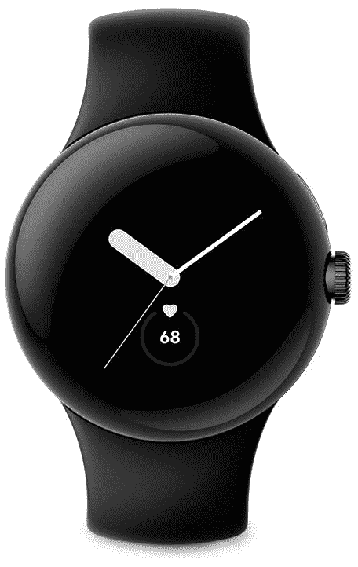

# 谷歌 Pixel Watch 评论:一半是 Wear OS，一半是 Fitbit 的高价之美

> 原文：<https://www.xda-developers.com/google-pixel-watch-hands-on/>

一直有传言称谷歌正在研发 Pixel 手表，事实上，这已经持续了好几年。它花了很长时间才最终开花结果，随之而来的是大量谷歌的商标软件 smarts。虽然这款手表本身由于被认为的大边框、高价格和糟糕的电池寿命而被争议所笼罩，但我发现谷歌仍然抓住了一款像样的智能手表的基本要素。这在很大程度上是“第一代”产品，但这是意料之中的。

然而，在使用谷歌 Pixel Watch 一段时间后，我发现它比许多人认为的要好很多。它在现实生活中看起来要好得多，电池寿命令人惊讶地易于管理，大约符合你对许多其他智能手表的期望。它仍然需要改进，但我觉得它没有我想象的那么大。我最大的批评是价格，因为它比三星 Galaxy 手表还要贵。

如果你正在寻找一款只能与你的 Android 设备兼容的智能手表，谷歌 Pixel Watch 是一款极具吸引力的产品。我不一定说它是目前市场上[最好的智能手表](https://www.xda-developers.com/best-smartwatches/)，但我发现它有几个方面超越了三星所能提供的——那就是软件。

 <picture></picture> 

Google Pixel Watch

谷歌 Pixel Watch 是谷歌旗下的第一款智能手表。它在某些方面已经过时了，但就其本身而言还是很有魅力的。

## 谷歌像素手表:规格

| 

规格

 | 

像素手表

 |
| --- | --- |
| **材质&尺寸** | 

*   41 毫米
*   不锈钢外壳
*   康宁大猩猩玻璃 5

 |
| **尺寸&重量** | 

*   40.64 x 40.64 x 12.2mm 毫米
*   32g

 |
| **显示** | 1.2 英寸 AMOLED 显示屏 |
| **处理器** | Exynos 9110 |
| **闸板&存放** |  |
| **电池&充电** | 

*   294 毫安时
*   快速无线充电

 |
| **耐久性** | 5ATM 防水性 |
| **传感器** | 

*   指南针
*   高度计
*   光学心率传感器
*   加速计
*   陀螺仪
*   与 ECG 兼容的多用途电传感器

 |
| **OS** | 佩戴 OS 3.5 |
| **颜色** |  |

***关于这篇评论*** : *谷歌爱尔兰在 2022 年 10 月 7 日给我的谷歌 Pixel 手表是给 IrishTech 的。虽然公司为我提供了一个单元，但它并没有参与这项评估的内容。*

* * *

## 谷歌像素手表:设计

这款手表最具争议的一个方面是，它的设计确实让一些人受到了影响。渲染并不经常公正地对待产品，他们对谷歌最新的手表产品尤其不友好。该公司悄悄调整了其新闻材料中的一些渲染，以使挡板看起来正确，但老实说，无论如何，它看起来更好。

事实上，有一天我在一家酒吧，和我聊天的一个人注意到了我身上的手表，问我是不是 Pixel 手表。我告诉他们是的，他们对我说的第一件事是，挡板实际上并不像他们想象的那样糟糕。他们一直在考虑购买一个，但被挡板推迟了，但他们说他们实际上不介意它看起来如何。这很有趣，因为这不是我第一次听到有人这么说 Pixel Watch，这也和我自己的经历完全一样。

谷歌 Pixel Watch 的功能设计很轻便，佩戴舒适，对大多数人来说，这是最重要的。我可以肯定地看到，缺乏适当凸起的表圈也是那些担心走路时划伤或摔坏手表的人的一个问题，但我喜欢它独特的外观。它可能在一些人的手腕上看起来有点太小，但对我来说，它完全没问题。

384x384 AMOLED 显示屏变得异常明亮，比我预期的要亮很多。当在户外使用时，自动亮度也很好，尽管如果你想谋杀你的 294 mAh 电池，你可以关闭它，并将亮度调到最大。我不建议那样做。

左手边有一个扬声器，为通知和助手播放音频，以及其他任何支持它的东西。右边的表冠可以用来上下滚动，读取心电图，以及回家。双击它还会打开钱包应用程序进行快速支付，上面的按钮是最近应用程序按钮。最后，触觉是*真的*好。

这种设计最大的缺点是包含了专有频段。虽然内置的活动表带*看起来*不错，但你将无法在这款设备上使用其他任何 20 毫米表带。这要归功于谷歌的带子机制，它用带子把带子绑在身体上。你也许可以买一个特定的带，把它拆开，以便附上你自己的(反正根据 [*The Verge*](https://www.theverge.com/2022/10/14/23405181/the-pixel-watch-can-take-standard-straps-if-you-want-it-bad-enough) )，但仅此而已。没有人能保证谷歌会为继任者保留这种波段机制——如果真有这种机制的话。希望他们将来能卖一个适配器。

* * *

## 谷歌像素手表:电池

解决房间里的大象，谷歌像素手表有一个非常糟糕的电池寿命，而且没有绕过这个问题。你可能会发现自己在一天中不时地呵护它，使用一个永远在线的显示器将意味着你每天至少要充电两次。这是不好的，不可原谅的，它几乎抵消了谷歌在这里得到的所有其他好处。

说了这么多，谷歌 Pixel Watch 对我的用例来说很方便，我可以*忍受*(注意:我不是说没关系)我需要频繁充电的事实。反正我经常坐在我的电脑前，我的电脑机箱里内置了一个 USB-C 端口。我可以在早上登录工作几分钟的时候插上手表，如果我需要，当我晚上玩游戏或其他什么的时候，我可以再给它充电。

问题是，如果我想在某个地方过夜，给它充电*会成为一个问题。取决于我在哪里，无论是聚会还是其他，充电器可能不会很快出现。我可以把它设置为省电模式，但假设我已经用了一整天，电池不太可能持续我很长时间。请记住，谷歌宣称*的电池寿命高达* 24 小时。那就是*最大*。如果你在某一天早上 9 点拔掉它的电源，不管你怎么努力，它都活不过第二天早上 9 点。也许在极端条件下，你会延长一两个小时，但仅此而已。*

这是谷歌 Pixel Watch 最大的头号问题。大多数人可能会忽略其他外观时尚的设备，基本上可以与任何 Android 智能手机很好地集成，但当电池明显随着时间的推移而退化时，挣扎的电池就值得警惕了。如果它现在还在挣扎，三年后会怎样？

然后就是无线充电的问题。谷歌说它不受支持，但从“它可能在某些地方工作，也可能不工作，你可能有问题，它可能工作得很好”的意义上来说，似乎没有额外的清晰度。你的里程会有所不同，但即使是谷歌也无法告诉你多少。你最好坚持使用官方的无线充电设备，尽管这种设备售价 30 美元，在撰写本文时谷歌商店已经售罄。

不管怎样，它的充电速度很快。我可以在半小时内将 Pixel Watch 从 0%充电到 50%，这在我刚刚使用 PC 时是很好的。从 0%到 100%需要一个多小时，尽管我不会把它降到那么低。不过，考虑到电池寿命本来就有多糟糕，这还是微不足道的。

简而言之，电池问题足以让我建议不要购买这款智能手表。我可以接受这款智能手表的所有其他怪癖和怪异之处，但在 350 美元的要价下，你为什么会买它？

* * *

## 谷歌像素手表:软件

从好的方面来看，谷歌 Pixel Watch 有一些优秀的软件，尽管有些古怪，我稍后会谈到。

它预装了基于 Android 11 的 Wear OS 3.5，鉴于我们目前使用的是 Android 13，这本身就有点奇怪。这是三星生态系统之外唯一一款让[佩戴 OS 3](https://www.xda-developers.com/wear-os-3-galaxy-watch-4-oneui-watch-review/) 的智能手表，看起来相当不错。有一些有用的功能，它的*非常*流畅，速度很快，是我用过的最好的智能手表界面之一。

Wear OS 上的应用生态系统相当不错，很多应用都有 Wear OS 伴侣，可以和智能手机一起使用。举个例子:在爱尔兰，我使用一个名为“下一趟爱尔兰列车”的应用程序来跟踪火车时间以及下一趟火车在我当地车站的到达时间。我可以在手机上将我的本地电台添加为收藏，这将在手表上反映出来。我可以用手表查看我喜欢的电台，查看实时出发和到达时间。它非常有用，这是我在其他非 Android 智能手表上做不到的。

我也是预装手表 faces 的主要粉丝，我最喜欢的其实是默认(实用程序)。我可以在表盘上显示时间、计步器、媒体控制、心率监测器和即将到来的日历事件。这真的非常非常有用，帮助我掌握我需要做的工作。也有其他的表盘，但这是我最喜欢的。

此外，你还可以获得一些基于 Fitbit 的专有应用，比如 Fitbit ECG 应用。它的工作原理与听起来一模一样，通过让你将手指放在表冠上并静坐三十秒来进行单点心电图测试。它可以检测心房颤动(AFib ),仅此而已。不支持检测异常心律或类似的功能，尽管这些功能在苹果手表等设备上很常见，甚至在 Fitbit 自己的产品组合中也很常见。

事实上，这是另一个问题——如果你想要一个 Fitbit，这里有很多不足之处，这使它成为比该公司自己提供的大多数产品更差的产品。[谷歌漏掉了一大堆功能](https://www.xda-developers.com/pixel-watch-missing-fitbit-features/)，我敢打赌原因是出于对电池的担忧。每秒收集心率数据是一回事(多亏了板载的专用低功耗 Cortex M55)，但处理这些数据是另一回事。谷歌 Pixel 手表缺少:

*   锻炼的自动开始、停止和暂停
*   游泳划水跟踪
*   异常心律检测
*   引导呼吸
*   静音/智能唤醒警报
*   血氧夜间平均值、范围和随时间变化的趋势
*   没有皮肤温度监测器

那么，花 350 美元，你为什么不买一台 Fitbit Sense 2 呢？谷歌 Pixel 手表感觉像是夹在两条车道之间——Wear OS 和 Fitbit。它可以在其中一个上加倍下注，或者尝试将两者结合起来。问题是，它不仅受到自身电池的限制，还受到 Exynos W920 芯片组的限制。这是三星 Galaxy Active 2 中使用了四年的芯片组，它无疑显示了它的年龄。

* * *

## 谷歌像素手表:Fitbit 应用

如果你曾经使用过 Fitbit，那么你应该已经知道 Fitbit 应用程序是什么样的了。谷歌 Pixel Watch 和以往一样，没有什么新的东西可以期待。它有睡眠跟踪，卡路里跟踪，食物和水的摄入量记录，健康指标，等等。

问题是:虽然所有这些功能都很棒，非常有用，但其中一些功能实际上被 Fitbit premium 锁定了。当你第一次获得 Pixel Watch 时，你可以免费获得六个月的时间，但之后，你需要单独付费。Fitbit premium 的锁定功能包括:

*   指导性计划和训练
*   每日准备得分
*   压力管理
*   长期健康报告
*   详细的睡眠分析

此外，如果你购买了谷歌 Pixel 手表，并使用了 Fitbit Premium 试用版，**请确保在它自动续订**之前取消它，以防你不再需要它。否则，它将在以后自动续订。

Fitbit 应用程序使用起来非常直观，但我觉得为了成为 Apple Watch 的真正竞争对手，一些付费功能应该对所有用户开放。详细的睡眠分析不应该是 Fitbit premium 独有的功能，因为现在许多*便宜的手表都可以做到这一点。*

* * *

## 你应该买谷歌 Pixel 手表吗？

无论如何，尽管我不得不说谷歌 Pixel Watch 有很多负面影响，但它有着巨大的魅力。它感觉很好，看起来很好，软件是*优秀*尽管有缺点。它还可以在所有 Android 设备上运行，虽然 Galaxy Watch 5 也可以，但它也需要一个经过改造的 APK 才能在非三星设备上运行。

电池是最大的问题，鉴于我已经能够让它为我所用，我想我可以把它推荐给一些和我相似的人。然而，如前所述，无论你何时外出过夜，你都会被限制使用它。不过，为什么要担心这些呢？

如果你的特权是健身和健康，有更好的 Fitbit 设备。如果你想要一款 Wear OS 手表，那么是的，也有更好的 Wear OS 手表。你让*买这个的唯一原因是，如果你想要一个将 Fitbit *特别是*与 Wear OS 相结合的东西，但问题是，这款手表并没有真正做到这两者中的任何一个——而且成本要高得多。*

**购买谷歌 Pixel 手表的条件是:**

*   你真的想要一块谷歌品牌的智能手表。
*   你不想和改装过的 apk 打交道。
*   你想要最快最流畅的穿戴 OS 体验。
*   你可以得到一个[好交易](https://www.xda-developers.com/best-google-pixel-watch-deals/)。

**不要购买谷歌 Pixel 手表，如果:**

*   你对钱很敏感，想要物有所值。
*   你想要最好的，并准备为此花钱。
*   你有电池焦虑症。

 <picture></picture> 

Google Pixel Watch

谷歌 Pixel Watch 是谷歌旗下的第一款智能手表。它在某些方面已经过时了，但就其本身而言还是很有魅力的。