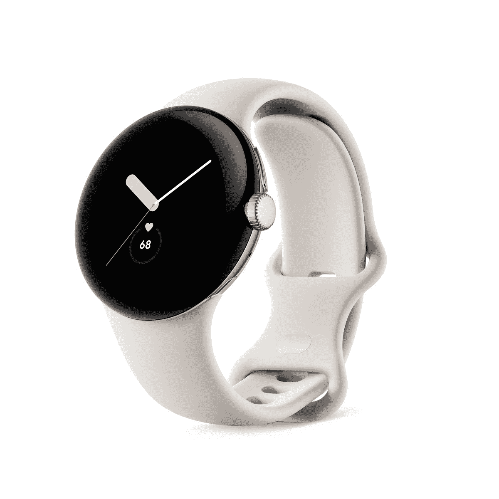

# 谷歌 Pixel Watch 会获得多少软件更新？

> 原文：<https://www.xda-developers.com/google-pixel-watch-software-updates/>

# 谷歌 Pixel Watch 会获得多少软件更新？

谷歌对 Pixel Watch 的支持文档证实，这款手表将获得至少三年的软件更新。

谈到软件更新，谷歌的 Pixel 设备无疑是市场上最好的设备之一。Pixel 智能手机不仅每月都会收到及时的安全更新，而且每年都会第一个收到最新的 Android 升级。谷歌也比大多数其他安卓原始设备制造商保持其设备更新的时间更长，因此很自然地期望该公司给予 [Pixel Watch](https://www.xda-developers.com/google-pixel-watch-review/) 同样的待遇。然而，你会惊讶地发现，与市场上其他[优秀的智能手表](https://www.xda-developers.com/best-smartwatches/)相比，谷歌对 Pixel 手表的软件更新承诺并不那么令人印象深刻。

## 落后于苹果和三星

根据谷歌的 Pixel Watch 支持页面，该公司的第一款 Wear OS 智能手表有资格“从该设备首次在美国谷歌商店上市起至少三年。”这意味着谷歌保证 Pixel 手表的软件更新一直到 2025 年 10 月。相比之下，三星承诺为 Galaxy Watch 4 和 Galaxy Watch 5 提供四年的软件更新。苹果更进一步，为其 Apple Watch 系列提供了长达五年的软件更新。

虽然支持页面没有具体说明谷歌将为 Pixel Watch 发布多少软件更新，但它指出，智能手表将收到“定期的软件更新，包括安全增强、新功能、操作系统更新、漏洞修复等。”由于谷歌没有分享任何关于 Pixel 手表软件更新的进一步细节，我们不知道这些更新何时会开始向用户推出。我们预计谷歌很快会分享更多信息。

 <picture></picture> 

Google Pixel Watch

谷歌已经证实，Pixel Watch 将获得至少三年的软件更新。

即使谷歌承诺只有三年的软件更新，你会购买 Pixel Watch 而不是 Galaxy Watch 5 或 Apple Watch Series 8 吗？请在下面的评论区告诉我们。如果你的回答是“是”，一定要看看我们的[最佳像素手表交易](https://www.xda-developers.com/best-google-pixel-watch-deals/)综述，为你的购买节省一些钱。