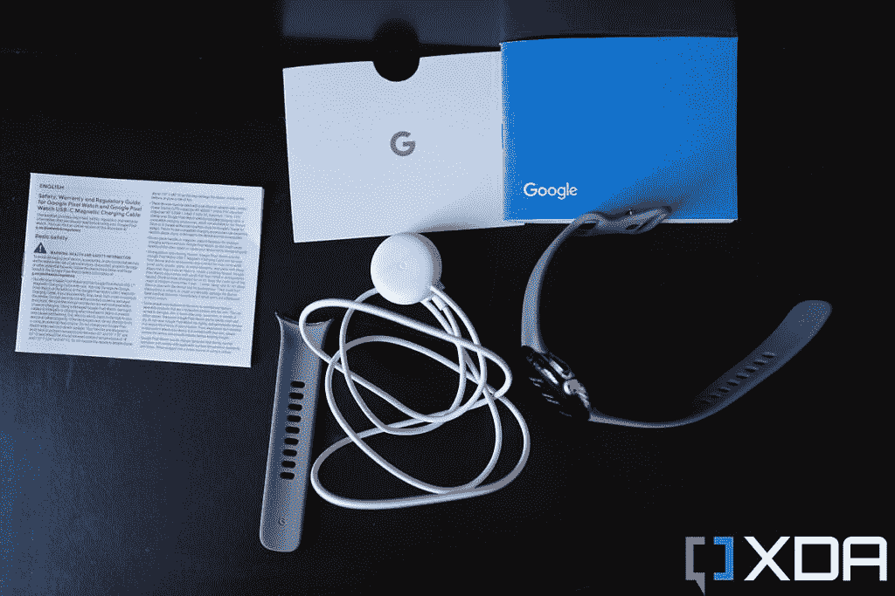
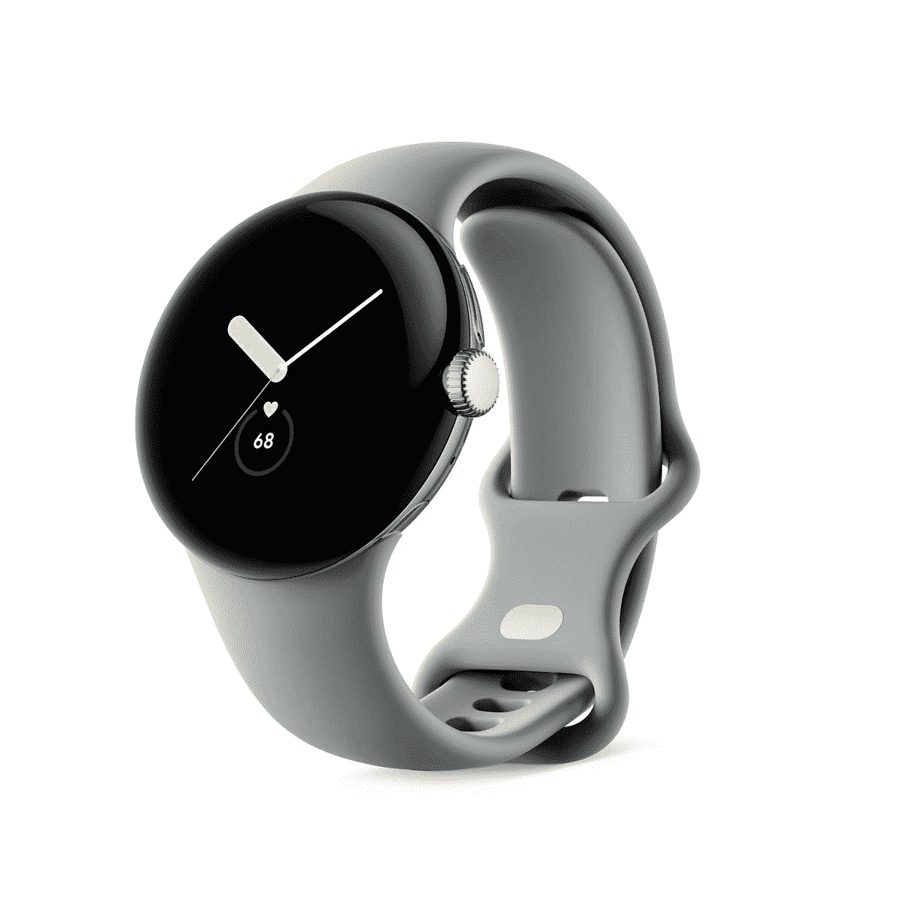

# 谷歌 Pixel Watch 零售盒子里有什么？

> 原文：<https://www.xda-developers.com/google-pixel-watch-unboxing/>

# 谷歌像素手表拆箱:这是你在盒子里得到的东西

Pixel 手表是谷歌首款 Wear OS 智能手表。让我们快速看一下 Pixel Watch 拆箱，看看你在盒子里面得到了什么。

谷歌像素手表终于上市了，你可以花 350 美元买一个。这是该公司第一款搭载 Fitbit 健身追踪功能的 Wear OS 智能手表。这种特殊的智能手表之前已经公开亮相过很多次，但这是我们第一次看到零售单位的开箱，看看它有什么。当你在国际上购买谷歌 Pixel Watch 时，你会在零售盒子里得到所有的东西。

与新款 Apple Watch 或三星 Galaxy Watch 5 系列不同，Pixel Watch 没有装在又高又窄的塑料盒中。相反，它装在一个长方形盒子里，盒子上有手表的插图和一些商标。盒子还会告诉你，你是选择了 LTE 还是只选择了手表正面的蓝牙/Wi-Fi 版本。一旦你打开封条，揭开盖子，你会看到 Pixel 手表放在一个支架上，它的带子很好地塞在里面。你可以取下手表，打开底座，找到里面所有的配件。

## 谷歌 Pixel Watch 零售盒子里有什么？

 <picture></picture> 

Google Pixel Watch along with its box contents

*   谷歌像素手表在你选择的完成。
*   带 USB Type-C 连接器的磁性充电器
*   特定于地区的文档，包括快速入门指南
*   更小尺寸的附加表带

谷歌 Pixel 手表配备了你期望在 2022 年看到的智能手表的所有好东西。除了标准配件，我们喜欢谷歌如何在一个更小的尺寸中包含一个额外的表带，以配置你的手腕长度。整体呈现相当整洁，但是不要期望在里面看到任何花哨的东西。盒子里少了一个连接充电器的 USB 适配器。这不一定是一个交易破坏者，因为你现有的任何墙上适配器都应该工作得很好，只要它有一个 USB-C 端口。

 <picture></picture> 

Google Pixel Watch

Pixel Watch 是谷歌的第一款 Wear OS 智能手表，具有独特的设计，支持许多健身跟踪功能。

正如我们之前提到的，谷歌 Pixel 手表现在可以通过一些[的大优惠](https://www.xda-developers.com/best-google-pixel-watch-deals/)来为你省钱。如果你对这款手表没有特别的印象，那么一定要看看我们收集的[最佳智能手表](https://www.xda-developers.com/best-smartwatches/)，看看是否有其他东西吸引了你的注意力。