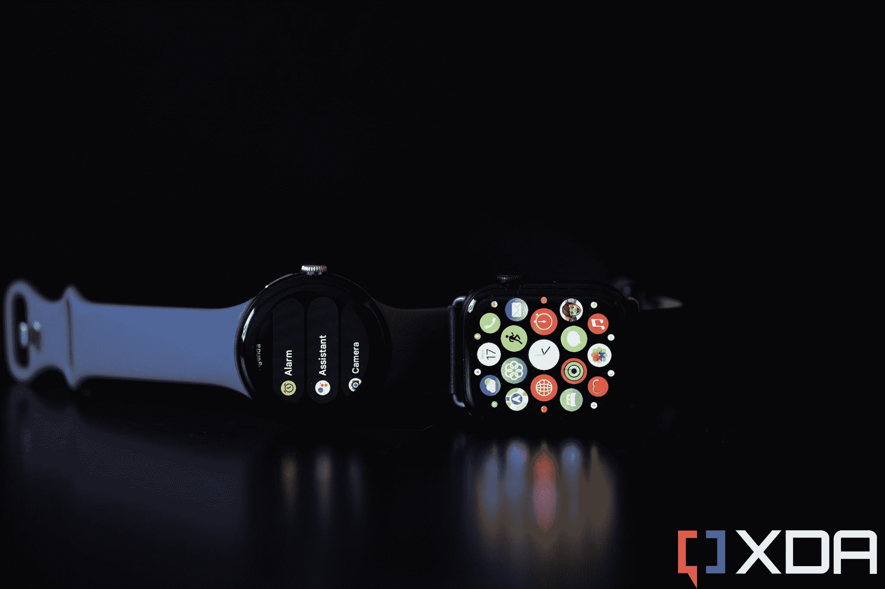

# 谷歌 Pixel Watch vs Apple Watch 系列 7:安卓终于有自己的 Apple Watch 了？

> 原文：<https://www.xda-developers.com/google-pixel-watch-vs-apple-watch-series-7/>

如果说谷歌 Pixel 手机(T1)是(或至少试图成为)安卓对 iPhone 的回应，那么谷歌 Pixel 手表(T3)显然是谷歌试图打造一款苹果手表的替代品——一款可以与谷歌/安卓产品无缝对接的产品。

但是谷歌做到了吗？在今天的文章中，我们将比较谷歌的可穿戴设备和苹果手表系列 7 和 8。我们同时包括 7 和 8 的原因很简单:8 系列是最新的苹果手表，但我个人没有测试过。但我已经使用 Apple Watch Series 7 一年了，它与 Series 8 的*非常非常相似，用户体验几乎完全相同。当一个功能只针对 Apple Watch Series 8 时，我会提到。*

如果说[谷歌 Pixel 手机](https://www.xda-developers.com/google-pixel-7-pro-review/)是(或至少试图成为)Android 对 iPhone 的回应，那么[谷歌 Pixel Watch](https://www.xda-developers.com/google-pixel-watch-review/) 显然是谷歌试图打造一款类似于[苹果手表的产品](https://www.xda-developers.com/best-apple-watch/)——可以与谷歌/Android 产品无缝配对和工作。

但是谷歌做到了吗？在本文中，我们将比较谷歌的可穿戴设备和苹果手表系列 7 和 8。我们同时包括 Series 7 和 Series 8 的原因很简单:Series 8 是最新的 Apple Watch，但我个人没有测试过它。但是我已经用了一年的 Apple Watch Series 7，它和 Series 8 的*非常非常相似*到了用户体验几乎相同的地步。当一个功能只针对 Apple Watch Series 8 时，我会提到。

## 谷歌 Pixel Watch vs 苹果手表系列 7/8:定价和可用性

谷歌 Pixel 手表只有一种尺寸，WiFi 型号的售价为 399 美元，4G/LTE 型号的售价为 399 美元。它可以在主要的在线零售商如百思买、亚马逊以及谷歌自己的在线商店买到。

Apple Watch Series 8 有 41 毫米或 44 毫米的外壳，起价分别为 399 美元和 429 美元。Apple Watch 在主要的在线零售商和任何销售苹果产品的实体店都有售。Apple Watch Series 7 不再通过苹果正式销售，但可以通过亚马逊等值得信赖的零售商找到。

谷歌 Pixel Watch 是谷歌 Pixel 品牌下的首款智能手表。它在某些方面已经过时了，但就其本身而言还是很有魅力的。

**Brand**

Google

**Operating System**

WearOS 3.5

**SIM Support**

eSIM

**Lens Material**

Gorilla Glass 5

**Display**

OLED

**CPU**

Exynos 9110

**Battery**

294 mAh

**Price**

$349, $399

**Dimensions**

41 x 41 x 12.3 mm

**Weight**

36g

Apple Watch Series 8 是苹果公司最新推出的智能手表。与 Series 7 相比，这不是一个巨大的变化，但它提供了一些新功能，如碰撞检测、新的温度传感器等。

**Brand**

Apple

**Case Material**

Stainless steel

**Display**

OLED

**CPU**

S8

**Battery**

308 mAh

**Software**

WatchOS 9

**Price**

$399

**Dimensions**

45 x 38 x 10.7 mm

**Weight**

42.3g

* * *

## 谷歌 Pixel Watch vs Apple Watch 系列 7/8:硬件和设计

尽管形状根本不同——谷歌 Pixel 手表是一个正圆；Apple Watch 8 是方形的——这两款手表在硬件上实际上有很多相似之处。两者都没有边框或凸起的脊——屏幕只是弯曲，无缝地融入金属外壳。两者都有一个可以扭曲或挤压的物理表冠。当并排放置时，谷歌 Pixel 手表看起来像是与苹果手表系列属于同一家族，这是三星的可穿戴设备从来没有过的。

44 毫米型号的 Apple Watch 显然比 41 毫米的 Pixel Watch 大，但即使是 41 毫米的 Apple Watch Series 7/8 也因其方形的方形屏幕而提供了更大的屏幕面积。然而，Pixel 手表比苹果可穿戴设备的 10.5 毫米厚一些，只有 10.7 毫米

在我看来，这两款手表看起来都很棒，但也可能很脆弱。事实上，Apple Watch 和 Pixel Watch 的屏幕都没有任何保护措施，如凸起的边框或脊，这意味着屏幕，尤其是侧面，总是暴露在外。当然，苹果和谷歌的营销团队声称这些眼镜得到了加固，足够坚固(苹果宣传的是“蓝宝石水晶玻璃”，谷歌使用的是“大猩猩玻璃 5”)，可以承受跌落或意外刮擦桌子的四周，但我仍然感到不安。对于任何买家来说，为 Apple Watch Series 8 或 Pixel Watch 找到一个好的外壳都应该是更优先考虑的事情。

这两种可穿戴设备都使用专有的表带，手表上的橡胶硅胶表带不是我喜欢的。我为 Apple Watch 7 购买了一条皮革表带，很可能也会为 Pixel Watch 购买。这些设备太昂贵了，不能拴在廉价的橡胶带上。两款手表都使用类似的快速释放机制来移除表带，但尽管 Apple Watch 的释放按钮很容易操作，但 Pixel Watch 的圆形意味着按钮很难操作。在第一次交换像素带的时候，至少要摆弄一分钟。

### 显示

有机发光二极管显示器是两种可穿戴设备都选择使用的技术，这是有充分理由的——它们可以产生鲜艳的颜色，包括有助于节省电池的深黑色。后者是至关重要的，因为两个手表屏幕都可以“永远在线”两个屏幕都达到了 1000 尼特的峰值亮度，足以在户外阳光直射下使用。

### 硅

Apple Watch 在硅部门取得了胜利 Apple Watch 8 由 S8 芯片驱动，而 Series 7 运行在 s 7 上，这两种芯片都明显快于四年前的 Exynos 9110。从启动应用程序到手表收听和处理我的语音查询需要多长时间，速度差异随处可见。

这并不是说 Pixel 手表动力不足，它表现很好。就是不能叫快。你可以随时点击手表上的任何地方，等待一两个节拍。

如果你想知道 Apple Watch 8 的 S8 芯片比 S7 提高了哪里，那应该是在 CPU 上——苹果公司说新的比旧的快 20%,但我真的看不出有什么区别。Apple Watch 7 可以像 Apple Watch 8 一样流畅快速地在用户界面上滑动。

### 电池

苹果和谷歌都没有在新闻材料中透露确切的电池尺寸，但拆机公司发现，Apple Watch 7 和 8 将 308 毫安时的电池与 Pixel Watch 的 294 毫安时电池封装在一起，电池寿命非常相似。这两种手表每天至少需要充电一次，因为它们都不能坚持到第二天。Pixel Watch 不像 Apple Watch 7 和 8 那样是一款全天智能手表，你应该预计到谷歌的产品会很快需要充电。

### 传感器

充电是通过手表背面的专有磁性充电器来完成的，该充电器也装有常见的传感器主机。两款手表都有检测心率、传导 EKG(心电图)和血氧水平的核心基本传感器，以及检测运动的加速度计和陀螺仪等基本元件。

Apple Watch 8 超越了 Pixel Watch，Apple Watch 7 还包括一个新的皮肤温度传感器和一个高 G 加速度传感器。前者主要是为了帮助 Apple Watch 8 跟踪月经周期，而后者则是为了帮助检测车祸。这些都是 Pixel Watch 和 Apple Watch 7 所缺少的功能。

### 其他硬件位

Pixel 手表的等级为 5ATM，这意味着它可以承受水下 50 米的深度。Apple Watch 7 和 8 的评级为 WR50，这也意味着它们可以承受高达 50 米的水下压力。换句话说，尽管它们使用不同的标准，但在防水方面，这两款手表几乎是一样的。我想说，除了潜水员，每个人都必须担心这些手表会受到水的损害。

在其他地方，这两款手表都有一个扬声器和麦克风，它们在接听电话方面做得很好。如果我必须吹毛求疵，我会说 Apple Watch 的扬声器更响亮、更饱满。

* * *

### 谷歌 Pixel Watch vs 苹果手表系列 7/8:软件和功能

Apple Watch 8 搭载了 WearOS 9，Apple Watch 7 也将更新这一最新的苹果软件版本。与此同时，Pixel 手表运行的是 Wear OS 3.5。由于谷歌在 2019 年收购了 Fitbit，Pixel Watch 也集成了 Fitbit，这是好是坏取决于你的看法。好的方面？Fitbit 拥有业内最好的睡眠追踪算法，并且有一个强大的软件可以很好地处理运动追踪。但不好的是，你必须安装并登录 Fitbit 应用程序才能获得这些服务。事实上，你必须在你的 Android 手机上安装两个应用程序(即使是 Pixel 7 Pro)才能完全使用 Pixel Watch:谷歌的新手表应用程序，以及 Fitbit。Fitbit 的一系列功能，如压力管理和详细的睡眠分析，也是订阅背后的付费墙——当你购买 Pixel Watch 时，你可以获得六个月的订阅。

相比之下，Apple Watch 的体验感觉更加无缝。iOS Watch 应用已经在所有 iPhones 上安装了——没有什么新的需要安装。产品、硬件和软件之间的这种凝聚力使 Pixel 手表看起来很糟糕。即使安装了 Fitbit，我也必须手动勾选谷歌手表应用程序和 Pixel 手表上的一堆弹出框，才能完全使用手表。

如果谷歌希望 Pixel Watch 成为“安卓世界的苹果手表”，它需要在建立无缝连接方面做得更好。

### 健身追踪

Apple Watch 在这方面的表现也更好。虽然两种手表大多可以跟踪相同的锻炼，但 Apple Watch 可以自动识别我何时骑自行车或走路比平时快，并开始跟踪这些活动锻炼。谷歌 Pixel 手表需要手动提示。否则，在心率和步数方面，跟踪似乎是准确的。

我可以直接在手表上看到当天的健身数据，但如果我想查看过去的历史，我需要进入应用程序。这就是谷歌另一个烦恼的地方:Fitbit 应用有时需要手动同步，即使 Pixel Watch 几天前就已经连接到设备上了。有时同步过程需要几分钟。在使用 Fitbit 可穿戴设备之前，我可以说这种不太理想的用户体验在 Fitbit 软件中并不少见。在 Apple Watch 上没有这些问题，一切都感觉天衣无缝:我跳进 iOS Watch 应用程序，我所有的健康和运动历史都在那里供我浏览。

### 作为一款普通智能手表

我对智能手表的一个关键要求是能够接收通知，并让我直接在手腕上回复它们。这是 Apple Watch 从第一天起就做对的事情:我可以在我的手腕上阅读完整的短信，然后通过潦草的文字或语音听写来回复。

这可能会让一些人感到惊讶，但大多数 Android 智能手表都不能很好地做到这一点，原因要么是缺乏软件优化，要么是芯片组动力不足。我很高兴地报告，谷歌 Pixel Watch 实际上可以很好地处理这项任务。没有 Apple Watch 那么好，但 Pixel Watch 确实可以毫无问题地获取和显示收到的文本，它的各种文本和语音输入方法都足够好。

## 谷歌 Pixel Watch vs Apple Watch 系列 7/8:哪个更好？

最终，这篇文章的观点纯粹是出于好奇，而不是作为一个真正的买家指南，因为这些可穿戴设备最终都被锁定在各自的移动操作系统上。谷歌 Pixel 手表是一款好看的优质智能手表，它的功能非常好，但显然没有苹果手表系列 7 或 8(甚至是系列 6)那么完美。

软件的缺点，比如需要与一个单独的 Fitbit 应用程序合作来跟踪健康状况——该应用程序甚至有一半时间不能自动同步——加上明显较慢的芯片组，都是阻碍 Pixel Watch 的因素。除了睡眠追踪，Pixel 手表没有比 Apple Watch 7 或 8 做得更好的了。

然而，安卓粉丝们不要沮丧。Pixel 手表在真空中仍然是一个很好的可穿戴设备，也是改善 Android 智能手表状态的良好第一步。如果有哪家公司财力雄厚、影响力强大，能够与苹果竞争，制造出一款优秀的智能手表供所有安卓用户使用，那就是谷歌。

Apple Watch Series 8 是苹果公司最新推出的智能手表。与 Series 7 相比，这不是一个巨大的变化，但它提供了一些新功能，如碰撞检测、新的温度传感器等。

谷歌 Pixel Watch 是谷歌 Pixel 品牌下的首款智能手表。它在某些方面已经过时了，但就其本身而言还是很有魅力的。