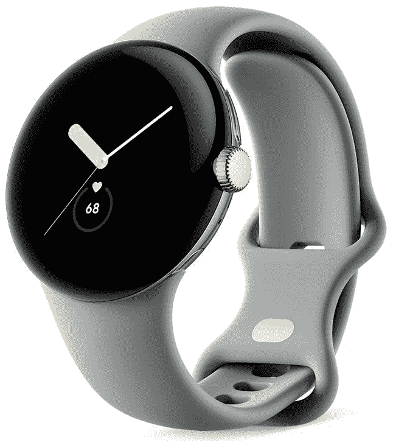

# 谷歌 Pixel 手表防水吗？它有 IP 等级吗？

> 原文：<https://www.xda-developers.com/google-pixel-watch-water-resistance/>

新的[谷歌像素手表](https://www.xda-developers.com/google-pixel-watch/)终于来了，它带有许多健康和健身跟踪功能，由 Fitbit 提供。如果你喜欢水上运动，或者你碰巧在锻炼时出了很多汗，那么你一定想知道新的 Pixel 手表是否有 IP 等级，或者它是否防水。好吧，你来对地方了，因为这正是我们要在这篇文章中详述的。

## 谷歌 Pixel 手表的防水等级为 5ATM

就像市场上的许多其他可穿戴设备一样，谷歌的新 Pixel 手表并不完全防水。也就是说，它具有 5ATM 的防水等级，这意味着它应该可以在锻炼过程中处理汗水，偶尔在游泳池中浸泡也没有任何问题。5ATM 防水等级实际上意味着 Pixel Watch 可以承受 50 米(164 英尺)深的水压。客观地说，Apple Watch Series 8 的防水深度可达 50 米，而坚固耐用的 Apple Watch Ultra 的防水深度可达 100 米。

虽然 Pixel Watch 可以完美处理偶尔溅起的水，但值得注意的是，由于正常的磨损，防水性能会逐渐降低。类似地，坚硬表面上的频繁跌落和碰撞可能会在外壳中打开一些裂缝或缝隙，从而降低其防水性。只要警惕所有这些事情，避免不必要的接触水。Pixel 手表与许多其他[智能手表](https://www.xda-developers.com/best-smartwatches/)不同，它没有官方的防尘防水 IP 等级，所以请记住这一点。

最后，谷歌还警告说，并不是所有的表带都可以防水，所以最好选择那些经得起浸泡和飞溅的表带。该公司还建议在接触液体后干燥手表和表带，以保护手表、表带和皮肤免受任何反应。

 <picture></picture> 

Google Pixel Watch

谷歌 Pixel Watch 的防水等级为 5ATM，这意味着它可以处理 50 米(164 英尺)深的水压。

谷歌 Pixel 手表现在在美国公开发售。蓝牙/Wi-Fi 版本的起价为 350 美元，但有一堆很棒的 [Pixel Watch 交易](https://www.xda-developers.com/best-google-pixel-watch-deals/)会帮你省下一大笔钱。