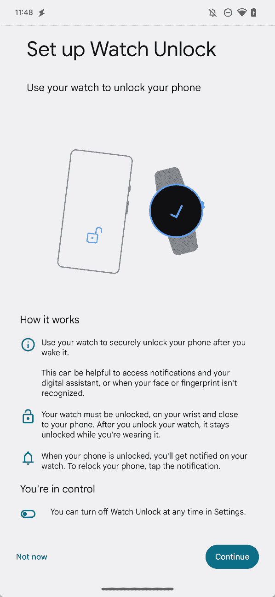

# 谷歌展示了 Pixel Watch 如何让你的手机安全解锁

> 原文：<https://www.xda-developers.com/google-shows-off-watch-unlock-at-ces/>

# 谷歌展示了 Pixel Watch 如何让你的手机安全解锁

在 CES 上展示，当你的手机靠近你的 Pixel 手表时，它会保持解锁状态。

[智能锁](https://www.xda-developers.com/google-smart-lock/)是让你的[安卓智能手机](http://www.xda-developers.com/best-android-phones/)更容易使用的方法之一，它已经存在很久很久了。如果您戴着健身带，或者可能有其他设备使用蓝牙连接到您的手机，您可以将其配置为当您通过蓝牙连接到受信任的设备时，您的手机在连接期间保持解锁状态。手表解锁是该功能的更高级版本，使用了[像素手表](https://www.xda-developers.com/google-pixel-watch-review/)，并在 CES 上首次展示。

手表解锁和智能解锁的区别在于，在手表解锁的情况下，你的手机不是*只是*连接到你的手表上。你的手表必须解锁，戴在手腕上，靠近手机。这要安全得多，因为它依赖于你正在使用的手表，你手腕上的*和*实际上是解锁的。例如，如果你去洗澡，摘下手表，把手机和手表都放下，那么你的手机仍然会正常锁定，尽管目前通过蓝牙连接到你的手表。

 <picture></picture> 

Source: [Esper](https://blog.esper.io/pixel-7-features-android-13/#every-pixel-7-feature-backed-by-android-13-apis:~:text=Google%20Play%20Services-,Watch%20Unlock,-One%20of%20the)

谷歌尚未正式宣布这项功能，而是由米沙·拉赫曼在 CES 的谷歌展台上发现的。据说该功能是通过在 [Android 13](https://www.xda-developers.com/android-13) 中引入的主动解锁 API 实现的，并与 Pixel 7 的面部解锁功能配合使用。目前，它似乎只是被宣传为可以与谷歌 Pixel Watch 配合使用，尽管该功能似乎并没有暗示谷歌 Pixel Watch 的排他性。话虽如此，鉴于它尚未正式发布，该公司可能会有更多关于其工作方式以及未来是否有任何排他性的信息可以分享。

手表解锁似乎还没有向任何用户推出，但如果你在谷歌 Pixel 智能手机上发现了这一功能，请务必在评论中让我们知道！

* * *

**Via: [安卓警察](https://www.androidpolice.com/google-pixel-watch-keep-smartphone-unlocked-ces-2023/)**