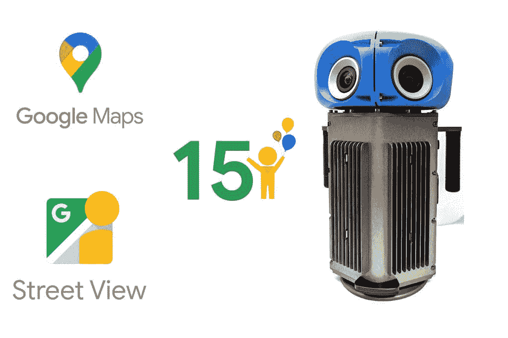

# 谷歌街景 15 岁迎来新的应用功能和工具

> 原文：<https://www.xda-developers.com/google-street-view-15-anniverary/>

# 谷歌街景 15 岁迎来新的应用功能和工具

谷歌街景即将迎来 15 岁生日，为了庆祝这一时刻，谷歌在其移动应用程序中加入了历史图片。

早在 2007 年，街景开始是一个雄心勃勃的想法，以记录前所未有的方式记录世界，以 360 度拍摄街道和地点的照片。快进 15 年，同样的想法已经在 100 个国家和地区捕获了超过 2200 亿张图像。为了庆祝 15 周年纪念日，谷歌发布了移动应用程序的历史图片，并推出了一款全新的相机。

## 街景现在可以向你展示过去的世界

在 [iOS](https://www.xda-developers.com/ios-15/) 和 [Android](https://www.xda-developers.com/android-13/) 上，街景现在可以向你展示过去的世界。当查看街景时，用户可以点击照片并查看其位置信息，然后点击“查看更多日期”选项来解锁自 2007 年以来拍摄的历史图像。这将允许用户在他们的邻居的记忆中漫步，或者查看他们从未去过的地方的演变。

没有记录位置的摄像机，街景是不可能的。除了街景车载摄像头和谷歌 Trekker 背包，谷歌还宣布了一款新的摄像头，将于 2023 年推出。该相机将采用传统汽车上的相机，并将其制成更紧凑的格式，重量不到 15 磅。这样做的好处首先是它更轻更容易使用，其次是它可以被运送到世界上的任何地方，即使是最偏远的地区也可以拍照。由于摄像机更小，它也可以连接到任何带有车顶行李架的车辆上。新相机还将摆脱其所需的专用电脑伴侣，新型号将能够通过移动设备进行控制。

新相机也将是可定制的，与以前的型号相比，允许更多的多功能性。虽然谷歌没有深入研究，但它确实表示，模块化组件可以添加到相机中，用于未来的增强。例如，可以添加激光雷达附件来创建增强的道路数据。谷歌表示，新相机还将允许该公司为未来“探索更可持续的解决方案”。

* * *

**来源:** [谷歌](https://blog.google/products/maps/street-view-15-new-features/)