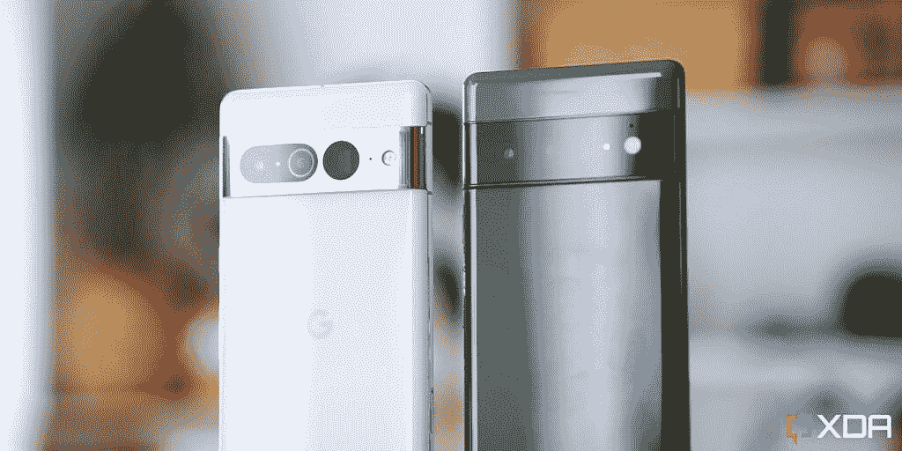

# 谷歌 Pixel 7 系列上的张量 G2 SoC 是什么？它和张量 G1 有什么不同？

> 原文：<https://www.xda-developers.com/google-tensor-g2/>

谷歌 Pixel 7 系列已经上市，随之而来的是一系列显著的全面改进。然而，最令人兴奋的改进之一来自芯片组的形式，因为它是任何智能手机的心脏。谷歌去年 Pixel 中的 Tensor 相当不错，尽管存在一些问题。这一次，该公司表示要在 Tensor G2 中改善电池寿命和其他方面，规格基本上是去年 Tensor 的迭代。

## 谷歌张量 G2:规范

| 规格 | 谷歌张量 G2 | 谷歌张量 |
| --- | --- | --- |
| **大核心** | 2 个 Cortex-X1 @ 2.85GHz | 2 个 Cortex-X1 @ 2.8GHz |
| **中芯** | 2 个 Cortex-A78 @ 2.35GHz | 2 个 Cortex-A76 @ 2.25GHz |
| **小核心** | 4x Cortex-A55 @ 1.8GHz | 4x Cortex-A55 @ 1.8GHz |
| **CPU L3 缓存** | 4MB | 4MB |
| **系统级缓存(SLC)** | 8MB | 8MB |
| **GPU** | ARM Mali G710 MP07 | 马里 G78 MP20 |
| **TPU** | 下一代定制边缘 TPU | 自定义边缘 TPU |
| **DSP** | 是 | 死后无子女。 |
| **ISP** | 

*   10 位 HDR
*   谷歌 HDRnet
*   108 兆像素 ZSL
*   4K60 视频

 | 

*   8 位 HDR
*   谷歌 HDRnet
*   4K60 视频

 |
| **语境枢纽** | 是 | 是 |
| **安全** | 

*   张量安全核
*   经过认证的 M2 安全芯片
*   CPU 虚拟化
*   TrustZone 上的可信操作系统
*   5 年的安全更新

 | 

*   张量安全核
*   经过认证的 M2 安全芯片
*   CPU 虚拟化
*   TrustZone 上的可信操作系统
*   5 年的安全更新

 |
| **DRAM** | LPDDR5 | LPDDR5 |

## Google Tensor G2 在与 Tensor 相同的 CPU 公式上翻倍

比较这两种芯片组会发现许多相似之处，每组内核的基本功能都保留了下来。谷歌仍然保持其有点不正常的 2+2+4 设置，而是选择稍微缓冲大中型核心的时钟速度。理论上，这意味着谷歌将在任何使用两个线程处理的应用程序中拥有性能优势，尽管这取决于它节流的速度。

谷歌也将中间的内核提升到一对 A78 内核，这是一个非常受欢迎的变化。去年令人困惑的是，谷歌选择了一对 A76 内核，因为它们的能效和性能都比 A77 和 A78 差。这应该有望看到一些明显的性能和效率提升，从而延长电池寿命。

最后，和去年的张量一样，保留了四个小核。这里没有真正的变化。

总的来说，虽然看到完全升级到 Armv9(配有 Cortex X2、A710 和 A510 trio)会很好，但这将需要谷歌进行大规模的重新设计，特别是考虑到这是对已经是经过修改的 Exynos 设计的修改。也许明年？

### 谷歌张量 G2 是 4nm 还是 5nm？

虽然最初的报道表明 Tensor G2 是在 4 纳米工艺上制造的，但谷歌后来证实事实并非如此。谷歌张量 G2 是在三星的 5nm 节点上编造的。目前还不清楚该公司是使用三星的 5LPE 还是 5LPP，尽管 5LPP 比 5LPE 更好，而且最初的张量是在 5LPE 上制造的。除非另有说明，否则我假定它在 5lp 上。LPE 代表低功率早期(并且是该公司的第一代 4 纳米制造工艺)，而 LPP 代表低功率增强。

### Google Tensor G2 比原来的 Google Tensor 快吗？

在性能方面，Google Tensor G2 的性能与最初的 Google Tensor 大致相同。唯一的改进是从 A76 到 A78 中等内核的变化，大内核和中等内核的时钟速度都有所提高。会有一些小的改进，但是在现实世界中，感觉是一样的。

 <picture></picture> 

Pixel 7 Pro (left) and Pixel 6 Pro (right).

## 谷歌张量 G2 的 GPU 有一个相当不错的升级

Google Tensor G2 在 GPU 部门进行了一次相当大的升级，从 Mali G78 MP20 升级到 Mali G710 MP07。Mali G710 MP07 与 Dimensity 9000 中的 GPU 类似，但可能会有一些修改，因为后缀是“MP07”。作为参考，联发科天玑 9000 有一个 Mali G710 MC10。很可能“7”指的是核心的数量(就像在原始张量的情况下一样)，但我们必须等等看。

然而，Mali G710 的改进不仅仅来自核心数量，而是来自实际结构本身。它承诺不仅在图形方面有重大改进，尤其是在 Vulkan 性能方面。我们需要等待，看看这些改进会有多少成果，但理论上，不仅在游戏和其他图形密集型任务中，甚至在像 [AetherSX2](https://www.xda-developers.com/aethersx2-playstation-emulator/) 这样的模拟器中，都应该有更好的性能。

上一次，张量中 G78 的 20 核怪兽虽然强大，但在开始减速前仅真正保留了几秒钟的功率。一开始，它保持高频率，但由此产生的高能耗和高热量是一个主要问题。看到谷歌把它调低一点，倾向于一个更正常的移动 GPU 配置，确实给了我们希望。

## 调制解调器得到了改进，尽管我们不确定改进了多少

最初的谷歌 Pixel 6 系列中的调制解调器表现如此糟糕的部分原因是，它实际上是三星的第一代 5G 调制解调器——exy nos 5123。它是作为 Galaxy S11 系列中的 Exynos 990 SoC 的一部分推出的，所以这应该会让你知道它有多老。这一次，谷歌使用了更新的 Exynos 5300 调制解调器。

有趣的是，我现在在以前无法接收到信号的地方接收到了信号

虽然没有太多关于这种特殊调制解调器的信息(因为它刚刚推出，之前没有在任何其他设备上提供)，但从我们自己的测试来看，它似乎有了很大的改进。有趣的是，我现在可以在以前无法接收到信号的地方接收到信号，包括我公寓里基本上不可能接收到任何信号的地方。

## 谷歌张量 G2 TPU 改进

谷歌正在宣传 Tensor G2 的 TPU 是“下一代”，在去年 Tensor SoC 已经令人印象深刻的基础上进行改进。去年，谷歌的张量芯片组在驱动程序中提到了“edgeTPU”。如果它是该公司在其云平台和 [Coral devices](https://coral.ai/products/dev-board/) 中宣传的同一款 Edge TPU，那么它只需 2W 的电源就能支持 4 TOPS。

在 Google Tensor G2 的例子中，Google 称 TPU 的功能和效率分别提高了 60%和 20%。这些都是相当大的改进，假设 TPU 的优势是一样的，已经很好了。它支持照片模糊和电影模糊等功能。

## 谷歌张量 G2 和骁龙 8 Gen 1 或 Exynos 2200 一样好吗？

当比较规格时，谷歌的张量 G2 落后于竞争对手很多。由于其不寻常的核心布局和围绕其调制解调器的问题，这款 SoC 无疑比骁龙 8 第 1 代更弱，并且通过扩展，也比骁龙 8 加第 1 代更弱。然而，与 Exynos 2200 相比，事情变得更加接近。Exynos 2200 采用 4 纳米工艺制造，在基准测试中得分较高，但几位用户也[报告称在三星 Galaxy S22 设备上的体验很差](https://www.xda-developers.com/samsung-galaxy-s22-exynos-performance-display-issues/)。

所有这些都是说，虽然谷歌张量 G2 在理论上更差，但它似乎表现得更好。这可能很大程度上归功于各种软件优化的结合。智能手机不仅仅是制造它们的部件，尽管谷歌张量 G2 看起来动力不足，但在正常使用中你可能不会注意到它...除非你在玩游戏。

## 谷歌张量 G2 改善了基本面

张量 G2 对张量的最佳位加倍，同时对需要返工的东西进行返工

谷歌张量 G2 看起来可能是一个非常好的芯片组，但我们不知道它是否足以改善张量去年下降的地方。它确实加倍了张量的最佳位，同时修改了需要修改的东西。

然而，芯片组不仅仅是其部件的总和。几乎可以肯定的是，在驱动程序中有额外的改进和优化，用于允许操作系统与 SoC 的不同方面进行接口。这些改进更加难以捉摸，但累积起来会给人带来更好的整体体验。

从我们自己的测试来看，Tensor G2 的用户体验有了很大的改善。它运行起来没有那么热，它在需要的地方进行了改进，谷歌总体上似乎一直在倾听。我最大的批评是不要完全迁移到 Armv9，无论是切换到以下两种配置之一:

*   皮质 X2 A710。A510
*   皮质 X3，A715，A510 更新

我想，如果该公司继续修改 Arm 的核心设计，我们可以期待在未来看到类似的事情。

Pixel 7 包含第二代 Tensor SoC、更亮的显示屏和改进的摄像头。

 <picture></picture> 

Google Pixel 7 Pro

##### 谷歌 Pixel 7 Pro

Pixel 7 Pro 是谷歌今年的顶级旗舰产品，具有第二代张量 SoC，120Hz LTPO 显示屏，长焦传感器和更大的电池。