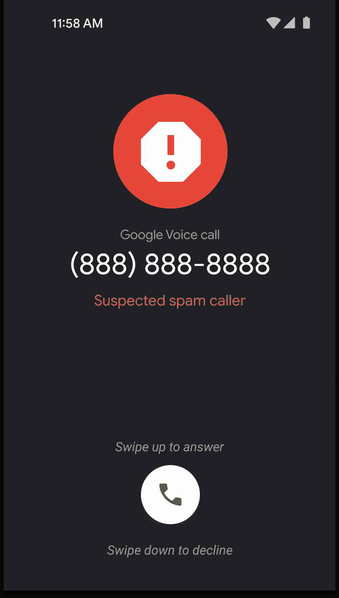

# 谷歌语音使垃圾电话更容易识别与新的视觉更新来电显示

> 原文：<https://www.xda-developers.com/google-voice-spam-ui-update/>

大多数人都会同意，在过去的十年里，我们已经看到了硬件和软件方面令人难以置信的技术进步。尽管如此，垃圾邮件仍然是一个大问题。虽然大多数电子邮件系统现在已经能够很好地处理垃圾邮件的涌入，但仍然存在机器人电话和短信的问题。

我们的智能手机有办法处理这些不便，无论是[屏蔽垃圾短信](https://www.xda-developers.com/how-to-block-spam-messages-on-your-phone/)，使用第三方应用程序，还是让谷歌这样的公司在其产品和服务中引入新的威慑手段。也就是说，谷歌语音正在为来电显示屏幕推出一个新的视觉元素，当收到可疑的垃圾电话时，它会提供更明显的外观。

根据*9 to 5 谷歌*的说法，只有当你在谷歌语音中将垃圾邮件过滤器设置为关闭时，新的外观才会出现。当自动过滤器被禁用时，被认为可疑的电话将被贴上“可疑垃圾来电者”的标签，该标签将位于来电号码的正下方。这个标签也将延续到通话记录部分，使其更容易在应用程序中发现垃圾电话及其相关号码。

 <picture></picture> 

Image via 9to5Google

当然，谷歌语音用户将能够管理这些类型的呼叫，并可以选择阻止某个号码，从而将同一号码的未来呼叫直接发送到语音邮件。这也将自动从呼叫历史记录日志中删除该号码，并将其重定向到垃圾邮件文件夹。如果一个来电号码真的不是垃圾电话，用户可以将其标记为垃圾电话，今后，被标记的号码将不再触发“可疑垃圾来电者”标签。

虽然这项新功能将为用户提供更多关于来电的信息，但这是否会在防止和接收来电方面增加另一个有效的层面仍有待观察。新功能现已在所有受支持的地区推出，但全面推广可能需要几周时间。

* * *

**来源** : [9to5Google](https://9to5google.com/2022/12/29/google-voice-spam-caller/)