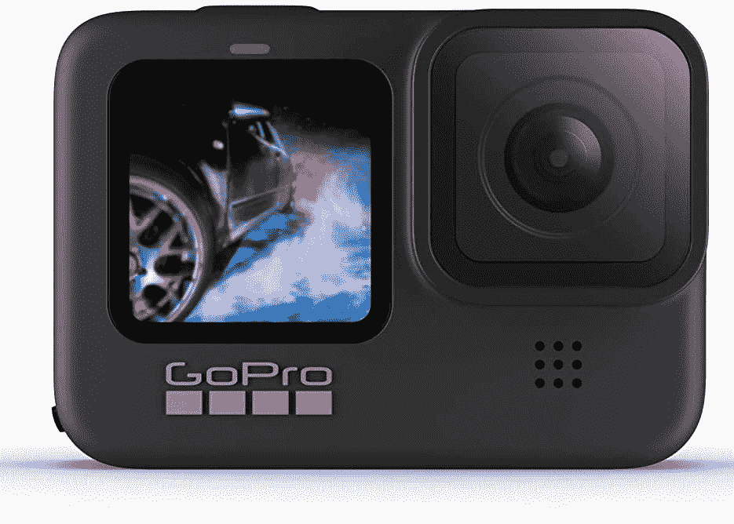

# 使用这些 GoPro 相机，节省高达 100 美元并记录您的旅程

> 原文：<https://www.xda-developers.com/gopro-cameras-deal-november-2021/>

# 节省高达 100 美元，用这些 GoPro 相机记录下您的下一次冒险

GoPro 对 HERO9 和 HERO10 相机打了折扣。现在分别以 350 美元和 450 美元的价格购买它们，此临时交易持续有效。

在世界的某些地方，生活开始恢复正常，新的冒险就在我们面前。go pro——以其耐用的动作相机而闻名的公司——已经有一些现场[黑色星期五](http://xda-developers.com/black-friday)交易。如果你想买这种东西，你很幸运！HERO9 和 HERO10(包括一个电池和一个双电池充电器)以折扣价出售。趁它们还有存货，现在分别以 350 美元(优惠 50 美元)和 450 美元(优惠 100 美元)的价格购买。

 <picture></picture> 

GoPro HERO9 Black

##### GoPro HERO9 黑色

这是一款防水行动相机，配有前置 LCD 和触摸后屏。它支持 5K 超高清视频、20MP 照片、1080p 直播、网络摄像头、稳定功能等。只需 350 美元就能买到。

 <picture></picture> 

GoPro HERO10 Black + Battery + Dual battery charger

##### GoPro HERO10 黑色

这是一款防水行动相机，配有前置 LCD 和触摸后屏。它支持 5.3K60 超高清视频，2300 万张照片，1080p 直播，网络摄像头，稳定等等。该套装包括电池和双充电器。只需 450 美元就能拥有它们。

GoPro HERO9 支持拍摄高达 5K 的视频——即使你放大，它也会保持细节。由于 200 万像素的超级照片功能，您可以捕捉到清晰的“专业”照片。想要轻松放大或缩小？触摸屏已经覆盖了你！这款相机还使用 HyperSmooth 3.0 技术来稳定脚步。它还支持时间扭曲、延时、慢镜头(1080p 时 8 倍)、地平线调平、后见之明、直播等等。

HERO10 是 HERO9 的升级版。它有一个 2300 万像素的传感器，而不是 200 万像素的传感器，拍摄 5.3K60，而不是 5K30，包括 HyperSmooth 4.0 技术，并支持 2.7K 的 8 倍慢镜头。两个相机都很坚固，防水，所以你可以拍摄你的水下旅程。值得一提的是，HERO10 配有电池和双电池充电器。因此，多付 100 美元，你就能得到官方配件，而不仅仅是升级型号。不管怎样，它们都是不会让人失望的好相机。

*你会购买打折的 GoPro 相机吗？如果有，是哪个型号？请在下面的评论区告诉我们。*