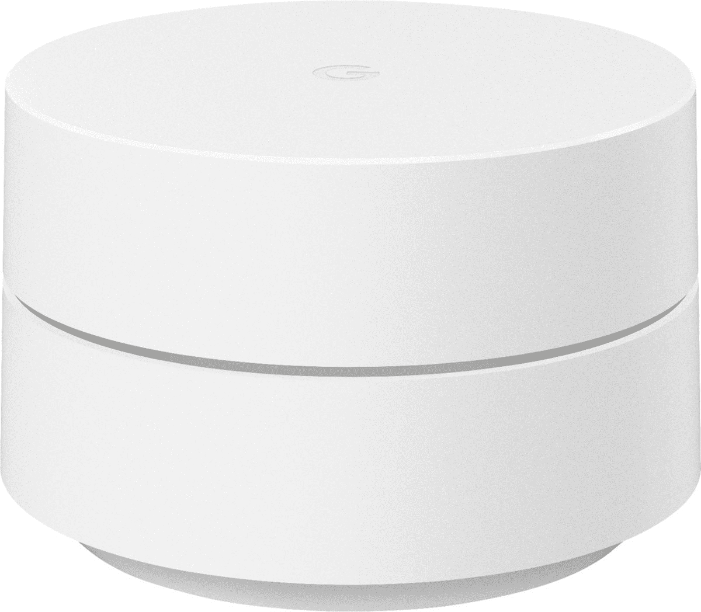

# 只需 150 美元(优惠 50 美元)就能买到一个谷歌 Wifi 3 件套来修理你的家庭网络

> 原文：<https://www.xda-developers.com/grab-a-google-wifi-3-pack-for-just-150-50-off-to-fix-your-home-internet/>

# 只需 150 美元(优惠 50 美元)就能买到一个谷歌 Wifi 3 件套来修理你的家庭网络

谷歌的网状 Wi-Fi 系统现在在多家零售商处售价为 149.99 美元，比通常价格节省了 50 美元。

有许多、许多、许多网状 Wi-Fi 系统承诺为你家的每个角落提供强大的网络连接，但近年来较好的系统之一是谷歌 Wifi。它不是周围最强大的网状系统，但谷歌 Wifi 易于使用，几乎总是比单个路由器好。现在，你可以在多家零售商那里以 150 美元的价格买到一包三个谷歌 Wifi 站，比正常价格节省了 50 美元。

谷歌 WiFi 是一个双频网状系统，因此它不能提供与三频路由器(如 Eero Pro 6)相同的超高速，但在大多数情况下，它仍然是单个路由器的一个重大改进。在售的型号是去年[发布的最新版本](https://www.xda-developers.com/google-wifi-mesh-router-2020/)，设计略有不同，价格较低。与 [Nest Wifi](https://www.xda-developers.com/google-nest-wifi-smart-speaker/) 不同，谷歌 Wifi 站不像谷歌助手智能音箱那样工作。你得到了一个双频(2.4 和 5GHz) AC1200 Wi-Fi 网络，每个工作站上有两个以太网端口——如果你需要更多的有线连接，请给[一个网络交换机](https://www.amazon.com/Ethernet-Splitter-Optimization-Unmanaged-TL-SG105/dp/B00A128S24?tag=xda-tjqr3m3-20&ascsubtag=UUxdaUeUpU4007&asc_refurl=https%3A%2F%2Fwww.xda-developers.com%2Fgrab-a-google-wifi-3-pack-for-just-150-50-off-to-fix-your-home-internet%2F&asc_campaign=Short-Term)。

 <picture></picture> 

Google Wifi (3-Pack)

##### 谷歌无线网络

这是谷歌 WiFi 的最新版本，一个网状 Wifi 路由器，将快速互联网带到你的每个角落(低于 4500 平方米。制成)家。

Google Wifi 是通过 [Google Home 应用](https://play.google.com/store/apps/details?id=com.google.android.apps.chromecast.app)设置和管理的(较旧的 Google Wifi 应用[已经退役](https://www.androidpolice.com/2021/08/05/googles-killing-off-its-legacy-wifi-app/))，它提供你连接的设备和可选的家长控制的数据。当我们中的许多人仍然在为大量的媒体流和视频通话强调我们的家庭互联网连接时，像谷歌 WiFi 这样的网状系统可以帮助你在家里的每个角落获得最佳速度。