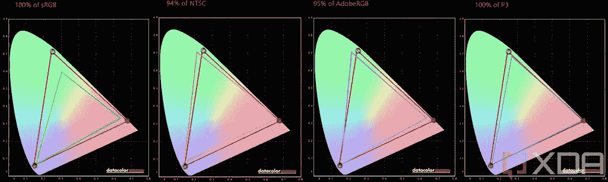

# 在黄金时段，你只需花 180 美元就能从 Innocn 买到一台便携式有机发光二极管显示器

> 原文：<https://www.xda-developers.com/grab-portable-oled-monitor-innocn-180-prime-day/>

便携式显示器的世界由 IPS 面板主导，但 Innocn 是少数几家生产便携式有机发光二极管显示器的公司之一。由于今年的 [Prime Day](https://www.xda-developers.com/amazon-prime-day/) 交易，你可以以低至 180.61 美元的价格获得 Innocn 有机发光二极管显示器，具体取决于你选择的尺寸。如果你不喜欢有机发光二极管，还有一款 4K 便携式显示器，价格也很优惠。

这个黄金日有两台 Innocn 的有机发光二极管显示器出售。首先，有 13.3 英寸的版本，它有全高清分辨率，对比度为 100，000:1。此外，它覆盖了 100%的 DCI-P3，亮度达到 400 尼特。这种型号通常售价 249.99 美元，但你现在只需 180.61 美元就能买到，这是 28%的折扣，或近 70 美元。如果你想要更大一点的，也有类似规格的 15.6 英寸有机发光二极管显示器。根据我们的测试，15.6 英寸的型号覆盖了 100%的 DCI-P3 和 sRGB，94%的 NTSC 和 96%的 Adobe RGB，因此它是一个非常棒的面板。这种型号通常售价 349.99 美元，但你现在只需 259.99 美元就能买到，打了 90 美元的折扣。

 <picture></picture> 

Display test results for the Innocn 15.6-inch portable OLED monitor

如果你不喜欢有机发光二极管，你宁愿要看起来更清晰的东西，也有 Innocn 15.6 英寸 4K 便携式显示器。这是一个 IPS 面板，但它具有非常高的分辨率，非常适合生产力，而且它仍然具有令人印象深刻的 LCD 面板规格。它的对比度为 1，500:1，比大多数便携式显示器好得多，并且它覆盖了 100%的 sRGB。这款通常售价 399.99 美元，折扣最大，降至 212.49 美元，几乎是原价的一半。然而，这是一个闪电交易，将在不到 9 个小时内结束(截至撰写本文时)。

*   <picture></picture>

    Innocn 13.3 英寸便携式显示器

    ##### Innocn 13.3 英寸有机发光二极管全高清显示器

    便携式有机发光二极管显示器是一个珍品，因此 Innocn 的这款显示器以其全高清 OLED 面板而脱颖而出，提供了令人惊叹的色彩和 1 毫秒的响应时间。它降到了 180.61 美元，这是一个非常好的价格。

*   <picture></picture>

    Innocn 15.6 英寸有机发光二极管全高清显示器(90 美元起)

    ##### inno cn 15.6 英寸有机发光二极管全高清显示器

    如果你想要大一点的东西，inno cn 15.6 英寸便携显示器就是另一个全高清分辨率的 OLED 面板，看起来也很棒。像它的小兄弟一样，它有 1 毫秒的响应时间。便宜了 90 美元，只要 259.99 美元。

所有这些都是很棒的显示器，所以如果您想在旅途中提高工作效率，这是购买其中一款的绝佳机会。你需要选择一个与你的笔记本电脑相匹配的尺寸。