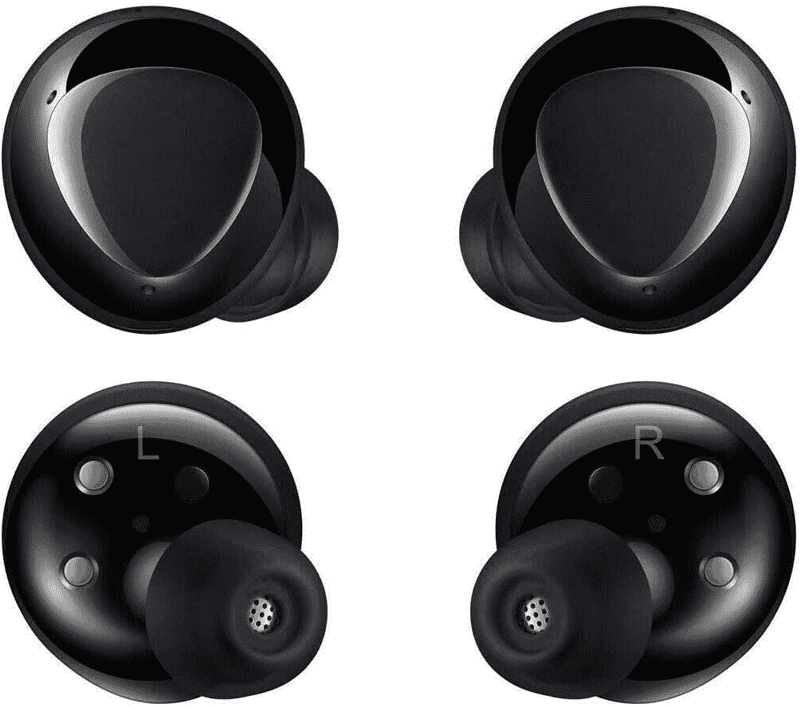

# 立即以 99 美元的价格购买三星 Galaxy Buds Plus，这是他们有史以来的最低价

> 原文：<https://www.xda-developers.com/grab-the-samsung-galaxy-buds-plus-now-for-99-their-lowest-price-ever/>

三星 Galaxy Buds Pro(T1)是三星最新的真正的无线耳塞，可能是目前吸引所有媒体和用户注意力的产品，但如果你买不起，三星仍然有很好的选择，尽管有点老。其中之一就是 Galaxy Buds Plus，这是三星最初的 Galaxy Buds 的继任者。尽管已经被更新的产品取代，但它们仍然是非常好用的无线耳塞，也是市场上每个人都应该记住的选择，而且它们目前的价格是有史以来最低的。

Galaxy Buds Pro 可能不会像 Galaxy Buds Live 和 Galaxy Buds Pro 那样具有主动噪音消除功能，这是 Galaxy Buds 系列中随后发布的两个选项，但如果你不在乎 ANC，只想要一个电池续航时间和音质出色的耳塞，它们是值得考虑的绝佳选择。硅胶耳塞头在补充 ANC 不足方面做得非常好，11 小时的连续电池寿命是很少有耳塞制造商能够达到的数字，充电外壳可以提供额外的 11 小时。它们还支持通过外壳进行无线充电，对于有线连接，3 分钟的充值可以让你玩一个小时。

它兼容 Android 和 iOS 设备，配有内部和外部麦克风，以提高通话质量，3 种尺寸的耳塞，以便您可以调整耳塞的适合度，目前售价为 99 美元，比通常的 149 美元低 50 美元，是这些耳塞有史以来最低的价格之一。相比之下，三星 Galaxy Buds Pro 是该系列的最新型号，目前零售价为 199.99 美元，最好的价格约为 179.99 美元。这使得 Galaxy Buds Plus 尽管较旧，但仍是一个出色的价值主张。这是你获得目前可用的[最好的真正无线耳塞](https://www.xda-developers.com/best-wireless-earbuds/)之一的机会。

 <picture></picture> 

Samsung Galaxy Buds Plus

##### 三星 Galaxy Buds+

与其他三星耳塞相比，三星 Galaxy Buds Plus 可能有点老，但它们仍然是一个令人惊叹的价值主张，可以为您提供 11 小时的电池寿命，AKG 调谐等等。

在这笔交易结束之前赶快行动吧！