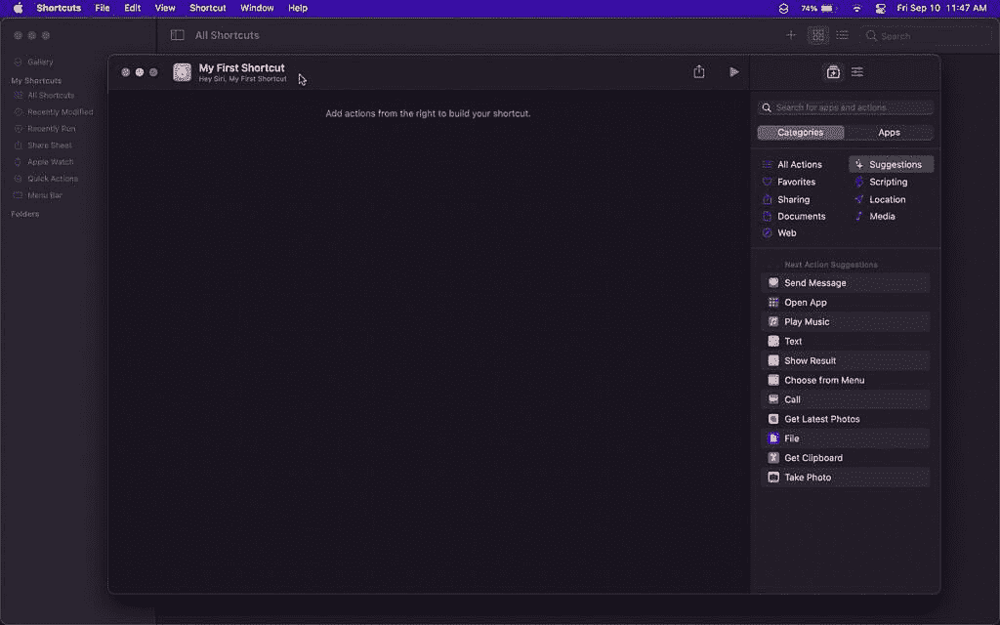
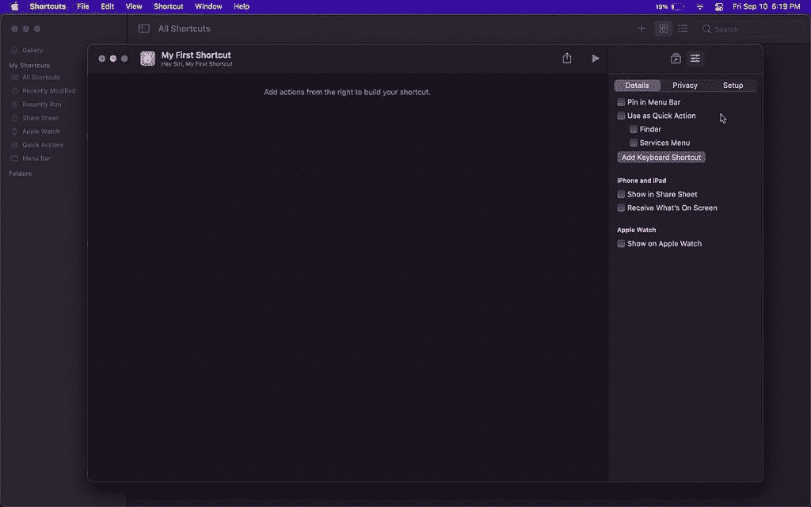

# macOS 上内置快捷方式应用的完整指南

> 原文：<https://www.xda-developers.com/guide-shortcuts-macos/>

我们依靠技术让我们的生活变得更容易，走捷径，避免更长的路线。但是，即使通过使用技术，也有办法进一步简化我们的工作流程，不管我们是学生还是员工。Shortcuts 是 iOS 12 中首次推出的第一方苹果应用。这款功能异常强大的应用终于通过 [macOS Monterey](http://xda-developers.com/macos-monterey) 的更新来到了 [Mac](https://www.xda-developers.com/best-macs/) 上，允许你在电脑上走捷径。

最初，Shortcuts 是一款名为 Workflow 的第三方 app。正如以前和现在的名字所暗示的那样，这是一个旨在将一系列捆绑动作编译成一个按钮的应用程序。苹果最终收购了这款应用，并将其更名为快捷方式——在这个过程中为其添加了系统级权限和更高级的功能。它的伟大之处在于任何人都可以使用它——无论是新手还是超级用户。有些行动几乎不需要任何经验，有些则需要额外的技巧。

## 先看 macOS 上的快捷方式

在你的 Mac 上启动这个应用程序，你会注意到与它的 iOS 版本相比有一个很大的不同——没有了**自动化**标签。对于那些不熟悉 **Automation** 选项卡或其用途的人来说，这是一个基于某些预先指定的条件触发特定快捷方式的部分。这些条件可以是一天中的时间、免打扰状态、电池电量、蓝牙/Wi-Fi 连接、NFC 标签检测等。

因此，每当你的 iPhone 检测到这些情况之一，它就会为你触发指定的快捷方式。你根本不需要和你的手机互动——至少在某些情况下。

很难解释为什么 macOS 上没有**自动化**标签——考虑到 Mac 可以支持很多条件。除了 NFC、CarPlay，或许还有更多功能，macOS 理论上可以支持 iOS 上可用的自动化条件。苹果是否会在未来的更新中添加它还是个未知数。我们必须等着看接下来会发生什么。

回到 macOS 上的快捷键主屏幕。你会看到**图库**标签，位于**我的快捷方式**和**文件夹**部分的上方。**我的快捷方式**分为七个不同的类别:

*   **所有快捷方式**
*   **最近修改的**
*   **最近运行的**
*   **股份表**
*   **苹果手表**
*   **快速动作**
*   **菜单栏**

**文件夹**部分包含您个人创建的任何文件夹，用于对您的个人快捷方式进行分类或分组。

## macOS 上的快捷方式库

画廊是新手探索捷径的好地方，因此是应用程序的第一部分。这是一个快捷方式的集合，根据它们不同的功能和类别进行分组。这些群体包括:

*   开始快捷方式:非常基本但方便的快捷方式，比如将你最近的照片发送给某人。
*   **可访问性快捷方式:**主要关注健康和紧急情况，具有向紧急联系人发送消息和位置信息或跟踪药物治疗等快捷方式。
*   **Siri 的伟大之处:**通过 Siri，不用手就能使用的快捷方式。该精选包括一个快捷方式，除了为您播放播客之外，还可以让 Siri 告诉您天气和上班的旅行时间。
*   **精彩的 Widget 快捷方式:**方便通过快捷方式 app widget 访问，如*播放当前整张专辑*快捷方式。
*   **共享表单快捷方式:**这些快捷方式主要用于保存、共享或编辑您正在查看的内容。一些快捷方式包括编辑 Safari 网页，将网页转换为 PDF，以及将图书添加到您的愿望列表中。
*   **Apple Music 快捷方式:**一切 Apple Music。打开流派播放列表，播放艺术家，在音乐中分享您的一周，等等。
*   **分享快捷方式:**从邮件到 Twitter 和 Instagram。这些快捷方式将使与其他人分享内容变得更加容易，例如*隔空投送截图*快捷方式。

画廊还包括更多的收藏品，主要集中在生产力上。这些包括**把事情做完*****有条理*****在任何地方工作**等等。**

 **一旦你探索了**画廊**及其捷径，你就可以开始建造自己的画廊了。理解它们背后的逻辑并不需要很长时间，我们将在后面详细介绍。

## 我在 macOS 上的快捷方式

### 所有快捷方式

### 

此部分包括您在“快捷键”应用程序中添加或创建的所有快捷键。右上角有一个加号，可以让你创建新的快捷方式。您也可以将视图从缩略图更改为列表，反之亦然。搜索栏放在最右边，方便查找你知道名字的某个快捷方式。

### 最近修改

### 

此部分显示您最近修改的快捷方式。当最后一次修改发生时，它会显示在顶部，并相应地进行排序。

### 最近运行

### 

与前一部分类似，这一部分显示您最近运行的快捷方式。它在最上面提到了它们最后一次被触发的时间，并且它们被相应地排序。

### 共享表

### 

此部分列出了支持并显示在 iOS 和 iPadOS(而非 macOS)的共享表中的快捷方式。由于快捷方式应用程序提供 iCloud sync，您将能够从 Mac 上查看哪些快捷方式支持 iPhone/iPad 上的该设置。

### 苹果手表

### 

watchOS 7 增加了从手腕上运行快捷命令的功能。此部分显示哪些快捷方式已同步到您的手表。

### 快速行动

### 

此部分显示您通过快捷方式创建设置添加到 Finder 和服务菜单的快捷方式。

### 

此部分显示您添加到 Mac 菜单栏的快捷方式，以便于访问。

## 文件夹

## 

正如我们前面提到的，文件夹是您自己的组所在的地方，以便更好地对您的快捷方式进行分类。您可以根据需要创建任意多个文件夹，只要您打开了 iCloud Sync，这些文件夹就会同步到您的 iDevices。

## macOS 上的快捷键偏好设置

在您开始创建自己的快捷方式之前，最好浏览一下首选项并根据需要进行自定义。

### 一般

### 

在**通用**下，你可以切换 **iCloud 同步**。这将使您所有设备上的快捷方式保持最新。您还可以找到一个**私人共享**选项，让您的联系人直接与您共享快捷方式。然而，苹果警告你，它无法验证收到的快捷方式是否安全。基本上，使用风险自担。

### 

**侧边栏**偏好设置可让您在应用程序的侧边栏中显示或隐藏某些部分和文件夹。

### 先进的

### 

**高级**首选项包括为更有经验的用户提供的高级设置。如果您对快捷方式还不熟悉，并且觉得一切都太混乱，我们建议您保持高级偏好设置不变——关闭。一旦你更熟悉所有东西是如何工作的，你最终可以用它们做实验。

## macOS 上的快捷方式

现在已经深入解释了主要部分，是时候深入研究实际的快捷方式创建过程了！

### 创造

### 

首先点击**我的快捷方式**部分右上角的**加号**。将出现一个空白画布。这将是你建造第一条捷径的地方。你必须给它一个名字，并有选择地改变默认图标。这些可以通过画布左上角的定制设置来完成。

有 15 种图标颜色可供选择，但实际图标也就几十个。动物、人、虚构的人物、家用电器，图标的清单是无穷无尽的。几乎可以保证你会找到一个与你的快捷方式主题相匹配的。一旦你给你的快捷方式一个身份，你会注意到它的名字下面有一个**嘿 Siri，【快捷方式名称】**短语。这是因为你可以通过 Siri 触发快捷方式，而不仅仅是通过物理点击按钮。

在画布的右侧，你会发现两个按钮- **动作库**和**快捷细节**。

### 动作库

这是魔法开始的地方。在该部分中，有两个主要选项卡— **类别**和**应用**。前者默认为**建议的**选项，该选项建议您可能想要添加到画布的动作列表。

其他选项包括**所有动作**，它列出了您可以添加的每一个动作- **收藏夹** *、* **文档** *、* **网页**等。这些选项中的每一个都缩小了快捷操作的列表，使查找所需内容变得更加容易。因此，如果你正在创建一个以音乐为中心的快捷方式，你知道你可能会在**媒体**下找到大多数你正在寻找的动作。

如果你知道哪个应用提供了你正在寻找的动作，那么**应用**标签就是你应该去的地方。在那里，您可以点击您选择的应用程序来查看可用操作的列表。值得一提的是，这一部分包括支持快捷操作的第一和第三方应用程序。

### 快捷方式详细信息

### 

本部分分为三个部分- **细节*****隐私****设置**。*

 ***细节**部分基本是快捷方式的骨架。在那里你可以决定它应该出现在哪里，在什么条件下出现。这些选项包括将它添加到 Apple Watch、iOS/iPadOS 上的 Share Sheet 或 Mac 上的菜单栏。

在**隐私***下，你可以获得授予快捷方式的特权，比如访问你的音乐库。这与 iOS 上的应用程序权限非常相似。毕竟快捷方式就像迷你应用。*

 *在**设置** *、*中，您可以添加**导入问题**，以防您打算与他人共享快捷方式。

### 在 macOS 上构建快捷方式

完成所有设置后，您就可以开始向新快捷方式添加操作了。构建是一个非常简单的过程。你只需按时间顺序拖放动作。一旦你点击 **Run** ，他们将开始各自的任务，一次一个。当一个动作完成后，它将得到的任何结果传递给下一个动作，以此类推，直到到达快捷方式的末尾。

在上面的截图中，我为你潜在的早晨惯例创建了一个简单的快捷方式。这只是一个关于快捷方式如何工作的简单演示。在这种情况下，快捷方式检查天气，然后大声说出来。之后，它会播放您资料库中的播客。一旦播客开始播放，它将从你最喜欢的 RSS 源中抓取最新的内容，并在快速浏览中整齐地显示这些文章。

大多数动作都有不言自明的名字，所以弄清楚每个动作做什么应该不是一个挑战。苹果和第三方开发者也包含了对模糊内容的进一步描述。这些描述充分解释了一个动作应该做什么。

现在你知道 macOS 上快捷方式背后的逻辑是如何工作的了。一旦你真正掌握了其中的窍门，尝试它会非常有趣。最棒的是。从长远来看，这会节省你的时间和精力。

* * *

*你会使用 macOS 上的快捷方式应用吗？如果是，它如何简化您的工作流程？请在下面的评论区告诉我们。*****