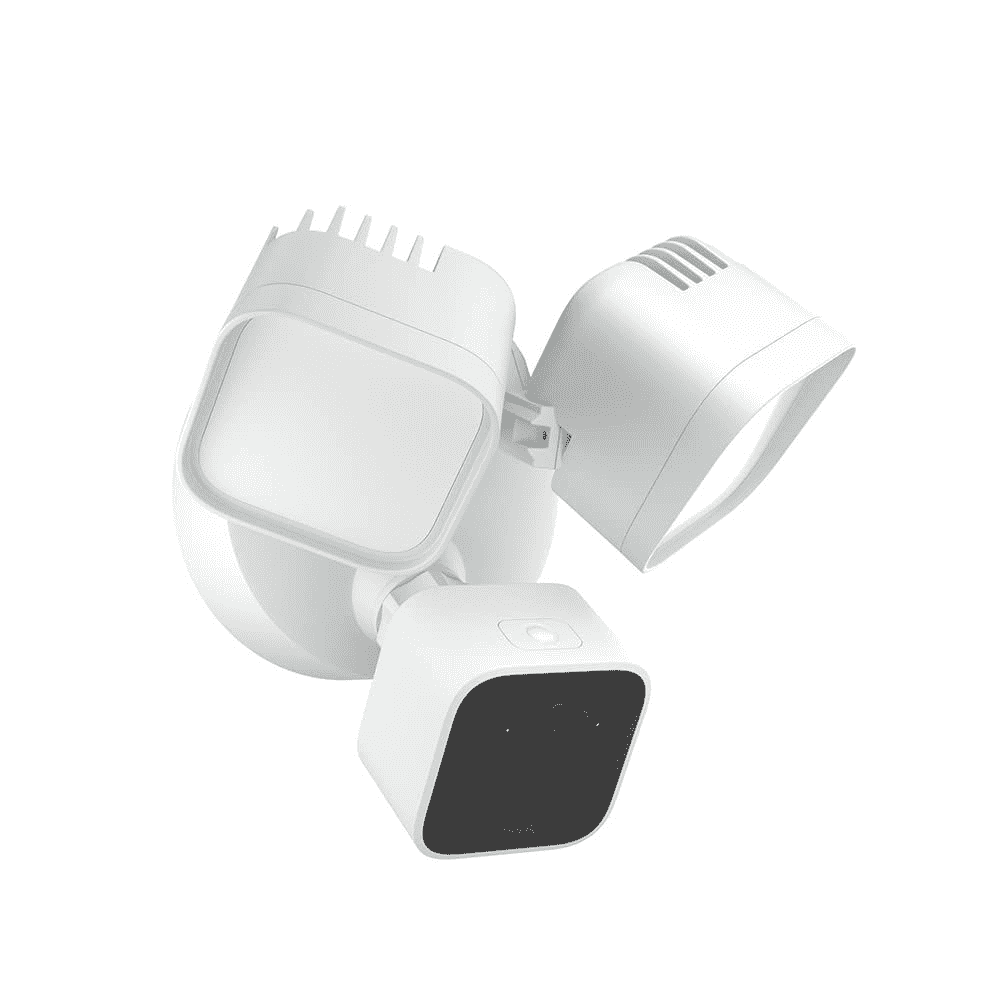
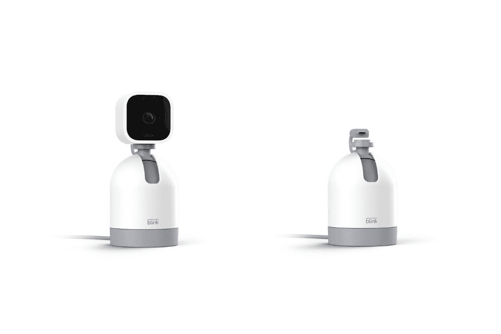

# 以下是亚马逊硬件活动期间发布的产品

> 原文：<https://www.xda-developers.com/heres-everything-announced-at-amazons-hardware-event/>

今天，亚马逊举办了一场在线活动，展示其 2022 年的最新硬件。现在，这不像典型的只有几样东西的产品发布会。相反，亚马逊将事情推向了另一个层面，在各种不同的产品类别中发布了一个又一个新设备。因此，如果您没空，或者错过了活动，我们会为您做好准备。因此，请坐好，放松并享受——这里几乎是亚马逊秋季活动期间发布的所有硬件产品。

亚马逊最新的 Echo Dot 和 Echo Dot with Clock 外观简单，但由于其定制的全音域驱动器，可以提供两倍于以前型号的低音，同时提供清晰的人声。除了音频增强之外，这些设备还具有新的传感器，支持上下文 Alexa 体验和手势控制。带时钟的 Echo Dot 现在可以展示比以前型号更多的信息，这要归功于它升级的高密度点显示。如果这还不够，新型号还将集成 eero，使 Echo Dot 和 Echo Dot with Clock 能够充当 Wi-Fi 网状扩展器。

### 带时钟的亚马逊回声圆点(第四代)

亚马逊还宣布了一种新的 Echo Dot 儿童模型，将有两种新设计，Owl 和 Dragon。该扬声器将包括一年的亚马逊 Kids Plus 服务，该服务将通过新的 Alexa 语音赋予猫头鹰和龙生命，可以讲笑话，唱歌，说问候等等。此外，Kids Plus 服务还将包括访问儿童内容，如数以千计的无广告书籍、游戏、视频等。Echo Dot、Echo Dot with Clock 和 Echo Dot Kids 现已接受预订，发布日期定在 10 月 20 日。Echo Dot 的价格为 49.99 美元，有木炭色、深海蓝和冰川白三种颜色可供选择，而带时钟的 Echo Dot 的价格为 59.99 美元，有云蓝色和冰川白两种颜色。最后，Echo Dot Kids 的价格为 59.99 美元，有猫头鹰和龙两种型号。

### 亚马逊回声点儿童(第四代)

最新的亚马逊智能音箱专为儿童打造，造型为猫头鹰和龙。

**Affiliate Links**

Amazon

[View at Amazon](https://www.amazon.com/dp/B09B9CD1YB/?tag=xda-7n2vk2v-20&ascsubtag=UUxdaUeUpU43811&asc_refurl=https%3A%2F%2Fwww.xda-developers.com%2Fheres-everything-announced-at-amazons-hardware-event%2F&asc_campaign=Short-Term)

## 回声工作室

亚马逊 Echo Studio 并不是一个全新的产品，但该公司在其最新的硬件活动中宣布了一种新颜色，Glacier。新的外观非常干净和明亮，给它一个清新的外观，在任何环境下都应该看起来很棒。Echo 扬声器是亚马逊提供的最好的扬声器之一，建立在 Echo 扬声器技术的基础上，并通过添加空间音频支持和频率范围扩展而更进一步。无论听什么样的内容，智能扬声器都能提供最佳的声音。最重要的是，复杂和强大的音频来自单一产品，不依赖于庞大的庞大设置。Echo 工作室售价 199.99 美元。冰川型号将于 10 月 20 日开始发售，而木炭型号目前已经可以购买。

### 亚马逊 Echo 工作室

Echo Studio 是亚马逊提供的最好的智能扬声器。这款扬声器有木炭色和全新冰川色可选。

**Affiliate Links**

Amazon

[View at Amazon](https://www.amazon.com/dp/B09M67KSSF/?tag=xda-7n2vk2v-20&ascsubtag=UUxdaUeUpU43811&asc_refurl=https%3A%2F%2Fwww.xda-developers.com%2Fheres-everything-announced-at-amazons-hardware-event%2F&asc_campaign=Short-Term)

Echo Auto 针对 2022 年进行了改进和翻新，看起来比其前身更薄，更便携。该设备更小的占地面积将使用户在将其放入车辆时更加灵活。Echo Auto 配备了五个麦克风，无论车厢内发出什么样的噪音，都能够听到您的请求。该设备由 Alexa 驱动，除了传统的一组命令外，它还将为用户提供免提路边援助。新款 Echo Auto 售价 54.99 美元，但目前亚马逊没有预购或发布日期。

### 亚马逊回声汽车

亚马逊 Echo Auto 将 Alexa 带到您的汽车上，同时还提供紧急路边服务。

**Affiliate Links**

Amazon

[View at Amazon](https://www.amazon.com/dp/B09X27YPS1/r?tag=xda-7n2vk2v-20&ascsubtag=UUxdaUeUpU43811&asc_refurl=https%3A%2F%2Fwww.xda-developers.com%2Fheres-everything-announced-at-amazons-hardware-event%2F&asc_campaign=Short-Term)

Halo Rise 是亚马逊的最新产品之一，提供了一种新的方法来跟踪睡眠行为，而不需要可穿戴硬件。床边跟踪器带有可以跟踪呼吸和运动的传感器，并利用机器学习来提供关于夜间休息的细节，如快速眼动、光照和深度睡眠。除了睡眠追踪之外，Halo Rise 还可以通过其可以模拟日出的“唤醒灯”照亮房间。作为一个亚马逊产品，也有与其他 Echo 产品和 Alexa 的集成。Halo Rise 的售价为 139.99 美元，将首先在美国上市。亚马逊尚未确定这款产品的发布日期。

### 亚马逊光环崛起

Halo Rise 是一款睡眠追踪器，位于您的床边，监控您的呼吸和运动。

**Affiliate Links**

Amazon

[View at Amazon](https://www.amazon.com/dp/B09MGBK9VV/r?tag=xda-7n2vk2v-20&ascsubtag=UUxdaUeUpU43811&asc_refurl=https%3A%2F%2Fwww.xda-developers.com%2Fheres-everything-announced-at-amazons-hardware-event%2F&asc_campaign=Short-Term)

也许今天宣布的最令人惊讶的产品是融合阅读和写作的下一代 Kindle。新的 Kindle Scribe 配备了一个 10.2 英寸的大型电子墨水显示屏，分辨率为 300ppi，厚度仅为 5.8 毫米。亚马逊 Paperwhite 显示屏将首次能够支持笔输入，除了记笔记或在书中涂鸦，你还可以使用新的 Kindle Scribe 下载和阅读你最喜欢的书籍。也许，最好的是，这支笔永远不需要充电。像以前的 Kindles 一样，新型号的电池充电一次可以使用几个月。只有一种颜色，钨，但该设备将有三种不同的型号，内部存储选项为 16GB，32GB 和 64GB。该设备的起价为 339 美元，从今天开始接受预购，11 月 30 日开始发货。

### 亚马逊 Kindle Scribe

亚马逊首次推出了可以用笔做笔记的 Kindle。

**Affiliate Links**

Amazon

[View at Amazon](https://www.amazon.com/dp/B09BS26B8B/?tag=xda-7n2vk2v-20&ascsubtag=UUxdaUeUpU43811&asc_refurl=https%3A%2F%2Fwww.xda-developers.com%2Fheres-everything-announced-at-amazons-hardware-event%2F&asc_campaign=Short-Term)

亚马逊正在扩大其电视产品线，推出其 Omni QLED 系列，该系列采用 4K QLED 显示屏，杜比视觉智商，HDR10+支持最佳画质。电视能够提供这种水平的图像质量归功于其面板，该面板具有 96 个局部调光区。此外，该电视首次支持亚马逊的 Fire TV 环境体验，允许显示器在没有用户物理输入的情况下做出智能反应。例如，它可以理解一个人何时进入房间，打开屏幕，显示相关信息。Omni QLED 电视也可以免提控制，当您趴在沙发上时，这是一种无缝体验。此外，它可以显示从超过 1，500 个选项中选取的风格化图像和艺术作品。全新的 Fire TV Omni QLED 系列将有两种尺寸:售价 799.99 美元的 65 英寸型号和售价 1099.99 美元的 75 英寸型号。这两款电视现在都可以预购，将于 10 月 27 日发布。

### 亚马逊 Fire TV Omni 系列

亚马逊提供的最好的电视，具有杜比视觉智商、本地调光和 Alexa。

**Affiliate Links**

Amazon

[View at Amazon](https://www.amazon.com/dp/B09N6J7KJD/?tag=xda-7n2vk2v-20&ascsubtag=UUxdaUeUpU43811&asc_refurl=https%3A%2F%2Fwww.xda-developers.com%2Fheres-everything-announced-at-amazons-hardware-event%2F&asc_campaign=Short-Term)

Amazon

[View at Amazon](https://www.amazon.com/dp/B09N6Y5BTL?tag=xda-7n2vk2v-20&ascsubtag=UUxdaUeUpU43811&asc_refurl=https%3A%2F%2Fwww.xda-developers.com%2Fheres-everything-announced-at-amazons-hardware-event%2F&asc_campaign=Short-Term)

亚马逊最新的媒体播放器采用 2Ghz 八核处理器，实现无缝 4K 流和闪电般的导航。该设备还将具有 HDMI 输入功能，允许连接和控制其他媒体设备。此外，由于它是亚马逊的产品，你可以使用 Alexa 对兼容设备进行免提控制。Fire TV Cube 现已接受预购，售价 139.99 美元，将于 10 月 25 日发售。

### 亚马逊 Fire 电视魔方

Fire TV Cube 包含了你想从 Fire Stick 获得的所有功能，但提供了改进的处理器和更多功能。

**Affiliate Links**

Amazon

[View at Amazon](https://www.amazon.com/dp/B09BZZ3MM7/?tag=xda-7n2vk2v-20&ascsubtag=UUxdaUeUpU43811&asc_refurl=https%3A%2F%2Fwww.xda-developers.com%2Fheres-everything-announced-at-amazons-hardware-event%2F&asc_campaign=Short-Term)

尽管 Echo Show 15 不是一款新设备，但亚马逊在其硬件活动中宣布，这款 15 英寸的智能显示器将获得 Fire TV 功能。亚马逊表示，超过 70%的 Echo Show 15 用户使用它来观看视频，因此将 Fire TV 添加到该产品中似乎是理所当然的。也许最好的是，更新将对所有当前和未来的所有者免费。Echo Show 15 现已发售，售价 249.99 美元

### 亚马逊回声秀 15

Echo Show 15 由于包含了 Fire TV 功能而变得更加出色。

**Affiliate Links**

Amazon

[View at Amazon](https://www.amazon.com/dp/B08MQLDFF6/ref=ods_gw_okly_d_dc_hftv_092822?pf_rd_r=3KZ8QR49MWPHG9FN4XVH&pf_rd_p=ae9f103c-a028-4758-885d-7484fefc6c4c&pd_rd_r=c1a3eb41-98f8-432f-be46-3f49893fed85&pd_rd_w=birHG&pd_rd_wg=mRaAW&ref_=pd_gw_unk&tag=xda-7n2vk2v-20&ascsubtag=UUxdaUeUpU43811&asc_refurl=https%3A%2F%2Fwww.xda-developers.com%2Fheres-everything-announced-at-amazons-hardware-event%2F&asc_campaign=Short-Term)

与标准型号相比，亚马逊最优质的遥控器提供了几项升级。遥控器具有背光按键，使其在夜间更容易操作按钮。此外，它还有两个可编程按钮，可以用来存储你最喜欢的应用程序，也可以用来存储 Alexa 命令。此外，该设备支持语音命令，甚至可以在丢失时发出声音。Alexa Voice Remote Pro 现在可以预购，价格为 34.99 美元。该遥控器将于 11 月 16 日开始上市。

### 亚马逊 Alexa 语音远程专业版

Alexa Voice Remote Pro 具有语音控制、可编程和背光按钮。

**Affiliate Links**

Amazon

[View at Amazon](https://www.amazon.com/dp/B09RX4HKTD/?tag=xda-7n2vk2v-20&ascsubtag=UUxdaUeUpU43811&asc_refurl=https%3A%2F%2Fwww.xda-developers.com%2Fheres-everything-announced-at-amazons-hardware-event%2F&asc_campaign=Short-Term)

Ring Spotlight Cam Pro 提供了一系列令人难以置信的安全功能，安装后不需要任何线缆。新的安全摄像机具有 1080p HDR 视频、3D 运动检测、可定制的运动区域等功能。该设备甚至可以跟踪运动，通过相机的鸟瞰图显示映射的轨迹。最重要的是，相机可以通过可充电电池或附加的太阳能电池板完全无线运行。那些更喜欢传统插件解决方案的人可以选择。基本款现已接受预购，售价 229.99 美元，将于 10 月 26 日上市。

### 环形聚光灯 Cam Pro

来自 Ring 的最新产品，提供强大的新功能，如鸟瞰模式。

**Affiliate Links**

Amazon

[View at Amazon](https://www.amazon.com/Introducing-Ring-Spotlight-Detection-Dual-Band/dp/B09DRX62ZV/?tag=xda-7n2vk2v-20&ascsubtag=UUxdaUeUpU43811&asc_refurl=https%3A%2F%2Fwww.xda-developers.com%2Fheres-everything-announced-at-amazons-hardware-event%2F&asc_campaign=Short-Term)

## **闪烁有线泛光灯摄像机和闪烁迷你云台**

除了 Ring Spotlight Cam Pro，亚马逊还首次推出了两款新的 Blink 设备，即 Blink 有线泛光灯相机和 Blink Mini Pan Tilt。泛光灯相机是一种有线解决方案，由亚马逊的 AZ2 处理器提供动力，具有强大的 LED 照明，能够产生高达 2600 流明。该相机具有耐候性、双向音频、可定制的运动检测系统和响亮的警报声。一体式设计非常便于安装，而且价格不会超出您的预算。眨眼有线泛光灯相机的零售价为 99.99 美元。不幸的是，亚马逊还没有宣布该产品的发布日期，但你可以注册以获得通知。

 <picture></picture> 

Blink Wired Floodlight Camera

##### 闪烁室外+泛光灯

Blink 有线泛光灯摄像机提供了所有的必需品，价格仅为 99.99 美元。

除了有线室外解决方案，亚马逊还推出了新的室内摄像头和摄像头安装系统，以及 Blink Mini 和 Blink Mini Pan Tilt。相机可以和支架一起购买，也可以单独购买支架。通过安装它，相机可以获得更宽的视野，这要归功于支架的运动范围。用户将能够控制平移和倾斜访问。这款相机可以以 59.99 美元的价格预订，而支架的价格为 29.99 美元

 <picture></picture> 

Blink Mini Pan-Tilt Camera

##### 迷你闪烁

Blink 迷你云台摄像机和 Blink 迷你云台支架。

在硬件展示期间，亚马逊发布了一些关于其 h

ousehold robot, Astro, originally built for home monitoring purposes. Today, the firm announced new updates to the robot, bringing a wealth of new features like allowing support for up to ten caregivers for one care recipient. It also added Remote Assist features, allowing the primary caregiver to set up Alexa routines remotely. Furthermore, it will gain the ability to better understand the world around it, learning more about objects and environments. This will first be applied to doors and windows so that it can alert owners if something is left open. Astro will now also be able to recognize cats and dogs. While it is available directly from Amazon, it isn't a straight purchase like many other products on this roundup and will require an invitation. You can submit your request using the link below. 

### 亚马逊 Astro

亚马逊 Astro 是一个强大而友好的家用机器人，可用于家庭监控。

**Affiliate Links**

Amazon

[View at Amazon](https://www.amazon.com/Introducing-Amazon-Astro/dp/B078NSDFSB?tag=xda-7n2vk2v-20&ascsubtag=UUxdaUeUpU43811&asc_refurl=https%3A%2F%2Fwww.xda-developers.com%2Fheres-everything-announced-at-amazons-hardware-event%2F&asc_campaign=Short-Term)