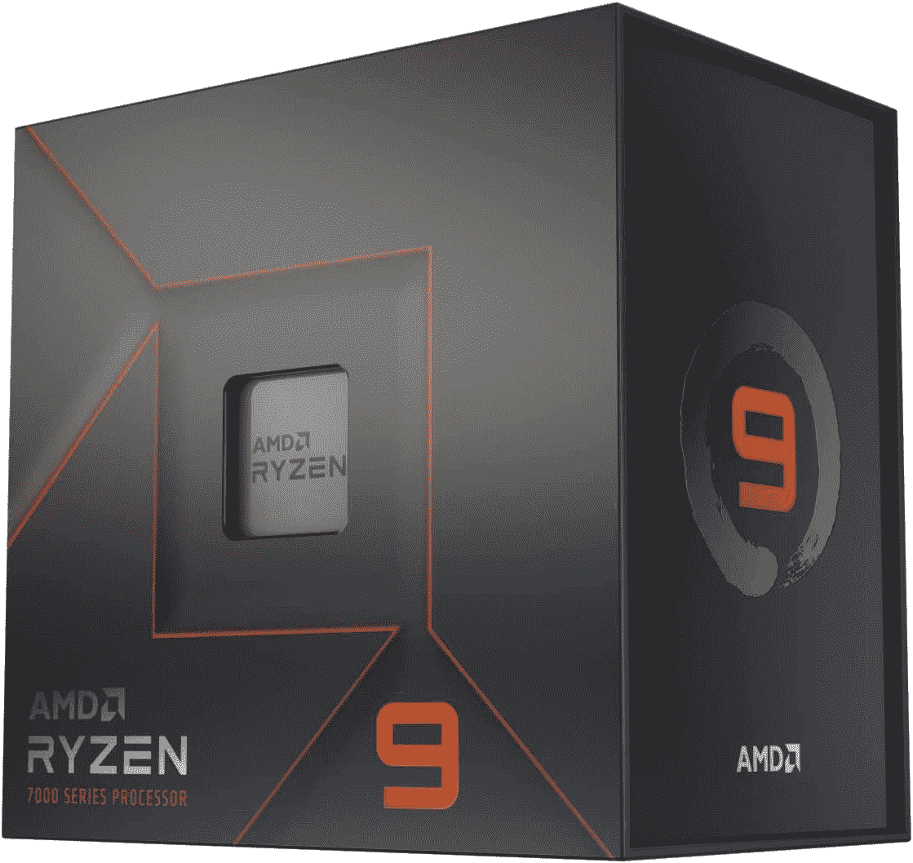
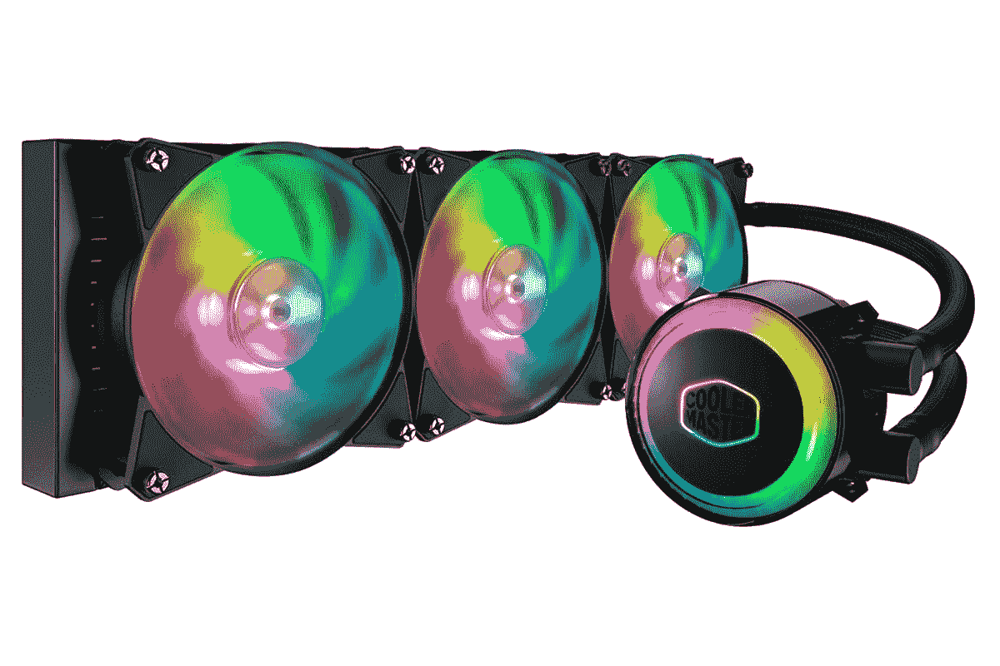
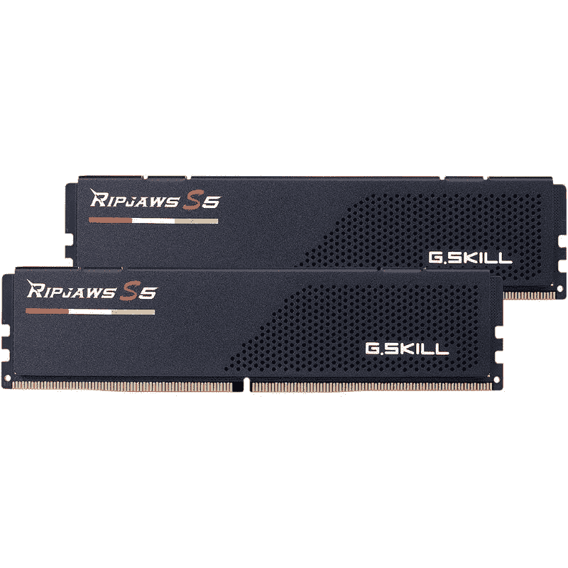
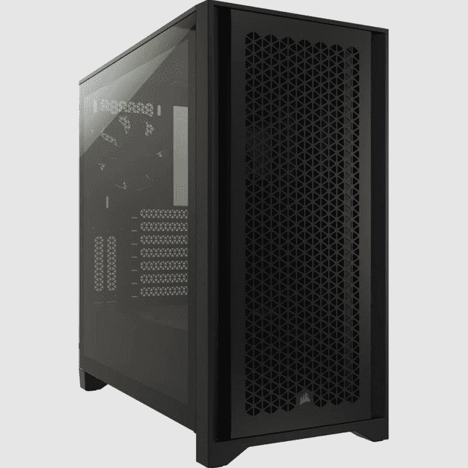

# 高级 AMD 游戏电脑指南:高端 AMD 产品的最佳部件

> 原文：<https://www.xda-developers.com/high-end-amd-gaming-pc-guide/>

构建一台新的游戏电脑总是很有趣。但是，试图找出最好的部分放在里面也会有点压力。首先，您是选择 AMD 还是英特尔的 CPU，AMD、Nvidia 还是英特尔的显卡。

没有一款适合所有人的电脑，但在这种情况下，我们将假设您已经选择构建一款高性能、全 AMD 游戏电脑。如果您正在寻找灵感，这正是我们在这里要帮助的。

## 高端 AMD 游戏电脑的最佳 CPU:AMD 锐龙 9 7950X

如果您正在寻找无与伦比的游戏性能，并为游戏流、内容创作等提供更多空间，这是值得购买的最佳 CPU 之一。[锐龙 9 7950X](https://www.xda-developers.com/amd-ryzen-7900x-7950x-review/) 是一款 16 核 32 线程 CPU，主频为 4.5 GHz，加速时钟为 5.7 GHz。

这是你现在可以买到的最强大的消费级 CPU，如果你正在寻找 AMD 最好的产品，那么你不能忽视它。这对于游戏来说太多了，但 7000 系列对锐龙单核性能的提升意味着在这一领域的性能优于其前辈。

 <picture></picture> 

AMD Ryzen 9 7950X

##### AMD 锐龙 9 7950X

16 核 32 线程的 AMD 处理器是您目前能获得的最强大的处理器。

## 高端 AMD 游戏电脑最佳 GPU 构建:AMD 镭龙 RX 7900 XTX

它不是你能买到的最高端的 GPU，但也足够接近[。RX 7900 XTX 是 AMD 最新的旗舰 GPU](https://www.xda-developers.com/best-gaming-graphics-cards/) ，配备了比以往更多的内核和 VRAM。这也是 AMD 的第一款小芯片 GPU，有一个图形芯片和六个内存控制器和高速缓存芯片。7900 XTX 的性能无法与[英伟达的 RTX 4090](https://www.xda-developers.com/nvidia-geforce-rtx-4090-review/) 相提并论，但它的价格为 1000 美元，而不是 1600 美元，这使得 AMD 的旗舰产品更加物有所值。

##### AMD 公司镭龙 RX 7900 XTX

使用最新的 RDNA 3 架构，AMD 已经能够将其游戏解决方案提升到一个新的水平。镭龙 RX 7900 XTX 是 2022 年的新旗舰，与旧的 6000 代 GPU 相比，在多个分辨率上提供了可观的收益。

## 最佳 CPU 冷却器:冷却器大师 MasterLiquid ML360R RGB

由于锐龙 9 7950X 没有捆绑 CPU 冷却器，你必须为你的构建购买一个。市场上有很多[很棒的 CPU 冷却器](https://www.xda-developers.com/best-cpu-coolers/)，所以为这个版本选择合适的应该没有问题。我们决定将锐龙 9 7950X 与更冷的 Master MasterLiquid ML360R 搭配使用。

顾名思义，这款冷却器配有一个 360 毫米的散热器，还有三个 RGB 风扇。可以把它看作是一个稍微实惠的冷却器 Master Master liquid ml 360 Illusion Cooler 版本，我们目前已经将其添加为市场上最佳 AIO 液体冷却器的选择。

 <picture></picture> 

Cooler Master MasterLiquid ML360R

##### 冷却器 Master MasterLiquid ML360R

冷却器 Master MasterLiquid ML360R 是市场上更实惠的 360 毫米 AIO CPU 冷却器之一。它还配备了三个预装的 RGB 风扇，并为高端芯片提供了出色的冷却性能。

## 最佳主板:华硕 ROG Strix X670E-E 游戏

从技术上来说，这不是华硕最高端的 AM5 主板，但 ROG Strix X670E-E 游戏是典型构造中最有吸引力的。它有一个 18+2 级 VRM，对于锐龙 9 7950X 来说绰绰有余，并且在大多数 PCIe 插槽上支持 PCIe 5.0，所有这些都在板上，不需要像更高端的华硕板那样的附加设备。

##### 华硕 ROG Strix X670E-E 游戏

华硕 ROG Strix X670E-E 游戏是一款高端华硕主板，由于其大型 18+2 级 VRM，它支持 PCIe 5.0 显卡、三个 PCIe 5.0 固态硬盘和高端锐龙 7000 CPUs。

## 最佳 DDR5 内存套件:G.Skill Ripjaws S5

G.Skill 拥有一系列高质量的内存套件，Ripjaws S5 非常适合高规格的 AMD 产品。迁移到锐龙 7000 也意味着迁移到 DDR5，这款 32GB 的 DDR5-5600 套件是一个不错的起点。它不是你能找到的绝对最快的，但是性能的平衡，不算天文数字的价格，和低姿态的设计使它成为任何类型的构建的好工具。它还支持 XMP 3.0，因此您可以轻松设置它以获得最佳性能。

 <picture></picture> 

G.Skill RipJaws S5 DDR5

##### G.技能 RipJaws S5 DDR5

G.Skill Ripjaws S5 是一款可靠的 DDR5 内存套件，具有可靠的性能和低调的设计。

## 最佳固态硬盘启动盘:三星 990 Pro 1TB

三星的 990 Pro SSD 基本上是其 980 Pro 驱动器的更快版本，并突破了 PCIe 4.0 接口的限制。凭借高达 7，450/MBs 的读取速度和 6，900/MBs 的写入速度，它是你能买到的[最快的 M.2 SSD](https://www.xda-developers.com/best-m-2-ssd/) 。它的售价为 170 美元，很贵，但没有你想象中世界上最快的 NVMe 固态硬盘那么贵。

三星最新、最快的固态硬盘 990 Pro 真正推动了 PCIe 4.0 存储的极限。

## 最佳电源设备:Corsair RM850X

 <picture></picture> 

Corsair RM850x PSU

为了给这一切供电，你需要一个合适的电源。根据我们在这里选择的部件，我们建议不低于 850W，Corsair RM850X 是一个可靠的选择。它是完全模块化的，具有 80+黄金能效等级，以及长期保修，让您高枕无忧。如果你觉得未来升级需要更多的空间，海盗船也有更高容量的版本。

 <picture></picture> 

Corsair RM850x PSU

##### 海盗船 RM850x PSU

Corsair RM850x 是一款可靠的 PSU，适合那些希望构建新 PC 的人，无论是游戏机还是视频编辑工作站。这是一款完全模块化的 PSU，能效等级为 80 Plus。

## 最佳电脑机箱:Corsair 4000D 气流中塔式机箱

海盗船 4000D 气流一直是我们的许多购买指南的首选，这是理所当然的。这种特殊的中塔式机箱在机箱内有足够的空间，即使是最苛刻的构建也不例外。作为一个以气流为中心的情况下，海盗船 4000D 气流是一个坚实的选择高端建设涉及许多强大的组件。

这个特殊的案例配有三个预装的案例风扇，这很好。除了我们的 CPU 冷却器附带的风扇，这应该足以保持机箱内的最佳气流。或者，您也可以选择 RGB 风扇附带的 RGB 版本。然而，这种情况下，前面是钢化玻璃，而不是网状面板，所以请记住这一点。

 <picture></picture> 

Corsair 4000D Airflow mid-tower PC case

##### 海盗船 4000D 气流

海盗船 4000D 气流是你可以买到的最好的气流箱之一，为你的组件提供完整的前后气流。它预装了两个 RGB 120mm 风扇。

## 高级 AMD 游戏电脑指南:价格摘要

下面是根据我们挑选的零件快速查看构建的价格摘要。不言而喻，价格会随着库存的变化而变化，所以一定要点击每个商品下面的购买链接来查看其最新价格。

| 

成分

 | 

挂牌价格

 |
| --- | --- |
| **AMD 锐龙 9 7950X 处理器** | $699 |
| **AMD 镭龙 RX 7900 XTX GPU** | $999 |
| **华硕 ROG Strix X670E-E 游戏主板** | $499 |
| **冷却器 Master MasterLiquid ML360R RGB** | $145 |
| **G.Skill Ripjaws S5 32GB DDR5** | $210 |
| **三星 980 Pro 1 TB M.2 NVMe SSD** | $169 |
| **海盗船 RM850X PSU** | $225 |
| **海盗船 4000D 气流中塔机箱** | $105 |
| **总计** | **3051 美元** |

**注:**请注意，此价格汇总只是为了让您了解，如果您以零售价采购所有部件或获得一台类似规格的预建计算机，这样的配置最理想的价格是多少。单个组件的价格会根据库存和其他外部因素发生变化。值得注意的是，最终价格不包括完成设置所需的其他外围设备，包括[显示器](https://www.xda-developers.com/best-monitors/)、[键盘](https://www.xda-developers.com/best-mechanical-keyboards/)、[游戏鼠标](https://www.xda-developers.com/best-gaming-mouse/)等，因此在计划购买这些部件时请记住这一点。

## 高级 AMD 游戏电脑指南:最终想法

一辆相对高端的锐龙 9 7950X 和一辆镭龙 RX 7900 XTX 要花掉你一大笔钱。然而，精英中的精英通常价格不菲，而且还会继续如此，尤其是因为 AMD 的高端芯片比以前更贵了。通过选择更便宜的锐龙 CPU(如 7900X 和 7900)和更便宜的镭龙 GPU(如 RX 7900 XT 和 RX 6800 XT ),可以以更低的成本获得最优质的 AMD 体验。

想买一台笔记本电脑，以避免追逐这些昂贵的电脑部件？查看我们收集的[最佳游戏笔记本电脑](https://www.xda-developers.com/best-gaming-laptops/)。如果你想购买更便宜的产品，我们还有一系列可靠的[低价游戏笔记本电脑](https://www.xda-developers.com/best-cheap-gaming-laptops/)。和往常一样，请务必访问我们的 [XDA 计算论坛](https://forum.xda-developers.com/c/xda-computing.12289/)，讨论您的构建，甚至从我们社区的专家那里获得更多产品推荐。祝你好运！