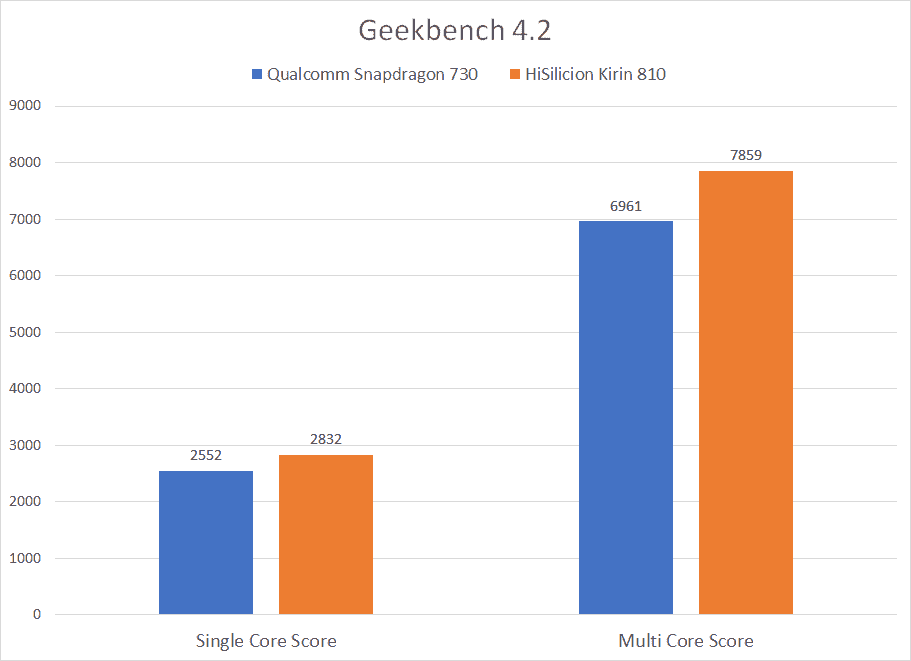
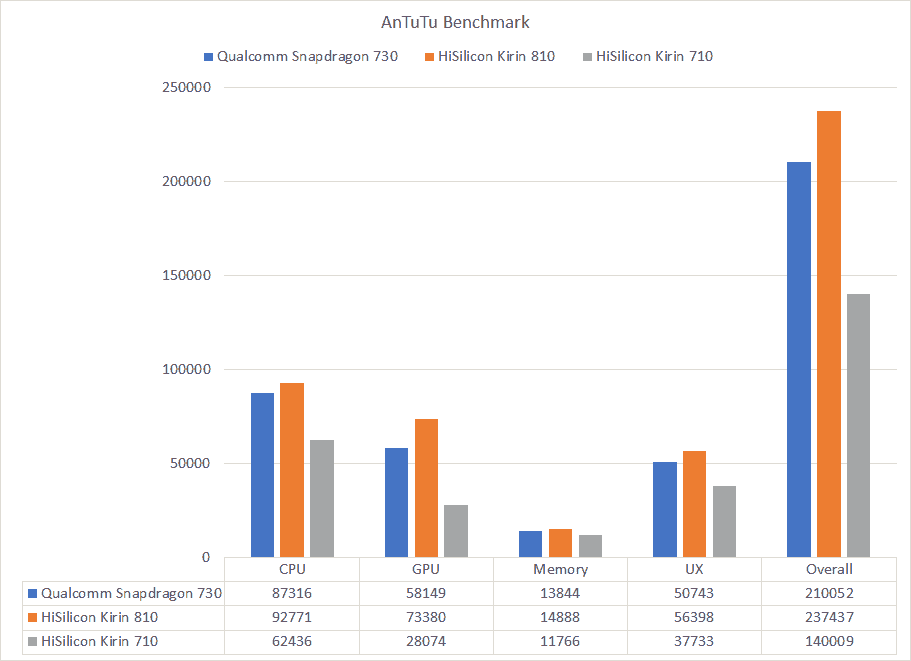

# Honor 9X 的新麒麟 810 与骁龙 730 相比如何

> 原文：<https://www.xda-developers.com/hisilicon-kirin-810-honor-9x-benchmark-snapdragon-730/>

华为最近在中国推出了 [Nova 5 智能手机系列](https://www.xda-developers.com/huawei-nova-5-pro-5i-mediapad-m6-launched/)。此次活动的亮点是华为 Nova 5 Pro 及其[海思麒麟 980](https://www.xda-developers.com/hisilicon-kirin-980-honor-magic-2-huawei-mate-20-pro/) SoC，我们之前在[华为 Mate 20 和 Mate 20 Pro](https://www.xda-developers.com/huawei-mate-20-huawei-mate-20-pro-specs-pricing-availability/) 、[华为 P30 和 P30 Pro](https://www.xda-developers.com/huawei-p30-pro-p30-official/) 以及 [Honor 20 和 20 Pro](https://www.xda-developers.com/honor-20-pro-specifications-features-pricing-availability/) 等设备上看到过。但除了旗舰产品，该活动也是华为 Nova 5 和华为最新中端 SoC 海思麒麟 810 的发布会。虽然 Nova 5 可能仍然是中国独家产品，但我们将在未来的 Honor 设备中看到新的麒麟 810，如即将到来的 Honor 9X。华为现在公布了麒麟 810 SoC 的更多细节，重点是它与高通骁龙 730 SoC 的比较。

海思麒麟 810 接替麒麟 710 成为华为今年的中端 SoC 选择。麒麟 810 基于 7nm 工艺，这使得它成为继旗舰麒麟 980 之后华为的第二款 7nm SoC。SoC 拥有 2 个最大频率为 2.27GHz 的 ARM Cortex-A76 CPU 内核和 6 个最大频率为 1.55GHz 的 ARM Cortex-A55 CPU 内核，而 Mali-G52 MP6 则处理设备上的 GPU 功能。该 SoC 还包含华为自主开发的达芬奇架构 NPU，据称可提供旗舰级人工智能性能。

华为将麒麟 810 直接与高通骁龙 730 竞争。骁龙 730 采用 8 纳米工艺制造，这是对其前身高通骁龙 710 的 10 纳米工艺的改进。SoC 内的设置包括 2 个半定制的 Kryo 470 黄金“性能”内核，主频为 2.2GHz，以及 6 个半定制的 Kryo 470 白银“效率”内核，主频为 1.8 GHz。SoC 上的 GPU 是 Adreno 618，SoC 还带有 Hexagon 688 DSP 和 Hexagon 张量加速器，用于人工智能加速。

| 

规格

 | 

高通骁龙 730

 | 

海思麒麟 810

 |
| --- | --- | --- |
| 中央处理器 | 

*   2 个 Kryo 470 金@2.2GHz
*   6x Kryo 470 银@1.8GHz

 | 

*   2 个 Cortex-A76 @2.27GHz
*   6x Cortex-A55 @1.55GHz

 |
| 制造工艺 | 8 纳米 | 7 纳米 |
| 国家政治保卫局。参见 OGPU | 肾上腺素 618 | 马里-G52 MP6 |
| 人工智能硬件 | 带六角形张量加速器的 Hexagon 688 DSP | 专用 NPU - DaVinci 架构 |

华为声称麒麟 810 优于更新的骁龙 730。这是通过 Geekbench 4.2 和 AnTuTu 基准测试成绩宣称的，如下。

据说麒麟 810 的单核性能略强于骁龙 730，但华为声称在 Geekbench 上的多核性能差异更大。

 <picture></picture> 

Source: Huawei

安兔兔也有类似的趋势，与骁龙 730 及其前身麒麟 710 相比，麒麟 810 成为性能优越的 SoC。麒麟 810 的 GPU 性能使其比骁龙的同类产品有明显的优势，再加上更强的多线程性能，将在游戏场景中帮助你。这并不是说骁龙 730 在任何方面都很差劲，因为我们已经看到骁龙 730 的前辈在价值导向型设备上的游戏表现令人钦佩。

 <picture></picture> 

Source: Huawei

华为也声称拥有卓越的人工智能性能，甚至可以与旗舰产品相媲美。根据他们使用安德烈·伊格纳托夫开发的[人工智能基准作为比较基础的内部测试，华为声称麒麟 810 NPU 在人工智能性能方面的表现甚至比旗舰高通骁龙 855 好得多。](http://ai-benchmark.com/)

虽然基准的一般效用本身有时会受到质疑，但人工智能基准的效用甚至更值得怀疑。人工智能是一个包罗万象的大术语，多年来已经获得了几个含义，计算一个单一的“分数”来概括设备在各种神经网络上的整体性能是一项难以完美协调的任务。正如骁龙路线图规划和 AI，XR，高通竞争战略副总裁 Ziad Asghar 先生在接受 XDA 采访时提到的，[人工智能基准因其固有性质将更多地转向特定网络或网络组合，而不考虑这种转向是否与模式工作负载一致。人工智能的性能将更多地取决于实际用例，而不仅仅是基准数据，以及哪些设备能够以最快、最有效的方式完成真正的工作。](https://www.xda-developers.com/qualcomm-gary-brotman-ziad-asghar-ai-snapdragon-855-hexagon-690-dsp/)

即使麒麟 810 的尺寸可能达不到高通骁龙 855 旗舰 SoC 或其他旗舰 SoC，但它确实是中端市场的一个非常好的产品，至少在理论上是如此。这也可能是海思最后一个拥有 ARM IP 的芯片，因为在特朗普政府发布针对华为的行政命令后， [ARM 已经切断了与华为](https://www.xda-developers.com/arm-suspend-business-huawei/)的联系。尽管如此，我们期待看到麒麟 810 在 Honor 9X 和其他华为和 Honor 设备上的运行，并独立测试华为的说法。

**注意:华为/Honor 已经停止为其设备提供官方 bootloader 解锁代码。因此，他们设备的引导加载程序无法解锁，这意味着用户无法 root 或安装自定义 rom。**