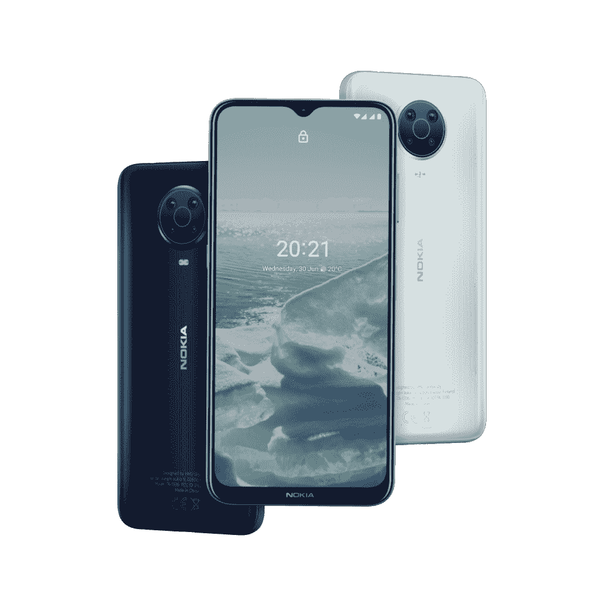
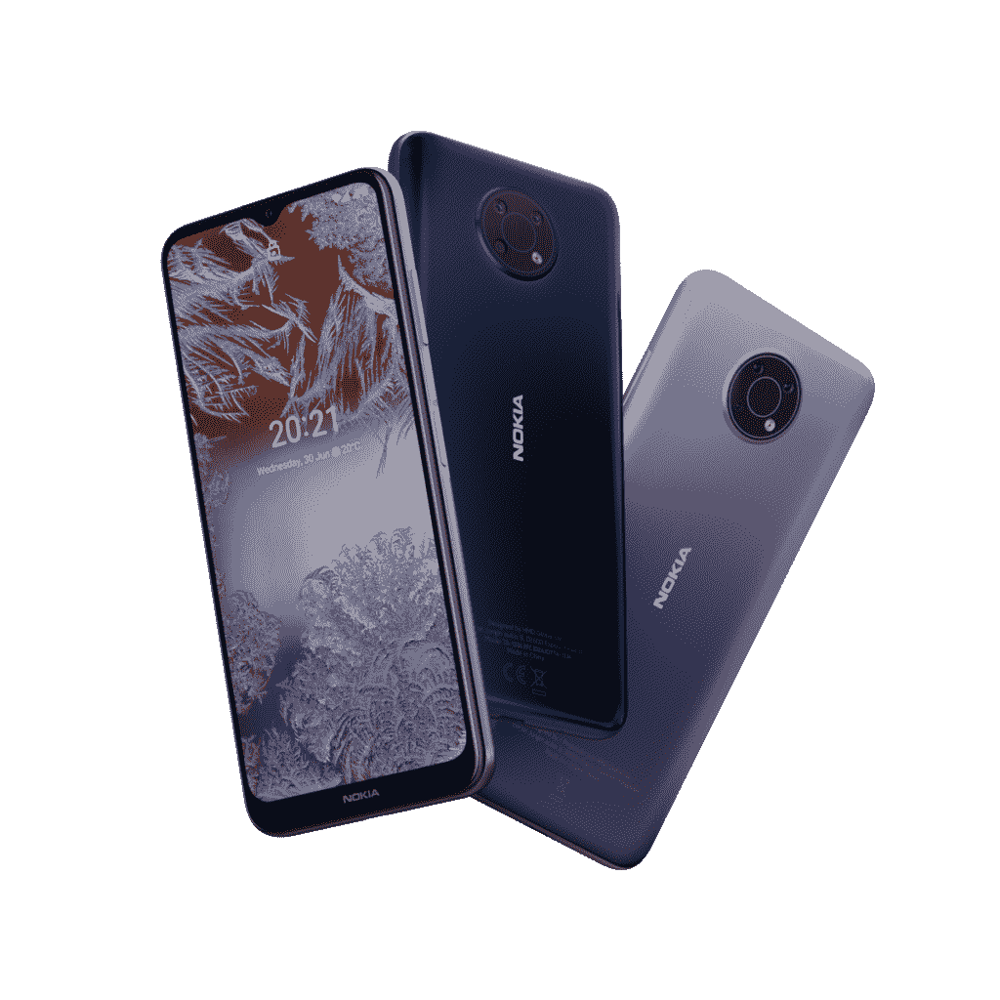
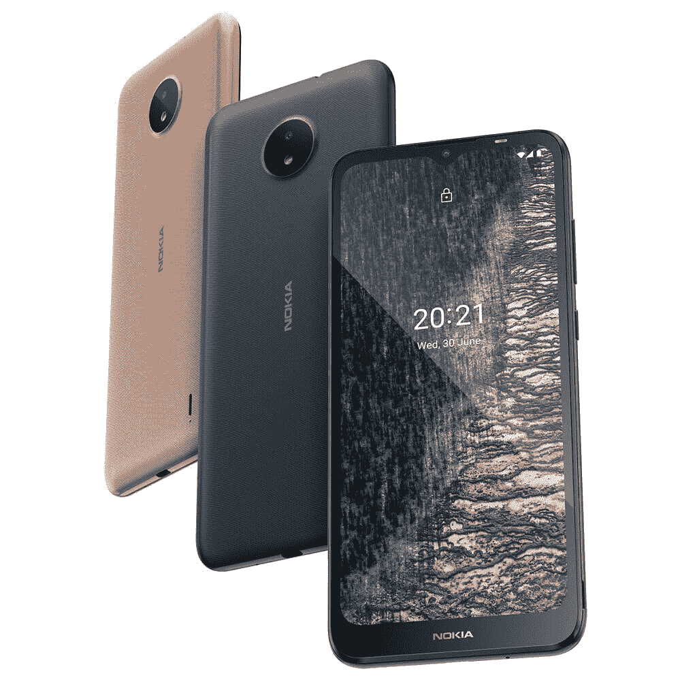
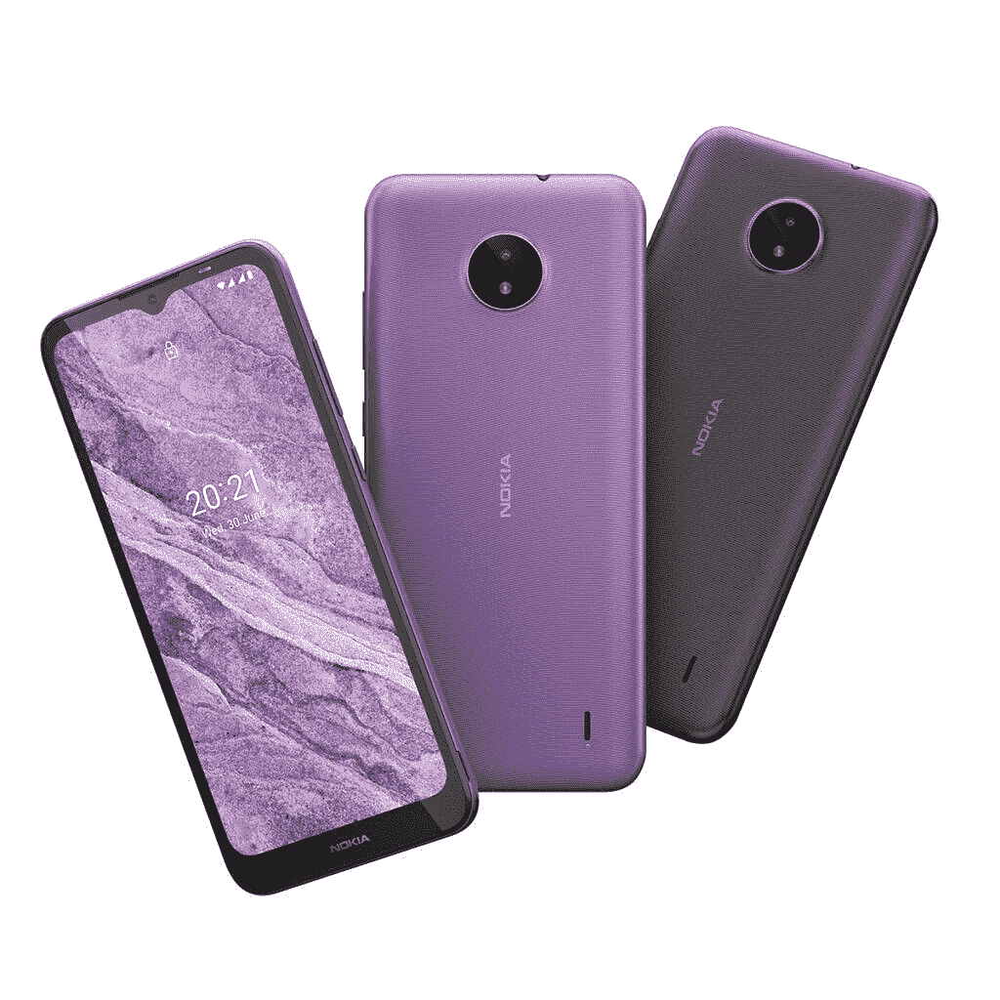

# 诺基亚 X10、X20、G10、G20、C10 和 C20 随 Android 11 发布

> 原文：<https://www.xda-developers.com/hmd-global-nokia-android-11-x10-x20-g10-g20-c10-c20/>

四年前，诺基亚重返智能手机市场。该品牌无疑远远落后于其作为世界上最大的手机品牌的传统，但其对无臃肿用户体验的承诺帮助其保持了独特的身份，特别是在入门级和经济型智能手机市场。复兴了诺基亚品牌的 HMD Global 公司现在正在推出六款不同价位的新智能手机和一副无线 TWS 耳机。随着此次发布，HMD 正在摆脱其传统的[十进制命名](https://www.xda-developers.com/nokia-5-4-nokia-3-4-nokia-power-earbuds-lite-launched-india/)，并采用字母数字命名，包括今天发布的新诺基亚 X 系列 X10 和 X20、G 系列 G10 和 G20 以及 C 系列 C10 和 C20。

新的 X 系列迎合了在中端市场寻求优质体验的用户，其功能包括三年的 Android 版本更新、增强相机的蔡司镜头以及 5G 连接的承诺。G 系列提供了更中性的中档体验，延长了三天的电池续航时间和两次平台更新。最后，HMD 以 C 系列面向首次使用智能手机的消费者。本文的以下部分将详细讨论所有这些智能手机。

## 诺基亚 X10 和 X20

诺基亚 X10 和 X20 是 HMD Global 今天推出的顶级车型。这两款智能手机拥有蔡司镜头，相机性能更好。X20 配有 6400 万像素的四摄像头，而诺基亚 X10 配有 4800 万像素的四摄像头。除了主摄像头传感器的差异，两款手机都具有一个 5MP 超宽摄像头，一个 2MP 微距摄像头和一个 2MP 深度传感器。X10 和 X20 都配备了 6/67 英寸的全高清+显示屏，中央对齐的打孔自拍相机。两台设备上的摄像头分辨率确实不同。

新的诺基亚 X 系列手机使用[高通骁龙 480](https://www.xda-developers.com/qualcomm-snapdragon-480-cheap-5g-phones-2021/) 芯片组，在预算部分提供 5G 连接。此外，您还可以获得高达 8GB 的内存和 128GB 的存储空间，后者可扩展至 512GB。这两款智能手机配备了 4470mAh 电池，支持 18W 充电。HMD Global 声称这些设备的电池续航时间为两天。

诺基亚 X10 和 X20 配备了一个专用的谷歌助手按钮，并带有 NFC 功能。这两款设备都支持增强现实应用的 AR Core，并且是谷歌为其 Android 企业推荐的认证设备之一。这两款智能手机运行的是现成的 Android 11 软件，诺基亚承诺将提供三代 Android 版本更新。这意味着诺基亚 X10 和 X20 将升级到 Android 14。

在下面找到诺基亚 X10 和 X20 的完整规格:

| 

规格

 | 

诺基亚 X10 和 X20

 |
| --- | --- |
| **尺寸&重量** | 

*   168.94 x 79.7 x 9.1mm 毫米
*   **X20**:220 克
*   **X10**:201 克

 |
| **显示** | 

*   6.67 英寸全高清+打孔显示屏
*   1080 x 2400 像素分辨率
*   450 尼特(典型。)峰值亮度

 |
| **SoC** | 高通骁龙 480 |
| **闸板&存放** | **X20** :

*   6GB/128GB
*   8GB/128GB
*   支持高达 512GB 的 MicroSD 卡

**X10** :

*   4GB/128GB
*   6GB/64GB
*   6GB/128GB
*   支持高达 512GB 的 MicroSD 卡

 |
| **电池&充电** | 

*   4470 毫安时电池
*   18W 充电

 |
| **安全** | 侧装电容式指纹扫描仪 |
| **后置摄像头** | **X20** :

*   6400 万像素主摄像头，配备蔡司光学系统
*   500 万像素超宽相机
*   2MP 微距相机
*   2MP 深度传感器

**X10** :

*   4800 万像素主摄像头，配有蔡司光学系统
*   500 万像素超宽相机
*   2MP 微距相机
*   2MP 深度传感器

 |
| **前置摄像头** | **X20** :**X10:** |
| **端口** | 

*   USB Type-C (USB 2.0)
*   3.5 毫米耳机插孔

 |
| **音频** | 

*   适用于蓝牙的 aptX/aptX HD/aptX
*   视频录制用 OZO 音频

 |
| **连通性** | 

*   5G sub-6GHz、LTE 和 GSM，支持 4x4 MIMO
*   802.11 b/g/n/ac
*   蓝牙 5.0
*   GPS/AGPS，GLONASS，伽利略

 |
| **软件** | 

*   Android One 搭载 Android 11
*   保证更新到 Android 14

 |
| **其他特征** | 

*   NFC(支持 eSE)
*   调频广播
*   支持谷歌 AR 核心
*   安卓企业推荐
*   专用的谷歌助手按钮

 |

## 诺基亚十国集团和二十国集团

与 X 系列手机相比，诺基亚 G10 和 G20 的动力相对较弱。G 系列配备了联发科的 [Helio G35](https://www.xda-developers.com/mediatek-helio-g35-g25-chipsets-unveiled-gaming-budget/) SoC，因此仅限于 4G 连接。你会得到一个 6.5 英寸的高清显示屏，带有 V 形凹槽。

除了一个 4800 万像素的主摄像头，诺基亚 G20 还配备了一个 500 万像素的超宽摄像头，一个 200 万像素的微距摄像头和一个 200 万像素的深度摄像头。另一方面，诺基亚 G10 只有一个 1300 万像素的三摄像头设置，缺少 G20 所具有的超宽摄像头。在正面，两款手机都配有 800 万像素的自拍摄像头。

 <picture></picture> 

Nokia G20

HMD Global 声称由于 5050mAh 电池，G10 和 G20 的电池续航时间为 3 天。智能手机只能获得 10W 的充电支持。

虽然这些智能手机上有一个谷歌助理按钮，但在某些地区，你也可以通过 NFC 进行非接触式交易。最后，这些手机通过了 IPX2 认证，这意味着该设备可能在被水溅到后仍然存在，但只是在特定条件下。

 <picture></picture> 

Nokia G10

以下是诺基亚 G10 和 G20 规格:

| 

规格

 | 

诺基亚十国集团和二十国集团

 |
| --- | --- |
| **尺寸&重量** | 

*   164.9 x 76.0 x 9.2mm 毫米
*   **G20**:197 克
*   **G10**:194 克

 |
| **显示** | 

*   带 V 形凹槽的 6.5 英寸高清显示屏
*   20:9 宽高比

 |
| **SoC** | 联发科 Helio G35 |
| **闸板&存放** | **G20** :

*   4GB/64GB
*   4GB/128GB
*   支持高达 512GB 的 MicroSD 卡

**G10** :

*   3GB/32GB
*   4GB/64GB
*   支持高达 512GB 的 MicroSD 卡

 |
| **电池&充电** | 

*   5050 毫安时电池
*   10W 充电

 |
| **安全** | 侧装电容式指纹扫描仪 |
| **后置摄像头** | **G20** :

*   480 万像素主摄像头，f/1.79 光圈
*   500 万像素超宽相机
*   2MP 微距相机
*   2MP 深度传感器

**G10** :

*   1300 万像素主摄像头
*   2MP 微距相机
*   2MP 深度传感器

 |
| **前置摄像头** | 两个都是 800 万像素 |
| **端口** | 

*   USB Type-C (USB 2.0)
*   3.5 毫米耳机插孔

 |
| **音频** | 

*   用于视频录制的 OZO 音频(仅限诺基亚 G20)

 |
| **连通性** | 

*   CAT4 LTE
*   802.11 b/g/n
*   蓝牙 5.0
*   全球定位系统/AGPS、GLONASS、伽利略

 |
| **软件** | 

*   Android One 搭载 Android 11
*   保证更新到 Android 13

 |
| **其他功能** | 

*   NFC(仅限特定市场)
*   调频广播
*   专用的谷歌助手按钮
*   IPX2 额定值

 |

## 诺基亚 C10 和 C20

诺基亚 C10 和 C20 以及该系列中最实惠的智能手机。诺基亚 C 系列并不新鲜，因为 HMD Global 之前已经推出了[诺基亚 C3](https://www.xda-developers.com/nokia-5-3-c3-hmd-global-launch-india/#google_ads_iframe_/8095840/.2_A.35948.3_xda-developers.com_tier1_0__container__:~:text=Nokia%20C3,-Besides) 。新的 C 系列手机旨在为首次使用智能手机的用户提供愉快的体验。虽然诺基亚 C20 支持 LTE 连接，但诺基亚 C10 仅限于 3G+或 WCDMA。

 <picture></picture> 

Nokia C20

C10 和诺基亚 C20 分别使用优尼科的四核和八核芯片组。它们配有 1GB 或 2GB 的 RAM，这表明 HMD Global 希望以这些设备为目标市场。这两款智能手机采用 6.5 英寸高清+显示屏，配有 500 万像素的自拍摄像头，由于没有物理指纹扫描仪，这也有助于解锁手机。

这两款智能手机配有单个 500 万像素的后置摄像头，并配有 3000 毫安时可移动电池。这两款设备都运行 Android 11 (Go 版)。与其他两个系列不同，诺基亚没有声称为这些手机提供一定数量的 Android 版本升级，但承诺两年的安全更新。

 <picture></picture> 

Nokia C10

在下面找到诺基亚 C10 和 C20 规格:

| 

规格

 | 

诺基亚 C10 和 C20

 |
| --- | --- |
| **尺寸&重量** | 

*   169.9 x 77.9 x 8.8mm 毫米
*   191g

 |
| **显示** | 

*   带 V 形凹槽的 6.5 英寸高清显示屏
*   20:9 宽高比

 |
| **SoC** | **C20:** Unisoc SC9863a 带八核 CPU @ 1.6 GHz**C10:**Unisoc sc 7331 e 带四核 CPU @1.3GHz |
| **闸板&存放** | **C20** :

*   1GB/116GB
*   2GB/32GB
*   支持高达 256GB 的 MicroSD 卡

**C10** :

*   1GB/16GB
*   2GB/16GB
*   2GB/32GB
*   支持高达 256GB 的 MicroSD 卡

 |
| **电池&充电** | 

*   3000mAh 可拆卸电池
*   5W 充电

 |
| **安全** | 2D 面部解锁(无指纹扫描仪) |
| **后置摄像头** | 500 万像素摄像头，f/2.2 光圈 |
| **前置摄像头** | 500 万像素自拍相机 |
| **端口** | 

*   微型 USB 2.0
*   3.5 毫米耳机插孔

 |
| **连通性** | **C20:**

*   CAT4 LTE
*   802.11 桶/克/日
*   蓝牙 4.2
*   GPS/AGPS

**C20:**

*   WCDMA (3G)
*   802.11 b/g/n
*   蓝牙 4.2
*   GPS/AGPS

 |
| **软件** | 安卓 11 (Go 版) |
| **其他功能** |  |

## 诺基亚建兴耳塞(BH-205) TWS

除了智能手机，HMD Global 还发布了一对 TWS 耳机，名为诺基亚 Lite 耳塞，具有蓝牙 5.0 连接功能。耳机配有 mm 驱动器，声称频率响应为 20Hz-20KHz。每个耳塞都配备了 40mAh 电池，承诺续航时间为 6 小时，而便携包则配备了 400mAh 电池，续航时间可达 30 小时。因此，每次充满电的总电池寿命为 36 小时，这对 TWS 耳机来说非常出色。便携包配有一个 USB Type-C 充电端口。

这款耳塞有极地海洋和木炭色两种颜色可供选择。

## 价格和可用性

诺基亚 X20 的售价为€349 英镑(约 415 美元)，将于 2021 年 5 月开始在不同市场上市。X10 将于 2021 年 6 月开始上市，起价为€309 英镑(约 368 美元)。

从 2021 年 5 月起，诺基亚 G20 可以在全球不同市场以 159€(约 189 美元)的起价购买。从 2021 年 4 月起，G10 的零售价格将从€139 英镑(约 165 美元)起。

诺基亚 C20(约 106 美元)的起价为€89 英镑，将从本月开始发售。C10 将于 2021 年 6 月上市，售价为€75 美元(约 89 美元)。

诺基亚 Lite 耳塞将于 4 月中旬开始在€上市，售价 39 美元(约 47 美元)。

**注:价格可能[因市场而异](https://www.hmdglobal.com/press-releases/love-trust-keep)，可能与从欧元直接兑换成当地货币不一致。**