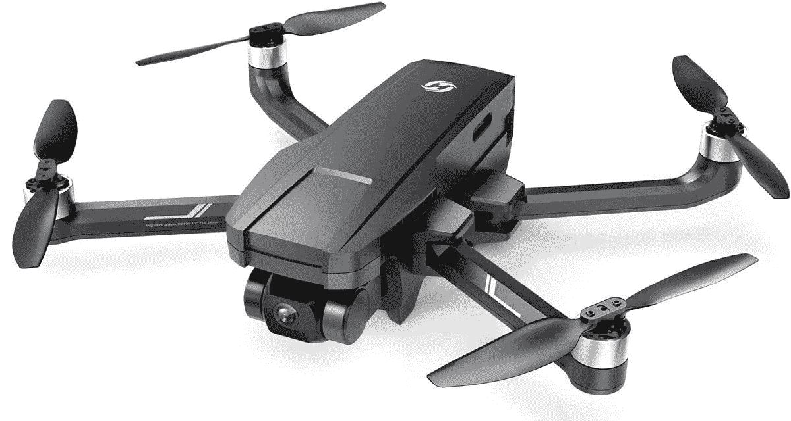
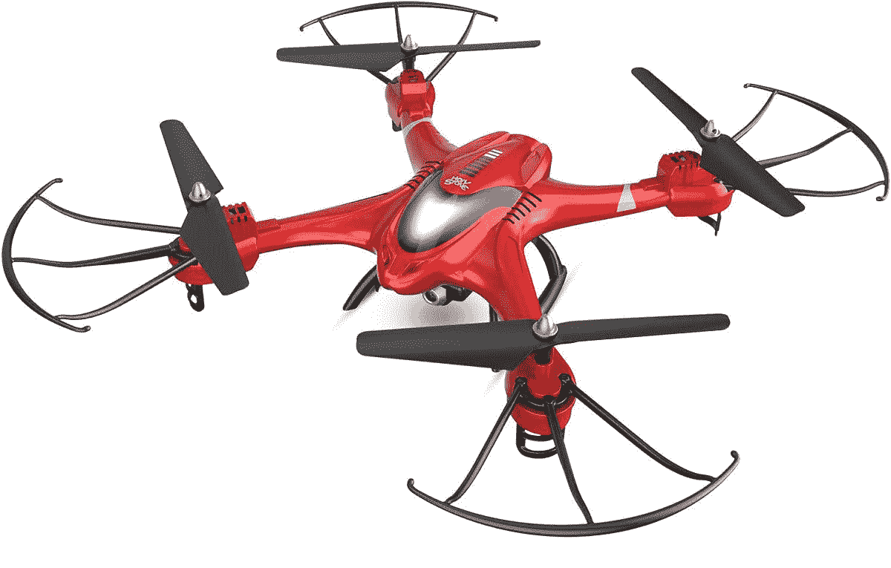
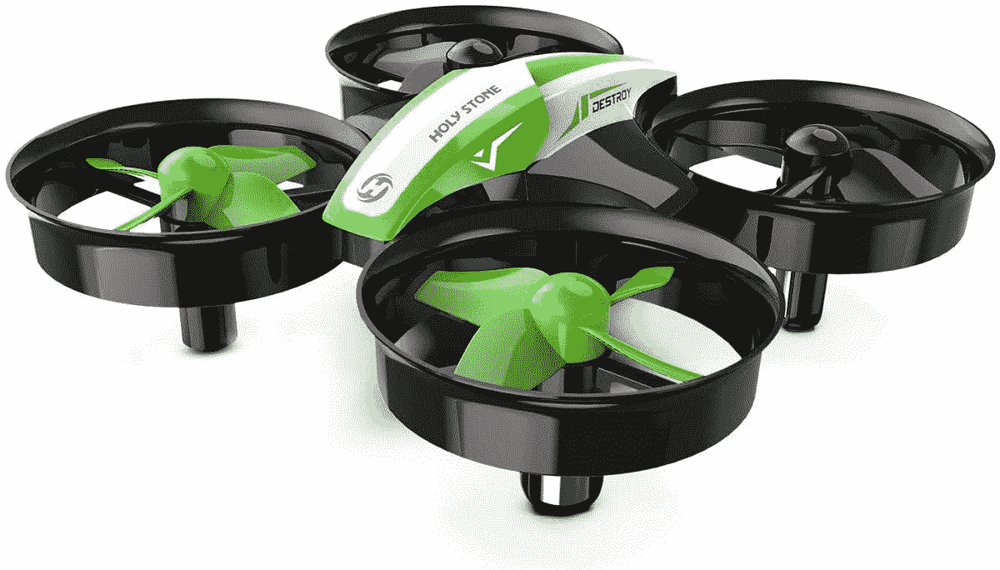

# 在黄金日带着圣石无人机飞向天空

> 原文：<https://www.xda-developers.com/holy-stone-drones-prime-day-2022/>

无人机是你在“得到它”之前真正需要体验的物品之一把一台摄像机放在 400 英尺高的空中会给你一个全新的视角。无人机已经使天空民主化，使得以超低价格飞行成为可能。我这辈子飞过十几个不同品牌的无人机，圣石绝对是前三的厂商。他们的无人机很坚固，飞得很好，还附有很好的相机。他们可以很好地连接到遥控器和你用来监控他们的电话，即使是在我家附近的 Wi-Fi 浴室里。

我喜欢带着一架无人机在我家附近的田野上飞来飞去，尤其是在使用第一人称视角拍摄时。当你以每小时 20 英里的速度在离草地几英尺的地方飞行，或者直冲云霄，看到你的整个邻居就在你面前时，你会有一点冲动。这就像你自己的个人[谷歌地图](http://maps.google.com)卫星视图。

## 价格合适

圣石无人机的成本也没有其他无人机制造商高，所以如果你只是考虑进入无人机领域，这种进入门槛要低得多。另外，如果你崩溃了，你不会在一眨眼的时间里损失四位数的投资。神圣之石无人机是很好的入门无人机，在把一些重要的硬币扔进更重要的机器之前，先了解一下无人机能做什么。圣石的大部分产品今明两天都会打折，所以如果你好奇，可以去看看。

 <picture></picture> 

Holy Stone 720G

##### 圣石 720 克

圣石 720G 是一种更先进的无人机，带有 GPS，使其飞行更加稳定。

圣石 720G 是圣石的高端产品之一。GPS 的加入是一个游戏规则的改变，因为它允许无人机在你释放操纵杆时停留在一个地方。它还允许 GPS 在断线的情况下找到回家的路。如果你想得到一架好的无人机，但又不想在上面花太多钱，这款无人机是个不错的选择。今天享受 20%的优惠是额外的奖励。

 <picture></picture> 

Holy Stone HS200

##### 圣石 HS200

HS200 是无人机领域的入门产品。没有全球定位系统，大大降低了成本。

HS 200 是初学者无人机，没有 GPS。控制无人机还是很容易的，但是不会得到归家功能。这也大大降低了成本。除此之外，这款无人机的飞行速度很快，航程也很远。

 <picture></picture> 

Holy Stone HS210

##### 圣石 HS210

HS210 是一款纳米无人机。它可以在室外飞行，但它应该在室内飞行，比如在客厅周围。

纳米无人机在房子周围飞行很有趣。它们足够紧凑，可以在内部操纵，而不用担心撞到墙壁。即使你这么做了，它们也没什么重量，所以不会造成太大的伤害。内置的转子盖也将有助于这一能力。

圣石今天还有许多其他的无人驾驶飞机出售。请查看以下内容:

圣石无人机飞行起来很有趣，而且不会让你倾家荡产。此外，一定要查看当地的无人机飞行法规。最近有很多新规则。虽然没有在室内飞行的规则，但如果你把它放在你的客厅，你会很好。

今天我们有更多的黄金日交易。如果你需要一部手机来帮助驾驶你的无人机，[一加诺德 N200](https://www.xda-developers.com/the-oneplus-nord-n200-is-just-179-this-amazon-prime-day/) 是一个不错的选择，或者看看[三星 Galaxy S22 Plus](https://www.xda-developers.com/samsung-galaxy-s22-plus-amazon-prime-day-deal/) 。