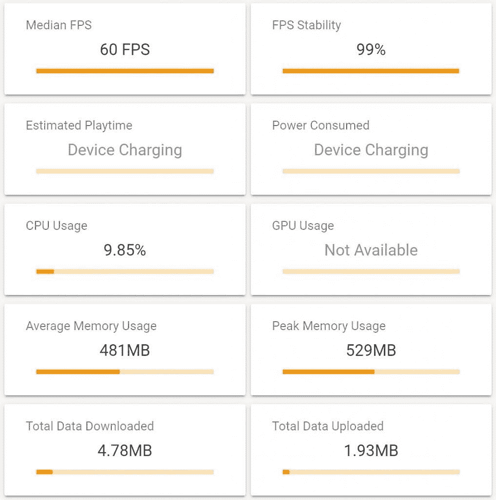
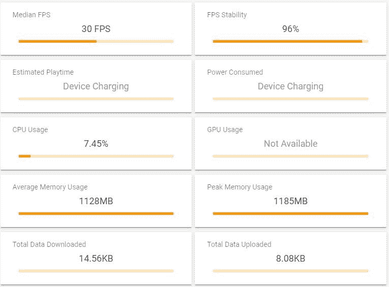

# 荣誉 20 游戏回顾:把麒麟 980 vs 安卓的前 15 名游戏

> 原文：<https://www.xda-developers.com/honor-20-gaming-performance-review/>

Honor 20 和 Honor 20 Pro 是 Honor 最新的旗舰手机。他们拥有最新的规格、最新的技术和最新的软件。所有这些应该意味着它拥有任何手机中最好的性能，对吗？。我们对此进行了测试，看看是否有可能以其他主要原始设备制造商旗舰产品一半的成本获得旗舰产品的性能。

| 

**规格**

 | 

**荣誉 20**

 | 

**荣誉 20 Pro**

 |
| --- | --- | --- |
| 尺寸和重量 | 

*   154.3 x 74 x 7.9 毫米；
*   174 克

 | 

*   154.6 x 74 x 8.4 毫米；
*   182 克

 |
| 显示 | 6.26 英寸 FHD+ IPS 液晶屏 | 6.26 英寸 FHD+ IPS 液晶屏 |
| 社会学 | 7 纳米海思麒麟 980:

*   2 个 Cortex-A76 @2.6GHz 以上
*   2 个 Cortex-A76 @1.9GHz 以上
*   4x Cortex-A55 @1.8GHz

Mali-G76 MP10 GPU | 7 纳米海思麒麟 980:

*   2 个 Cortex-A76 @2.6GHz 以上
*   2 个 Cortex-A76 @1.9GHz 以上
*   4x Cortex-A55 @1.8GHz

Mali-G76 MP10 GPU |
| RAM 和存储 |  |  |
| 电池 | 3750 毫安时，支持 22.5 瓦快充 | 4000 毫安时，支持 22.5 瓦快充 |
| 通用串行总线 | 带 C 型连接器的 USB 2.0 | 带 C 型连接器的 USB 2.0 |
| 连通性 | 

*   WiFi 802.11 a/b/g/n/ac 支持
*   蓝牙 5.0
*   A-GPS、GLONASS、BDS、伽利略、QZSS
*   红外端口

 | 

*   WiFi 802.11 a/b/g/n/ac 支持
*   蓝牙 5.0
*   A-GPS、GLONASS、BDS、伽利略、QZSS
*   红外端口

 |
| 指纹扫描仪 | 侧面安装的 | 侧面安装的 |
| 后置摄像头 | 

*   48MP 索尼 IMX586，f/1.8，0.8μm，PDAF
*   16MP，f/2.2，117 广角相机
*   200 万像素，f/2.4，微距相机
*   200 万像素，f/2.4，深度传感器

 | 

*   48MP 索尼 IMX 586，f/1.4，0.8μm，PDAF，激光自动对焦，OIS
*   16MP，f/2.2，117 广角相机
*   800 万像素，f/2.4，具有 3 倍光学变焦的远摄相机，PDAF，激光自动对焦，OIS
*   200 万像素，f/2.4，微距相机

 |
| 前置摄像头 | 32MP，f/2.0 | 32MP，f/2.0 |
| 安卓版本 | Android 9 Pie 之上的 Magic UI 2.1 | Android 9 Pie 之上的 Magic UI 2.1 |

*免责声明:Honor 为本评论提供了 Honor 20。Honor 也是 XDA 的赞助商，但是，Honor 对本文的影响是推荐游戏进行测试。我们还包括了我们自己的游戏集来测试。所有的结果都是在 GameBench 上获得的，Honor 在发布之前没有看到任何结果。*

Honor 是少数几家销售海思麒麟芯片组手机的公司之一。唯一的另一家公司是华为，当然，它拥有荣誉品牌。这些芯片通常在 CPU 性能和效率方面都非常好，提供了一个非常好的电池，速度非常快。过去他们在 GPU 部门确实有所欠缺。正如我们在 [Honor View20](https://www.xda-developers.com/honor-view20-gaming-review/) 中看到的，Honor 20 中包含的芯片麒麟 980 上的 GPU 性能令人惊叹。在我们测试的几乎所有游戏中，它都提供了稳定的帧率。

自今年早些时候推出 Honor View20 以来，Honor 有时间完善运行在麒麟 980 上的软件，并创建了 [GPU Turbo 3.o](https://www.xda-developers.com/huawei-honor-gpu-turbo-3/) 。这使得 Honor 20 的功耗降低了 10%，并优化了底层系统，以更低的温度和更长的电池寿命提供更稳定的游戏。虽然下面的测试不包括温度或电池状态，但它将包括我在测试每款游戏时所经历的性能和个人轶事。

在这些测试中，我只测试了 Honor 20，而不是 Honor 20 和 Honor 20 Pro。这是因为底层的冷却系统和硬件。这两款设备几乎完全相同，所以测试这两款设备并不能告诉我们太多，除了它们是相同的。

**[荣誉 20 论坛](https://forum.xda-developers.com/honor-20) / [荣誉 20 职业论坛](https://forum.xda-developers.com/honor-20-pro)**

* * *

## 荣誉 20 游戏性能

在我们进入游戏和他们的统计数据之前，我想谈谈每个统计数据意味着什么，从**中值 FPS** 开始。这是游戏在测试期间的平均 fps。当然，越高越好。接下来是 **FPS 稳定性**(或**帧稳定性**)，这是每秒帧数没有剧烈波动并保持在恒定 FPS 的时间百分比。同样，越高越好。 **CPU 使用率**是游戏给 CPU 带来的压力。这没有前几类重要，但是低于 25%就很好了。接下来是平均内存使用率和峰值内存使用率。这显示了游戏在峰值和平均值时使用了多少内存。Honor 20 有 6gb 的内存，所以 3gb 以下的都很棒。最后，我们有**总数据下载**和**总数据上传**。这是它在你的网络上上传或下载的数据量(以兆字节为单位),如果你的 Wi-Fi 有数据上限或你的蜂窝计划数据有限，这是一个重要的统计数据。

Honor 20 和 Honor 20 Pro 都有 Honor 称为 **GPU Turbo 3.0 的东西。**这优化了游戏和底层系统，以获得更好的性能和散热。我不会提及太多，因为没有办法启用或禁用它，因为这都是在后台。这意味着它可以用于所有的测试，如果你选择了一个荣誉 20 就应该启用它。

*以下游戏性能数据是使用 [GameBench](https://gamebench.net) 记录的，这是一项出色的服务，可以帮助您分析 Android 和 iOS 上的游戏性能。GameBench 有桌面客户端和移动客户端。我们使用桌面客户端进行审查。*

### 《堡垒之夜》

与我在 Honor 20 上测试的大多数游戏不同，堡垒之夜不支持 Gamebench。所以除了业绩数字，你还得相信我的经验。一个很好的描述方式是“还好。”Honor 20 在堡垒之夜应该支持 60fps，但无论是手机的软件还是堡垒之夜，两者都进行了全面更新，它的上限是 30fps。在 30 帧/秒的速度下，没有什么值得称道的。这款手机没有过热，触摸延迟也很小。我认为这是一部适合玩堡垒之夜的手机，但不是我用过的最好的手机。

**[下载堡垒之夜](https://www.epicgames.com/fortnite/en-US/mobile/android/get-started)**

### PUBG 移动

在 PUBG 中，我们获得了平滑的 60fps，帧稳定性为 98%。这意味着 60fps 以下的帧骤降非常少。CPU 使用率大约为 18%,这对于 GPU 推出的帧数来说是很低的。这个游戏唯一的问题是设备的热度。虽然 Gamebench 没有显示 GPU 温度，但我可以感受到手机的机身。天气非常热。

在这次测试中，我几乎拿不住手机。天气太热了，我不能舒服地玩耍。现在，这可能是因为 HDR 和极限 FPS 设置，这是有道理的。在当时的温度下，我不认为 60fps 在减速前会持续很久。

### DOTA Underlords

Underlords 获得了不错的 30fps，帧稳定性为 99%。与我们测试的其他一些游戏不同，Underlords 的上限是 30fps。这个游戏没有任何选项来改变纹理质量或帧速率，所以我被它下载的东西卡住了。显示器上的质量看起来真的很好，所以我假设它使用高清纹理。荣誉 20 比玩 DOTA Underlords 更有能力。

该设备在玩 Underlords 时没有变得非常热。在我的游戏结束时，感觉有点温暖，但还没有到我担心拿着手机的地步，就像 PUBG Mobile 一样。

### 洪凯冲击 3

honkai Impact 3 获得了相当稳定的 30fps，稳定的帧稳定性为 94%。在我的游戏过程中，我没有注意到任何丢帧现象，所以我认为这是一次很棒的体验。对于 Honkai，我下载了 HD 纹理包，只是为了将其推向极限。同样，没有启用 60fps 的选项，所以它被限制在 30fps。

手机也没有太热。天气很暖和，但还是没有热到让我担心拿不稳手机。

### 影枪传奇

《暗影之枪传奇》是我注意到热节流开始发挥作用的第一款游戏之一。正如你所看到的，它的平均帧率约为 54fps，fps 稳定性为 85%。当我第一次启动游戏并设置图形设置时，我启用了高图形和 60fps。在前 10 分钟，它以 60fps 的速度平稳运行，没有出现任何问题。在这段时间里天气变得非常热，所以在测试结束时，大约 20 分钟，帧速率明显下降。

### 方舟:生存进化

由于非常低的 15fps 结果，ARK 是更有趣的测试之一。ARK 的上限是 30fps，所以我预计会达到 30fps 左右。当我真的达到 30fps 时，它只持续了大约 3 分钟，直到手机开始过热和节流。帧速率从大约 30 fps 缓慢下降到 12fps，中间值大约为 15fps。这就是大多数游戏玩家所说的“不可玩”。这很可能是由于热节流。

### 吊杆枪

Boom 的 Guns 获得了出色流畅的 60fps，99%的帧稳定性。在测试期间，我将游戏设置为高质量和 60fps 的帧率。荣誉 20 号能够毫无问题地处理它。它甚至没有变得那么暖和。Boom 的 Guns 不是有史以来最密集的手机游戏，但它仍然设法推动手机一点。

### 

### 沥青 9

像我们测试的一些其他游戏一样，沥青 9 即使在最高设置下也最多只能达到 30fps。因此，在我们的测试中，我们平均获得了 30fps，fps 稳定性为 95%。沥青作为一个游戏有很多物理和激烈的图形，所以 30fps 和 95%的稳定性真的很好。较低的 CPU 使用率也给人留下了深刻的印象。

### 勇敢的竞技场

凭借 31 的中值 fps 和 96%的 fps 稳定性，荣誉 20 可以毫无问题地处理英勇竞技场。与大多数其他游戏不同，《英雄竞技场》的平均速度约为 31fps。fps 最高为 34，最低为 14 左右。有趣的是，大多数游戏都是以 31fps 为上限的。这让我得出了几个结论:《英雄竞技场》可能会被限制在一个奇怪的 fps，荣誉 20 无法处理超过 30fps 的《英雄竞技场》,或者这里发生了一些奇怪的事情。幸运的是，它仍然可靠地达到 30fps，所以不要指望它像方舟一样不可玩。

### 手机传奇:棒棒

荣誉 20 能够处理移动传奇，就像它什么都不是。它使用了不到 1%的 CPU 使用率，具有惊人的 99% fps 稳定性，并在整个测试期间保持稳定的 60fps。荣誉 20 号像一头野兽一样掌控了这场比赛。这些结果对于游戏来说是惊人的，并且显示了手机游戏是多么的轻量级。

### 虚荣

就像大多数其他无上限帧率的游戏一样，Honor 20 能够轻松处理 60fps，稳定性高达 95%。Vainglory 的设置被设置为最高质量 60fps，所以很高兴看到手机能够在最高设置下处理如此高的帧率。值得注意的是，该设备确实开始变暖，但不是过度变暖，而且在我完成 20 分钟的测试后，它似乎不会很快开始过热。

### 龙珠传说

《龙珠传奇》是少数几个没有质量设置的游戏之一，但它提供了下载高清纹理的选项。这就是我所做的，在等了 2 个小时下载 2gb 的纹理后，我终于可以运行测试了。龙珠传奇获得了非常棒的 30fps，稳定性 96%。没有提高帧速率的选项，但我怀疑它在处理 60fps 时会有任何问题。

### 

### 真实赛车 3

不像沥青 9，真正的赛车 3 允许在 60fps 的一些最流畅的游戏。它以惊人的 100% fps 稳定性很好地处理了这 60 fps*。这意味着在整个测试期间，fps 几乎从未低于 60。这个测试真正展示了荣誉 20 中 GPU 的能力。*

 *### 地铁冲浪者

虽然地铁冲浪者可能感觉像一个轻量级的消磨时间的游戏，但它真的不是。它有大量的物理和图形跟踪来运行。这就是为什么具有 100% fps 稳定性的 55fps 更加令人印象深刻。如果你是喜欢打开地铁冲浪者消磨时间的休闲游戏玩家，Honor 20 将能够让你在运行中不丢任何帧。

### 生存法则

最后，但肯定不是最不重要的，是生存法则。就像我们测试的所有其他皇家战役游戏一样，生存规则能够轻松处理其最大帧率，在这种情况下，60fps，并保持稳定。这表现在 99%的帧稳定性上。在整个 20 分钟的游戏过程中，手机几乎没有过热，感觉好像可以持续几个小时。

* * *

## 游戏结果摘要

我知道通读一堆统计数据通常不是最容易的，所以所有的结果都组织在下面的图表中。我们测试的每款游戏都被设置为最高设置，并启用了最高帧率。不是每个游戏都支持 60fps，所以这就是为什么你会看到一些 60fps 和一些 30fps。

| 

应用

 | 

每秒传输帧数

 | 

FPS 稳定性

 | 

中央处理器

 | 

记忆

 |
| 勇敢的竞技场 | 31 | 96% | 5.68% | 654 兆字节 |
| 方舟:生存进化 | 15 | 39% | 8.69% | 1482 兆字节 |
| 沥青 9 | 30 | 95% | 8.69% | 928 兆字节 |
| 吊杆枪 | 60 | 99% | 9.85% | 481 兆字节 |
| 洪凯冲击 3 | 30 | 94% | 11.26% | 838 兆字节 |
| 影枪传奇 | 54 | 85% | 18.38% | 930 兆字节 |
| PUBG 移动 | 60 | 99% | 16.12% | 943 兆字节 |
| DOTA Underlords | 30 | 99% | 14.96% | 916 兆字节 |
| 龙珠传说 | 30 | 96% | 7.45% | 1128 兆字节 |
| 手机传奇:棒棒 | 60 | 99% | 0.36% | 24 兆字节 |
| 真实赛车 3 | 60 | 100% | 6.91% | 629 兆字节 |
| 生存法则 | 60 | 99% | 11.56% | 1209 兆字节 |
| 地铁冲浪者 | 55 | 100% | 9.68% | 261 兆字节 |
| 虚荣 | 60 | 95% | 8.17% | 1056 兆字节 |

* * *

## 游戏体验

Honor 20 上的游戏体验与大多数其他手机非常相似。玻璃背面和铝合金侧面给人一种很好的抓握感，大小也让双手游戏变得轻松舒适。

我对荣誉 20 和游戏的一个主要担忧是热度。正如我在 PUBG 移动部分提到的，在我的测试期间，手机变得非常热，我无法握住它。这部手机还没有热到烧伤我或任何东西，但它足够热，握着它不舒服，我不得不放下它，并在战斗情况下节省地拿起它。

手机在连续玩了 3 局后达到了这种“我不想碰你”的热度。这些游戏是《方舟:进化生存》、《PUBG Mobile》和《暗影之枪传奇》,可能是我测试过的一些比较密集的游戏。然而，手机*应该*在它变得热到你甚至拿不住它之前开始自动节流。

打洞并不像你想象的那样是个大问题。所有的游戏填满了整个显示屏，它从来没有真正地妨碍。它可能覆盖了一个游戏用户界面的一小部分，但是我从来没有被它困扰过。关于打孔机的更多体验，我推荐查看我们的[荣誉视图 20 游戏评论](https://www.xda-developers.com/honor-view20-gaming-review/)。它有一个专门的部分是关于打孔机的。

* * *

## 结论

Honor 20 并不意味着是一款像[华硕 ROG 手机](https://www.xda-developers.com/asus-rog-phone-2-120hz-display/)或[努比亚红色魔法 3](https://www.xda-developers.com/nubia-red-magic-3-block-calls-game-mode/) 那样的游戏手机。Honor 20 对每个人来说都是一款相对不贵的旗舰。它可能不会专注于游戏，但对于大多数用户来说，它肯定能玩得很好。

**[荣誉 20 论坛](https://forum.xda-developers.com/honor-20) [荣誉 20 职业论坛](https://forum.xda-developers.com/honor-20-pro)**

Honor 20 不像许多三星或一加模式那样有花哨的游戏模式，但它确实有纯粹的性能。该设备具有足够好的基准性能，不需要游戏模式或游戏锁，而是需要一个幕后的 GPU 加速。这就是 20 成为一款令人惊叹的游戏手机所需要的全部荣誉。

这绝不是我们测试过的游戏性能最好的手机，但就其价格和性能而言，它对于游戏和各种用途来说都是非常值得的。如果你对这款设备的日常使用更感兴趣，我强烈建议查看我们的 [Honor 20 评测](https://www.xda-developers.com/honor-20-review/)或 [Honor 20 Pro 评测](https://www.xda-developers.com/honor-20-pro-review/)。两者都很好地展示了这些设备在正常使用中所提供的功能。

[**购买荣誉 20【英国】**](https://www.hihonor.com/uk/product/honor-20) [**购买荣誉 20【德国】**](https://www.hihonor.com/de/product/honor-20) [**购买荣誉 20【法国】**](https://www.hihonor.com/fr/product/honor-20) [**购买荣誉 20【印度】**](https://www.flipkart.com/honor-20-sapphire-blue-128-gb/p/itmfggkavk6yua6x)

[**购买荣誉 20【英国】**](https://www.hihonor.com/uk/product/honor-20) [**购买荣誉 20【德国】**](https://www.hihonor.com/de/product/honor-20) [**购买荣誉 20【法国】**](https://www.hihonor.com/fr/product/honor-20) [**购买荣誉 20【印度】**](https://www.flipkart.com/honor-20-sapphire-blue-128-gb/p/itmfggkavk6yua6x)*