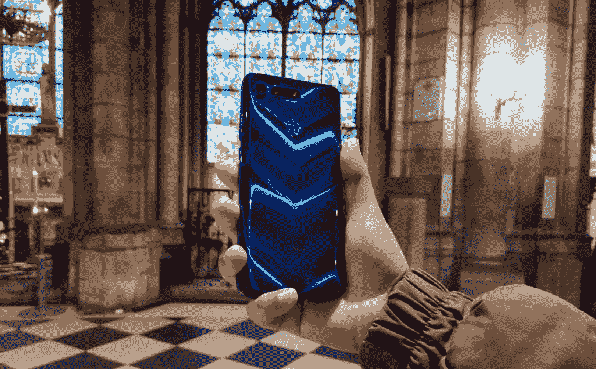

# 荣誉旗舰对比:荣誉 View20 vs 荣誉 20 vs 荣誉 20 Pro

> 原文：<https://www.xda-developers.com/honor-20-pro-view20-flagship-comparison/>

Honor [最近在伦敦的一次活动中发布了他们最新的 Honor 20 旗舰系列](https://www.xda-developers.com/honor-20-pro-specifications-features-pricing-availability/)，为我们提供了 Honor 20 和 Honor 20 Pro 这两款功能强大的设备。这些新的智能手机带来了新的相机技术，以便与最近来自其他旗舰设备的竞争，如[一加 7 Pro](https://www.xda-developers.com/oneplus-7-pro-review/) 、[小米 9](https://www.xda-developers.com/xiaomi-mi-9-review/) 和[华硕 ZenFone 6](https://www.xda-developers.com/asus-zenfone-6-48mp-flip-camera-snapdragon-855/) 。与新的 Honor 手机非常相似，[之前推出的 Honor View20](https://www.xda-developers.com/honor-view-20-hands-on-first-impressions-review/) 也引入了一些新功能，如打孔显示屏和 [48MP 索尼 IMX 586 传感器](https://www.xda-developers.com/sonys-imx586-48mp-smartphone-camera/)，使其成为首批推出这种现已流行的相机传感器的设备之一。

这里有一个关于新荣誉旗舰如何适应相对较老的荣誉观 20！

| 

规范

 | 

荣誉视图 20

 | 

荣誉 20

 | 

Honor 20 Pro

 |
| --- | --- | --- | --- |
| **尺寸和重量** | 

*   156.9 x 75.4 x 8.1 毫米；
*   180 克

 | 

*   154.3 x 74 x 7.9 毫米；
*   174 克

 | 

*   154.6 x 74 x 8.4 毫米；
*   182 克

 |
| **显示** | 6.4 英寸 FHD+ IPS 液晶屏 | 6.26 英寸 FHD+ IPS 液晶屏 | 6.26 英寸 FHD+ IPS 液晶屏 |
| **SoC** | 7 纳米海思麒麟 980:

*   2 个 Cortex-A76 @2.6GHz 以上
*   2 个 Cortex-A76 @1.9GHz 以上
*   4x Cortex-A55 @1.8GHz

Mali-G76 MP10 GPU | 7 纳米海思麒麟 980:

*   2 个 Cortex-A76 @2.6GHz 以上
*   2 个 Cortex-A76 @1.9GHz 以上
*   4x Cortex-A55 @1.8GHz

Mali-G76 MP10 GPU | 7 纳米海思麒麟 980:

*   2 个 Cortex-A76 @2.6GHz 以上
*   2 个 Cortex-A76 @1.9GHz 以上
*   4x Cortex-A55 @1.8GHz

Mali-G76 MP10 GPU |
| **闸板&存放** |  |  |  |
| **电池** | 4000 毫安时，支持 22.5 瓦快充 | 3750 毫安时，支持 22.5 瓦快充 | 4000 毫安时，支持 22.5 瓦快充 |
| **USB** | 带 C 型连接器的 USB 3.1 | 带 C 型连接器的 USB 2.0 | 带 C 型连接器的 USB 2.0 |
| **连通性** | 

*   双频 WiFi 802.11 a/b/g/n/ac 支持
*   蓝牙 5.0
*   A-GPS、GLONASS、BDS、伽利略、QZSS
*   红外端口
*   3.5 毫米耳机插孔

 | 

*   WiFi 802.11 a/b/g/n/ac 支持
*   蓝牙 5.0
*   A-GPS、GLONASS、BDS、伽利略、QZSS
*   红外端口

 | 

*   WiFi 802.11 a/b/g/n/ac 支持
*   蓝牙 5.0
*   A-GPS、GLONASS、BDS、伽利略、QZSS
*   红外端口

 |
| **指纹扫描仪** | 后面的 | 侧面安装的 | 侧面安装的 |
| **后置摄像头** | 

*   48MP 索尼 IMX586，f/1.8，0.8μm，PDAF
*   ToF 传感器

 | 

*   48MP 索尼 IMX586，f/1.8，0.8μm，PDAF
*   16MP，f/2.2，117 广角相机
*   200 万像素，f/2.4，微距相机
*   200 万像素，f/2.4，深度传感器

 | 

*   48MP 索尼 IMX 586，f/1.4，0.8μm，PDAF，激光自动对焦，OIS
*   16MP，f/2.2，117 广角相机
*   800 万像素，f/2.4，具有 3 倍光学变焦的远摄相机，PDAF，激光自动对焦，OIS
*   200 万像素，f/2.4，微距相机

 |
| **前置摄像头** | 25MP，f/2.0 | 32MP，f/2.0 | 32MP，f/2.0 |
| **安卓版本** | Android 9 Pie 之上的 Magic UI 2.0 | Android 9 Pie 之上的 Magic UI 2.1 | Android 9 Pie 之上的 Magic UI 2.1 |

尽管[于 2018 年 12 月](https://www.xda-developers.com/honor-view-20-honor-v20-china/)推出，但 Honor View20 拥有顶级的规格，这让它与新推出的旗舰产品保持更近的距离。为 View20 提供动力的[麒麟 980](https://www.xda-developers.com/hisilicon-kirin-980-honor-magic-2-huawei-mate-20-pro/) SoC 也见于其他 2018 年末和 2019 年初的旗舰产品，如[华为 Mate 20 Pro](https://www.xda-developers.com/huawei-mate-20-pro-india-launch-kirin-980/) 、[华为 P30 Pro](https://www.xda-developers.com/huawei-p30-pro-p30-official/) 以及新的 Honor 20 和 Honor 20 Pro。目前，如果用户不想选择高通的骁龙 855 或三星的 Exynos 9820，这是他们可以使用的旗舰 SoC 选项之一，这凸显了它在保持旗舰 SoC 市场竞争力以更好地满足消费者利益方面的重要性。正如旗舰 SoC 所预期的那样，麒麟 980 在其出现的所有设备中都提供了出色的性能，包括 Honor View 20 和 Honor 20 系列。就性能而言，这些荣誉设备实际上应该是相同的体验，这是一件好事。

**[荣誉观 20 论坛](https://forum.xda-developers.com/honor-20-view)**

**[荣誉 20 论坛](https://forum.xda-developers.com/honor-20) | [荣誉 20 职业论坛](https://forum.xda-developers.com/honor-20-pro)**

荣誉视图 20 被认为是 48MP 后置摄像头趋势的先驱，也是荣誉设备显示孔趋势的先驱。虽然 Honor View20 上的相机具有开创性，但其他设备很快就通过潜望镜变焦镜头和更多的相机传感器超越了它。Honor 20 Pro 建立在 Honor View20 设置的基础上，以创建一个明显更好的相机。Honor 20 Pro 旨在提供与华为 P30 Pro 类似的功能，但价格更实惠。这些设备的侧重点不同，它们的设计也为它们提供了更多的差异化点。虽然 Honor 20 和 Honor 20 Pro 是主观上美丽的设备，它们的“[动态全息设计](https://www.xda-developers.com/honor-20-pro-dynamic-holographic-design/)”具有诱导深度的光学效果，但 Honor View20 的背部具有相当引人注目的 V 形微光效果，用户可能会觉得更加美丽。

 <picture></picture> 

Honor View20

荣誉 20 Pro 明显优于荣誉视图 20。虽然它的外形比 Honor View20 更小，但它能够装入更广角的镜头，30 倍变焦功能，近至 4 厘米的微距拍摄和 111 的 DxOMark。Honor 20 Pro 的多功能相机设置使其易于推荐，特别是如果你预算紧张，不想在智能手机上花太多钱。Honor 20 介于两者之间，放弃了一些相机技巧，并以更低的 RAM 和存储选项来降低价格。最终这一切都归结于消费者的偏好，Honor 发现自己处于有利地位，这些新智能手机的偏好和价格覆盖范围更广。

任何关于 Honor/华为的文章都不会完整，如果不提及特朗普总统发布的行政命令对华为施加的当前政治限制，该命令限制美国公司与华为做生意。该命令反过来迫使谷歌撤销了华为的 Android 许可，这进一步影响了在这些设备上使用 Google Play 服务以及这些设备的 Android 更新的未来。华为提到，它将“*继续为所有现有的华为和荣誉智能手机和平板电脑产品提供安全更新和售后服务，涵盖那些已经在全球销售或仍然库存的产品”*，它将“*与谷歌*密切合作，制定出一个解决方案，以减轻对消费者的影响。在行政命令发布后，美国商务部确实以 90 天的一般许可形式给予华为临时缓刑，这使得谷歌可以撤销其决定，并在这段时间结束时进行重新评估。就目前而言，华为现有的智能手机不受影响。

**注意:华为/Honor 已经停止为其设备提供官方 bootloader 解锁代码。因此，他们设备的引导加载程序无法解锁，这意味着用户无法 root 或安装自定义 rom。**