# 荣誉 20 与荣誉 20 Lite/20i

> 原文：<https://www.xda-developers.com/honor-20-vs-honor-20-lite/>

Honor 的 Honor 20 系列有三款主力手机。这包括 Honor 20、Honor 20 Lite 和 Honor 20 Pro。在这个 XDA 电视视频中，我们比较了两款入门级产品，Honor 20 和 Honor 20 Lite。每部手机都有其优点和缺点，所以我们比较了这些手机的所有最佳功能，看看哪一个更有价值。

***注:Honor 20 Lite 的评审单位由 Honor 提供，以便进行公正评审。荣誉赞助 XDA 开发者，但是他们对这个视频/文章的内容没有投入或贡献。在这个比较中陈述的观点是我自己的。***

| 

规范

 | 

荣誉 20

 | 

荣誉 20 Lite

 |
| --- | --- | --- |
| 显示 | 6.26 英寸 1080 x 2340 像素，19.5:9 比率(约 412 ppi 密度) | 6.21 英寸 1080 x 2340 像素，19.5:9 比率(约 415 ppi 密度) |
| 芯片集 | 海思麒麟 980 | 海思麒麟 710 |
| 随机存取存储 | 6GB | 4GB |
| 储存；储备 | 128GB | 128GB |
| 主摄像机 | 48MP + 16MP + 2MP +2MP | 24MP + 8MP + 2MP |
| 自拍相机 | 32MP | 32MP |
| 电池 | 3750 毫安时 | 3400 毫安时 |
| 价格 | £ 399.99 | £ 249.99 |

### 设计

两款手机的设计相似，都采用了 Honor 为 20 系列打造的大胆色彩。Honor 20 Lite 有一个由塑料制成的背板。它肯定感觉更便宜，甚至比 Honor 的其他廉价手机更便宜。Honor 20 Lite 背面有三个垂直布局的摄像头，手机背面有一个稍微凸起的唇缘。自拍相机以水滴凹槽的形式出现。不幸的是，Honor 决定在 Honor 20 Lite 上安装一个微型 USB 端口。这是 20 Lite 设计上最大的缺点。它几乎通过包含 3.5 毫米耳机插孔来弥补这一点，但选择使用 micro-USB 端口真的很糟糕。指纹传感器位于设备的背面，手机有一个底部发射扬声器。

荣誉 20 在设计和美学方面与 20 Lite 非常相似。一旦你把手机拿在手里，你会立即注意到材料的质量要高得多。Honor 20 感觉更像是一款高端设备。它与 20 Lite 具有相同的摄像头布局，一个 USB C 端口，一个底部发射扬声器，没有耳机插孔。指纹传感器被集成到了电源键中，这是一个好得多的设计。

 <picture>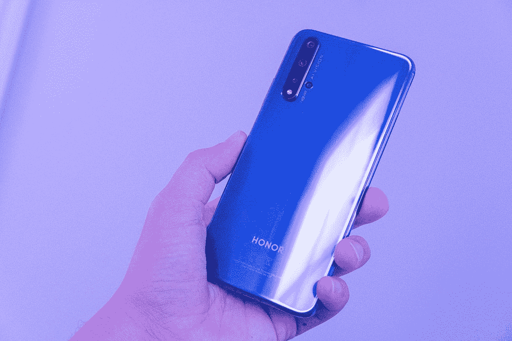</picture> 

Honor 20 in Sapphire Blue

 <picture>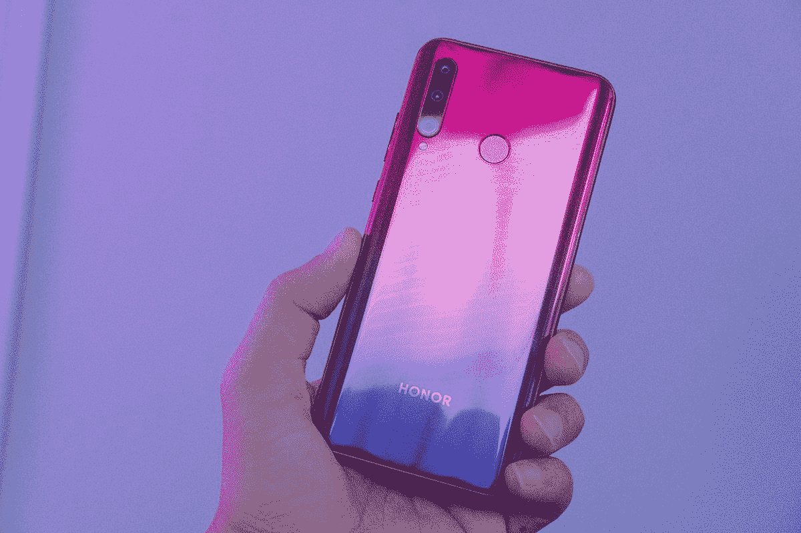</picture> 

Honor 20 Lite in Phantom Red

## 显示

Honor 20 Lite 拥有 1080x2340p 分辨率的显示屏。这使得它的长宽比为 19.5:9，显示屏延伸到非常接近手机的边缘。最小的边框仅被位于显示屏顶部的水滴凹槽打断。显示屏变得足够亮，可以在户外轻松使用，但不如 Honor 20 亮。尽管如此，对于一部廉价手机来说，这仍然是一个很好的展示。

Honor 20 上的显示屏是这款手机最强大的功能之一。Honor 20 拥有与 20 Lite 相同的分辨率和长宽比，采用打孔凹槽样式。显示器看起来非常好，对比度和色彩准确度更好。这无疑是迄今为止我在荣誉手机上看到的最好的显示。

 <picture>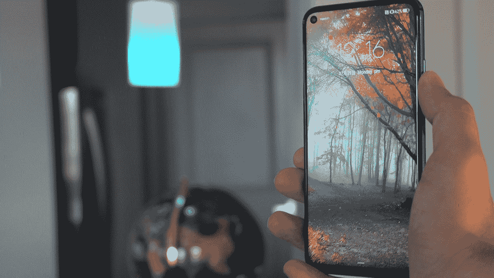</picture> 

Honor 20 Display

 <picture>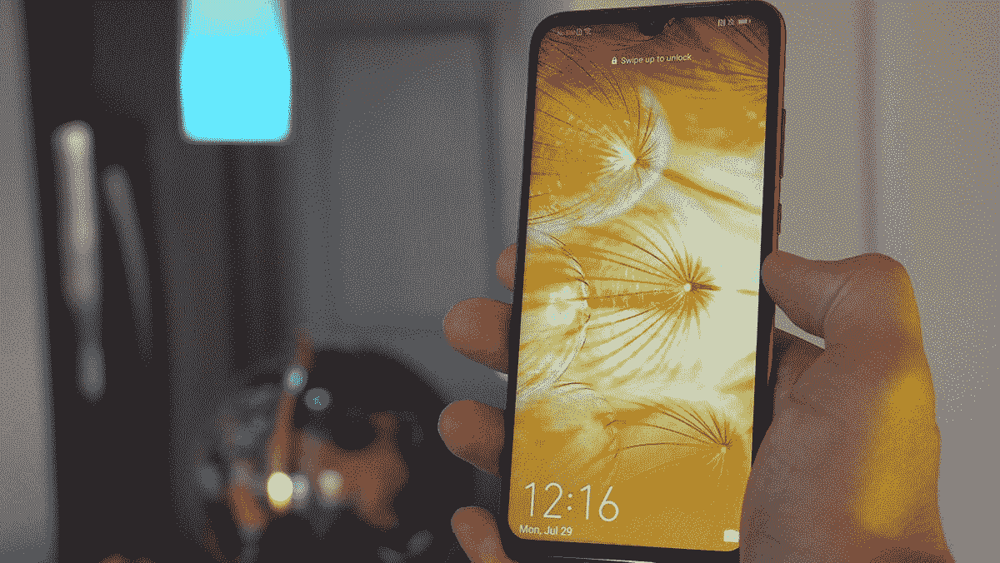</picture> 

Honor 20 Lite Display

## 表演

#### 赌博

麒麟 710 为 Honor 20 Lite 提供动力，在激烈的 3D 游戏中表现惊人。你会发现自己等待应用程序加载的时间稍长，但一旦游戏运行，3D 性能就非常好。值得注意的是，Honor 20 Lite 在游戏时的电池续航时间更好，不会像 Honor 20 那样发热。

Honor 20 拥有麒麟 980 芯片组，非常适合 PUBG 和堡垒之夜等游戏。不幸的是，手机在玩游戏时会变得非常热。即使是没有强烈的 3D 图形的休闲游戏也会让手机变得非常热。除此之外，Honor 20 上的电池续航能力真的很差。偶尔使用几乎无法度过一整天。

在这两款手机中，Honor 20 Lite 是一款完全可以接受的预算游戏手机，而 Honor 20 在电池寿命和热量管理方面确实很难实现。

#### 连通性

WiFi 连接是 Honor 10 Lite 的一个不足之处。这款手机没有配备交流兼容性，这导致速度慢得多。它还卡着蓝牙 4.2，而 Honor 20 有蓝牙 5.0。你肯定会注意到，在你的 20 Lite 上安装 Play store 的应用程序时，下载速度会变慢。如果这是一个对你来说非常重要的领域，强烈考虑选择荣誉 20 而不是 20 Lite。

| **2G 频段** | GSM 850 / 900 / 1800 / 1900 - SIM 1 和 SIM 2 | GSM 900 / 1800 / 1900 - SIM 1 和 SIM 2(仅限双卡型号) |  |
| **3G 网络** | HSDPA 800/850/900/1700(AWS)/1900/2100 | HSDPA 850 / 900 / 1900 / 2100 |  |
| **4G 网络** | LTE 频段 1(2100)、2(1900)、3(1800)、4(1700/2100)、5(850)、7(2600)、8(900)、18(800)、19(800)、20(800)、26(850)、28(700)、38(2600)、40(2300)、41(2500) | LTE 频段 1(2100)、3(1800)、5(850)、7(2600)、8(900)、20(800) |  |
| **速度** | HSPA 42.2/5.76 Mbps，LTE-A | HSPA 42.2/5.76 Mbps，LTE Cat4 150/50 Mbps |
| **无线局域网** | Wi-Fi 802.11 a/b/g/n/ac，双频带，Wi-Fi 直连，热点 | Wi-Fi 802.11 b/g/n，Wi-Fi 直连，热点 |  |
| **蓝牙** | 5.0，A2DP，aptX HD，LE | 4.2，A2DP，LE |

[第四段]

 <picture>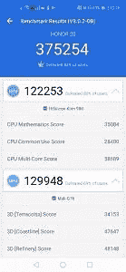</picture> 

Honor 20 3DMark Benchmark Results

[/第四段][第四段]

 <picture>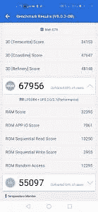</picture> 

Honor 20 3DMark Benchmark Results

[/第四段][第四段]

 <picture>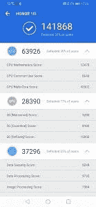</picture> 

Honor 20 Lite 3DMark Benchmark Results

[/第四段][第四段]

 <picture>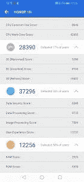</picture> 

Honor 20 Lite 3DMark Benchmark Results

[/第四段]

### 照相机

这两款手机上的摄像头都很有意思。这是一个真正伟大的新功能和真正无用的噱头的集合。Honor 20 Lite 背面有三个摄像头传感器。主摄像头为 24MP，带有 2MP 深度传感器。第三个传感器是 8MP 超宽摄像头。用这种设备拍摄的照片的图像质量相当令人失望。Honor 以前向我们展示过带有出色摄像头的廉价手机，Honor 8X。因此，从他们最新的手机中看到这种质量并不好。超宽相机尤其不好。参见[视频回顾](https://youtu.be/KETf2kUpNVg)中的示例。

Honor 20 有一套很棒的相机。主摄像头能够通过 2MP 深度传感器拍摄 4800 万张照片。我们再次看到一个 16MP 的超宽传感器，它产生的照片比 20 Lite 好得多。第四个相机是一个微距相机，旨在拍摄距离约 4 厘米的微小物体。微距相机拍出的照片质量很差，我在任何情况下都拍不出像样的照片。再次，要查看样本照片和视频，请在 XDA 电视台观看完整的[视频评论](https://youtu.be/KETf2kUpNVg)。

 <picture>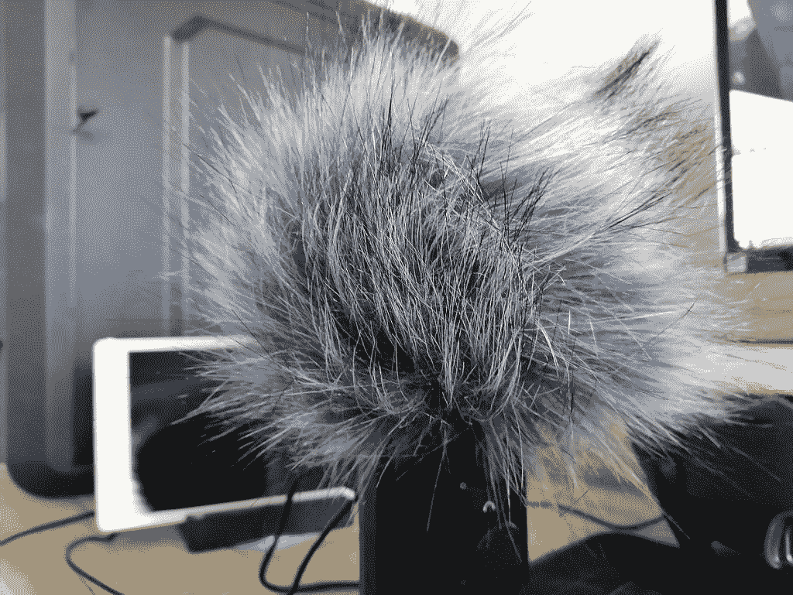</picture> 

Honor 20 Lite 24MP shot [Standard Photo Mode]

 <picture>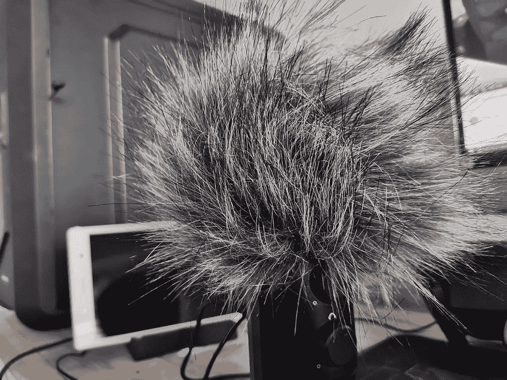</picture> 

Honor 20 48MP shot [Standard Photo Mode]

 <picture></picture> 

Honor 20 Lite 24MP shot [Standard Photo Mode] [Cropped]

 <picture></picture> 

Honor 20 48MP shot [Standard Photo Mode] [Cropped]

 <picture>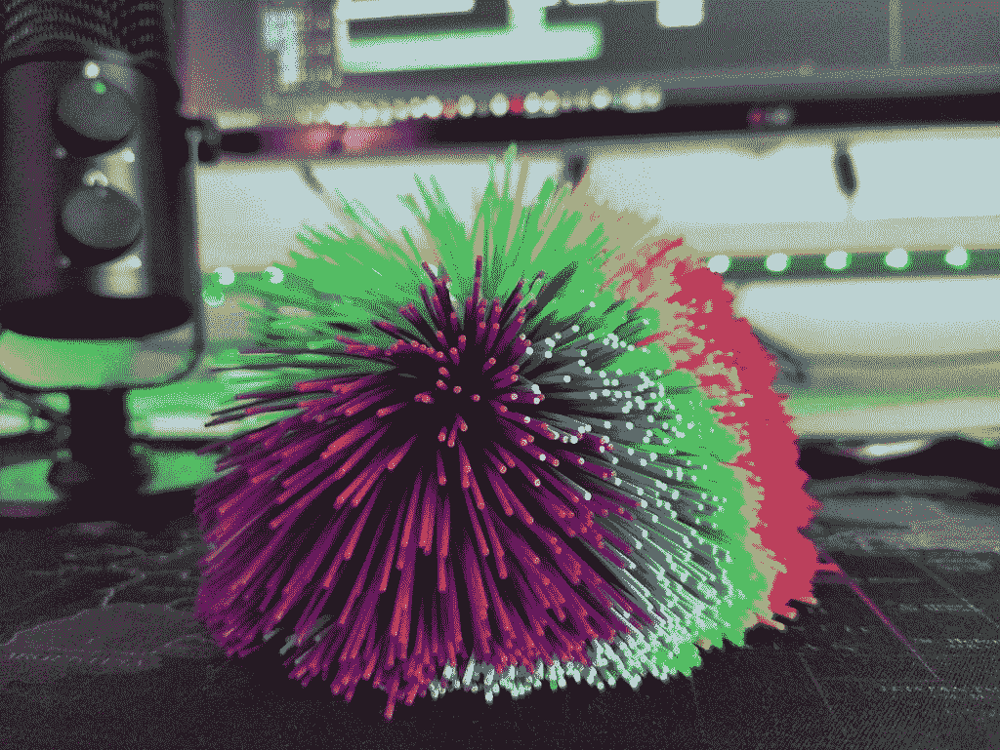</picture> 

Honor 20 48MP shot [Standard Photo Mode]

 <picture>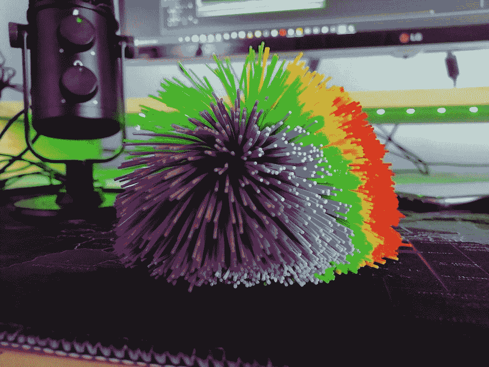</picture> 

Honor 20 Lite 24MP shot [Standard Photo Mode]

 <picture></picture> 

Honor 20 16MP shot [Ultra-Wide Photo Mode]

 <picture>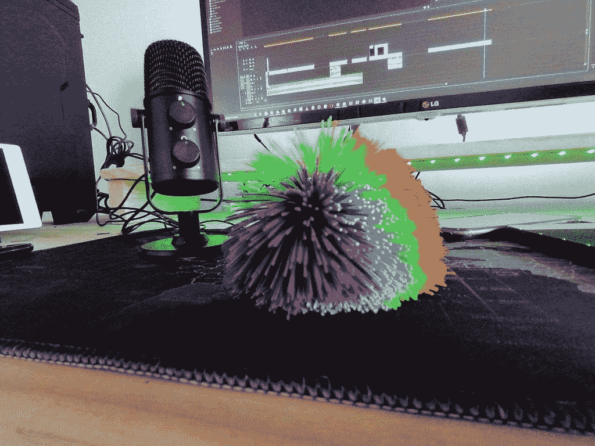</picture> 

Honor 20 Lite 8MP shot [Ultra-Wide Photo Mode]

 <picture></picture> 

Honor 20 [Blue] and Honor 20 Lite [Red]

### 结论

399.99 英镑的 Honor 20 比 249.99 英镑的 Honor 20 Lite 更有价值。Honor 20 Lite 几乎在每个方面都有所欠缺，除了电池寿命，它比 Honor 20 好得多。Honor 20 是一款出色的手机，性能令人印象深刻，但电池续航时间和散热管理都很差。

[**荣誉 20 论坛**](https://forum.xda-developers.com/honor-20)

[**荣誉 20 Lite 论坛**](https://forum.xda-developers.com/honor-20-lite)