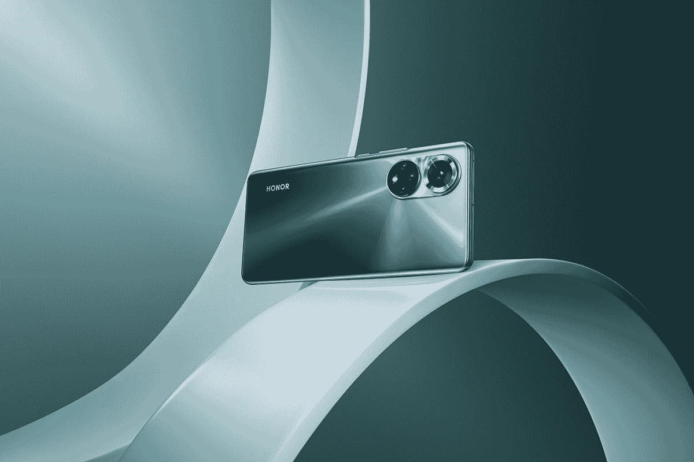

# 荣誉 50 回顾:谷歌服务被深深怀念

> 原文：<https://www.xda-developers.com/honor-50-review/>

Honor 50 对 Honor 来说是一个相当大的里程碑，因为它是该公司很长很长时间以来第一款带有 Google Play 服务的智能手机。在去年年底正式与华为分离后，Honor 在中国推出了 Honor V40 系列，随后在 6 月份举行了另一场仅面向中国的发布会，该公司[推出了三款新设备](https://www.xda-developers.com/honor-50-series-official-launch/)——Honor 50、Honor 50 Pro 和 Honor 50SE。该公司现在已经在西方市场推出了 Honor 50 和 Honor 50SE，重大消息是这两款设备现在都预装了 Google Play 服务。

Honor 50 有完整的西方版本，可以在德国、法国、芬兰、捷克共和国和英国购买。你还可以通过亚马逊等网站将这款手机进口到其他欧洲国家，它的起价有点高，为€529 英镑。

***关于这次复习:*** *我从 Honor 那里获得了 50 次复习的荣誉。Honor 对这篇文章的内容没有任何意见。*

### 荣誉 50:规格。单击以展开。

| 

规格

 | 

荣誉 50

 |
| --- | --- |
| **尺寸&重量** | 

*   159.96 x 73.76 x 7.78mm 毫米
*   175 克

 |
| **显示** | 

*   6.57 英寸 FHD+有机发光二极管
*   2340 x 1080p 像素
*   100% DCI-P3 覆盖率
*   120 赫兹刷新率
*   300Hz 触摸采样率

 |
| **SoC** |  |
| **闸板&存放** | 

*   6GB 内存+ 128GB 存储空间
*   8GB + 256GB

 |
| **电池&充电** | 

*   4300 毫安时
*   66W 快速充电

 |
| **后置摄像头** | 

*   初级:108 兆像素 f/1.9
*   超宽:800 万像素/2.2 英寸
*   宏:2MP f/2.4
*   深度:2MP f/2.4

 |
| **前置摄像头** | 32MP f/2.2 |
| **端口** | USB 类型-C |
| **连通性** | 

*   5G NR
*   4G LTE
*   双频 Wi-Fi (802.11 a/b/g/n/ac/ax)
*   蓝牙 5.2

 |
| **软件** | 基于 Android 11 的 Magic UI 4.2，带 GMS |
| **颜色** | 

*   午夜黑
*   翠绿色

 |

## 荣誉 50 的大胆设计

Honor 50 配备了 6.57 英寸全高清 OLED 面板，刷新率为 120 赫兹。它的两边都非常严重地弯曲，比我用过的其他手机都严重。它握在手中感觉很好，手掌的排斥也很好，所以我对此没有太多抱怨。不过，前置摄像头在显示屏上是一个相当大的污点，我希望它能小一点。

手机背面有一对独特的摄像头模块，由两个圆圈组成。顶部模块有一个 108MP 摄像头，而底部模块有一个 2MP 深度传感器，一个 2MP 宏观传感器和一个 8MP 超宽摄像头。还有一个 LED 闪光灯。右手边有一个电源按钮，上面有一个音量摇杆。

Honor 50 有一个单声道扬声器，单声道扬声器位于手机底部。声音很大，但听起来很普通，我很失望耳机没有兼作第二扬声器。还有一个 USB-C 端口，一个 SIM 卡托盘，没有耳机插孔。还有一个显示指纹扫描仪，当我拿起手机时，我的拇指很容易够到它。

总的来说，我是 Honor 50 设计的粉丝，这是一款长时间使用非常舒适的手机。

总的来说，我是 Honor 50 设计的粉丝，弯曲的边缘加上手机的重量，使它成为一款长时间使用非常舒适的手机。请注意，我通常更喜欢平板显示器，而不是曲面显示器，但 Honor 50 看起来真的很好。我在手机显示屏上遇到的最大问题是，一直亮着的显示屏有时不亮，我不知道为什么。我启用了它，它有时会工作。但有时当手机面朝上放在我的桌子上时，永远在线显示屏无法启用。希望 Honor 通过软件更新解决这个问题。

## 照相机

Honor 50 配备了 108MP 主摄像头，还配备了 8MP 超广角摄像头、2MP 微距摄像头和 2MP 深度传感器。108MP 摄像头使用 9 合 1 像素宁滨技术来创建 12MP 照片，这是迄今为止这款手机上唯一值得一提的摄像头。它能够从主传感器拍摄出像样的照片，尽管它在这个价位上落后于其他制造商提供的体验，特别是当手机上的其他相机从尚可到几乎无用时。

## 神奇的 UI 4.2 -完整的 Google Play 服务！

Honor 50 的头条特点是它包含了谷歌服务，这是我们很久没有在 Honor 智能手机上看到的。我们已经看到预装了华为移动服务的 Honor 智能手机，我们显然也看到了运行鸿蒙系统和 EMUI 的华为设备，这些设备看起来或多或少像是 Magic UI。

就个人而言，虽然华为移动服务在最初的迭代中有了长足的进步，但对我来说，没有什么能打败 Google Play 服务。我在日常生活中使用了无数的谷歌服务，终于能够在一部荣誉智能手机上使用它们，而无需经历重重困难或寻找替代品，这是一件幸事。我不必考虑使用谷歌服务或任何我喜欢的应用程序——它们现在就像在成千上万的其他手机上一样工作。在我们看到合适的旗舰产品之前，我想保留对该公司的进一步判断，但 Honor 20 Pro 是我在发布时最喜欢的手机之一。

华为移动服务的问题不仅仅在于它不是谷歌，而是仍然有一些初期问题无法真正解决。任何使用谷歌地图 API 的应用程序实际上都无法显示地图，因为它需要这种集成。安装不在 AppGallery 上的应用程序通常也是一个麻烦的过程，即使像花瓣搜索这样的工具有一点帮助。总的来说，很难将荣誉手机交给任何人，因为这肯定不是许多消费者熟悉的安卓智能手机。

然而，尽管如此，Honor 可以制造并已经制造出了出色的智能手机，但带有 Google Play 服务的 Honor 50 或多或少只是另一种预算产品。Honor 智能手机通常有很长的电池寿命，Magic UI 有很多很棒的功能，相机也一直令人印象深刻。我对 Honor 50 的相机有点失望，因为我对该公司有更高的期望，尤其是在这个价格范围内。

我很高兴看到 Magic UI 在未来几年如何发展自己的身份

总而言之，这是西方第一次没有华为支持的大回归，我愿意拭目以待。我当然对它能做什么持乐观态度，鉴于 Magic UI 是基于 EMUI 的，我很高兴看到它在未来几年如何发展自己的身份。

## 性能、音频和电池

骁龙 778G 与骁龙 780G 相似，但 GPU 和 ISP 稍弱。然而，它拥有更快的 CPU，更好的支持 mmWave 5G 的调制解调器，以及以 LPDDR5 形式支持更快的内存。就像其他骁龙 7 系列芯片组一样，骁龙 778G 的目标是以更实惠的价格提供顶级骁龙 8 系列产品组合的一些高级功能。

在游戏方面，该芯片配备了 Adreno 642L GPU，并支持精选的骁龙精英游戏功能，如可变速率着色(VRS)，帮助游戏开发者提供更高的视觉保真度，同时减少 GPU 工作负载，以及高通游戏快速触摸，在游戏中提供高达 30%的触摸响应速度。

对于任何普通的智能手机用户来说，这款芯片组完全能够

高通骁龙 778G 是一款有趣的芯片，因为它是中端和旗舰芯片组之间的过渡。你使用智能手机的一切基本功能都感觉流畅和快速，我真的不想从芯片组中得到更多。你无法通过 Wii 和 GameCube emulation 之类的游戏将智能手机推向绝对极限，但对于任何正常的智能手机用户来说，这款芯片组完全有能力。

从我们所有的基准测试来看，Honor 50 是骁龙 778G 所能达到的最好水平。所有这些结果对于这种口径的芯片来说都很不错，存储速度也足够快，应用程序和游戏的加载时间应该不成问题。CPU 节流测试有点差，因为它的最低点相当低。尽管如此，无论是通过游戏还是其他方式，在将 CPU 推向极限的几分钟后，你将真正面临这些节流水平。

然而，说到音频，我很失望。当我们看到这个价格区间(以及更低的价格区间)的智能手机推出双扬声器时，只有一个底部发射扬声器。这不是我通常关心的事情，但我知道很多人都关心，这是我在 2021 年的这个时候在所有价格范围的智能手机中习惯的事情。从好的方面来看，扬声器*确实*声音很大，但音频质量本身只是一般。这些人是“智能手机发言人”，这个词带有各种各样的污名。

至少，说到电池寿命，Honor 又一次做到了。骁龙 778G 不像我们在旗舰端看到的那样是一个耗电芯片，Magic UI 的软件优化意味着这款手机整天都在消耗电池。更好的是，盒子里的 66W 充电砖*(很疯狂吧？)可以帮你收拾残局，如果你发现自己急需果汁的话。*

 *## 结论:Honor 的西部大回归是朝着正确方向迈出的一步

如果这是任何其他公司的任何其他智能手机，就不会有太多值得大书特书的内容。€529 对于这款手机来说是一大笔钱，而小米甚至 OPPO 等公司提供的价格更低，要好得多。然而，Honor 智能手机从其前任所有者那里继承了一些关键优势，这些优势将使该公司真正发光。拍照能力是其一，电池寿命是其二。

 <picture></picture> 

Honor 50

##### 荣誉 50

荣誉 50 是该公司对西方市场的一次重大回归，尽管它还没有完全获得荣誉的天赋。

然而，我最初的立场仍然存在；这是一款很难向任何人推荐的手机。它本身就很好，但也有像小米红米 Note 10 Pro 这样的手机，提供了几乎一样好的规格，但价格要低得多。POCO F3 是另一款这样的手机，甚至是一加诺德 2。无论你最看重智能手机中的什么，似乎都有与 Honor 50 一样好的东西，而且价格要低得多。

我喜欢 Honor 50，我真的很高兴 Honor 可以再次使用谷歌的 Play 服务。我一直是该公司旗舰产品的超级粉丝，我很期待看到未来的发展。这是朝着正确方向迈出的一步，我看不出这款手机作为一款中档智能手机有什么不对的地方——只是有些手机价格更低。然而，我很高兴看到接下来会发生什么，我真的很期待再次在西方测试和审查 Honor 智能手机。*