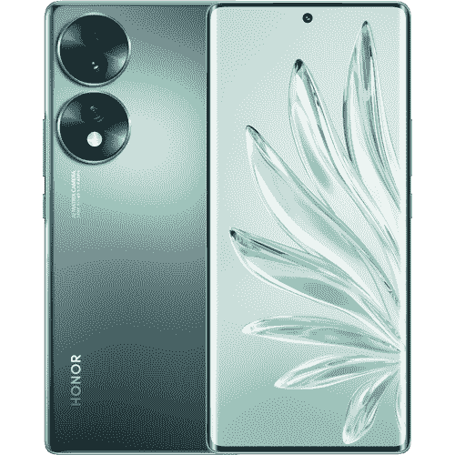

# 荣誉 70 审查:伟大的照片，中档一切

> 原文：<https://www.xda-developers.com/honor-70-review/>

Honor 最近有所复苏，5 月份在西方推出了旗舰产品 Honor Magic 4 Pro。这发生在该公司第一个单独的西方合资企业 Honor 50 之后，这是一款没有太多其他产品的中档手机。几个月前在中国推出的 [Honor 70](https://www.xda-developers.com/honor-70-honor-pad-8-magicbook-14-launch/) 现在已经在西方上市。它配备了骁龙 778G Plus、120Hz AMOLED 屏幕和 54MP 索尼 IMX800 主摄像头，这意味着它肯定不逊色。不过有一个有趣的地方——这款手机来自€549。

Honor 70 是一款非常好的手机，我认为任何人都会喜欢，但问题是还有很多其他更便宜的选择。该公司的神奇用户界面相当两极分化，其余的硬件虽然不错，但不是革命性的，骁龙 778G Plus 是一个伟大的表现者，但它大致相当于 Dimensity 1300 甚至 Tensor，如果你想走 Pixel 6a 的路线。

荣誉 70 值得买吗？说实话，大概不会。这要花很多钱，而且你没有得到多少回报。€549 是一部要价很高的智能手机，它的相机体验比谷歌 Pixel 6a 差，芯片组与之相当，软件体验也更差。Honor 70 袖子里唯一的东西就是显示屏，如果这是吸引你的东西，那么你可能应该买类似于 [Nothing Phone 1](https://www.xda-developers.com/nothing-phone-1-review/) 的东西，因为它基本上具有相同的规格，价格更低。除非你真的热爱 Honor 或者想要一些谈论的视频功能，否则 Honor 70 没有很大的价值主张。

 <picture></picture> 

Honor 70

##### 荣誉 70

Honor 70 是一款中等规格的智能手机，虽然它价格昂贵，但你可能会找到更好的替代品。

|  | 

荣誉 70

 |
| --- | --- |
| 

中央处理器

 | 骁龙 778G 加 5G |
| 

尺寸和重量

 | 

*   161.4 毫米 x 73.3 毫米 x 7.91 毫米
*   178 克

 |
| 

显示

 | 

*   6.67 英寸有机发光二极管 58 曲面打孔显示屏 4
*   10.7 亿种颜色，100% DCI-HDR P3 10+
*   120 赫兹

 |
| 

照相机

 | 

*   54MP 宽，IMX8000，f/1.9
*   50MP 超宽，f/2.2
*   2MP 深度传感器
*   32MP 前置摄像头

 |
| 

记忆

 | 8GB 内存，128GB |
| 

电池

 | 4800 毫安时 |
| 

网络

 | LTE:增强型 4X4 MIMO，7CA，LAA，LTE Cat。205 克 |
| 

传感器

 | 光学显示指纹传感器、加速度计、气压计、陀螺仪传感器、地磁传感器、霍尔传感器(模拟)、接近传感器、光传感器、用于触笔输入的 Wacom 层 |
| 

港口

 | USB-C |
| 

操作系统（Operating System）

 | 搭载 MagicUI 6.1 的 Android 12 |
| 

颜色；色彩；色调

 | 午夜黑、翠绿色、冰岛霜 |
| 

价格

 | 起价 479.99 英镑 |

***关于本次评审****:2022 年 8 月 9 日收到公司评审荣誉 70。虽然该公司为我们提供了一个单位进行审查，它没有投入到这一审查的内容。*

* * *

## 荣誉 70:设计

Honor 70 在设计上与 Honor 50 非常相似，也很容易让人想起华为的一些设备，如 Huwaei P50 Pro。显然，其中一个因素是，很明显，Honor 在华为的一部分时就开始致力于这些设计，但这只会给该公司的反对者更多弹药，指责它利用华为的资源。

这是一部非常漂亮的手机

然而，这是一款非常漂亮的手机，握在手中感觉很轻，当光线以某种方式照射到它时，背面会显示出更“条纹”的设计。它看起来不错，摸起来也不错，我认为它仍然是一个足够独特的设计，使自己与市场上的其他产品有所区别。两个相机圈容纳了“超级传感”IMX 800 相机，以及 50MP 超宽和 2MP 深度相机。

在展示中，Honor 70 并没有真正做什么超级特别的事情。两边都是弧形的，前置摄像头是状态栏中央的一个洞。这是一个支持 HDR10+的 120Hz AMOLED 面板，非常适合内容消费。这是一个非常标准的显示屏，因为它只是一个玻璃板，尽管它有一些非常好的规格，使它成为这款智能手机最高端的方面之一。只有全高清，这是最大的症结之一。

然而，一个更大的症结是手机底部的单触发扬声器。我本以为双扬声器会有意义，尤其是在包含 HDR10+显示屏的情况下。事实并非如此，事实上，单触发扬声器也不是所有的高品质。当然，这是一款中档手机，但我认为该公司显然将这款设备定位为更适合媒体消费。

手机的制造质量很好(即使是塑料的)，触感也很好。总的来说，这是一款设计不错的手机，但我对其背后的理念有点困惑。

* * *

## 荣誉 70:相机

Honor 70 的相机被吹捧为特别的，因为它包含了 IMX800，但老实说，我们已经远远超过了传感器是智能手机摄影体验中最重要的部分这一点。由于采用了令人难以置信的软件处理算法，像谷歌 Pixel 6a 这样的智能手机仍然可以超越其重量，虽然新的传感器在某些方面有所帮助，但你可以使用新的传感器，但仍然有糟糕的照片。

我得到的照片给我留下了深刻的印象

考虑到这一点，了解 Honor 70 的本质是很重要的:一款配备旗舰传感器的中档智能手机。我预计结果会很差，但我对我所得到的印象非常深刻。Honor 尤其在 HDR 方面做得非常出色，我对这款手机的能力感到惊讶。如果你想要一部能够拍摄精彩照片的中档手机，那么这款手机无疑是其中之一。这款手机在其他方面可能会有问题(或者可能只是还行)，但这是它真正闪光的地方。

为了清楚起见，下面显示的照片是压缩的。如果你想看完整的未压缩图片，请务必查看本部分底部的 Flickr 相册。

第一张照片是在都柏林 3Arena 的街头霸王乐队音乐会上拍摄的。它在平衡图像的明亮部分和黑暗部分方面做得很好，不会过度曝光图像的任何特定部分。我对此印象深刻，因为我知道很多类似的中档手机会在这种情况下挣扎。

这是我拍摄的最令人印象深刻的照片之一，这是因为手机如何处理建筑物的反射。它的清晰度和对比度恰到好处，不会让照片看起来不自然。我原以为手机会很吃力，但它在这里表现得相当不错。

我预计 Honor 70 也会在这张照片上挣扎，但我很惊讶它没有。建筑顶部可见的太阳实际上完全占据了手机的取景器，在我真正拍摄照片之前，我无法看到这里捕捉到的许多细节。天空中的鸟也被完美地显示出来，照片很好地平衡了太阳的亮度和图像下部的黑暗和阴影。

总的来说，这款手机做得非常出色。我还用音乐会的一小段录音进行了测试，对于那些可能想在嘈杂的场地录音的人来说，音频质量非常好。

Honor 的“Solo Cut”视频模式是 Honor 70 的一个重要功能，它会让你在人群中挑出一个人。你选择你的主题，它会在右边额外显示这个人，即使他们是一群人。

我真的很惊讶这里的摄像头。这不是我用过的最好的手机摄像头，但它的表现比我对一部中档智能手机的预期要好很多(尤其是在 HDR)。如果你想要一部拍照不错的手机，那么这款手机在它的价格类别中是一个很强的竞争者。我不确定我会称之为旗舰相机，但它非常接近。

* * *

## 荣誉 70:性能

Honor 70 装了一个骁龙 778G Plus，说实话还是挺不错的。它功能强大，速度快，我对这种特殊的芯片组印象深刻。显然不是旗舰芯片组，但反正大多数人都不需要。值得一提的是，这款手机感觉比旗舰产品 Honor Magic 4 Pro 更流畅，尽管我证明了 Honor 严重限制了这款智能手机的性能。与上次不同，我在打开相机或使用发射器时没有任何流畅性问题。

至于测试和基准测试，这款手机显然非常强大。它不是旗舰级别的，但它的性能足够好(有趣的是，看起来接近与 Honor Magic 4 Pro 中的骁龙 8 Gen 1 相当)，大多数时候你不会注意到它缺乏旗舰性能。最明显的形式将是在游戏时，因为 GPU 是真正会受到打击的。我们也尝试运行我们的 jank 测试，但当试图导出结果时，应用程序会崩溃。正因为如此，我们无法科学地推断这款手机有多流畅(或滞后)，但我会说，在正常使用中，它感觉很流畅，没有什么特别让我感觉我在使用一款中档智能手机。

使用这款手机进行日常活动不会有任何问题

正如你从上面的基准测试中看到的，这款手机在散热和一般处理能力方面都做得很好。它在你能处理的几乎任何正常工作负载下都能做得很好，这无疑是不是每个人都需要一部全功能旗舰手机的一个理由。对于大多数人来说，骁龙 8 Plus Gen 1 是多余的，这款手机很好地证明了这一点。使用这款手机进行日常活动不会有任何问题。

然而，说到游戏，这绝对不是你应该使用的芯片组。Adreno 642L GPU 只能处理一些非常基本的工作负载，因此你不会在这款手机上玩任何硬核游戏。它有时很难在最低设置下运行 Genshin Impact，所以这让你知道这款手机在这方面的能力(或缺乏能力)。

* * *

## 电池寿命和充电

不过，这款手机的电池续航时间很长，可以处理很多事情。骁龙 778G Plus 是一款非常高效的芯片组，使用它时手机不会发热太多。考虑到我对这款手机的测试，包括一系列测试和其他繁重的使用，我的电池续航时间真的很好。尽管进行了大量的 CPU 节流测试来耗尽电池，但我仍然按时显示了近五个小时的屏幕。你可以期待这款手机可以支持你一整天，作为一名日常司机，这正是我所做的。

至于充电，66W 充电速度非常快，目标是在 20 分钟内将手机充电至 60%。这真的很快，而且考虑到手机的效率，如果你需要在紧要关头给手机充电，它可以持续很长时间。虽然让屏幕开着，但我注意到它的充电速度远没有这么快。为了使用 66W 的充电，你似乎不能同时使用手机。

* * *

## 你应该买荣誉 70 吗？

Honor 70 仅仅是一款带有一些额外功能的中档手机，这意味着它不是一款特别独特的智能手机。它在几乎所有事情上都做得很好，但在各种不同的任务上，也有比它好得多的手机。想要一台好相机？得到一个像素 6a。想要更干净的软件(尽管有一点未经证实的记录)？那么 Nothing Phone 1 可能就值了。显然还有一加诺德 2T 这样的产品，以及 Poco 和其他设备制造商的一系列选择，最终你会发现 Honor 70 似乎定价过高。

老实说，没有太多要补充的了。手机是个好手机，但它的价格很高。为什么要花这么多钱买一部只比一些便宜 20%的手机好一点点的手机呢？如果这款手机上市销售，我会考虑它，但除此之外，其他与之竞争的手机已经有了更低的价格。谷歌服务和华为驱动的智能手机的回声不足以在获得高价时放松——还需要更多。荣誉做得很好，但要收取比其他地方高得多的价格，它需要做得更多。

 <picture></picture> 

Honor 70

##### 荣誉 70

Honor 70 是一款中等规格的智能手机，虽然它价格昂贵，但你可能会找到更好的替代品。

因此，我喜欢 Honor 70，但很难证明它的价格是合理的。如果它上市了，那就很难错过了。然而，有太多便宜的好选择，很难说*这款*是你应该买的手机。