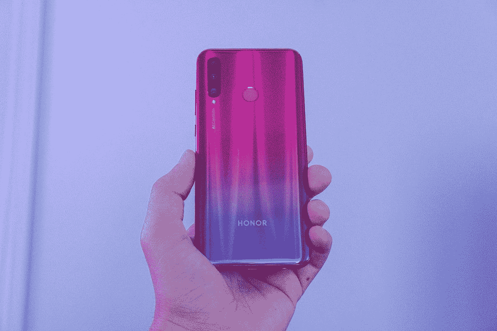
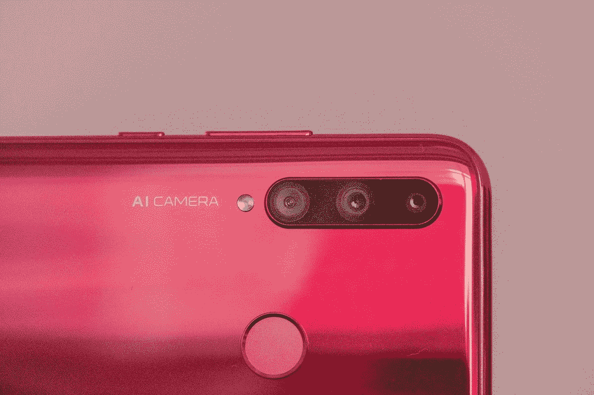
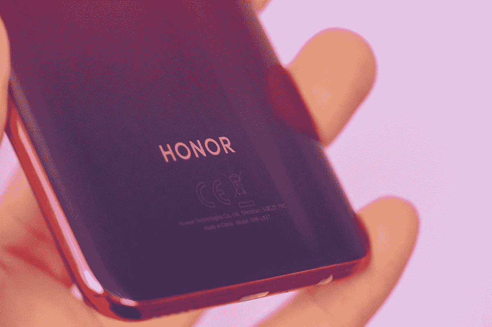
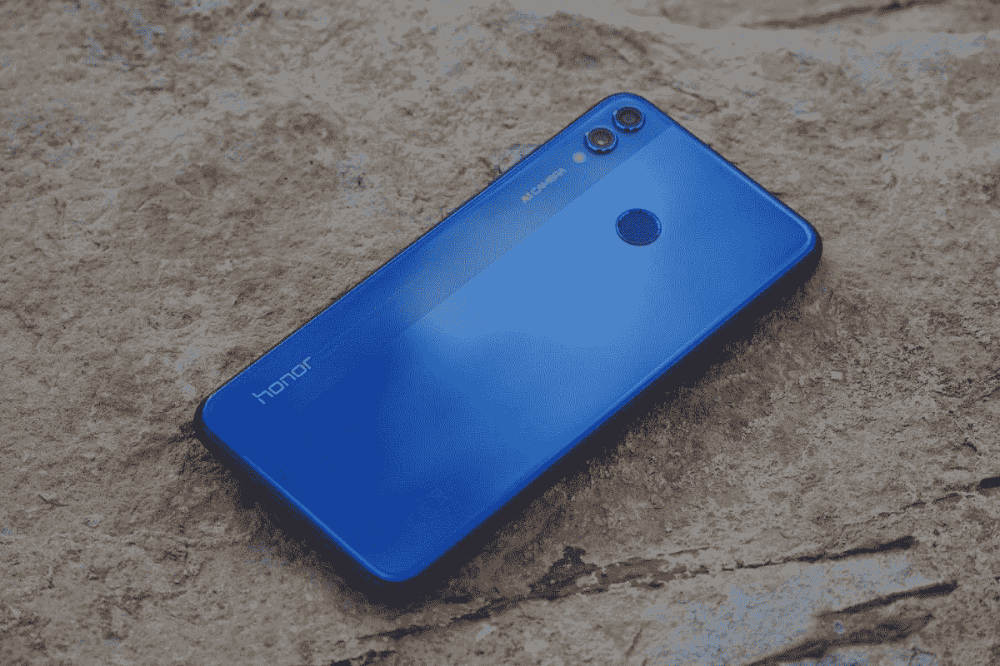
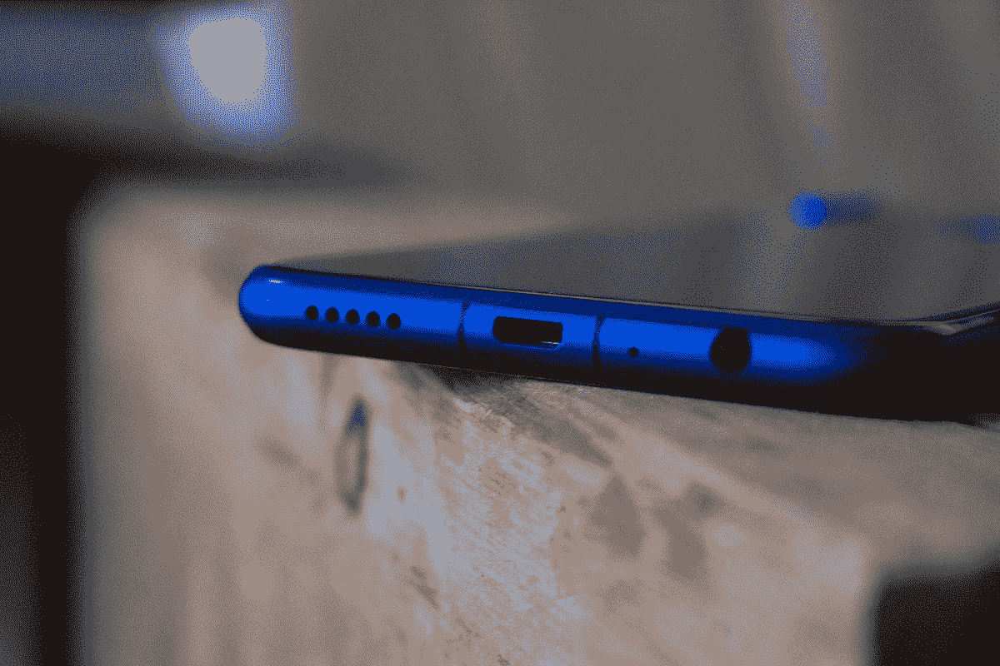
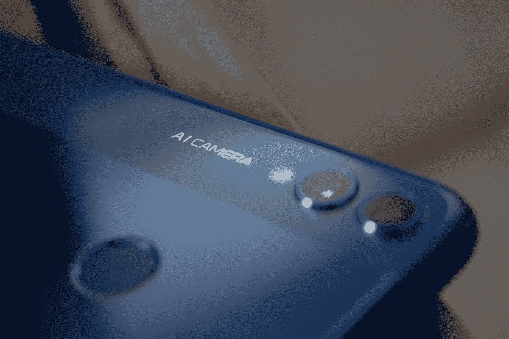
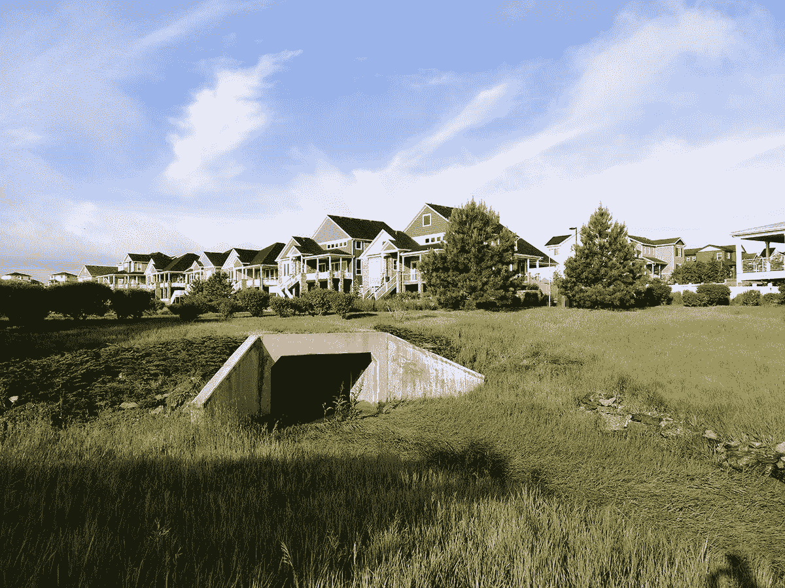
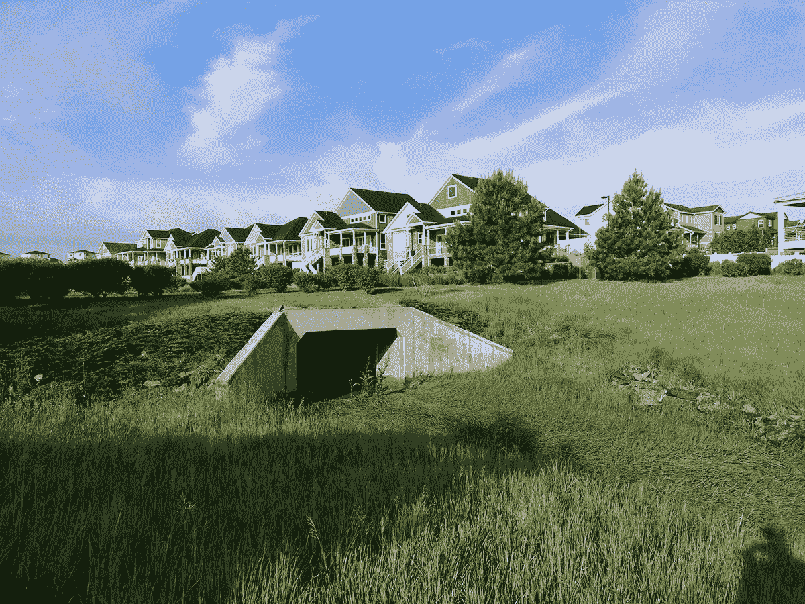
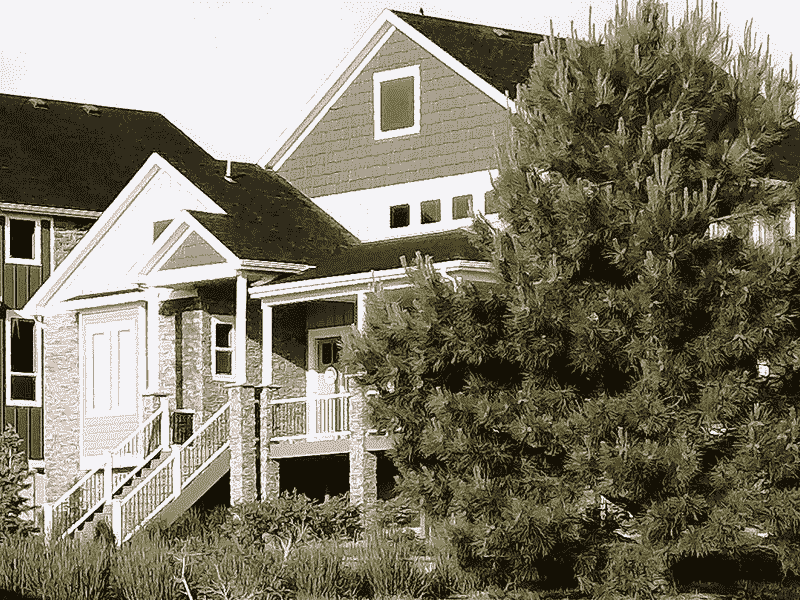
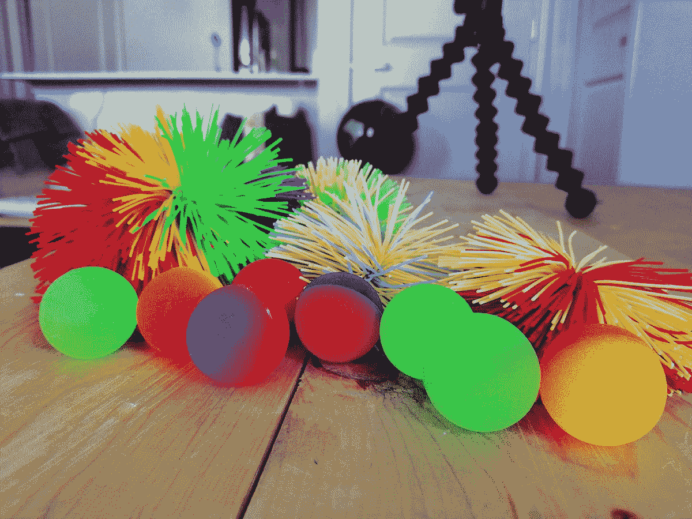

# Honor 8X 与 Honor 20 Lite:中端智能手机对比

> 原文：<https://www.xda-developers.com/honor-8x-vs-honor-20-lite/>

# Honor 8X 与 Honor 20i/Lite:中端智能手机对比

Honor 8X 和 Honor 20 Lite 之间的比较:两款来自 Honor 的中端智能手机，配有麒麟 710，但摄像头截然不同。

随着 Honor 推出 Honor 20 系列，他们包括了 20 Lite 型号，作为那些在该系列中寻找入门级手机的人的预算解决方案。Honor 20 Lite 秉承了 20 和 20 Pro 的精髓，同时在一些规格上做出了妥协，以降低价格。让我们看看这款新的廉价手机如何与 Honor 8X 相抗衡，Honor 8X 是 Honor 的另一款更受欢迎的廉价手机。

| 

规范

 | 

荣誉 20 Lite

 | 

荣誉 8X

 |
| --- | --- | --- |
| 芯片集 | 麒麟 710 | 麒麟 710 |
| 随机存取存储 | 4GB | 4/6GB |
| 显示 | 6.21 英寸 1080 x 2340 英寸 | 6.5 英寸 1080 x 2340 英寸 |
| 主摄像机 | 2400 万像素，1.8 倍像素，8 倍像素，2.2 倍像素，13 毫米(超宽)2 倍像素，2.4 倍像素，深度传感器 | 20 兆像素，f/1.8，27 毫米(宽)，PDAF2 兆像素，深度传感器 |
| 自拍相机 | 32 兆像素，f/2.0，0.8 米 | 16 百万像素，f/2.0，26 毫米(宽) |
| 电池 | 3400 毫安时 | 3750 毫安时 |
| 国家政治保卫局。参见 OGPU | 马里-G51 MP4 | 马里-G51 MP4 |
| 软件 | EMUI 9.0.1 | EMUI 8.2 |

注意:在上面的视频中，当列出电池容量的规格时出现了一个错误。Honor 8X 的电池容量为 3750 毫安时，Honor 20 Lite 的电池容量为 3400 毫安时。

 <picture></picture> 

Honor 20 Lite in Phantom Red

 <picture></picture> 

20 Lite's Triple-Camera

 <picture></picture> 

20 Lite with Kirin 710 Chipset

 <picture></picture> 

Honor 8X in Blue

 <picture></picture> 

Honor 8X with Micro-USB

 <picture></picture> 

Honor 8X Dual Cameras

这两款手机都配备了麒麟 710 芯片组，这使它们成为游戏和一般性能的优秀手机。在这方面，两款手机都没有明显优于另一款。应用程序启动速度和性能是相同的。

这些手机有一点不同的地方是摄像头。虽然 20 Lite 比 8X 的分辨率更高，但让我们看看这是否会转化为更好的质量。

 <picture></picture> 

20 Lite Landscape Photo

 <picture></picture> 

8X Landscape Photo

 <picture></picture> 

20 Lite Landscape Photo [Zoomed]

 <picture></picture> 

8X Landscape Photo [Zoomed]

 <picture></picture> 

20 Lite Bouncy Balls Photo

 <picture></picture> 

8X Bouncy Balls Photo

这些照片显示，Honor 8X 的摄像头质量明显高于 Honor 20 Lite。这些改进体现在视频、照片、慢镜头、夜拍、人工智能拍摄和相机的其他方面。鉴于这些手机的所有其他规格都是相同的，更好的摄像头使 Honor 8X 倍于高级手机。

[**荣誉 20 Lite 论坛**](https://forum.xda-developers.com/honor-20-lite)

[荣誉 8X 论坛 ](https://forum.xda-developers.com/honor-8x)

**注:华为/Honor 已停止为其设备提供官方 bootloader 解锁码。因此，bootloaders 无法解锁，这意味着用户无法 root 或安装自定义 rom。**