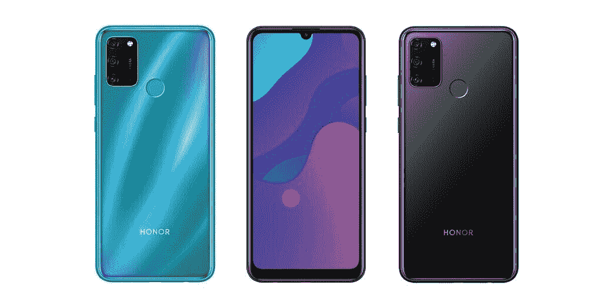
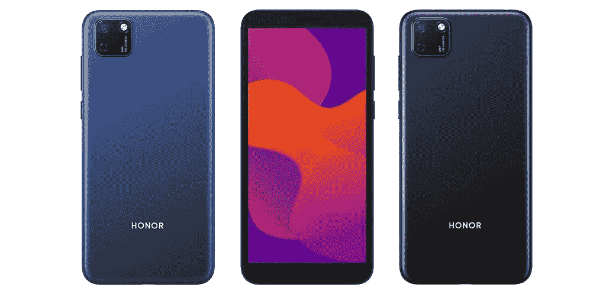

# Honor 9A、Honor 9S 与 AppGallery 一起在印度发布，同时发布的还有 Honor MagicBook 15

> 原文：<https://www.xda-developers.com/honor-9a-9s-huawei-appgallery-honor-magicbook-15-launched-india/>

Honor 将在印度市场推出两款智能手机，专注于世界上竞争最激烈的市场之一的入门级市场。Honor 9A 于今年早些时候在中国发布，随后进入了 T2 和欧洲市场。同样，Honor 9S 和 MagicBook 15 也走向了全球市场，现在终于走向了印度。

## 荣誉 9A 和荣誉 9S

| 

规格

 | 

荣誉 9A

 | 

荣誉 9S

 |
| --- | --- | --- |
| **尺寸&重量** | - | 

*   146.5 x 70.94 x 8.35 毫米
*   144 克

 |
| **显示** |  |  |
| **SoC** | 

*   联发科 Helio P22 MT6762R

 | 

*   联发科 Helio P22 MT6762R

 |
| **闸板&存放** | 

*   3GB + 64GB
*   可通过 microSD 扩展

 | 

*   2GB + 32GB
*   可通过 microSD 扩展

 |
| **电池&充电** | 

*   5000 毫安时电池
*   反向有线充电

 |  |
| **后置摄像头** |  |  |
| **前置摄像头** |  |  |
| **其他功能** | 

*   后置指纹传感器
*   MicroUSB 端口
*   3.5 毫米耳机插孔

 | 

*   MicroUSB 端口
*   3.5 毫米耳机插孔

 |
| **安卓版本** | 搭载 Magic UI 3.1 的 Android 10 | 搭载 Magic UI 3.1 的 Android 10 |

Honor 9A 和 Honor 9A 显然是入门级设备，所以习惯于旗舰的人可能不会觉得它们本身令人印象深刻。然而，Honor 在两款手机上都使用了老化的联发科 Helio P22，这并没有激起人们的信心，因为这些手机将面临来自小米，Realme 和三星手机的激烈竞争。此外，这两款设备都没有配备 GMS 和谷歌 Play 商店，而是采用了华为的 AppGallery 和 HMS Core。

 <picture></picture> 

Honor 9A

从 2020 年 8 月 6 日开始，Honor 9A 将在亚马逊网站上提供午夜黑和幻影蓝两种颜色。这款手机的价格为₹9,999，但用户可以在₹8,999 的首次销售中获得。

 <picture></picture> 

Honor 9S

另一方面，Honor 9S 在₹6,499 有蓝色和黑色可选，但用户可以在第一次销售时在₹5,999 购买。

## 荣誉魔法书 15

Honor MagicBook 15 是 Honor 首次进军印度笔记本电脑市场。顾名思义，它采用 15.6 英寸 FHD IPS 显示屏，屏幕与机身的比例为 87%，并通过了德国莱茵 TV 认证。该笔记本电脑由 AMD 锐龙 5 3500U 处理器和镭龙织女星 8 显卡驱动。你还会得到 8GB 的 DDR4 双通道内存和 256GB 的 PCIe NVMe 固态硬盘。

笔记本电脑通过随附的 65W 充电器充电，该充电器通过 USB Type-C 端口在半小时内将笔记本电脑充电 0-50%。该笔记本电脑的其他显著功能包括二合一指纹电源按钮、隐藏在相机按钮下方的弹出式网络摄像头、Wi-Fi、蓝牙、NFC 等。当然，你还可以预装 Windows 10 家庭版。

Honor MagicBook 15 在印度₹42,990 定价，将于 2020 年 8 月 6 日在 Flipkart.com 的神秘银色选项中上市。有一个首次销售折扣，让用户拿起它去₹39,990.

**[从 Flipkart](https://www.flipkart.com/honor-magicbook-15-ryzen-5-quad-core-8-gb-256-gb-ssd-windows-10-home-boh-waq9hnr-thin-light-laptop/p/itm5cc079c6abd4d) 购买荣誉 magic book 15**