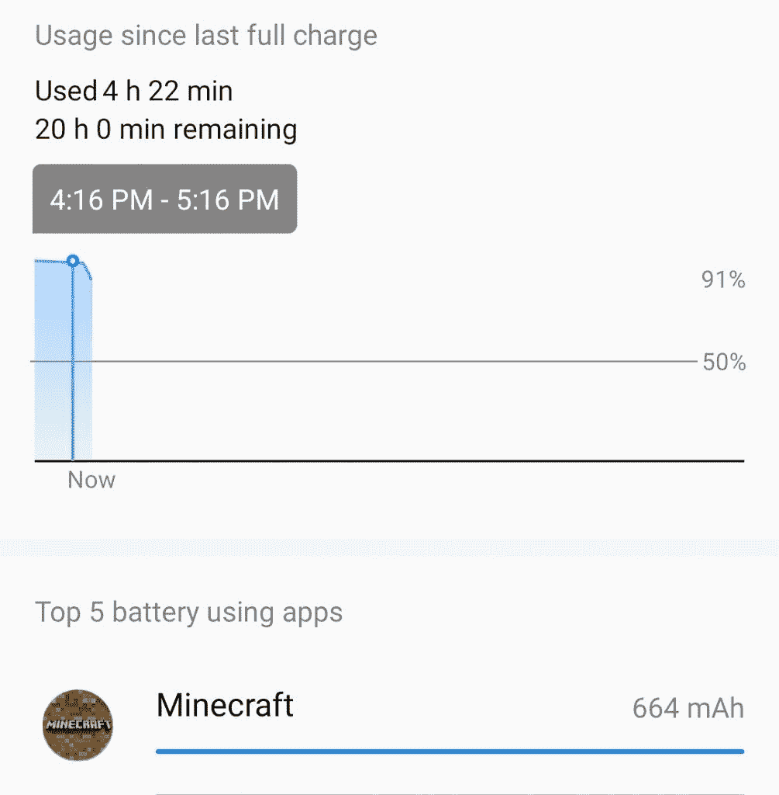
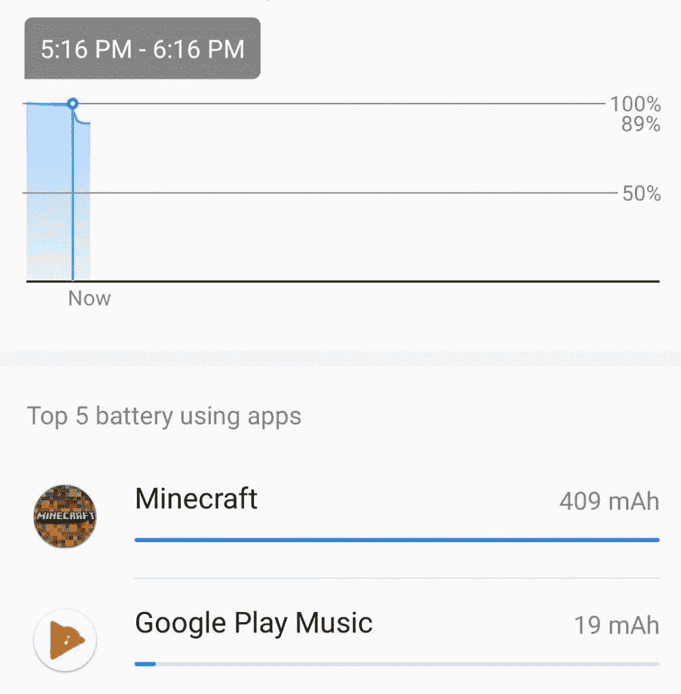
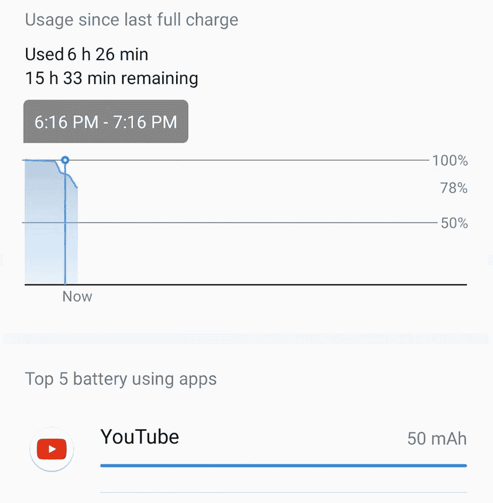
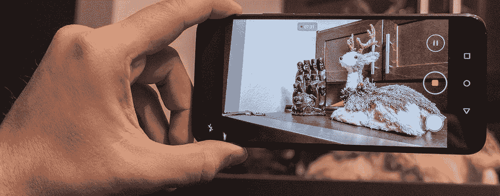
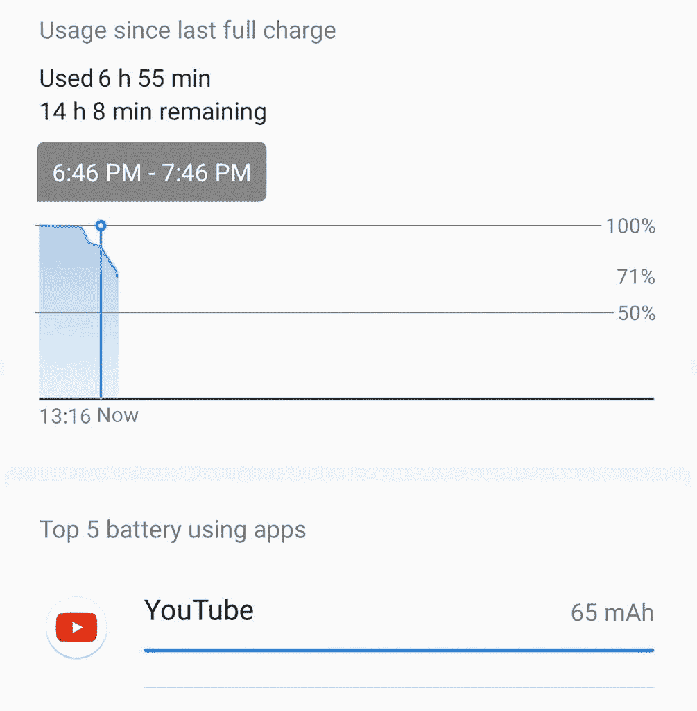
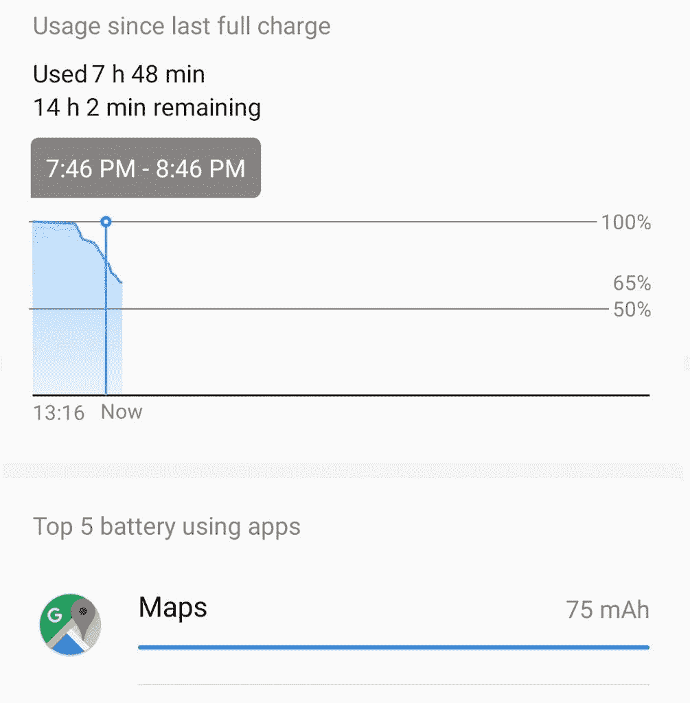
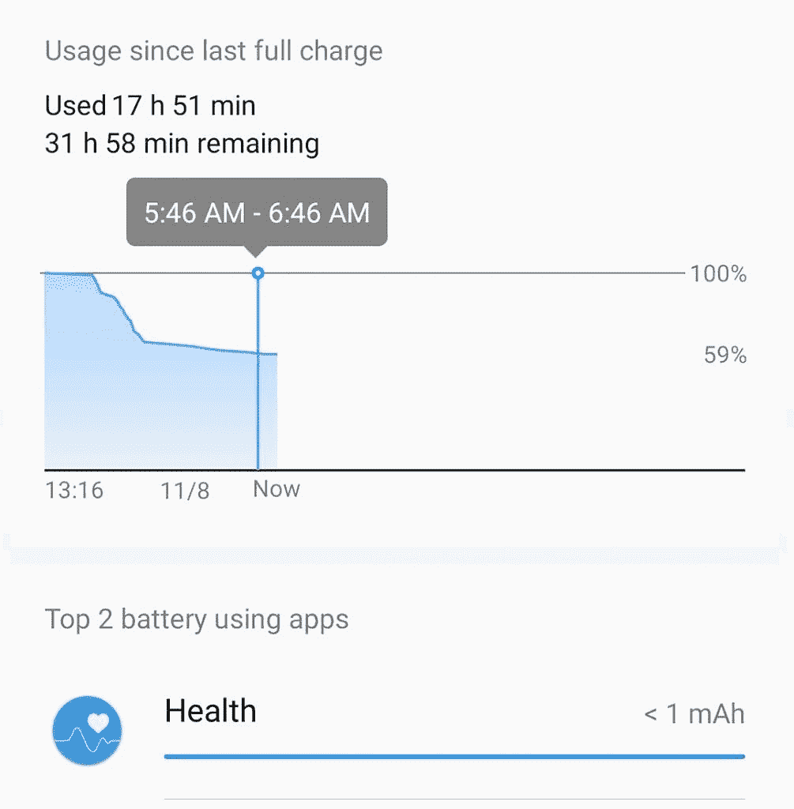

# 荣誉 9X 全天电池测试

> 原文：<https://www.xda-developers.com/honor-9x-full-day-battery-test/>

考虑到手机的低预算价格，Honor 9X 配备了非常大的电池。4000 毫安时电池可让手机轻松运行一整天。超高效的麒麟 9X 芯片组使手机在最小的电池消耗下快速运行。在这篇文章中，我们将看看手机在一天中的使用情况，看看它是如何工作的。

| 

荣誉 9X

 | 

规范

 |
| --- | --- |
| 显示 | 6.59 英寸 1080 x 2340p 像素(391 ppi) |
| 芯片集 | 海思麒麟 710F |
| 随机存取存储 | 6GB |
| 储存；储备 | 128GB |
| 主摄像机 | 48MP/8MP(超宽)/2MP(深度传感器) |
| 自拍相机 | 16MP 电动弹出式 |
| 电池 | 4000 毫安时 |
| 操作系统 | 安卓 9.1.0 [EMUI](https://www.xda-developers.com/tag/emui/) 9.1.0 |

* * *

## 一个小时的《我的世界》 ***9%***

在我的 Honor 9X 上使用的第一个小时是用来玩《我的世界》的。玩游戏时，我喜欢在玩的任何游戏上使用最大设置，以获得最佳视觉体验。在《我的世界》，我将渲染距离设置为 11 块，其他图形设置为高。对于大多数廉价手机，《我的世界》可以认真强调其硬件的极限。在 Honor 9X 上，我玩了整整一个小时的《我的世界》，没有发热问题，也没有性能下降。这款游戏就像你在 Android 上所能体验到的一样流畅。

 <picture></picture> 

Minecraft of the Honor9X

为了提高手机的游戏性能，我喜欢在电池菜单中将手机设置为**性能模式**。此模式优先考虑性能，而不是电池节能。随着性能模式的启用，屏幕亮度设置为 50%，我最终在一个小时的游戏中使用了 9%。

 <picture></picture> 

Battery Usage Data After One Hour of Minecraft

* * *

## 一小时的音乐 ***3%***

对我来说，一天一小时的音乐真的是大材小用。事实上，我可能会在出去吃午饭的时候听几首歌，结果发现大力水手的鸡肉三明治又一次卖完了。但是为了彻底测试，我假设一个普通用户会在他们的 Honor 9X 上播放一个小时的音乐。在这次测试中，我们将使用 Google Play 音乐进行播放，并关闭屏幕。流媒体音乐是启用**节电选项的最佳时机，**因为这不是图形密集型任务，不会以任何方式影响音乐播放。

 <picture></picture> 

Battery Usage Data After One Hour of Music

在 Google Play 音乐上播放一个小时的流媒体歌曲后，Honor 9X 只使用了 3%的电池。这意味着即使你的电池电量不足，你仍然可以从你的 Honor 9X 中获得数小时的音乐时间。长途汽车旅行是打开省电选项并播放音乐的最佳时机。EMUI 的这个省电功能非常有效。

* * *

## 一小时的 YouTube***11%***

除了一些密集的 3D 游戏，流媒体视频通常是你给智能手机电池带来的最大压力。对于视频流测试，我将播放一个一小时长的 YouTube 视频，屏幕亮度为 70%。我不会打开**省电选项**或**性能模式**。

 <picture></picture> 

Battery Usage Data After One Hour of YouTube

在一个小时的 YouTube 视频流之后，我能够将电池电量降低到 78%。视频全屏播放，只是被几个广告打断。在 YouTube 的一个小时里，我总共只损失了 11%的电池。你应该可以舒舒服服地看几部电影，或者在需要充电之前狂看几集。

* * *

## 十分钟的拍摄和 100 张 48MP 的照片 ***7%***

在接下来的测试中，我将看看相机的使用情况。我以 1080p 分辨率和 60FPS 拍摄了 10 分钟的镜头。这些是 Honor 9X 支持的最大视频设置。接下来，我用 48MP 传感器拍了 100 张照片。

**有趣的事实:100 张 48MP 的照片占用 674MB**

 <picture></picture> 

Filming on the Honor 9X

十分钟的拍摄时间可能比你平常一天所用的时间要长得多，但如果你打算用 Honor 9X 记录假期，或为互联网拍摄一些视频，了解这将使用多少电池是很重要的。在拍摄了 10 分钟并以 48MP 拍摄了 100 张照片后，我设法在 14 分钟的过程中杀死了大约 7%的电池。

 <picture></picture> 

Battery Usage Data After 10 Minutes of Filming and 100 Photos

* * *

## 一小时的 GPS***6%***

Android 手机上的 GPS 可能比大多数人想象的更有效。如果你开着 GPS，不看屏幕的时候关掉屏幕，GPS 在一个小时内几乎不会接触到你的电池。在这次测试中，我让屏幕保持 25%的亮度，并且没有使用省电功能。我带着手机在冰冷的气温下骑了一个小时的电动滑板车(顺便说一句，这让我看起来很酷)。我用于 GPS 导航的应用程序是谷歌地图。

 <picture></picture> 

Battery Usage Data After 1 Hour of GPS

在使用了整整一个小时后，我又从 Honor 9X 的电池中消耗了 6%的电量。

## 八小时睡眠6%

好了，该睡觉了。没有什么太重要的事情要做来为晚上的荣誉 9X 做准备。显示屏将关闭，手机将设置为静音，以测试待机功耗。

 <picture></picture> 

Battery Usage Data After 8 Hours of Standby Time

早上，电池电量下降到 59%,而整个晚上的电量下降了 6%。在需要充电之前，59%的电量可供我们使用整整第二天。

Honor 9X 的电池寿命非常令人印象深刻。一次充电可以轻松度过一整天，而大多数人可以度过两天。看看社区论坛里其他人对 Honor 9X 的评价。

[**荣誉 9X 论坛**](https://forum.xda-developers.com/honor-9x)

我们感谢 Honor 赞助了这篇文章。我们的赞助商帮助我们支付与运行 XDA 相关的许多费用，包括服务器成本、全职开发人员、新闻撰稿人等等。虽然您可能会在门户内容旁边看到赞助内容(这些内容将始终被标记为赞助内容),但门户团队对这些帖子不承担任何责任。赞助内容、广告和 XDA 仓库完全由一个独立的团队管理。XDA 绝不会通过接受金钱来赞扬一家公司，或以任何方式改变我们的观点或看法，从而损害其新闻诚信。我们的意见不能被收买。

###### 我们感谢 Honor 赞助了这篇文章。我们的赞助商帮助我们支付与运行 XDA 相关的许多费用，包括服务器成本、全职开发人员、新闻撰稿人等等。虽然您可能会在门户内容旁边看到赞助内容(这些内容将始终被标记为赞助内容),但门户团队对这些帖子不承担任何责任。赞助内容、广告和 XDA 仓库完全由一个独立的团队管理。XDA 绝不会通过接受金钱来赞扬一家公司，或以任何方式改变我们的观点或看法，从而损害其新闻诚信。我们的意见不能被收买。