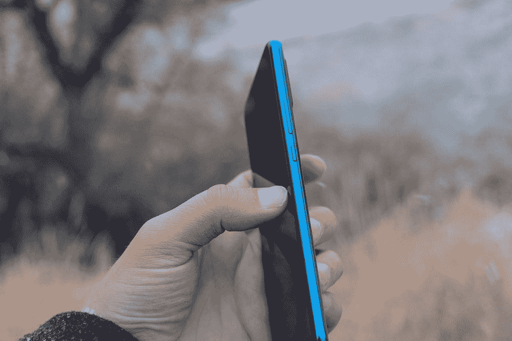
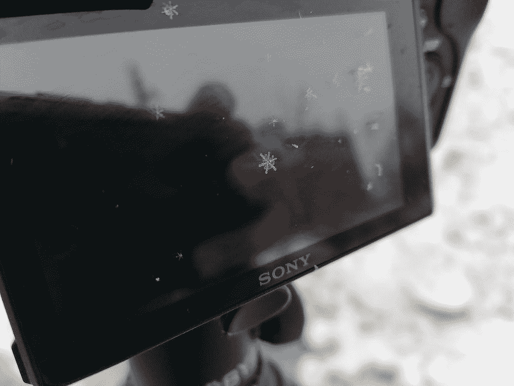
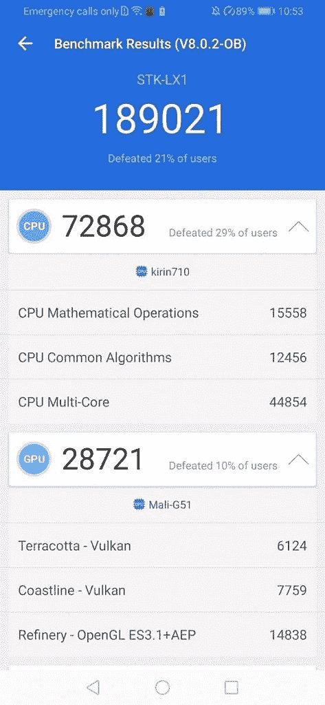
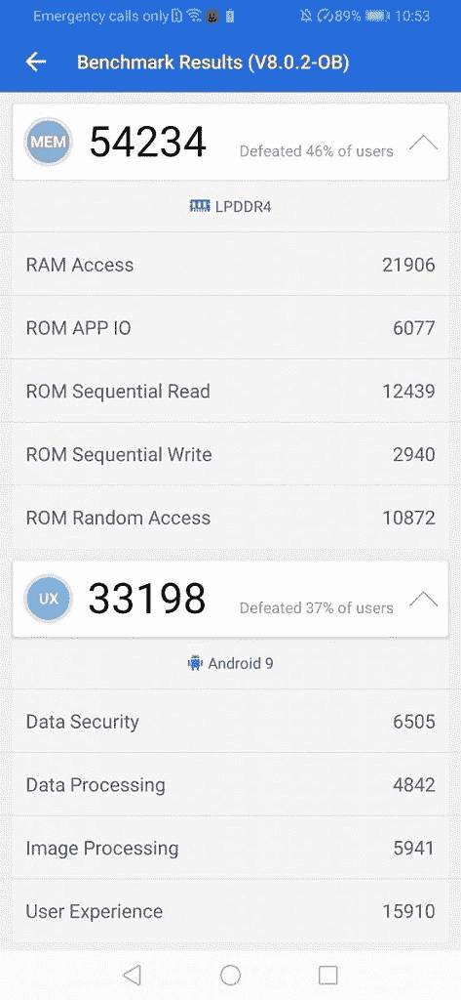

# 荣誉 9X[迷你]回顾:另一个预算友好的赢家？

> 原文：<https://www.xda-developers.com/honor-9x-mini-review-another-budget-friendly-winner/>

Honor 已经成为一种传统，每年在假期前后都会撼动廉价智能手机市场。Honor 9X 是这一遗产的最新继承人，现在在全球许多国家都可以买到，价格趋势约为 270 美元。尽管华为谷歌被禁，这款新的 X 系列手机仍设法提供完整的谷歌服务，包括某些型号上的 Play Store。在这篇评论中，我们看到了 STK-LX1 型号的 Honor 9X，这是一款在欧洲销售的车型。

* * *

## 规范

| 

荣誉 9X

 | 

规范

 |
| --- | --- |
| 显示 | 6.59 英寸 1080 x 2340p 像素(391 ppi) |
| 芯片集 | 海思麒麟 710F |
| 随机存取存储 | 6GB |
| 储存；储备 | 128GB |
| 主摄像机 | 48MP/8MP(超宽)/2MP(深度传感器) |
| 自拍相机 | 16MP 电动弹出式 |
| 电池 | 4000 毫安时 |
| 操作系统 | 安卓 9.1.0 [EMUI](https://www.xda-developers.com/tag/emui/) 9.1.0 |

### 全景显示和动态 X 设计

Honor 在 X 系列手机的设计选择上非常大胆，试图模仿更昂贵设备的外观和结构质量。Honor 9X 有一个由几何钻石切割瓷砖制成的纹理反射背面，当拿在灯光下时，会产生一个动态的“X”图案。背面由双 3D 曲面面板组成，边框厚度为 8.8 毫米。这些图片中显示的 型号 为宝蓝色型号。Honor 9X 还有午夜黑。请观看下面的视频，了解实际效果。

显示屏为 6.59 英寸，占据了手机正面的 91%，这要归功于自拍相机被一个弹出机制隐藏起来，这与各种旗舰智能手机中的情况没有什么不同。三个背部摄像头垂直堆叠，指纹 传感器 共用手机背部。电源和音量键位于 Honor 9X 的右侧，SIM 卡托盘位于顶部，靠近弹出式摄像头。

 <picture></picture> 

Honor 9X display

 <picture></picture> 

Honor 9X Power and volume Buttons

 <picture></picture> 

Honor 9X USB Type C Port and Headphone Jack

过去 X 系列手机最大的抱怨之一是使用微型 USB 端口进行充电和数据传输。考虑到整个行业已经远离这个标准(即使在这个价位)，很高兴看到我们终于在 Honor 9X 上拥有了 USB-C。相反，当我们看到更昂贵的智能手机转向 USB C 音频解决方案时，Honor 9X 保留了值得信赖的 3.5 毫米耳机插孔。

荣誉 9X 显示器

9X 的大尺寸不间断显示屏可能是这款手机提供的最好功能:第一次拿着手机时，屏幕感觉非常大，非常引人入胜。6.59 英寸，不是最大的显示屏，但没有任何缺口来阻挡你的视线，这款手机提供了比其他设备更身临其境的体验——尤其是在这个价格范围内。

### 颜色模式和温度

颜色模式和温度调节让您可以微调屏幕上的颜色。您可以根据您想要的屏幕饱和度在正常模式和生动模式之间进行选择。色温调节将帮助您使屏幕的颜色尽可能令人愉快。

颜色模式和温度

在其最亮的时候，荣誉 9X 将达到 464 尼特。在相反的一端，你可以把亮度降低到非常低的 1.8 尼特。这使得户外观看非常容易，而夜间使用不会令人眼花缭乱。

## 48MP 三摄像头

对于 9X，Honor 在这款手机的摄影方面投入了大量精力。 装置 装有一个 48MP 的三摄像头，包括一个 8MP 超宽镜头和一个 2MP 深度传感器。f/1.8 光圈搭配半英寸传感器，拍出超清照片。AIS 超级夜间模式承诺改善您的弱光照片。观察我们下面的一些初始样本。

### 样片

[第四段]

 <picture></picture> 

48MP Shot [Default Mode]

[/第四段][第四段]

 <picture></picture> 

16MP Selfie Shot [Default Mode]

[/第四段][第四段]

 <picture></picture> 

48MP Shot [Default Mode]

[/第四段][第四段]

 <picture></picture> 

12MP Shot [Default Mode]

[/第四段]

[第四段][caption align = " align none " width = " 900 "]

800 万像素拍摄[夜间模式][/caption]

[/第四段][第四段]

[caption align = " align none " width = " 900 "]

800 万像素拍摄[夜间模式][/caption]

[/第四段][第四段]

[caption align = " align none " width = " 900 "]

4800 万像素拍摄[默认模式][/caption]

[/第四段][第四段]

[caption align = " align none " width = " 900 "]

8800 万像素拍摄[广角拍摄模式][/caption]

[/第四段]

说到视频，honor 9X 带来的只是最基本的功能。你可以以 60FPS 的速度拍摄高达 1080p 的画面，慢镜头选项有 120 和 480FPS，但后者是一种人工交错的慢镜头，所以很难用它获得好看的镜头。120FPS 模式要好得多，在最高 720p 的情况下产生真正的慢动作镜头。查看我们的

[camera review video](https://youtu.be/hfUwqJLTF6A)

查看视频质量的样本。

## 麒麟 710F 和整体性能

我们测试的具体荣誉 9X 型号是 STK-LX1。这款机型配有麒麟 710F 和 6GB 内存。麒麟 810 还有其他型号，但出于这样或那样的原因，这并不包括在每个型号中。这使得该处理器相对于麒麟 710 之前的 Honor 8X 是一个非常温和的升级。话虽如此，但这款手机的性能并没有太多值得批评的地方。[caption align = " align none " width = " 900 "]

《我的世界》PE 在 Honor 9X 上[/caption]《我的世界》在 Honor 9X 上运行完美，即使渲染距离一路颠簸到 11 个区块和最大的图形。世界创建速度非常快，地形加载没有延迟。同样的体验可以在你用这款手机玩的游戏中找到。事实上，即使我有许多其他功能更强大的手机，Honor 9X 的大显示屏也使这款手机成为我的新游戏手机。4000 毫安时的电池可以持续 9X 一整天，没有任何问题。[caption align = " align none " width = " 473 "]

AnTuTu 基准[/caption][caption align = " align none " width = " 473 "]

安图图基准[/caption]

凭借 6GB 的内存，Honor 9X 保持了超快的应用程序启动速度和非常敏捷的系统导航。更多详细的基准测试结果见上图。

## 音频质量

2019 年，当判断智能手机的音频能力时，你必须解决的第一个问题是“手机有耳机插孔吗？”这里的答案是肯定的。除了耳机插孔，Honor 9X 还配有用于无线耳机的蓝牙 4.2 和一个底部发射扬声器。扬声器声音很大，音质也不错。视频听起来很清晰，高音和中音都很棒，但与其他智能手机相比，低音不足。

### 华为 Histen 音效

使用有线耳机时，您可以激活华为 Histen 音效。这可以在“设置”的“声音”菜单中找到，让您可以微调耳机的声音。这种世界级的音频增强技术使用先进的音频处理算法，将对更大更高端的耳机产生更大的影响，尽管你仍然可以听到任何一对耳机的差异。

华为 Histen 音效

总的来说，Honor 9X 是目前为止 X 系列中最好的。虽然摄像头通常是廉价手机的主要功能，但 9X 上的 48MP 摄像头实际上是这款设备的最佳方面之一。Honor 9X 的价格仅为 270 美元，对于任何希望充分利用智能手机相机的人来说都是一笔不错的交易。看看其他 Honor 9X 用户在社区论坛上对这款手机的评价。