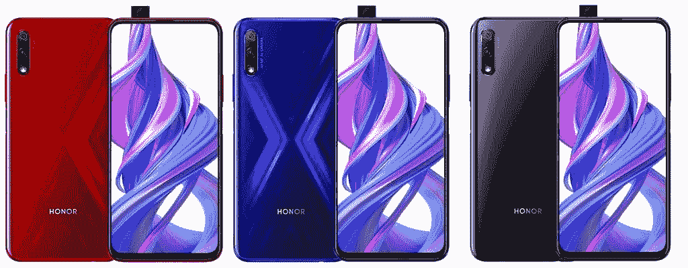
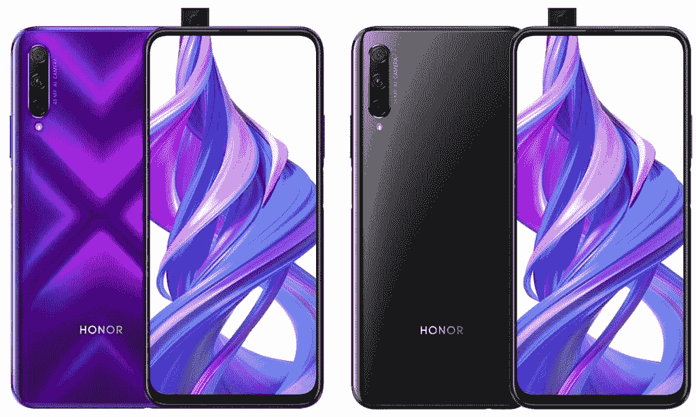

# Honor 9X 和 Honor 9X Pro 宣布采用麒麟 810 和弹出式摄像头

> 原文：<https://www.xda-developers.com/honor-9x-pro-announced-kirin-810/>

本月早些时候，Honor 开始戏弄他们 X 系列的新发布，几个[泄漏证实了设备](https://www.xda-developers.com/honor-9x-pro-pop-up-selfie-camera-triple/)的关键功能。今天，他们推出了 Honor 9X 和 Honor 9X Pro，作为他们“高端中端”类别中的最新产品。这些设备没有 Honor 的高端手机那么强大，但它们仍然以更实惠的价格提供了一个令人信服的包装。

**[荣誉 9X XDA 论坛](https://forum.xda-developers.com/honor-9x) / [荣誉 9X 亲 XDA 论坛](https://forum.xda-developers.com/9x-pro)**

| 

规范

 | 

荣誉 9X

 | 

Honor 9X Pro

 |
| --- | --- | --- |
| 尺寸和重量 | 

*   163.1 x 77.2 x 8.8 毫米
*   206 克

 | 

*   163.1 x 77.2 x 8.8 毫米
*   206 克

 |
| 显示 | 

*   6.59 英寸液晶显示器
*   2340 x 1080 分辨率
*   19.5:9 宽高比

 | 

*   6.59 英寸液晶显示器
*   2340 x 1080 分辨率
*   19.5:9 宽高比

 |
| 社会学 | 海思麒麟 810:

*   2x ARM Cortex-A76 @ 2.27GHz +
*   6x ARM Cortex-A55 @ 1.55 GHz；
*   7 纳米制造工艺
*   Mali-G52 MP6 GPU

 | 海思麒麟 810:

*   2x ARM Cortex-A76 @ 2.27GHz +
*   6x ARM Cortex-A55 @ 1.55 GHz；
*   7 纳米制造工艺
*   Mali-G52 MP6 GPU

 |
| RAM 和存储 | 

*   4GB + 64GB
*   6GB + 64GB
*   6GB + 128GB

 |  |
| 膨胀性 | 通过 microSD 高达 512GB | 通过 microSD 高达 512GB |
| 电池 | 4000 毫安时 | 4000 毫安时 |
| 指纹传感器 | 是的，侧面安装 | 是的，侧面安装 |
| 后置摄像头 | 

*   48MP 主传感器，f/1.8
*   2MP，深度传感器

 | 

*   48MP 主传感器，f/1.8
*   800 万像素，超宽
*   2MP，深度传感器

 |
| 前置摄像头 | 16MP，f/2.2，弹出式 | 16MP，f/2.2，弹出式 |
| 连通性 | 

*   双 4G VoLTE
*   Wi-Fi 802.11 交流电(2.4GHz + 5GHz)
*   蓝牙 5.0 LE
*   GPS + GLONASS
*   USB 类型-C
*   3.5 毫米耳机插孔

 | 

*   双 4G VoLTE
*   Wi-Fi 802.11 交流电(2.4GHz + 5GHz)
*   蓝牙 5.0 LE
*   GPS + GLONASS
*   USB 类型-C
*   3.5 毫米耳机插孔

 |
| 安卓版本 | EMUI 9 下面的 Android 9 派 | EMUI 9 下面的 Android 9 派 |

这两款手机的设计惊人地相似。如果没有一些细微的差别，你可能无法区分它们。它们都有 X 形渐变效果的彩色模型，非常薄的边框，弹出式相机，垂直相机排列，按钮在同一位置，背面有简单的“HONOR”品牌。这是一个很有吸引力的设计，但不可否认的是，它变得有点过时了。

 <picture></picture> 

Honor 9X

Honor 9X 与 9X Pro 的主要外部特征是摄像头排列。Honor 9X Pro 有三个相机堆叠在一起，闪光灯在下面。Honor 9X 具有相同的垂直排列，但第三个摄像头点被闪光灯占据，因为标准型号只有两个摄像头。

Honor 9X 和 9X Pro 将有多种颜色可供选择。如上所述，这是一个非常好看的设计，但我们已经看到了很多。带有醒目渐变色的纤薄表圈不再像过去那样独一无二。X 形图案将吸引那些想要类似于我们在 Honor View 20 上看到的[的闪亮背部的用户，而黑色变体将提供更保守和扁平的外观。](https://www.xda-developers.com/honor-view-20-hands-on-first-impressions-review/)

 <picture></picture> 

Honor 9X Pro

抛开设计不谈，Honor 9X Pro 之所以是“专业”型号，很大程度上是因为多了一个摄像头。9X 有一个 48MP 主传感器和一个 2MP 辅助传感器。同时，9X Pro 有 48MP 主传感器，加上 8MP 和 2MP 辅助传感器。

这两款新设备的一个关键特性是海思麒麟 810 SoC。麒麟 810 是麒麟 710 上的一个[大时代飞跃](https://www.xda-developers.com/hisilicon-kirin-810-honor-9x-benchmark-snapdragon-730/)，它声称带来的性能可以与高通骁龙 730 媲美，如果不是更好的话。考虑到骁龙 730 据说是高通第三强大的移动处理器，它把如何放置麒麟 810 的观点。Honor 9X Pro 变种据说还具有“液体冷却”功能，尽管这可能是指基于蒸汽室的系统，而不是主动水冷。

## 荣誉 9X 和荣誉 9X 专业定价和可用性

Honor 9X 将在中国的[发售，有幻影红、幻影蓝和幻夜黑三种颜色，4GB/64GB 版本的价格为 CNY 1399 英镑(约 203 美元)，6GB/64GB 版本的价格为 CNY 1599 英镑(约 232 美元)，6GB/128GB 版本的价格为 CNY 1899 英镑(约 276 美元)。这款手机已接受预购，将于 2019 年 7 月 30 日起上市。](https://www.honor.cn/)

Honor 9X Pro 将于 2019 年 8 月 9 日在中国上市，有幻影紫和幻夜黑两种颜色，8GB/128GB 版本的价格为 CNY 2199 英镑(约 320 美元)，8GB/256GB 版本的价格为 CNY 2399 英镑(约 349 美元)。

**注意:华为/Honor 已经停止为其设备提供官方 bootloader 解锁码。因此，bootloaders 无法解锁，这意味着用户无法 root 或安装自定义 rom。**