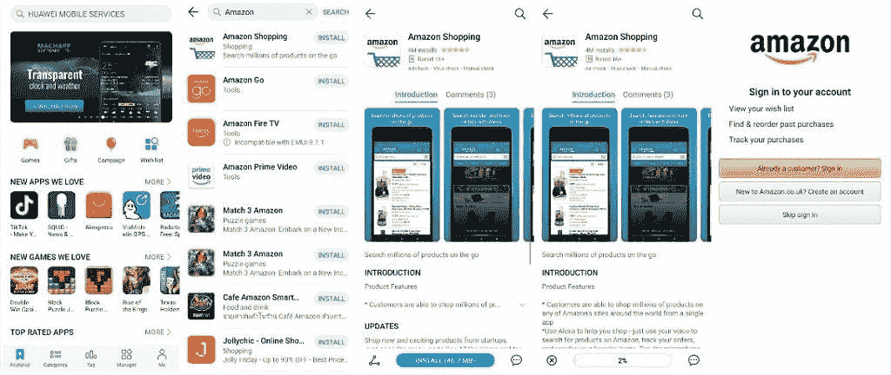
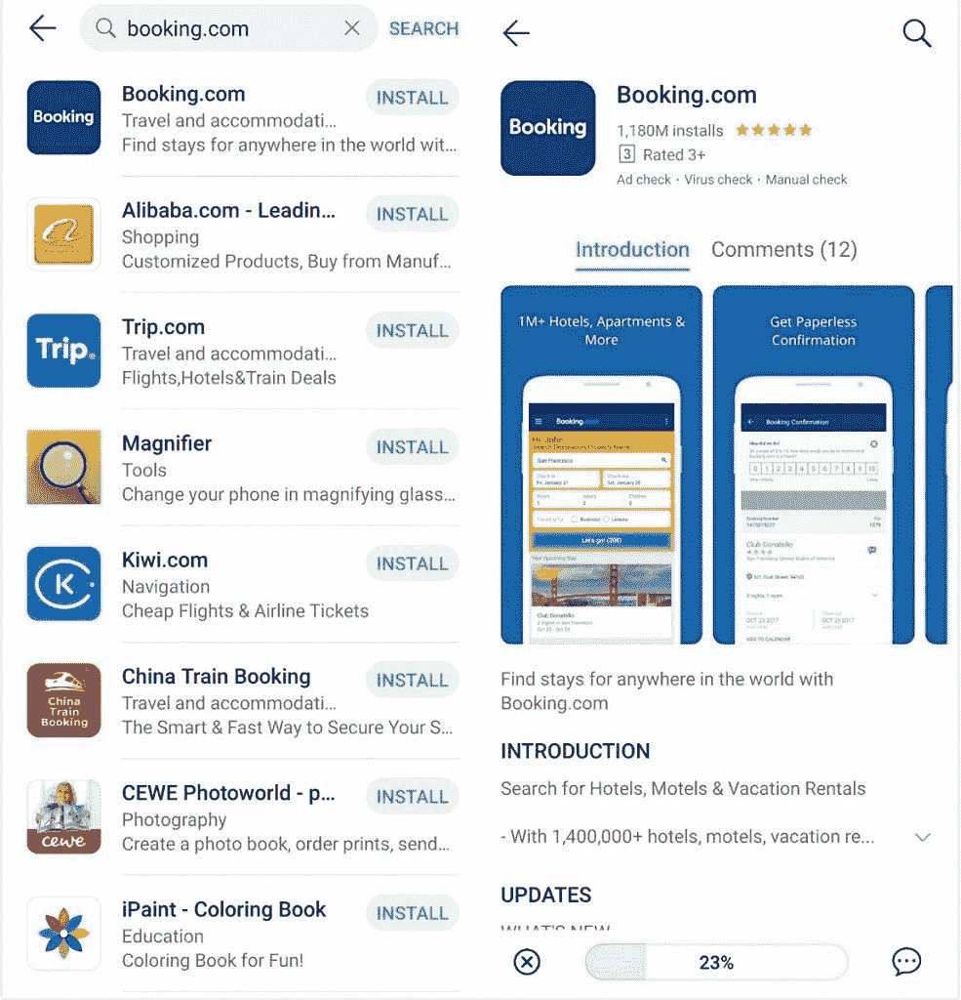
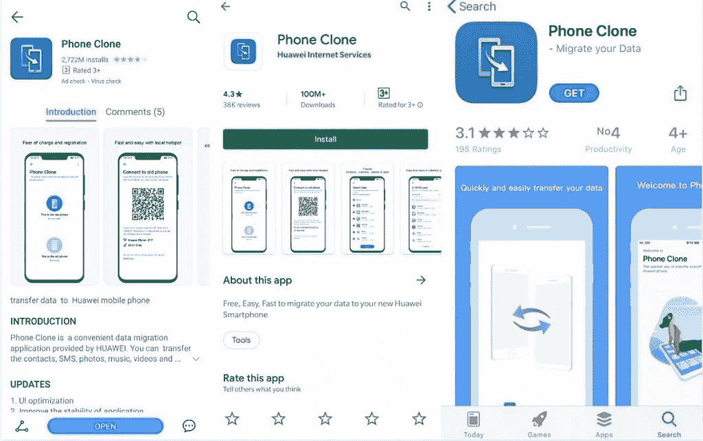
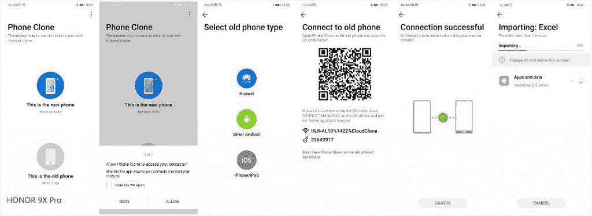
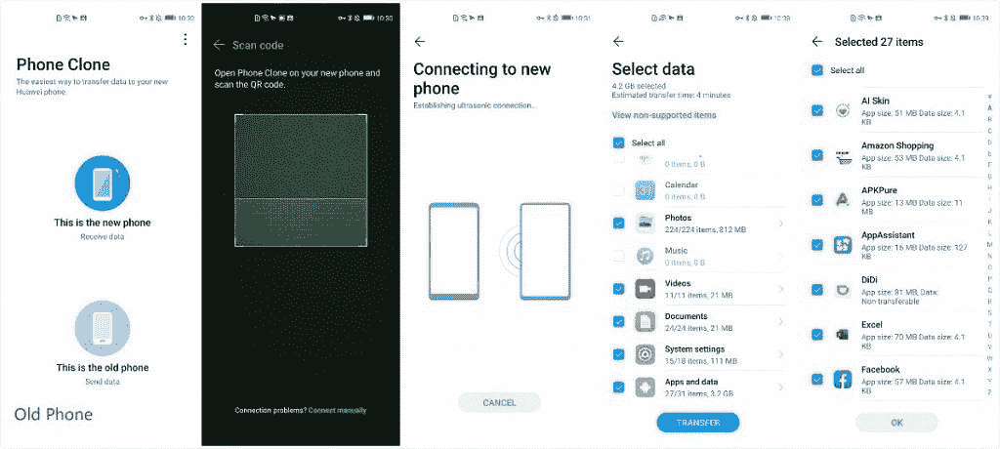
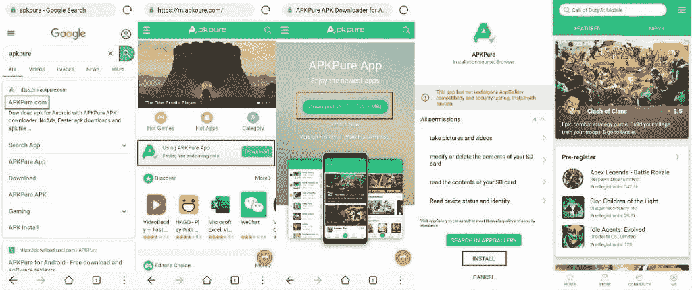
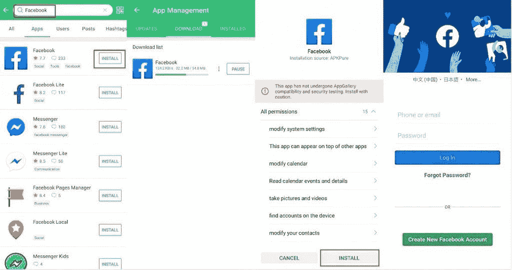
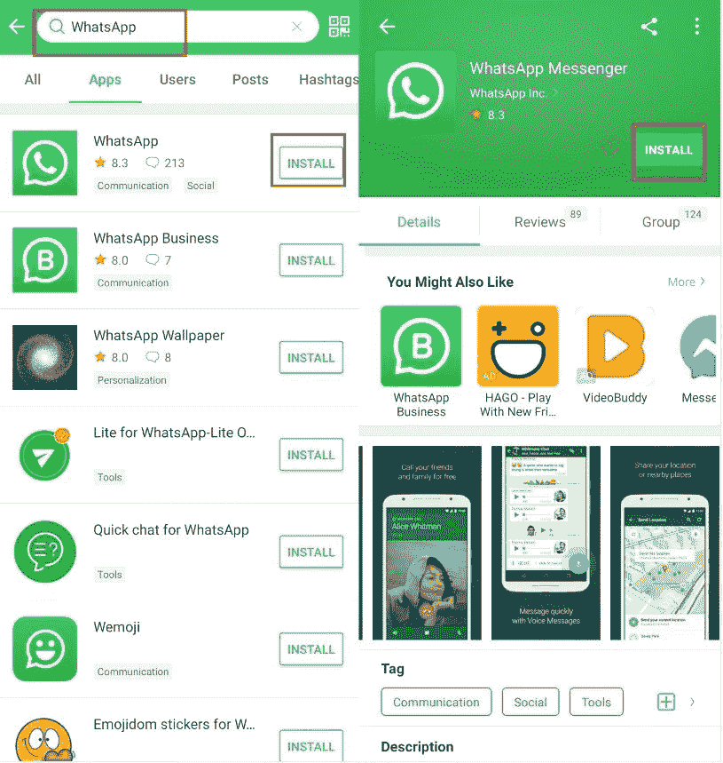
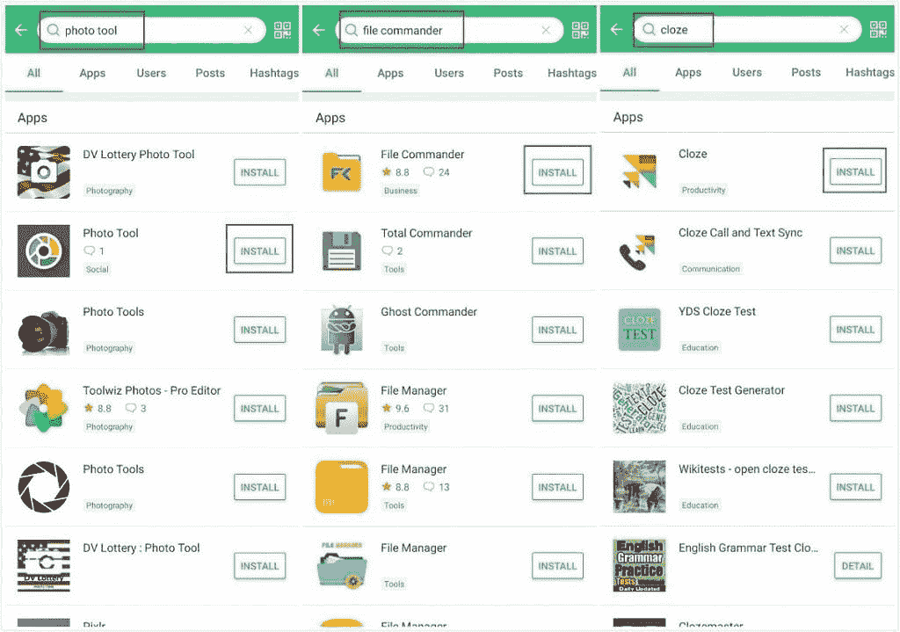
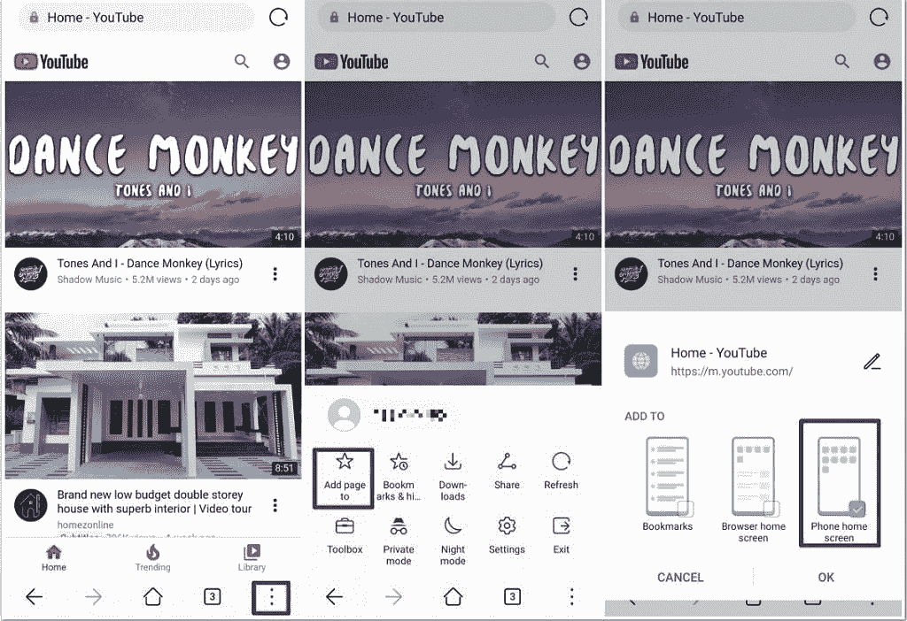

# 荣誉 9X 专业应用指南–获取您需要的应用的所有方法

> 原文：<https://www.xda-developers.com/honor-9x-pro-app-guide-all-the-ways-to-get-apps-you-need/>

如果你正在考虑获得一个 HONOR 9X Pro，或者如果你已经有一个，你可能会想知道如何在 Google Play 商店获得一些你想要的更常见的应用程序。由于华为设备禁止谷歌服务，许多应用程序变得更加难以获得。如果没有 Google Play 商店，你将需要找到变通办法来获得一些你最喜欢的应用程序。请遵循本指南，找到几种方法来为您的 HONOR 9X Pro 找到这些应用程序。

Honor 9X Pro 采用 6.59 英寸显示屏，麒麟 810 处理器，6GB 内存，256GB 存储空间，4,000mAh 电池。该设备具有三个后置摄像头:48MP，8MP 广角和 2MP 深度传感器。前置 1600 万像素摄像头位于弹出式装置中，在手机正面形成了非常薄的边框。

| 

规范

 | 

Honor 9X Pro

 |
| --- | --- |
| 尺寸和重量 | 

*   163.1 x 77.2 x 8.8 毫米
*   206 克

 |
| 显示 | 

*   6.59 英寸液晶显示器
*   2340 x 1080 分辨率

 |
| 社会学 | 海思麒麟 810:

*   2x ARM Cortex-A76 @ 2.27GHz +
*   6x ARM Cortex-A55 @ 1.55 GHz；
*   7 纳米制造工艺
*   Mali-G52 MP6 GPU

 |
| RAM 和存储 |  |
| 膨胀性 | 通过 microSD 高达 512GB |
| 电池 | 4000 毫安时 |
| 指纹传感器 | 是的，侧面安装 |
| 后置摄像头 | 

*   48MP 主传感器，f/1.8
*   800 万像素，超宽
*   2MP，深度传感器

 |
| 前置摄像头 | 16MP，f/2.2，弹出式 |
| 安卓版本 | EMUI 9.1 下面的 Android 9 派 |

## 1.华为应用程序库

华为应用程序库是一个巨大的应用程序市场，正在快速扩张。使用这项服务，你可以找到很多你想找的热门应用。只要打开应用程序，搜索你想要的应用程序，你就能找到完全相同或相似的匹配。在下面的截图中，你可以看到亚马逊应用程序可供下载。

 <picture></picture> 

Amazing App on Huawei App Store

Booking.com 应用程序也可在应用程序库中找到。

 <picture></picture> 

Booking.com App on Huawei App Store

## 2.电话克隆

手机克隆允许您快速复制应用程序和数据到一个荣誉手机，无论你的旧手机是什么。

在复制应用程序之前，您需要在两部手机上安装手机克隆。该应用程序可以在您使用的任何应用程序商店中找到并复制。

 <picture></picture> 

Phone Clone app

手机克隆是一个非常简单的应用程序使用。在这种情况下，您将选择 HONOR 9X Pro 上的“这是新手机”按钮，并选择您要克隆的手机上的“这是旧手机”按钮。

按照步骤操作后，您可以选择您需要的任何数据和应用程序。例如，如果你想在你的 HONOR 9X Pro 上安装亚马逊、Excel 和脸书，只需在 Phone Clone 中选择它们，然后等待它们传输。

 <picture></picture> 

Phone Clone Transfering

 <picture></picture> 

Phone Clone Transfering Booking.com app

 <picture></picture> 

Selecting apps to Transfer on Phone Clone

## 3.替代应用商店(APKPure)

有了 APK 纯，您不仅可以下载您需要的应用程序，还可以管理和更新它们。当您第一次安装从 APK 纯软件下载的应用程序时，HONOR 9X Pro 会要求您允许安装来自 APK 纯软件的应用程序。这只会出现一次，不会再打扰你了。

 <picture></picture> 

APKPure App Store

 <picture></picture> 

Installing Facebook from APKPure

您可以安装所有您最喜欢的社交媒体应用程序，并通过 APKPure 保持更新。

 <picture></picture> 

Facebook on APKPure

 <picture></picture> 

WhatsApp on APKPure

## 4.替代应用程序

对于一些 HONOR 9X Pro 不支持的应用程序，您也可以很容易地在 APKPure 上找到替代品。例如，我们找到了一些好的替代方案向您推荐。

 <picture></picture> 

[Google Photos→ Photo Tool] [Google Drive→ File Commander] [Google Contact→ Cloze]

**谷歌照片→照片工具**

照片工具应用程序可以帮助您轻松快速地备份、管理和共享照片和视频。

**谷歌硬盘→文件指挥官**

文件指挥官是一个强大的文件管理器，允许您通过一个干净直观的界面处理 Android 设备、云存储或网络位置上的任何文件。它装载了各种功能——保险库安全、回收站、存储分析器、文件转换器&还在移动系统驱动器上接收 5GB 的空闲存储空间。

**谷歌联系→完形填空**

完形填空会自动为每个人和每个公司创建一个视图，包括他们所有的联系方式和完整的历史记录，包括电话、短信、每封来回的电子邮件、会议、笔记、文件、社交和信息。

## 5.WAP 快捷方式

对于一些提供良好浏览器体验的应用程序，最好的替代方法是在你的主页上创建一个 WAP 版本网站的快捷方式。例如，YouTube。

 <picture></picture> 

YouTube WAP Shortcut

然后你会在你的主页上找到快捷方式，就像 YouTube 应用程序一样。

这些技巧应该能帮助你在谷歌禁令中导航，并且仍然能够得到你最喜欢的应用。

###### ***感谢荣誉赞助本帖子。我们的赞助商帮助我们支付与运营 XDA 相关的许多费用，包括服务器费用、全职开发人员、新闻记者等等。虽然您可能会在门户内容旁边看到赞助内容(将始终如此标注)，但门户团队绝不负责这些帖子。赞助内容、广告和 XDA 仓库完全由一个独立的团队管理。XDA 绝不会通过接受金钱来赞美一家公司，或者以任何方式改变我们的观点来损害它的新闻诚信。我们的意见不能被收买。***