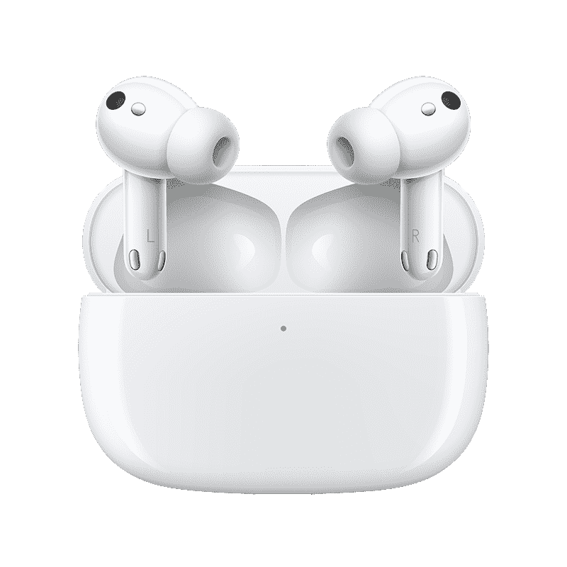

# 荣誉耳塞 3 专业评论:惊人的音质和舒适的设计

> 原文：<https://www.xda-developers.com/honor-earbuds-3-pro-review/>

Honor 做耳机多年，2020 年上半年我评测了 Honor Magic 耳塞。这是一副非常普通的耳机，本质上是华为 FreeBuds 3i 的品牌重塑。该公司一直在生产耳机，虽然我对命名的血统感到困惑，但我可以说的是，Honor Earbuds 3 Pro 是一副非常棒的耳机，我已经爱上了它。

就技术规格而言，Honor Earbuds 3 Pro 采用了同轴双驱动器设计，配有 11 毫米扬声器，主动降噪，快速充电，以及仅限于部分地区的温度监控。它们有白色和灰色两种，在 ANC 打开的情况下，每个耳塞的电池寿命可达 4 小时。它们还支持同时连接到两个设备进行快速切换，使用蓝牙 5.2，并具有无线充电和快速有线充电功能。

基本上，这是一套优质的耳机，我很舒服地被冠以[最佳无线耳机](https://www.xda-developers.com/best-wireless-earbuds/)之一，很难挑出它们的毛病。我认为它们将成为任何智能手机生态系统的优秀补充，在这篇评论中，我想你会明白为什么。

 <picture></picture> 

Honor Earbuds 3 Pro

##### 荣誉耳塞 3 专业版

Honor Earbuds 3 Pro 是一副出色的主动降噪耳机，也是我用过的最喜欢的一副。

## 荣誉耳塞 3 专业版:规格

| 

规格

 | 

荣誉耳塞 3 专业版

 |
| --- | --- |
| **建造** | 不适用的 |
| **尺寸&重量** | 不适用的 |
| **扬声器驱动器** | 

*   11 毫米同轴双驱动器设计

 |
| **麦克风** | x 麦克风阵列 |
| **连通性** | 蓝牙 5.2 |
| **电池&充电** | 

*   仅耳塞:
    *   ANC 开启:长达 4 小时
    *   ANC 关闭:最长 6 小时

*   耳塞+外壳:
    *   ANC on:最长 16 小时
    *   ANC 关闭:最长 24 小时

*   快速充电支持
    *   充电 5 分钟可增加 2 小时的总播放时间

 |
| **其他特性** | 

*   支持主动噪声消除(48dB 峰值)
*   用于充电的 USB 型端口
*   入耳式温度计(视地区而定)
*   触摸控制

 |
| **颜色** |  |

## 荣誉耳塞 3 专业版:设计

Honor Earbuds 3 Pro 并没有独特的设计，但很难用耳机做一些独特的事情。三星通过该公司的 Galaxy Buds 实现了一些不同的东西，华为的 FreeBuds Pro 有一个更方正的设计。除此之外，它们看起来或多或少都是一样的，在这里也没有什么不同。这不是一件坏事，这只是一个观察。至于这种配色，我非常喜欢更“烟熏”的外观。这一点*确实让*有别于苹果的 AirPods，这也只是一种审美偏好。

每个耳塞上都有多个传感器——一个接近传感器和一个人工智能温度读取器。很难为耳机做出独特的设计，作为一个使用过很多真正无线耳机的人，很多耳机看起来都一样。

在长时间的聆听中使用它们很舒服

由于耳塞上的小杆，触摸控制非常挑剔。它们有时很难使用，很少会误解触摸，尽管它们很有效，过一段时间你最终会掌握它们的窍门。

除此之外，这种设计很实用，长时间聆听时使用起来也很舒服。硅胶耳塞头非常适合我的耳朵，我不需要像使用一些耳机那样改变大小，比如一加耳塞 Pro T1。盒子里有一套小的和一套大的。

## 荣誉耳塞 3 专业版:音频，电池和软件

不管怎样，任何一副耳机最重要的方面是它们实际上听起来如何*。如果一副耳机有很好的声音，我总是会原谅它缺乏特色，因为这可能是人们真正购买它们的原因。鉴于华为之前在音频方面的熟练程度(介于[华为 Sound](https://www.xda-developers.com/huawei-sound-smart-speaker-review/) 和[华为 FreeBuds Pro](https://www.xda-developers.com/huawei-freebuds-pro-review/) 之间)，我认为其中一些声音技术也会获得荣誉。事实证明，确实如此。*

 *我喜欢华为 Freebuds Pro，从那以后我也用过很多耳机。我用过三星、一加和 [Nothing Ear 1 耳机](https://www.xda-developers.com/nothing-ear-1-review/)等一些最好的产品，到目前为止，没有一款*能与 Honor Earbuds 3 Pro 相提并论，它们也成功超过了华为 FreeBuds Pro。本质上，我认为这是我目前最喜欢的耳机。*

Honor Earbuds 3 Pro 听起来令人难以置信，长时间佩戴也很舒适

Honor Earbuds 3 Pro 听起来令人难以置信，长时间佩戴也很舒适。如果你想看看我主要用耳机听的播放列表，你可以在 Spotify 上查看。诸如 *EDEN* 的*Modern warning*之类的歌曲完美地平衡了低端与混音的其余部分，Honor 成功地摆脱了我们经常在廉价耳机中看到的对低端的严重关注。我一直以来最喜欢的歌曲之一，由谦逊耗子乐团创作的《漂浮在 T21 上》，也做了大量的服务，一如既往的干净。

就音频质量而言，Honor 在这里是最大的赢家。Honor Earbuds 3 Pro 听起来很棒，基本上只是一副坚固的耳机。没有过于强烈的低音，但它非常明显地存在，高音和中音仍然牢牢地控制住。对于一副耳机来说，它们也没有完全狭窄的声音，声场对我来说比我用过的其他耳机(如 Galaxy Buds 2)要宽得多。

说到主动降噪，Honor Earbuds 3 Pro 也做了令人印象深刻的工作。它们很好地屏蔽了我周围的声音，在公共交通工具上，如公共汽车和火车上，它们为我提供了很好的服务。他们确实有一个透明模式，但它不是很好，有点平庸——通常情况下，当涉及到耳机时，无论如何。我从来没有真正使用过我真正喜欢的透明模式，包括 AirPods Pro。我宁愿完全脱掉它们。

如果你想修改这些耳机的设置，你需要 Honor AI Space 应用程序。熟悉的话就跟华为 AI 生活 app 差不多。你可以更新你的耳机，改变手势，进行“合身测试”(尽管这些也不是很好)，或者改变降噪模式。不过没有 iOS 应用，所以苹果用户要小心了。

从耳朵上取下耳机会自动暂停音乐播放并关闭 ANC，但如果你愿意，你可以从应用程序中关闭该功能。把耳机放回耳朵会继续播放。您也可以在手势仍然活跃的情况下，一次用一只耳机收听。

至于续航，Honor Earbuds 3 Pro 已经完全够用了。他们吹嘘只有四个小时的播放时间，但我认为这将适合大多数人。我还没有遇到过这样的情况，我的耳机几乎没电了，我需要把它们放回盒子里充电，我不认为我真的有过这样的经历。

## Honor Earbuds 3 Pro 值你的钱吗？

它们很贵，但它们值得这个价格标签

这是一副昂贵的无线耳机，在英国售价 169 英镑，在欧洲€售价 199 英镑。然而，它们也是我用过的最好的一双。它们价格昂贵，尤其是与竞争对手相比，但它们也赢得了一套优质耳机的价格标签。

我对这些耳机最大的批评是没有 aptX 技术。他们支持 AAC 编解码器，所以他们仍然提供比 SBC 更高的比特率流，大多数人也不会关心技术规格；如果他们工作，他们工作，这些工作。

 <picture></picture> 

Honor Earbuds 3 Pro

##### 荣誉耳塞 3 专业版

Honor Earbuds 3 Pro 是一副出色的主动降噪耳机，也是我用过的最喜欢的一副。

如果你想要的是一副音质出色的坚固耳机，那么这些就是你要找的耳机。如果能测试一下人工智能温度监测系统，并将其与实际的温度计进行比较，那就太好了，但这项功能在爱尔兰并不活跃。Honor 表示，它在“英国、法国、德国、意大利、西班牙、捷克、芬兰和罗马尼亚”并不活跃，尽管它在爱尔兰也不可用，但我怀疑它可能在整个欧盟都不活跃。我绝对喜欢这款耳机的音质，这是最重要的。*