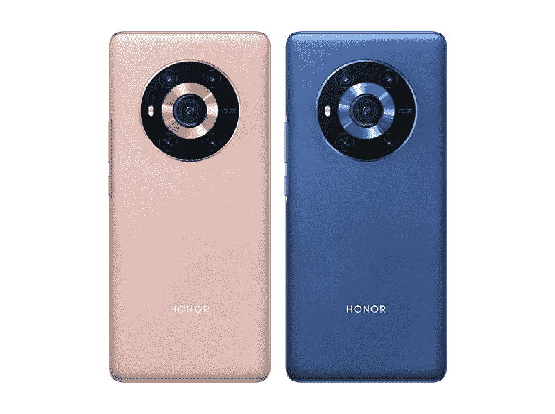
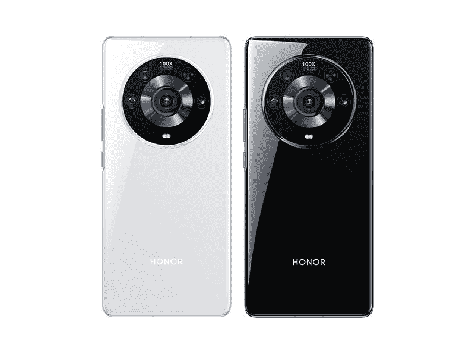
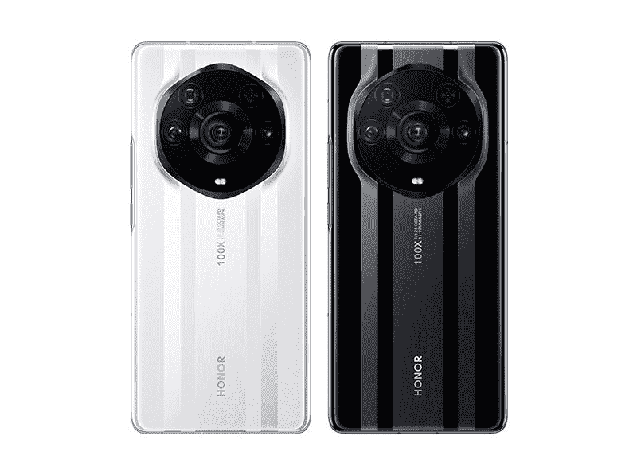

# 荣誉魔术 3 系列:规格，功能，价格和可用性！

> 原文：<https://www.xda-developers.com/honor-magic-3-series-launch/>

在脱离华为之后，Honor 今年早些时候凭借其新的 [Honor 50 系列](https://www.xda-developers.com/honor-50-series-official-launch/)卷土重来。该系列以合理的价格提供了中档硬件，并且预装了 GMS 和谷歌 Play 商店。发布后不久，Honor [分享了一个关于即将推出的旗舰设备的预告](https://www.xda-developers.com/honor-confirms-flagship-phone-qualcomm-snapdragon-888-plus/)，该设备将采用高通[的骁龙 888 Plus](https://www.xda-developers.com/qualcomm-snapdragon-888-plus/) 芯片。上个月早些时候，[该公司最终确认](https://www.xda-developers.com/honor-magic-3-series-launch-date-confirm/)它将在 8 月推出旗舰产品 Honor Magic 3 系列。现在，该公司已经正式揭开了这些设备的外壳。

## 荣誉魔术 3 系列:规格

| 

规格

 | 

荣誉魔法 3

 | 

荣誉魔术 3 专业版

 | 

荣誉魔术 3 专业版

 |
| --- | --- | --- | --- |
| **打造** | 

*   IP54 认证
*   玻璃背面

 | 

*   IP68 认证
*   玻璃背面

 | 

*   IP68 认证
*   纳米晶体陶瓷背板

 |
| **尺寸&重量** | 

*   纯素皮革:
    *   162.8 x 74.9 x 9.5mm 毫米
    *   202 克
*   玻璃:
    *   162.8 x 74.9 x 8.99mm 毫米
    *   203 克

 | 

*   纯素皮革:
    *   162.8 x 74.9 x 9.5mm 毫米
    *   212 克
*   玻璃:
    *   162.8 x 74.9 x 8.99mm 毫米
    *   213g

 | 

*   162.8 x 74.9 x 9.94mm 毫米
*   236 克

 |
| **显示** | 

*   6.76 英寸弧形有机发光二极管
*   10 位颜色
*   120 赫兹刷新率
*   2772 x 1344p，456PPI
*   HDR10+
*   P3 保卫儿童国际
*   δe<0.8

 | 

*   6.76-inch curved OLED
*   10-bit color
*   120Hz refresh rate
*   1344p, 456PPI
*   HDR10+
*   DCI-P3
*   Delta e <0.8

 | 

*   6.76-inch curved OLED
*   10-bit color
*   120Hz refresh rate
*   1344p, 456PPI
*   HDR10+
*   DCI-P3
*   Delta e <0.8
*   Nano Crystal shield protection

 |
| **SoC** | 高通骁龙 888 | 高通骁龙 888+。 | 高通骁龙 888+。 |
| **闸板&存放** |  |  |  |
| **电池&充电** | 

*   4600 毫安时
*   66W 有线快速充电

 | 

*   4600 毫安时
*   66W 有线快速充电
*   50W 无线快速充电
*   反向无线充电

 | 

*   4600 毫安时
*   66W 有线快速充电
*   50W 无线快速充电
*   反向无线充电

 |
| **安全** | 

*   带 3D Face ID 的 3D ToF 前置摄像头

 | 

*   带 3D Face ID 的 3D ToF 前置摄像头

 | 

*   带 3D Face ID 的 3D ToF 前置摄像头

 |
| **后置摄像头** | 

*   主要:50MP f/1.9 索尼 IMX 766
*   超宽:1300 万像素/2.2 英寸
*   单色:6400 万像素 f/1.8

 | 

*   主要:50MP f/1.9 索尼 IMX 766
*   超宽:1300 万像素/2.2 英寸
*   单色:6400 万像素 f/1.8
*   长焦:64MP f/3.5 潜望镜变焦，3.5 倍光学变焦，OIS，10 倍混合变焦，100 倍数码变焦

 | 

*   主要:50MP f/1.9 索尼 IMX 700，PDAF
*   超宽:64MP f/2.4，126 度 FoV
*   单色:6400 万像素 f/1.8
*   长焦:64MP f/3.5 潜望镜变焦，3.5 倍光学变焦，OIS，10 倍混合变焦，100 倍数码变焦

 |
| **前置摄像头** | 1300 万像素 f/2.4 | 1300 万像素 f/2.4 | 1300 万像素 f/2.4 |
| **端口** | USB 类型-C | USB 类型-C | USB 类型-C |
| **音频** | 

*   立体声扬声器
*   三话筒设置

 | 

*   立体声扬声器
*   三话筒设置

 | 立体声扬声器 |
| **连通性** | 

*   5G
*   Wi-Fi 6(双频)
*   蓝牙
*   国家足球联盟

 |  |  |
| **软件** | 基于 Android 11 的 Magic UI 5 | 基于 Android 11 的 Magic UI 5 | 基于 Android 11 的 Magic UI 5 |
| **颜色** | 

*   蓝色时光(纯素皮革)
*   金色小时粉色(纯素皮革)
*   怀特（姓氏）
*   黑色

 | 

*   蓝色时光(纯素皮革)
*   金色小时粉色(纯素皮革)
*   怀特（姓氏）
*   黑色

 |  |

* * *

荣誉魔术 3 系列包括三个设备-常规荣誉魔术 3，魔术 3 专业，魔术 3 专业加。这三款设备都采用了相同的 6.76 英寸 10 位曲面有机发光二极管显示屏，提供 120Hz 高刷新率支持和 456 PPI 像素密度。然而，顶级的 Magic 3 Pro Plus 采用了纳米晶体屏蔽涂层，以提供额外的抗碎性，而其他两款则没有。

 <picture></picture> 

Honor Magic 3

基本的 Honor Magic 3 由高通的骁龙 888 芯片驱动，而其他两个型号则使用更新的骁龙 888 Plus 芯片。基本型号配备 8GB 内存和 128/256GB 存储，Magic 3 Pro 配备 8/12GB 内存和 256/512GB 存储，Pro Plus 配备 12GB 内存和 512GB 存储。这三款手机都配备了 4,600mAh 电池，支持 66W 有线快速充电，Pro 版本还支持 50W 无线快速充电。

 <picture></picture> 

Honor Magic 3 Pro

Magic 3 系列的摄像头硬件是这三款设备之间的主要区别因素。base Honor Magic 3 采用三摄像头设置，配有 64MP 索尼 IMX 766 主摄像头、13MP 超宽摄像头和 64MP 单色摄像头。Magic 3 Pro 采用四摄像头设置，具有与基本型号相同的主摄像头、超宽摄像头和单色摄像头，以及 64MP 潜望镜变焦摄像头。

 <picture></picture> 

Honor Magic 3 Pro Plus

premium Honor Magic Pro 3 配备了最好的相机硬件。它有一个更大的 50MP 索尼 IMX 700 主相机，一个 64MP 超宽相机，一个 64MP 单色相机和一个 64MP 潜望镜变焦相机。在正面，这三款设备都有一个 1300 万像素的自拍摄像头和一个 3D ToF 摄像头，用于在显示屏上的药丸形状的切口中进行 3D 面部解锁。

Magic 3 和 Magic 3 Pro 采用玻璃和纯素皮革表面，基本型号提供 IP54 认证，Pro 型号提供 IP68 认证。Honor Magic 3 Pro Plus 有一个陶瓷背板，它还提供 IP68 认证。这三款设备都配有立体声扬声器、三麦克风设置和 USB Type-C 端口。在连接方面，这些设备提供 5G 支持、双频 Wi-Fi 6、蓝牙和 NFC。

在软件方面，这三款设备都在 Android 11 之上运行 Honor 的 Magic UI 5 皮肤。与荣誉 50 系列一样，它们带有 GMS，并预装了谷歌 Play 商店。

## 定价和可用性

荣誉魔术 3 系列有多种配色。Magic 3 和 Magic 3 Pro 有两种合成革表面-金色小时和蓝色小时-以及两种玻璃表面-黑色和白色。Honor Magic 3 Pro Plus 有两种陶瓷背板饰面-黑色和白色。Honor Magic 3 系列将很快在中国销售，Honor 计划在不久的将来在全球推出。其定价如下:

*   荣誉魔法 3:从€899 开始
*   荣誉魔术 3 专业版:€起价 1099 英镑
*   荣誉魔术 3 Pro Plus:€1499