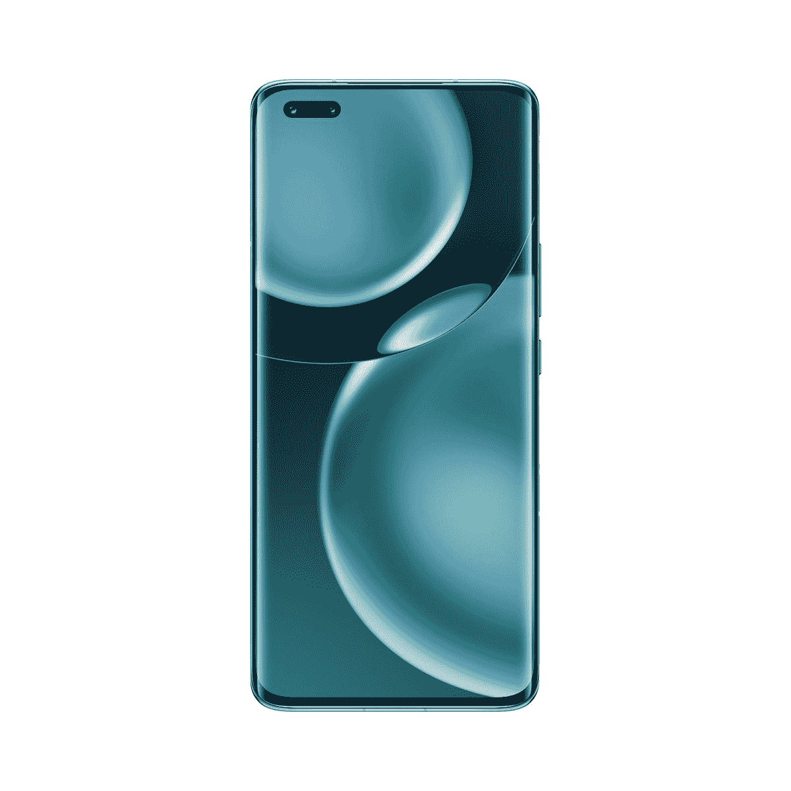

# 荣誉魔术 4 临检讨:一个秋千和近小姐

> 原文：<https://www.xda-developers.com/honor-magic-4-pro-review/>

荣誉回来了，他们比以前更好了。在该公司于 2020 年底从华为分离出来后，我们看到了它的第一个独立企业以明显的中档 [Honor 50](https://www.xda-developers.com/honor-50-review/) 系列的形式出现。现在，该公司在西方推出了旗舰智能手机 Honor Magic 4 Pro，这表明在其伟大的西方回归中，荣誉意味着商业。

Honor Magic 4 Pro 刚刚在英国正式亮相，您也可以从其他欧洲国家购买。Honor 20 Pro 问世时是我最喜欢的手机之一，对于 Honor 50，我说我想保留判断，直到该公司发布旗舰产品，看看它是否真的回来了。虽然我是荣誉魔术 4 Pro 的忠实粉丝，并看到了潜力，但遗憾的是，我不太认为这相当经得起旧的荣誉旗舰。

Honor Magic 4 Pro 将于 5 月 27 日在英国上市，售价为 949.99 英镑，€在欧洲的售价为 1099 英镑。

 <picture></picture> 

Honor Magic 4 Pro

##### 荣誉魔术 4 专业版

Honor Magic 4 Pro 是 Honor 从华为分拆以来在西方的第一款旗舰，它拥有一些令人印象深刻的规格。

***关于本次回顾:*** *本人于 2022 年 5 月 3 日收到 Honor 发来的荣誉 Magic 4 Pro 进行回顾。Honor 对这篇文章的内容没有任何意见。*

## 荣誉魔术 4 专业版:规格

| 

规格

 | 

荣誉魔术 4 专业版

 |
| --- | --- |
| **打造** | 

*   IP68 防水防尘等级

 |
| **尺寸&重量** | 

*   玻璃:
    *   163.6 x 74.7 x 9.15mm 毫米
    *   215 克
*   PU:
    *   163.6 x 74.7 x 9.10mm 毫米
    *   209 克

 |
| **显示** | 

*   6.81 英寸 LTPO 有机发光二极管
*   2848 x 1312p 像素
*   460PPI
*   120 赫兹刷新率
*   100% DCI-P3 覆盖率
*   HDR10+认证
*   1000 尼特峰值亮度
*   MEMC
*   特别提款权到 HDR 升级

 |
| **SoC** | 

*   高通骁龙 8 代 1

 |
| **闸板&存放** | 

*   8/12GB LPDDR5 RAM
*   256/512GB 存储空间

 |
| **电池&充电** | 

*   4600 毫安时
*   100W 有线快充支持
*   100W 无线快充支持

 |
| **安全** | 

*   显示指纹扫描仪
    *   高通 3D 声波传感器第二代
*   3D 人脸解锁

 |
| **后置摄像头** | 

*   初级:50MP f/1.8
*   超宽:50MP f/2.2，122 FoV
*   长焦:64MP f/3.5，3.5 倍光学变焦，100 倍数码变焦
*   8*8 dToF 激光聚焦传感器
*   闪烁传感器

 |
| **前置摄像头** | 

*   具有 100 FoV 的未指定广角摄像机
*   3D 深度传感器

 |
| **端口** | USB 3.1 第 1 代 C 类端口 |
| **音频** | 

*   立体声扬声器
*   24 位 HDR 立体声录音

 |
| **连通性** | 

*   5G NR
*   第四代移动通信技术
*   蓝牙 5.2
*   Wi-Fi 6 (2.4Ghz/5GHz)
*   国家足球联盟

 |
| **软件** | 基于 Android 12 的 Magic UI 6.0 |
| **颜色** | 

*   黑色
*   怀特（姓氏）
*   蓝绿色
*   金色的
*   橙色(PU)

 |

## 荣誉魔术 4 专业版:设计

*   又大又亮
*   讨厌的药丸自拍相机
*   四次曲线

如果曾经有一个极化的智能手机设计，那么这就是它。在背面配备一个巨大的圆形摄像头对于荣誉来说不够大胆，因为它还在显示屏的左上方包装了一个药丸形状的切口。这不是一个适合所有人的设计，但在一个类似的玻璃片的海洋中，我很欣赏荣誉是为了什么。

明确地说，我喜欢 Honor Magic 4 Pro 的整体设计，我发现背面的摄像头(被亲切地称为“缪斯之眼”)大大有助于赋予它独特的外观。它既对称又大胆，这一点很突出。闪光灯在那个大圆圈的底部可能会很烦人，因为我发现我的手指在手机背面可能会挡住一点。

我*不*喜欢的是前面的药丸摄像头镂空。它太长了，占据了很多空间，而且它离左手边太远了，以至于通知图标几乎被推到了显示屏的中央。我知道它很长，因为它容纳了额外的相机硬件，但从长远来看，我会发现自己对此感到沮丧。

Honor Magic 4 Pro 的显示屏是四曲面 120Hz AMOLED 面板，最大亮度为 1000 尼特，分辨率为 2848 x 1312 像素，像素密度为 460 PPI。之所以采用药丸形状的切口，是因为它在前置摄像头旁边装有一个 3D ToF 传感器，以便更好地进行面部解锁，而且它*的*工作得很好。尽管如此，还是很碍眼，所以真的要看人脸解锁对你有多重要了。

触觉方面，我能描述它的最好方式是，我能感觉到我口袋里的通知，打字感觉很好，这对我来说已经足够了。这款手机的其他设计方面包括双发射扬声器，顶部用于红外控制设备的红外发射器，以及一个非常明显的曲面屏幕。还有一个 USB 3.1 USB-C 端口，一个 SIM 卡托盘，没有耳机插孔。最后，还有一个显示指纹扫描仪，它是超声波的，所以我在黑暗中解锁手机时不会看不见。

总的来说，Honor Magic 4 Pro 的设计很漂亮，但也非常两极分化。它配备了一个预先应用的屏幕保护装置，感觉非常低质量，但你在盒子里得到的透明外壳足够体面，可以掩盖光滑的后玻璃。

* * *

## 荣誉魔术 4 专业版:相机

*   非常好的初级传感器
*   有时难以集中注意力
*   100 倍变焦是营销噱头

当 Honor 从华为分离时，最大的受害者之一很可能是相机。华为的相机智能一直处于游戏的顶端，虽然 Honor 似乎不再有能力与最佳中的最佳竞争，但这款相机硬件*确实有闪光的光辉。它挤满了优质的传感器，覆盖你的所有基地，作为一个全能的竞争者，它做得非常出色。*

* * *

## 荣誉魔法 4 Pro:魔法 UI 6

*   缺少 VoLTE 和 Wi-Fi 通话等基本功能
*   魔法 UI 6 是*精*
*   荣誉发射器太可怕了

Honor 的 Android 智能手机运行 Magic UI，这是该公司自己的 Android 版本。以前的迭代是基于华为的 EMUI，但现在，它看起来有点*不同*。虽然没有不同到足以说它实际上是不同的整体。尽管如此，软件部门的头条功能仍然是包含 Google Play 服务，因为以前的 Honor 智能手机预装了华为移动服务。这是自拆分以来 Honor's 在西方推出的首款旗舰手机。

在华为 P50 Pro 的案例中，我们已经看到华为移动服务如何在最初的迭代中实现飞跃式的改进，但对我来说，没有什么能打败 Google Play 服务。华为移动服务的问题不仅仅在于它不是谷歌，而是仍然有一些初期问题无法真正解决。任何使用谷歌地图 API 的应用程序实际上都无法显示地图，因为它需要这种集成。安装不在 AppGallery 上的应用程序通常也是一个麻烦的过程，即使像花瓣搜索这样的工具有一点帮助。很难将荣誉手机交给任何人，因为它肯定不是许多消费者熟悉的安卓智能手机。我在日常生活中使用大量的谷歌服务，能够在 Honor 的智能手机上使用它们，而不需要经历重重困难或寻找替代品，这是一种福气。我不必考虑使用谷歌服务或任何我喜欢的应用程序——它们现在就像在成千上万的其他手机上一样工作。

在 Honor Magic 4 Pro 上，预装了大量的膨胀软件，足以让我注意到我通常不会注意到的情况。有第一方荣誉应用，还有 WPS Office 和 Booking.com 之类的应用。

总体来说，Magic UI 6 是*精*。我有很多问题，手机缺乏基本功能，包括没有 VoLTE 或 Wi-Fi 通话。我依赖 Wi-Fi 打很多电话，因为我在公寓里没有信号，VoLTE 很好，所以后台的应用程序保持高速连接。我也不能分享设置中的 Wi-Fi 二维码，这一点几乎每部手机都可以做到。

不过，发射架实在是太糟糕了。没有应用抽屉选项，向下滑动搜索应用会滞后于整个手机。我相信这是因为它搜索每一个输入的字母，但整个手机在输入时慢得像爬行一样，甚至会错过字母。在这方面，这是一次可怕的经历，也是我在现代智能手机上使用过的最糟糕的发射器之一。只是不值得使用，你绝对应该考虑换成其他[好的启动器](https://www.xda-developers.com/best-android-launchers/)。

* * *

## 表演

*   性能远远低于应有水平
*   相机速度慢
*   刷新率经常下降到 120Hz 以下

Honor Magic 4 Pro 是西方很久很久以来第一款搭载旗舰规格的 Honor 智能手机。通常情况下，我会满足于说这款手机的性能将与任何其他基于[骁龙 8 第 1 代](https://xda-developers.com/qualcomm-snapdragon-8-gen-1)的智能手机一样，但事实并非如此。事实上，我对骁龙 8 Gen 1 有很高的期望，认为它能够成为顶级的表现者，加上神奇的用户界面，我真的认为这款手机能够做得更多。我很难过地发现，这款手机在许多基本任务上举步维艰，我的发现得到了我运行的基准测试的支持。

就背景而言，华为和 Honor 在软件优化方面都是出了名的严厉，通常不利于通知等。虽然我还没有遇到通知方面的问题，但如果这些优化决策已经渗透到 Magic UI 6 的工程中，我也不会感到惊讶。

这款手机在一些随意的地方感觉迟钝——从应用程序之间切换到启动相机——它只是感觉*慢*。一部配有骁龙 8 代 1 和 8GB 内存的手机应该不会表现得如此糟糕，但我们还是来了。然而，有趣的是，这种性能体现在电池寿命上，因为在这款设备上，电池寿命相当体面。我的理论是 Honor 过度优化了芯片组，导致了滞后的体验。

更糟糕的是，启动相机可能需要几秒钟才能启动并拍摄照片，切换应用程序偶尔会导致奇怪的口吃。我已经提到了启动延迟。在软件部门使用这款手机并不愉快，我也不知道为什么。有时候，当我滚动屏幕时，刷新率明显下降到 120 赫兹以下，这对这么贵的手机来说还不够好。

至于基准测试，我感到非常惊讶。在超过 240，000 GIPS(每秒 10 亿条指令)的峰值时，它在半小时内降低到其最大性能的 71%。这不是很好，考虑到骁龙 8 Gen 1 在我们的测试中可以达到 280，000 GIPS。我注意到这款手机似乎根本没有升温，这再次表明 Honor 故意限制了这款芯片组的性能。你可以在电池设置中启用性能模式，但它不会改善相机或 laggy launcher，我也没有在基准测试中获得更高的分数。

总的来说，我对这里的软件非常失望。我期望更好，并且希望，随着软件更新，它确实*变得*更好。

* * *

## 荣誉魔术 4 专业版:电池和充电

*   非常快速充电
*   良好的电池寿命
*   糟糕的电池状态报告

Honor Magic 4 Pro 拥有我在装有骁龙 8 Gen 1 的智能手机中体验过的最好的电池寿命，尽管我不认为这是没有妥协的原因。我认为部分原因是 Honor 为了驯服芯片组而做的软件优化；毕竟，我们听说制造商正在努力真正处理高通的最新芯片组。

因此，电池续航时间相当不错，我估计我一天能按时打 5 个小时的屏幕。问题是，Honor 在手机设置中显示电池状态时采用了谷歌的 AOSP 选择，因为它会在午夜钟声敲响后重置。你再也不能只查看你的手机上次充电时的数据，而是从第二天的任何时候开始。

你在盒子里得到的充电器也是 100 瓦充电器，这应该有望弥补你可能面临的任何电池缺点。我们能够在整整 40 分钟内从 0%充电到 100%，表面上看起来有点慢。该公司还送给我们一个能够 100W 充电的无线充电器，我们能够在 41 分钟内从 0%充电到 100%。

Honor Magic 4 Pro 非常注重充电，在这方面做得非常好。它的充电速度比西方的大多数竞争对手都快，尽管它只是一加和小米等中国品牌的一员。

* * *

## 多方面的

### 指纹扫描仪

指纹扫描仪是一种速度足够快的扫描仪，它使用超声波技术进行扫描。超声波传感器通常比光学扫描仪慢一点点，但不会慢太多，而且它的工作精度相当高。当我晚上解锁手机时，它也不会让我看不见，这是一个很大的优势。

### 电话、信号强度和 5G

没有 VoLTE 也没有 Wi-Fi 通话，尽管信号强度已经足够令人印象深刻。有些手机在我的公寓里很难收到信号，但 Honor Magic 4 Pro 明显比我在这个部门使用的大多数手机都要好。

### 引导加载程序解锁

bootloader 无法在 Honor 智能手机上解锁。

### 软件更新承诺

Honor 承诺 2 代 Android 更新和 3 年安全更新。这肯定落后于许多其他人在这一点上做出的承诺。

* * *

## 荣耀 Magic 4 Pro 值你的钱吗？

Honor Magic 4 Pro 处于一个奇怪的位置，因为尽管它出色地完成了一些事情，但它在其他方面却步履蹒跚。相机很好，但有主要的自动对焦问题，电池寿命很好，但代价是计算，软件很好，但缺乏一些功能。每一个积极的方面都有与之相关的消极方面，为了钱，这是很大的牺牲。

虽然我很高兴 Honor 回来了，但在我全心全意推荐这款手机之前，还有很多工作需要进入公司的软件。智能手机的现状令人遗憾，因为骁龙 8 代似乎是智能手机制造商目前面临的许多问题的主要原因。鉴于骁龙 8 Plus Gen 1 的推出，也许今年下半年情况会有所好转。

 <picture></picture> 

Honor Magic 4 Pro

##### 荣誉魔术 4 专业版

Honor Magic 4 Pro 是 Honor 从华为分拆以来在西方的第一款旗舰，它拥有一些令人印象深刻的规格。