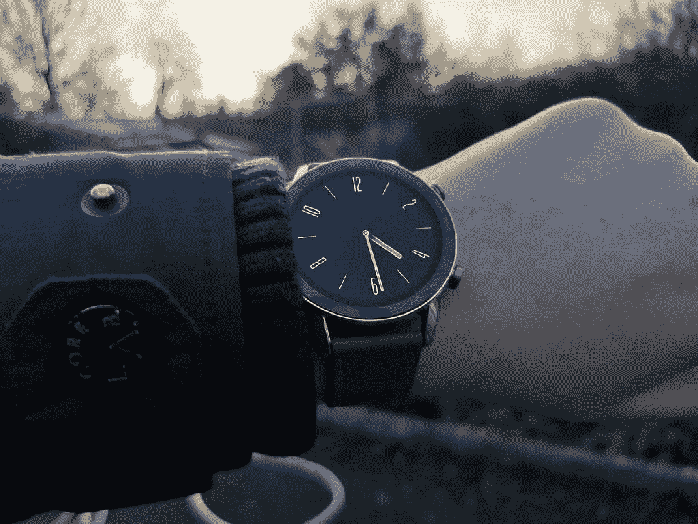

# 荣誉魔表 2 评测- LiteOS 太轻

> 原文：<https://www.xda-developers.com/honor-magic-watch-2-review/>

随着美国和华为之间正在进行的贸易崩溃进展缓慢，Honor 继续将其一些努力重新集中在与美国无关的技术上。这种新的关注以升级版[荣誉带 5](https://www.xda-developers.com/honor-band-5-fitness-tracker-review/) 的形式出现，现在是去年年底推出的原始荣誉魔法手表的继任者。Honor Magic Watch 2 和它的前身一样，运行 LiteOS - **而不是 WearOS** 。其他规格包括 454 x 454，1.39 英寸全彩色 AMOLED 显示屏(我们收到的 46 毫米版本)，4GB 板载存储，以及 455mAh 电池，电池续航时间长达 2 周。

https://www.youtube.com/watch?v=UKbViTShXgo

LiteOS 有一个严重的后果，那就是你不能在这里使用 WearOS 应用。这听起来既解放又限制。WearOS 有它的问题，但是背离它就完全是解决方案吗？Honor Magic Watch 2 是一款不错的产品，但它绝对不适合那些希望将智能手表不仅仅作为一款精美手表的科技爱好者。

*关于本次回顾:2019 年 11 月 28 日收到 Honor 寄来的亚麻棕色的 Honor Magic Watch 2。自从收到这个设备后，我每天都在使用它。Honor 是 XDA 的赞助商，但他们没有对这篇评论的内容发表任何意见。*

## 荣誉魔法手表 2 规格

| 

规范

 | 

46 毫米荣誉魔力手表 2

 | 

42 毫米荣誉魔力手表 2

 |
| 显示 | 1.39 英寸 454×454 AMOLED 显示屏 | 1.2 英寸 390×390 AMOLED 显示屏 |
| 社会学 | 麒麟 A1 | 麒麟 A1 |
| 电池 | 455 毫安时 | 215 毫安时 |
| 连通性 | 蓝牙 v5.1，Wi-Fi，双频 GPS | 蓝牙 v5.1，Wi-Fi，双频 GPS |
| 健康特征 | 心率、睡眠跟踪、压力监测、呼吸指导、15 种健身模式 | 心率、睡眠跟踪、压力监测、呼吸指导、15 种健身模式 |
| 抗水性 | 50 米防水，非 IP 等级 | 50 米防水，非 IP 等级 |
| 存储容量 | 4GB | 4GB |
| 软件版本 | LiteOS | LiteOS |

## 荣誉魔法手表 2 设计

Honor Magic Watch 2 呈现了一个相当不显眼的设计——乍一看，你不会发现它实际上是一个智能手表。金属边缘和静态始终显示有助于它保持真正的手表外观，以及相对经典的表带。边上有两个表冠，乍一看可能很奇怪，但即使在真正的手表中也并不罕见。亚麻棕色表带是真皮，所以它不是最高的质量，但它完成了任务。全天穿着都很舒适，这是最重要的。

手表本身并不太笨重。我习惯了原始的华为手表，它稍微厚一点，肯定更重，它肯定是你可以忘记戴在手腕上的东西。手表的底部是一个心率传感器，还有充电针。正如你可能习惯于智能手表一样，Honor Magic Watch 2 在一个小型磁性充电底座中充电。这相当快，我们稍后会详细讨论。

Honor Magic Watch 2 没有最原创的设计，但也不需要。手表设计本质上是个人的和主观的，所以虽然我真的很喜欢它的设计，但你可能不喜欢。

## 充电和电池寿命

Honor Magic Watch 2 非常注重电池寿命，这是有充分理由的。46 毫米版本 l **一次充电大约需要 14 天**,不过如果你启用了常亮显示，大约需要 7 天。42 毫米版本一次充电可持续约 7 天，当启用“永远在线”时，电池寿命也会类似地缩短。它可以在一个磁性底座上充电大约一个小时左右，尽管它不是无线的，并连接到手表底部的两个引脚。磁性基座由 USB-C 供电。2 周的电池寿命非常好，因为我每天都要给我的 OG 华为手表充电。

## LiteOS

LiteOS 是华为和 Honor 对 WearOS 的回答。它更加封闭，这意味着你不能在你的手表上下载和安装安卓应用。事实上，你不能真的下载并安装*任何东西*。你甚至不能定制手表面部——你只能使用华为健康应用程序中的任何内容。我注意到每隔几天就有新的加入，但是我还没有遇到我真正喜欢的*。老实说，这有点傻。这还不是我目前对表盘工作方式最大的不满。*

在 Honor Magic Watch 2 上，您可以启用始终开启的静态显示，这对任何现代智能手表都有意义。启用它将会使你的电池寿命减少一半(从我公认的短暂测试来看)，但这是值得的，至少对我来说是这样。我不明白的是，为什么一直显示的*与当前启用的表盘*不同。在 WearOS 上，我习惯于观看具有专用 AMOLED 模式的人脸，这样活动和待机使用之间就不会有很大差异。Honor Magic Watch 2 就不是这样了，它有单独的待机表面，不能换。结果，这种转变看起来相当愚蠢。

https://www.youtube.com/watch?v=CbGSv2MWc8A

LiteOS 确实有一些非常漂亮的功能，但对我来说，没有一个功能比 WearOS 更重要。唤醒功能如你所料，当你感觉到一个通知嗡嗡声时，你可以抬起手腕查看它。由于这项功能的工作原理，每当你抬起手腕，你就会看到你最近的通知，你还没有看。也可以绑定第二个表冠按钮来访问 LiteOS 的任何选项。 **LiteOS 有一些不错的想法，但都执行得相当糟糕。**即使在最好的情况下，手表本身也会严重滞后——例如，在按下表冠后，试图将它从静止、永远开启的模式中唤醒可能需要一两秒钟。

### 健身模式

Honor Magic Watch 2 最大的卖点之一是它的锻炼模式，旨在完全取代智能手机进行散步、跑步和其他健身运动。它可以在完全脱离手机的情况下，在大约 30 秒内获得 GPS 锁定。然后，它会保存您选择的路线，以及配速信息、心率统计数据等。它还会通过手表的扬声器提醒你迄今为止每公里的平均统计数据，不过我马上就把它关掉了。这很烦人，而且在我看来，没什么用处。你可以看看我下面的统计数据，我把手机留在大学校园里的一个朋友家充电，当时我正和几个朋友散步，中途停下来喝咖啡。

还有骑行模式、椭圆模式、徒步模式、铁人三项等等。更重要的是，你甚至可以将音乐复制到手表的内部存储中，并与蓝牙设备配对以进行收听。如果你愿意，你也可以只使用内置扬声器来听音乐...虽然真的，*真的*不好。我不建议你用它听任何音乐，你应该在出门前带上你的手机或者给你的手表配一副蓝牙耳机。虽然音频控制不是很好。锻炼模式似乎非常充实，但其周围的功能是缺乏的。你不能播放非 MP3 格式的音乐，这意味着你也不能从 Spotify 库中同步任何歌曲，尽管这是意料之中的。

### 心率监测

就像 Honor Band 5 一样，Honor Magic Watch 2 也有一个非常好的心率监视器。虽然我显然没有专业的设备来检查，但它*似乎*准确。健康和健身是 Honor Magic Watch 2 的两大重点，我们也将在后面的一些章节中展示。除非你禁用它，否则它会全天候跟踪心率，而且它似乎不会消耗太多电池。华为健康应用程序中的数据布局很容易理解，没有留下任何模糊的空间。

### 应力计

一个看似无用的功能，Honor Magic Watch 2 有一个功能可以告诉你压力有多大。它基于一组 12 个(有些很漂亮...个人)问题，以确定你的典型压力水平和人生观。

在此基础上，它声称可以根据运动和心率了解你何时处于最紧张状态。它使用的标度看起来相当随意，因为它使用一个从 0 到 100 的数字系统来确定你的压力水平。低于 29 被认为是“放松”，而 54 则是“正常”的。就在我写这篇评论的时候，它说我的压力水平已经飙升到 57——不管这意味着什么。这听起来更糟糕，就在我今天早上考试之前，我连续几个小时一直保持 15 的压力水平。

### 睡眠

就像 Honor 的其他可穿戴产品一样，Honor Magic Watch 2 可以跟踪你的睡眠，并给你深度睡眠、浅睡眠、心率等详细信息。它还可以就如何改善你的睡眠提出建议，尽管它们都不是真正为你个人量身定制的。尽管如此，他们可能会帮助别人。它甚至还能检测出午睡，看似相当准确。

### 其他功能

Honor Magic Watch 2 还有一些其他功能，包括呼吸练习、指南针和天气应用程序。天气应用程序根据你的当前位置获取信息，而指南针需要先校准。我身上没有实际的指南针来比较输出，但它确实与我的手机所说的相符。呼吸练习听起来一模一样，可以用来帮助缓解焦虑，因为显示器上还有一个小动画，你可以专注于它。最后，还有一个“查找我的手机”功能，这正是它所说的。选择它会让你的手机开始大声喊*“我是 heeeere”*并响铃，直到你拿起它或从手表上取消它。

## 结论

荣誉魔术手表 2 是一个有趣的购买。不过，42 毫米的€售价 179 英镑，46 毫米的€售价 189 英镑，这是一个很高的要求。它看起来很漂亮，但是软件使得任何想要实际上智能的智能手表的人都无法使用它。来自 OG 华为 Watch，这当然是一个节奏的改变。底线是，如果你正在寻找一款好看的手表，并且非常注重健身，那么 Honor Magic Watch 2 可能值得一试。Magic Watch 2 通过当地合作伙伴在俄罗斯和马来西亚等少数国家销售。在英国，从 2019 年 12 月 20 日起，你可以在亚马逊上以 159.99 英镑的价格获得木炭黑颜色的变体。

**[从易贝买](https://www.ebay.co.uk/itm/184070948849)| |[从荷兰买](https://www.hihonor.com/nl/promo.html)**