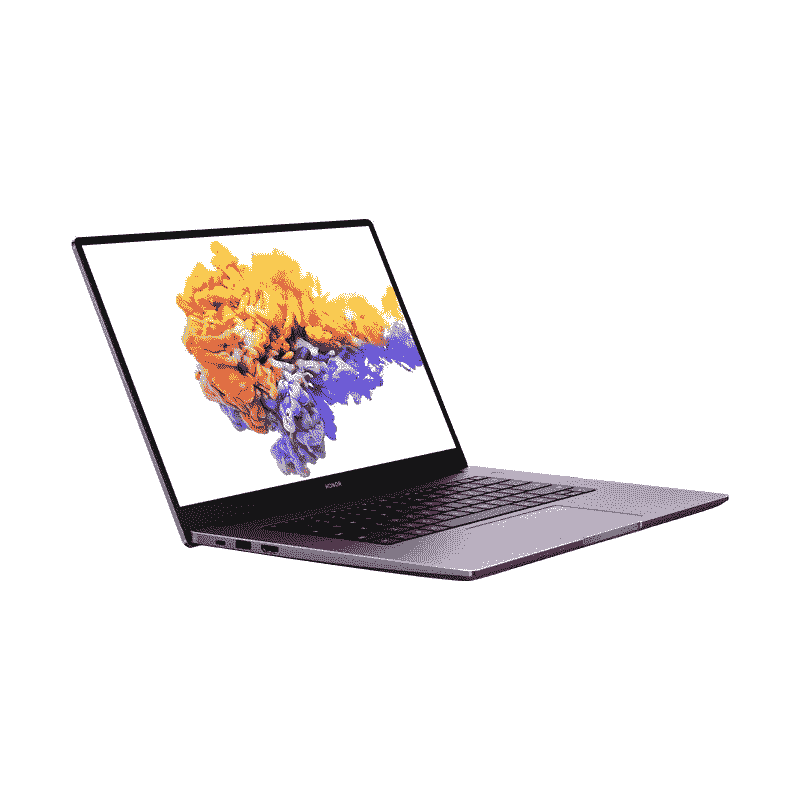

# 荣誉 MagicBook Pro 手握评论:神奇的锐龙动力笔记本电脑

> 原文：<https://www.xda-developers.com/honor-magicbook-pro-preview/>

他们的笔记本电脑并不出名。该公司非常关注智能手机和可穿戴设备，所以我对许多人不知道他们的笔记本电脑并不感到惊讶。

MagicBook Pro 的荣誉刚刚在 IFA 2020 上宣布，我每天都用我的电脑来完成我通常在 MacBook Pro 上完成的所有任务。MagicBook Pro 的荣誉是我书中的一个主要胜利，虽然我们将在未来进行更深入的评论，但我真的很享受目前为止与它在一起的时光。

*关于本次回顾:2020 年 8 月 31 日收到 Honor 颁发的 Honor MagicBook Pro。Honor 没有对本评论的内容提供任何意见。*

### 遵守 MagicBook Pro 规范

| 规格 | 荣誉 MagicBook Pro |
| --- | --- |
| **尺寸&重量** |  |
| **显示** |  |
| **处理器** |  |
| **GPU** |  |
| **闸板&存放** |  |
| **电池&充电** |  |
| **输入/输出** |  |
| **连通性** |  |
| **操作系统** |  |
| **其他特征** |  |

## 设计和制造质量

Honor MagicBook Pro 作为一款高端设备给我留下了深刻印象。它采用全铝底盘和喷砂外壳，只有一个大的“荣誉”雕刻在上面。笔记本电脑本身很薄，尤其是打开时，重量只有 1.7 千克。它又小又轻，我可以单手拿着它，不用担心会掉下来。

键盘是背光的，不过与我的 Macbook Pro 相比，它相当暗。它在弱光下工作得相当好，但在中等环境照明下就不太有用了。显然，这并不重要，因为背光键盘的目的是让你在黑暗中可以看到你在敲什么键。它肯定实现了那个目标。

说到那个键盘，虽然它很好用，但显然不是机械键盘。这是一个薄膜键盘，因此驱动力比我习惯的要高。它对于一般的使用来说是很好的，我已经在上面敲了很多次了，但是有时候它从我的机械键盘上发出来会有点刺耳。这是我用过的最好的薄膜键盘之一，这是最主要的。

我真的没有发现它对我的打字速度有多大影响，因为当我做一个 TypeRacer 测试时，我的速度在 110-120WPM 之间。一般来说，我在电脑的机械键盘上每分钟可以打 120 分钟，所以我对这个键盘很满意。我也发现我在使用它的时候打字相当准确。

触控板比以前的 Honor 键盘更大，但更大的触控板意味着我经常刷触控板，导致光标移动到其他地方。

虽然键盘有一个简洁的小功能；与华为 Matebook 系列非常相似，它内置了一个 1MP 摄像头，虽然不太好，但可以完成任务。对于那些注重隐私的人来说，把相机藏在键盘里也能让你安心。要部署相机，你点击它回到键盘上，它就会弹出来！这个网络摄像头的位置允许 16.1 英寸的显示屏适合通常为 15.6 英寸的外形。我毫不费力地将 Honor MagicBook Pro 放入 15.6 英寸笔记本电脑的袋子中。

在键盘的左侧和右侧，有一对双扬声器。质量不是最好的，但他们能完成工作，而且声音很大。我发现它们很适合看电影和 YouTube，尽管音乐的音频质量还有待提高。在右侧扬声器的顶部，有一个内置指纹传感器的电源按钮。

最后，笔记本电脑右侧有 2 个 USB-A 端口和一个耳机插孔，左侧有一个 USB-C 端口、一个 HDMI 端口和一个 USB-C 端口。

## 显示

Honor MagicBook Pro 的显示效果相当不错。这是一款 IPS 1080p 16.1 英寸显示器，峰值亮度为 300 尼特。色彩感觉非常准确，这可能要归功于这款笔记本电脑使用的 100% sRGB 色域。它的屏幕与机身的比例为 90%，这就是网络摄像头位于键盘内部的原因。就是这样，或者像小米对 Mi Notebook 14 所做的那样[完全移除](https://www.xda-developers.com/xiaomi-mi-notebook-14-horizon-edition-review/)。还有一个内置的眼睛舒适模式，可以过滤蓝光。您可以通过右键单击桌面并单击“显示管理器”来启用它。

## 表演

因此，性能部分将是实际审查中的一个更大的焦点，但现在，我已经进行了一些基本的阅读和基准。总体来说，我对锐龙 5 4600H 印象非常深刻，原因有很多。

首要的，这个东西就是*快*。锐龙 5 4600H 是一个入门级的 CPU，但你不会知道它只是从使用它。性能在几乎所有方面都非常出色，甚至没有那么热。我可以和一些朋友一起玩 Valorant 的游戏，它的运行速度一直在 110-140FPS 之间。它在 89 摄氏度的高温下达到峰值，但大部分时间都在 70 摄氏度左右。这种热量也远离键盘，我没有注意到游戏中有任何热量节流。《我的世界》以 16 块的远渲染距离达到相同的 FPS。

我还对 Western Digital nVME 驱动器进行了快速基准测试，结果给我留下了深刻的印象。

最后，我对最佳性能电池预设做了一个快速的 CineBench 测试，只是为了看看它有什么能力。我将做更多的基准测试，更深入一点，为全面审查做准备。2971 的分数非常令人印象深刻，几乎符合你对第二代锐龙**桌面**CPU 的预期。

不过现在，正如你所见，锐龙 4600H 并不懒散。Honor MagicBook Pro 是一款出色的产品，我非常期待看到它在更深入的测试中表现如何。

## 电池寿命

AMD 锐龙 5 4600H 拥有 45W 的相当低的 TDP，这意味着对于一般的使用来说，大多数时候，TDP 会低很多。再加上 Honor MagicBook Pro 中巨大的 56 Wh 电池，我在电池寿命方面没有任何问题。我一次充电可以持续使用 6-7 个小时。这主要是网页浏览和写作等非密集型工作，但仍然令人印象深刻。Honor 声称，一次充电你可以获得 11 小时的离线 1080p 视频播放，我倾向于同意这种情况。

当电池没电时，您可以使用随附的 65W USB-C 充电器在半小时内充电 50%。这款充电器还可以为您的华为和 Honor 设备快速充电。

## 尊重 MagicBook Pro 的第一印象

虽然这还不是我们的完整评论，但 Honor MagicBook Pro 是一个有趣的购买品。在法国和德国的 HiHonor 网站上，你可以以€899 英镑(约 1065 美元)的价格买到它，正在进行的促销活动意味着你可以将价格降至€799 英镑(约 946 美元)。在英国，它的价格为 849 英镑，你还可以选择获得免费的荣誉魔法手表或荣誉路由器 3。我目前很喜欢 Honor MagicBook Pro，如果你还在观望，几周后再来看看我的完整想法吧！

 <picture></picture> 

Honor Magicbook Pro

##### 荣誉 Magicbook Pro

Honor MagicBook Pro 是一款出色的锐龙动力笔记本电脑，它让我大吃一惊。仅仅过了几天，我已经爱上了这台笔记本电脑！