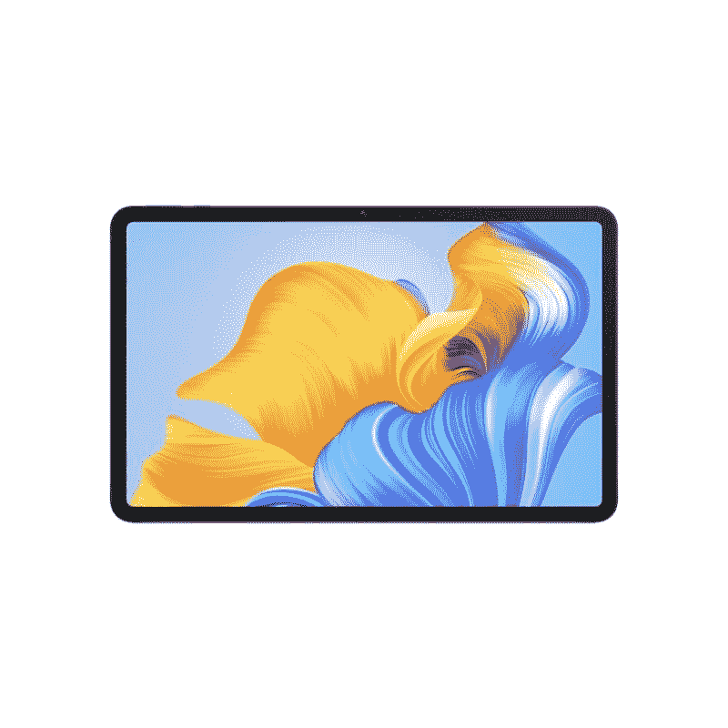

# 荣誉垫 8 审查:预算的大型高分辨率显示器

> 原文：<https://www.xda-developers.com/honor-pad-8-review/>

在平板电脑的世界里，没有太多的选择。在安卓领域，你几乎只会迷上三星，或者更有可能迷上 iPad。许多安卓用户会被 iPad 的诱惑所左右，因为苹果只是把平板电脑*做得更好*。然而，Honor Pad 8 是一款有趣的平板电脑，它的功能略有不同。它更多地面向媒体消费，但也有与之匹配的价格标签。

如果您需要一台平板电脑来观看视频、听音乐或控制智能家居生态系统，那么这款平板电脑可能适合您。它不是最强大的，所以不要指望生产力，但它有一个伟大的，大屏幕和一些神奇的扬声器。这是一款便宜的设备，可以用来观看你最喜欢的电影、电视节目，甚至是 YouTubers，而且它在这方面做得很好——比这个价位的大多数竞争对手都好得多。

我喜欢 Honor Pad 8 的原因是，它并没有试图成为一个媒体消费设备。它的设计非常棒，而且它不会试图在此基础上硬塞一大堆其他东西。如果你想要生产力，不要拿荣誉簿 8。如果你只是想用它来消费媒体，那么这几乎和任何价格稍高的平板电脑一样好。

 <picture></picture> 

Honor Pad 8

##### 荣誉垫 8

Honor Pad 8 是一款专注于媒体的平板电脑，在预算方面表现出色。想要在 Android 平板电脑上观看电视节目、电影或 YouTube？听着。

## 荣誉簿 8:定价和可用性

Honor Pad 8 在 Honor 的 HiHonor 网站和整个欧洲的亚马逊上都可以买到€329。如果你住在英国，它的价格是 269.99 英镑。

* * *

## 荣誉垫 8:规格

|  | 

荣誉垫 8

 |
| --- | --- |
| 

中央处理器

 | 骁龙 680 |
| 

尺寸和重量

 | 

*   240.2 毫米 x 159mm 毫米 x 6.9mm 毫米
*   520 克

 |
| 

显示

 | 

*   12 英寸 2K IPS 液晶屏
*   2000×1200
*   350 尼特
*   60Hz

 |
| 

照相机

 | 

*   5MP 主电源
*   500 万像素前置摄像头

 |
| 

记忆

 | 4GB 内存/64GB，128GB |
| 

电池

 | 7250 毫安时 |
| 

网络

 | LTE:增强型 4X4 MIMO，7CA，LAA，LTE Cat。20 克 |
| 

传感器

 | 加速度计、气压计、陀螺仪传感器、地磁传感器 |
| 

港口

 | USB-C |
| 

操作系统（Operating System）

 | 搭载 MagicUI 6.1 的 Android 12 |
| 

颜色；色彩；色调

 | 蓝色 |
| 

价格

 | 起价 269.99 英镑 |

***关于本次复习*** *:荣誉给我发了荣誉 Pad 8 进行复习。该公司对此次审查的内容没有任何意见。*

* * *

## 荣誉垫 8:展示和构建

荣誉垫 8 显示屏清晰明亮

显示屏是 Honor Pad 8 最重要的部分，也是该公司在这方面做得很好的部分。它清脆、清晰、明亮。坐下来看网飞或 YouTube 很棒，最近去柏林看 IFA 2022 也很棒，我可以在休息时间坐下来看些东西。

这不是技术上最令人印象深刻的显示器，它确实缺乏一些功能。例如，没有 HDR 支持，它是 IPS 面板而不是有机发光二极管。虽然关于有机发光二极管和 IPS 哪个更适合看电影或电视节目还有争议，但在大多数其他场景中，有机发光二极管肯定更好。如果您更喜欢 IPS 面板来消费媒体，那么这款设备不会有问题。

荣誉簿 8 在打包必需品方面做得非常好

作为一款基于媒体消费的廉价平板电脑，Honor Pad 8 在打包必需品方面做得非常出色。高分辨率的大显示屏是整个考验中最重要的部分，更宽的 5:3 宽高比可以轻松显示各种内容。较老的 4:3 内容(如《未来世界》的老剧集)和较新的 16:9 内容看起来都很棒。总的来说，对于这样一款廉价的设备来说，Honor Pad 8 在显示屏方面做得非常出色，很明显这是它的主要关注点。

然而，我注意到的一件事是，由于放在我的包里，设备的背面有一点擦伤。我没有对它做任何特别的损坏，但在两个星期的使用过程中，仍然有明显的划痕。这是一个更便宜的设备，背面是塑料制成的，所以我假设这是怎么回事。这真的没什么大不了的，但值得记住的是，如果你想让它看起来完美无瑕，你可能需要保护它一点。

* * *

## 声音的

Honor Pad 8 装有八个扬声器，每侧四个，能够发出响亮、干净的声音。它们非常适合消费内容，作为集成扬声器听起来也很不错。我对 Honor Pad 8 的音频的一个批评是没有耳机插孔，我觉得这有点令人失望，因为它是这样一个媒体消费怪兽。

我在各种音乐、不同的电视节目和 YouTube 视频中测试了这些扬声器，我发现它们一般不会太费力。根据歌曲的不同(由*的 *No Halo* 的第二副歌《女生联谊会的噪音*是一个主要的例子)，它听起来可能难以置信地模糊，但那是因为这些是平板电脑扬声器。在很大程度上，它可以播放音乐，对于其他类型的内容，这些扬声器已经足够了。

* * *

## 性能、电池寿命和软件

Honor Pad 8 的性能其实并不那么重要，因为这不是一台生产力机器，也没有以此进行营销。然而，重要的是要说明，这款设备拥有高通骁龙 680，这只是一个中档芯片组。这对于非常基本的游戏等来说是不错的，但你会注意到它在处理更密集的工作负载时会很吃力。说到媒体解码，这是最贴切的地方。我得了 3 分

当谈到电池寿命和软件时，我不再有我在这部设备上观看 YouTube 和网飞时保存的数据，原因与软件有关。当我从包里拿出平板电脑时，我注意到它不再开机了。打开它，我发现设备已经重置，我失去了一切。这包括我的电池截图、基准和我在整个审查过程中收集的其他数据。虽然我认为这与我的设备之前是预发布固件的事实有关，但我必须报告这一点，因为 Honor 没有向我传达任何官方声明。

尽管如此，在使用它时，电池寿命还是相当不错的。我可以用盒子里附带的 22.5 瓦充电器快速给它充电(无论如何，对于 7250 毫安的电池来说)，它可以很容易地持续我一整天。

不过，那个软件是 Magic UI 6.0。虽然华为手机目前看起来像 EMUI，但据 Honor 的欧盟主席称，这种情况将会改变。这意味着你在这里看到的可能会与 Magic UI 7.0 的下一个版本完全不同。它看起来不错，使用起来也不难，平板电脑的用户界面也很有意义。这里没什么特别的，但也不一定要有。

* * *

## 该不该买 Honor Pad 8？

这是一个非常好的价格，尽管它在其他部门的规格低于标准，但它为媒体消费提供了中端规格。很难对 Honor Pad 8 有任何特别的挑剔，因为它的价格更低，而且它比与之一起推出的 Honor 70 更经济实惠。我认为 Honor 70 的价格太高，但我认为 Honor Pad 8 几乎是旗舰杀手的领地，它的性能非常好。

需要明确的是，不是每个人都希望平板电脑不仅仅是用来看电影和电视节目的，你通常必须花很多钱才能得到一个真正好的屏幕。这是因为高分辨率显示器通常也需要更高的规格，尤其是在用户玩游戏或执行其他密集型任务时。如果你想要一台移动办公的平板电脑，那就跳过这款设备吧。你不会真的能够使用它，它也不会真的完成工作。

然而，如果你像许多人一样，只想晚上在沙发上或床上看些好东西，那么这款平板电脑不会错。性价比高，又好看，这才是它真正需要的。你可以[多花一点钱买一台 iPad](https://www.xda-developers.com/best-ipad/) ，但为什么要这么麻烦呢？例如，iPad (2021)是最接近的，但它仍然比€贵 70 英镑，屏幕更小，设计更过时。大屏幕在这里真的很重要。老实说，这是我很长一段时间以来用过的最好的经济型平板电脑之一。

 <picture></picture> 

Honor Pad 8

##### 荣誉垫 8

Honor Pad 8 是一款专注于媒体的平板电脑，在预算方面表现出色。想要在 Android 平板电脑上观看电视节目、电影或 YouTube？听着。