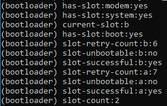
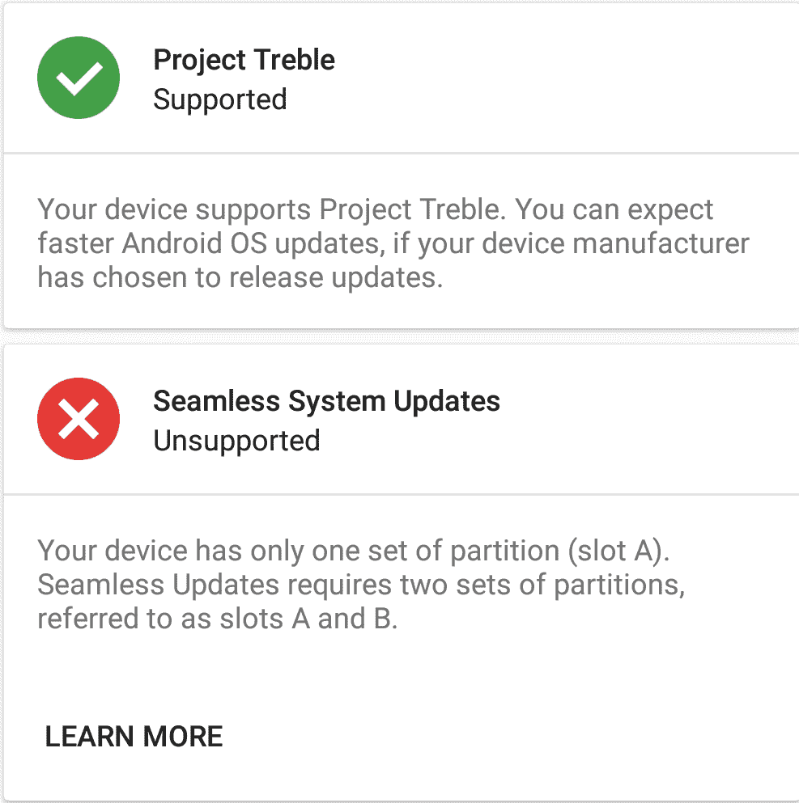

# A/B 分区和无缝更新如何影响 XDA 上的定制开发

> 原文：<https://www.xda-developers.com/how-a-b-partitions-and-seamless-updates-affect-custom-development-on-xda/>

当 Android 牛轧糖发布时，它让我们谈论[各种新功能](https://www.xda-developers.com/android-7-0-nougat-finally-released-coming-your-way/)。我们为初学者提供了一个最新的用户界面，以及期待已久的多窗口功能和 Vulkan 图形 API 支持。但是一个隐藏在引擎盖下的附加功能却让大多数用户感到困惑。Android Nougat 在支持 A/B 分区的设备上推出了“无缝更新”。绝大多数现有的 Android 设备(不包括新的谷歌 Pixel 和谷歌 Pixel XL)当时没有 A/B 分区，因此无法利用无缝更新。此功能的基本前提是设备有第二组系统、引导、供应商和其他重要分区，当您获得 OTA 更新时，更新在后台进行，同时第二组分区被修补，这允许您无缝地重新启动到更新的软件版本。如果更新失败，你将被踢回一个工作版本，这意味着公司将有更少的麻烦要处理，消费者得到更好的保护。

与 Project Treble 不同，任何新的 Android 设备都不需要支持无缝更新。因此，绝大多数新的 Android 设备不支持该功能。[到目前为止，我们一直在保存所有受支持设备的列表](https://www.xda-developers.com/list-android-devices-seamless-updates/)，很明显这个功能并没有得到广泛支持。这很遗憾，因为 A/B 分区给普通用户和高级用户都带来了很多好处。然而，该功能在发烧友社区中有一点坏名声，因为它被认为使 Android 开发和刷新自定义修改更加困难。实际情况并非如此，所以我们想揭开无缝更新的神秘面纱，并解释 A/B 分区如何影响 XDA 上的定制开发。

*非常感谢 XDA 资深成员 [npjohnson](https://forum.xda-developers.com/member.php?u=5848265) ，他是 LineageOS 的[贡献者和](https://wiki.lineageos.org/contributors.html)摩托罗拉 Moto Z2 Force 的[维护者，他帮助我们核实了这篇文章。](https://www.xda-developers.com/lineageos-15-1-supports-a-b-devices-moto-z2-force/)*

* * *

## Android 设备上的分区

分区只是手机内部存储空间中保存数据的一个独立部分。每个分区上保存什么样的数据取决于硬件、操作系统和许多其他因素。引导装载程序会有一个，系统(Android OS)会有一个，用户数据会有一个...诸如此类。当你看到人们谈论“/系统”和“/缓存”时，他们指的是这些分区的名字。例如，OnePlus 6 有 **72 个分区**。这听起来很多，但 OnePlus 6 是支持无缝更新的设备之一，这意味着许多分区只是彼此的副本。

*OnePlus 6 上分区的部分输出。出于演示目的，一些 A/B 分区带有下划线。*

一个设备上有很多分区，作为用户你永远不用担心。在刷新定制的 rom、内核、恢复或修改(如 Magisk 或 Xposed)时，这些分区中的许多都不会被修改。这些分区中有很多要么没有被我们使用，要么太危险了，除非你知道你在做什么(想到了华为/Honor 设备上的 XLOADER 和 OEMINFO。)对于绝大多数 Android 用户来说，我们最常处理的分区是系统、引导、恢复、用户数据以及最近的供应商和 vbmeta。下面是每个分区用途的简要说明:

*   system -保存 Android 操作系统、系统库、系统应用程序和其他系统媒体，如 bootanimations、股票壁纸、铃声等。
*   引导-保存内核、内存磁盘和 A/B 设备上的恢复
*   recovery—保存恢复，其中 TWRP 最常在仅限 A 的设备上刷新(A/B 设备没有专用的恢复分区)
*   userdata -保存您的所有应用程序、系统和内部存储数据
*   供应商持有特定于平台和设备的 Hal，这是 Android 操作系统与底层硬件通信所必需的文件
*   VB meta-Android Verified Boot 2.0 的分区，用于验证引导过程的完整性

设备 OEM 可以更改他们的分区方案，以使用他们想要的任何布局。例如，华为将引导分区分为 ramdisk_recovery 和 kernel。还有许多额外的分区可能包含其他系统应用程序，如 cust、product 和 oem，虽然这些修改是安全的，但如果您想让自己更容易返回库存，通常不建议这样做。那么 A/B 分区在哪里发挥作用呢？

* * *

## A/B 分区方案

### 无缝更新设备上的更新方式

下面这张非常简单的图片展示了如何在支持 A/B 分区的设备上处理更新。所示的分区是系统分区，尽管诸如引导和供应商之类的其他分区也可以用来自 OEM 的任何给定 OTA 更新来更新。这种更新过程不仅发生在主要的 Android 版本更新中，也发生在安全补丁更新中。

1.  我们从两个系统分区开始，system_a 和 system_b，都在同一个版本的 Android 上。
2.  假设 system_a 是活动的，OTA 更新将在后台修补 system_b，即不活动的分区。
3.  一旦用户重新启动，system_a 将设置为非活动状态，system_b 将变为活动状态。
4.  当前不活动的分区 system_a 将在下一次 OTA 更新推出时更新。

这种更新过程有什么好处？

1.  如果更新失败，设备将回滚到另一个插槽上的工作版本。
2.  即使更新被破坏，您的数据也会保持完好无损，因为只有一个分区(用户数据)存放您的数据。
3.  更新流:如果您的数据分区已满，那么可以下载更新并将其流至非活动插槽。这是一个非常简洁的功能，意味着你不必浪费任何临时存储空间来更新。这就是为什么 A/B 设备上没有缓存分区，因为不再需要它们。

### A/B 分区方案对设备的存储有什么影响？

无缝更新导致大量重复分区的事实是否意味着您正在损失大量存储空间？**完全没有**。谷歌表示，由于移除了/cache 和/recovery 分区，支持无缝更新的设备应该只下降了大约几百兆字节。删除这两个分区可以平衡添加第二组分区的成本。根据谷歌的说法，Pixel 的 A/B 系统图像是纯 A 系统图像的一半大小。大多数额外的存储使用实际上来自于第二个供应商分区的添加。这是有意义的，因为供应商分区包含了 OEM 使用的所有专有二进制文件(Project Treble 的一部分)，所以预计会占用相当多的空间。虽然谷歌不建议在 4GB 存储的设备上进行 A/B 分区(因为它占总可用存储的近 10%)，但他们建议在 8GB 或更高的设备上进行 A/B 分区。

以下是谷歌 Pixel 在有和没有 A/B 分区的情况下使用的存储空间的细目分类。

| 

分区大小

 | 

A/B

 | 

仅限 a 级

 |
| --- | --- | --- |
| 引导装载程序 | 50MB*2 | 50MB |
| 靴子 | 32MB*2 | 32MB |
| 恢复 |  | 32MB |
| 隐藏物 |  | 100MB |
| 收音机 | 70MB*2 | 70MB |
| 小贩 | 300MB*2 | 300MB |
| 系统 | 2048MB*2 | 4096MB |
| **总计** | **5000MB** | **4680MB** |

### 恢复分区怎么了？

Android 设备上的底层 Linux 内核让 Android 能够在智能手机上正确识别和使用硬件。在纯 Android 设备上，通常有两个版本的内核:一个在恢复分区中，另一个在引导分区中。在支持无缝更新的 A/B 设备上，恢复现在与内核一起在引导映像中进行。恢复的主要功能是安装更新，但由于这是由系统本身处理的( [update_engine](https://android.googlesource.com/platform/system/update_engine/) )，当 Android 启动时，不再需要专用的恢复分区。

要在 A/B 设备上安装自定义恢复，我们需要修改引导分区，并用我们自己的恢复替换库存恢复。这就是为什么要安装 TWRP，你需要先使用一个快速启动命令来启动一个定制的启动映像，然后*再*刷新 TWRP 安装脚本，因为快速启动不能修补分区——只能刷新整个分区。从技术上来说，你可以用 TWRP 预先修补你现有的启动映像，然后通过快速启动来刷新它，但是这太麻烦了，不值得。TWRP 安装程序脚本对 boot_a 和 boot_b 分区进行修补，以安装 TWRP。

有趣的事实:处理无缝更新的 Android update_engine 基本上是直接从 Chrome OS 上抄袭来的。[直到最近](https://android-review.googlesource.com/c/platform/system/update_engine/+/635980)包含“Chrome OS”的字符串才从 update_engine 的日志中删除，以避免碰巧查看 logcat 的人感到困惑。

### 我的 Android 智能手机支持无缝更新的 A/B 分区吗？

虽然我们[保留了所有支持它的设备的列表](https://www.xda-developers.com/list-android-devices-seamless-updates/)，但是[你也可以很容易地检查你自己](https://www.xda-developers.com/how-to-check-android-device-supports-seamless-updates/)。

* * *

## 无缝更新如何影响定制开发？

### 用户对 A/B 分区的看法

无缝更新被许多用户视为定制软件开发的障碍，但实际上对开发人员来说却是一个福音。A/B 设备被认为具有较差开发支持的原因归结于第一个 A/B 设备的价格。毕竟，谷歌 Pixel 设备是首批支持无缝更新的设备，而且与过去的 Nexus 智能手机相比，它们相对昂贵。此外，由于谷歌对 Android 操作系统进行了大量改进，使得定制 rom 和修改在谷歌设备上不那么受欢迎，谷歌 Pixel 智能手机在我们的论坛上的表现远不如 Nexus 智能手机。外部因素的结合导致了谷歌 Pixel 智能手机定制开发的减少，尽管大多数用户选择责怪 A/B 分区支持。在我们的论坛上比较谷歌 Pixel 等设备和小米 Mi A1 [等设备上定制开发的可用性。](https://forum.xda-developers.com/mi-a1/development)

此外，对 A/B 分区如何改变用户安装定制 rom、内核、恢复和修改的方式缺乏了解，导致 A/B 分区支持不受欢迎。由于恢复现在位于引导映像中，以错误的顺序(如 Magisk 或 Xposed)刷新修改可能会导致冲突并导致引导循环。你闪存这些模块的顺序可能很重要，尽管在定制 rom 的情况下，你不需要担心你闪存到哪个插槽。与普遍的看法相反，大多数定制 rom 的安装脚本并不同时闪速写入两个插槽。您基本上不需要担心这一点，因为您不需要手动交换插槽。

### 开发人员如何看待 A/B 分区

当构建一个 ROM 时，开发人员可以利用这两个分区来测试不同的构建。如果一个不工作，他们可以恢复到工作分区并重建他们的 ROM。开发人员还可以通过简单地安装更新、切换活动分区并比较两者来测试回归，而不必擦除数据。以下是 LineageOS 团队对 A/B 分区支持的看法:

> #### “Android 社区中的许多人抨击 A/B‘难以支持’和‘对开发人员不友好’，而事实上，正确实施后，它更容易支持和对开发人员友好。”——jrizzo Li，[linegeos Changelog 19](https://lineageos.org/Changelog-19/)

对开发人员来说，A/B 支持最初的困难来自于修改他们现有的工具来支持这些设备。Magisk 的开发者 topjohnwu 在谷歌 Pixel 发布一年后增加了对它的官方支持——不是因为它很难，而是因为他花了一年时间才真正获得可以使用的设备。在主要开发者 Dees_Troy 尝试之后，TWRP 对 A/B 设备的支持[来得很快](https://www.xda-developers.com/twrp-v3-1-0-is-now-rolling-out-with-support-for-adb-backup-ab-ota-zips-and-more/)。在志愿者找到时间修复他们的 addon.d 脚本后，LineageOS 15.1 [现在支持](https://www.xda-developers.com/lineageos-15-1-supports-a-b-devices-moto-z2-force/) A/B 设备。

### 如何更新具有自定义恢复、内核或其他模块的 A/B 设备

#### 定制 rom

在一个带有定制 ROM 的设备上刷新更新意味着你必须小心你也在刷新哪个插槽，对吗？不完全是。TWRP 实际上会为你处理很多，它默认为非活动插槽，用于刷新自定义 ROM。如果您的活动插槽是 A，并且您刷新了自定义 ROM，则实际上是刷新到插槽 b。当您重新启动时，活动插槽现在是 b。开发人员可以修改安装脚本并刷新到两个插槽，以使最终用户更加方便，尽管大多数自定义 ROM 安装脚本目前仅刷新到单个插槽。最后，定制 ROM 可以在其 ROM 中实现 A/B 更新程序，这样用户甚至不需要手动更新——最新的 LineageOS 15.1 包括一个沿袭更新程序工具，XDA 高级成员 [USA-RedDragon](https://forum.xda-developers.com/member.php?u=5184450) 制作了一个[通用 A/B 更新程序](https://github.com/mikecriggs/jacob_derped_updater)，其他开发人员可以使用。

#### 股票光盘

但是，如果你的设备运行的是经过各种修改的普通 ROM，而你想在不丢失所有这些修改的情况下安装一个更新，这难道不是一个问题吗？如果您不知道安装更新的正确步骤，可能会出现这种情况。例如，在 OnePlus 6 上，您不能在修改后的设备上刷新增量 OTA，因为增量 OTA 会尝试修补修改后的启动映像。因此，您可能会以引导循环结束，这就是为什么您必须刷新完整的 ROM 更新以完全覆盖您修改的引导映像。以下是在 OnePlus 6 上安装 OxygenOS 更新时需要采取的一般步骤，同时仍保留 TWRP、Magisk 和可选的自定义内核。

1.  下载了最新的**完整版 ROM** zip
2.  恢复时刷新完整的 ROM 压缩文件
3.  (可选)Flash 自定义内核
4.  Flash TWRP 安装程序
5.  直接重启以恢复
6.  Flash Magisk

在谷歌 Pixel 设备上，你可以[刷新出厂图像而不擦除数据](https://www.xda-developers.com/flash-monthly-security-update-google-pixel/)，然后启动 TWRP，通过安装脚本安装 TWRP，然后安装 Magisk。

许多 A/B 设备的更新文件与纯 A 设备相比略有不同。它们不再只是包含大量图像的 zip 文件(不包括谷歌和 Razer 的工厂图像)，而是以 payload.bin 文件的形式存在。您可以提取这个文件，并手动刷新每个部分，但这需要一个特殊的工具来完成。如果你有兴趣了解如何在 OnePlus 6、小米 Mi A1 和许多其他 A/B 设备上这样做，请继续阅读。

#### 设置提取 payload.bin

1.  确保你已经安装了 Python 3.6 [和](https://www.python.org/downloads/release/python-360/)。
2.  在这里下载 payload_dumper.py 和 update_metadata_pb2.py [。](https://gist.github.com/ius/42bd02a5df2226633a342ab7a9c60f15)
3.  解压缩 OTA 压缩文件，并将 payload.bin 放在与这些文件相同的文件夹中。
4.  根据您的操作系统，打开 PowerShell、命令提示符或终端。
5.  输入以下命令:`python -m pip install protobuf`
6.  完成后，输入这个命令:`python payload_dumper.py payload.bin`
7.  这将开始将 payload.bin 文件中的图像提取到您所在的当前文件夹中。

如果你愿意，现在可以通过快速启动分别刷新这些图像。下一节将向您展示如何做到这一点。

### 在支持无缝更新的设备上使用快速启动来刷新映像

有许多命令是 A/B 分区系统设备专用的。您可以将活动插槽和闪存更改为特定插槽。如果你有一个 Project Treble- [兼容设备](https://www.xda-developers.com/list-android-devices-project-treble-support/)并想学习如何[刷新通用系统镜像](https://www.xda-developers.com/flash-generic-system-image-project-treble-device/)，你应该熟悉这些命令。看看下面的表格。

| 

快速启动命令

 | 

命令

 |
| --- | --- |
| 获取当前活动插槽 | fast boot getvar all &#124; grep“current-slot”如果你在 Windows PC 上，“grep”命令就不起作用了。 |
| 将其他插槽设置为活动 | 快速启动 set_active other |
| 将指定的插槽设置为活动 | fast boot set _ active $ or fast boot-set-active = _ $ slot 其中$是 a 或 b |
| 将映像闪存到当前插槽中的指定分区 | 快速启动闪存分区 partition.img |
| 将映像闪存到指定插槽中的指定分区 | fast boot flash partition _ a partition . imgfastboot flash partition _ b partition . img |

(注意:在 A/B 设备上，您可以在特定插槽中指定要闪存到的分区，也可以省略插槽后缀，它将闪存到当前活动插槽。例如，您可以将 flash 命令中的“分区”替换为“系统”、“系统 a”或“系统 b”。)

 <picture></picture> 

On Windows PCs, you can't use grep, so just remove that part and look for "current-slot".

* * *

## 关于项目 Treble 和无缝更新的一句话

一个常见的误解是，项目三重支持和 A/B 分区支持是相互关联的，但事实并非如此。拥有一个并不意味着另一个。摩托罗拉 Moto Z2 Force 使用 A/B 分区方案，但不支持高音。另一方面，Honor 9 Lite 支持 Project Treble，但却是一款仅限 A 的设备。

 <picture></picture> 

The Honor 9 Lite supports Project Treble but does not support Seamless Updates

* * *

## 常见问题/摘要

*   **A/B 分区有什么好处？**
    *   A/B 分区允许您在使用 Android 智能手机时更新它，当您准备好启动新版本时，只需重新启动即可。它还可以防止砖块——如果更新出错，您将返回到工作安装。
*   **有 A/B 分区会阻碍开发吗？**
    *   虽然开发人员确实需要一些时间来适应，但答案几乎是否定的。事实上，它可以帮助开发人员，因为他们可以用旧版本和新测试版本双重引导他们的自定义 ROM，以检查回归。
*   **A/B 分区如何影响自定义内核、Magisk、或 Xposed 等 mod？**
    *   你必须小心安装它们，但目前没有问题。Magisk 官方支持设备的无缝更新，只要你以正确的顺序刷新，就不会有问题。确保在刷新你的其他模块之前刷新自定义内核，这样你就可以开始了。
*   我可以在每个分区和双引导上闪存两个不同的 rom 吗？
    *   理论上，是的。但是由于共享数据分区会出现问题，所以不推荐这样做。
*   **拥有 A/B 分区方案是否意味着我减少了存储空间？**
    *   没有。谷歌表示，支持无缝更新的设备只需要牺牲几百兆的存储空间来支持它。收益大于成本。
*   **我的设备支持 A/B 分区，这是否意味着我可以使用 Project Treble 通用系统映像？**
    *   不一定。项目高音和 A/B 支持是不相关的。摩托罗拉 Moto Z2 Force 不支持 Project Treble，但它支持 A/B 分区方案。
*   **我的设备支持 Project Treble，这是否意味着我有 A/B 分区方案？**
    *   情况并非总是如此。Honor 9 Lite 是一个很好的例子，因为它支持高音项目，但没有 A/B 分区方案。
*   **为什么我需要先用 fastboot 启动 TWRP，然后再刷新？**
    *   这是因为快速启动的工作方式以及恢复分区不再存在的事实。恢复放在引导分区内，所以我们必须修改 boot_a 和 boot_b。您不能在快速引导中修补分区，只能覆盖它。理论上，你可以制作一个预打补丁的引导镜像，然后刷新它。
*   **A/B 分区有危险吗？回滚保护如何影响事物？**
    *   谷歌已经尽了最大努力来解决这个问题，但在摩托罗拉 Moto Z2 Force 的情况下，已知有设备在升级到 Android Oreo 后重新激活旧插槽的情况。这意味着回滚保护开始生效，设备所有者只能通过 EDL 恢复来拯救他们的智能手机。谷歌表示，回滚保护只在第一次启动后生效，所以在升级后，你不能再降级之前，插槽需要完全发挥作用。