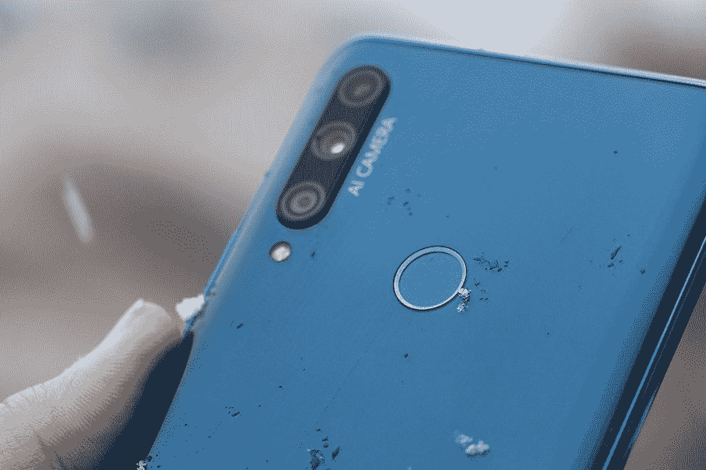
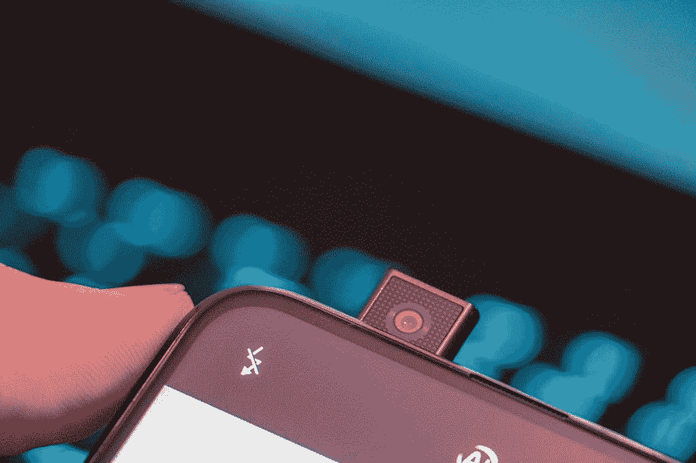
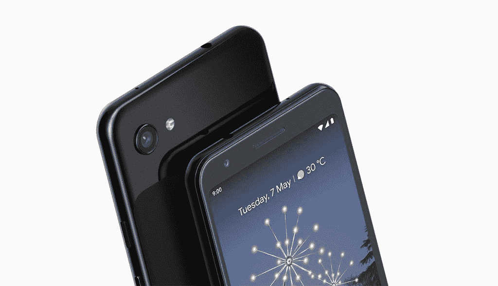
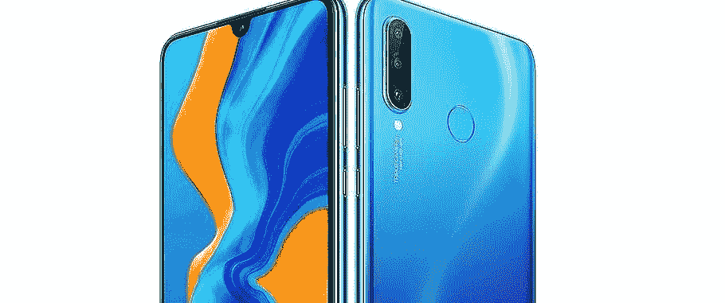

# Honor 9X 与其他廉价手机相比如何？

> 原文：<https://www.xda-developers.com/how-does-the-honor-9x-compare-to-other-budget-phones/>

Honor 9X 是 2019 年我们最喜欢的廉价手机之一。虽然 Honor 9X 在其设备中实现了许多出色的功能，但其他公司也推出了一些真正具有竞争力的选项。看看 Honor 9X 与竞争对手相比如何。

* * *

Honor 9X 是 X 系列中第一款配备弹出式摄像头的产品。这款弹出式相机采用全电动设计。当自拍模式被激活时，相机会迅速从手机顶部升起。为了真正增强手机的全屏无缺口效果，Honor 在手机中安装了 6.59 英寸的更大显示屏。最终结果是一个大的全屏手机，带有一个非常方便的电动弹出式摄像头。

对于 9X，Honor 在这款手机的摄影方面投入了大量精力。 装置 装有一个 48MP 的三摄像头，包括一个 8MP 超宽镜头和一个 2MP 深度传感器。f/1.8 光圈搭配半英寸传感器，拍出超清照片。AIS 超级夜间模式承诺改善您的弱光照片。观察我们最初的一些样片[在这里](https://www.xda-developers.com/honor-9x-mini-review-another-budget-friendly-winner/)。

 <picture></picture> 

Honor 9X

 <picture></picture> 

Honor 9X Selfie Camera

除了弹出式摄像头，Honor 9X 还拥有一些€300 手机的出色规格和功能。Honor 9X 采用麒麟 710F 和 6GB 内存。麒麟 810 还有其他型号，但出于这样或那样的原因，这并不包括在每个型号中。这使得该处理器相对于麒麟 710 之前的 Honor 8X 是一个非常温和的升级。话虽如此，但这款手机的性能并没有太多值得批评的地方。

| 

荣誉 9X

 | 

规范

 |
| --- | --- |
| 芯片集 | 海思麒麟 710F |
| RAM/存储 | 4/6GB 64/128GB |
| 显示 | 6.59 英寸 1080x2340p 像素 |
| 自拍相机 | 电动弹出式 16 MP |
| 主摄像机 | 48+8+2MP |
| 国家政治保卫局。参见 OGPU | 马里-G51 MP4 |
| 电池 | 4000 毫安时 |
| 软件 | 安卓 9.0 EMUI 9.1 |

总的来说，Honor 9X 是目前为止 X 系列中最好的。虽然摄像头通常是廉价手机的主要功能，但 9X 上的 48MP 摄像头实际上是这款设备的最佳方面之一。Honor 9X 对于任何希望充分利用智能手机相机的人来说都是一笔不错的交易。

这是 2019 年€300 下最好的手机，但今年还有很多其他很棒的预算手机。看看下面其他一些好的选择。

| 

特征

 | 

华为 P30 Lite

 | 

谷歌 Pixel 3A XL

 | 

摩托罗拉行动一

 | 

小米 Mi 9 Lite

 | 

荣誉 9X

 |
| --- | --- | --- | --- | --- | --- |
| 全视图显示 | 不 | 不 | 不 | 不 | 是 |
| 弹出式摄像机 | 不 | 不 | 不 | 不 | 是 |
| 耳机插孔 | 是 | 是 | 是 | 是 | 是 |
| 芯片集 | 麒麟 710 | 骁龙 670 | Exynos 9609 | 骁龙 710 | Kirim 710F |
| 随机存取存储 | 4/6/8GB | 4GB | 4GB | 6GB | 4/6GB |
| 显示分辨率 | 1080 x 2312 像素 | 1080 x 2160 像素 | 1080 x 2520 像素 | 1080 x 2340 像素 | 1080 x 2340 像素 |
| 屏幕大小 | 6.15 英寸 | 6.0 英寸 | 6.3 英寸 | 6.39 英寸 | 6.59 英寸 |
| 主摄像机 | 24/48+8+2MP | 1220 万像素 | 12+16+5 百万像素 | 48+8+2MP | 48+8+2MP |
| 自拍相机 | 24/32MP | 800 万像素 | 12MP | 32MP | 16MP |
| 蓄电池容量 | 3340 毫安时 | 3700 毫安时 | 3500 毫安时 | 4030 毫安时 | 4000 毫安时 |

* * *

[摩托罗拉 Moto One Action](https://shop-links.co/link/?exclusive=1&publisher_slug=xda&article_name=How+Does+the+Honor+9X+Compare+to+Other+Budget+Phones%3F&article_url=https%3A%2F%2Fwww.xda-developers.com%2Fhow-does-the-honor-9x-compare-to-other-budget-phones%2F&u1=UUxdaUeUpU26809&url=https%3A%2F%2Fwww.bestbuy.com%2Fsite%2Fmotorola-moto-one-action-with-128gb-memory-cell-phone-unlocked-white%2F6375617.p%3FskuId%3D6375617%26cmp%3DRMX%26irclickid%3DXmvws90-rxyOUVR0UfQwQyYMUkn3UjWf830mTo0%26irgwc%3D1%26ref%3D198%26loc%3DXmvws90-rxyOUVR0UfQwQyYMUkn3UjWf830mTo0%26acampID%3D633495%26mpid%3D221109)249.99 美元

摩托罗拉摩托 One Action

Moto One Action 的价格非常合理，但由于独特的 21:9 显示屏而脱颖而出。很少有手机有这个长宽比，大部分价格都高很多。这使得 Moto One Action 与众不同，对于那些寻求这种显示屏的人来说，它是一款入门级手机。除此之外，你还会有一个三摄像头设置来拍摄精彩的照片。

| 

摩托罗拉摩托 One Action

 | 

规范

 |
| --- | --- |
| 芯片集 | Exynos 9609 |
| RAM/存储 | 4GB 128GB |
| 显示 | 6.3 英寸 1080x2520p 像素 |
| 自拍相机 | 12MP |
| 主摄像机 | 12+16+5 百万像素 |
| 国家政治保卫局。参见 OGPU | 马里-G72 MP3 |
| 电池 | 3500 毫安时 |
| 软件 | 安卓 9.0 |

* * *

谷歌 PIXEL 3A XL **$348.99**

 <picture></picture> 

GOOGLE PIXEL 3A XL

Pixel 3A XL 是从 Pixel 手机获得纯谷歌体验的最佳选择，无需支付大量资金。对于单传感器设计来说，相机质量还不错，你可以期待在未来的 Android 更新中成为第一个。

| 

谷歌 PIXEL 3A XL

 | 

规范

 |
| --- | --- |
| 芯片集 | 高通 SDM670 骁龙 670 |
| 随机存取存储 | 4GB 64GB |
| 显示 | 6.0 英寸 1080x2160p 像素 |
| 自拍相机 | 800 万像素 |
| 主摄像机 | 1220 万像素 |
| 国家政治保卫局。参见 OGPU | 肾上腺素 615 |
| 电池 | 3700 毫安时 |
| 软件 | 安卓 9.0 |

* * *

华为 P30 Lite **$279.00**

 <picture></picture> 

Huawei P30 Lite

对于寻求三摄像头设置的人来说，华为 P30 Lite 是一个不错的选择。不要期望这款相机的质量最好，但手机整体的性能非常好。

| 

华为 P30 Lite

 | 

规范

 |
| --- | --- |
| 芯片集 | 海思麒麟 710 |
| 随机存取存储 | 4/8GB 128GB |
| 显示 | 6.15 英寸 1080x2312p 像素 |
| 自拍相机 | 24/32MP |
| 主摄像机 | 24/48+8+2MP |
| 国家政治保卫局。参见 OGPU | 马里-G51 MP4 |
| 电池 | 3340 毫安时 |
| 软件 | 安卓 9.0 |

* * *

小米 Mi 9 Lite **$279.99**

小米 Mi 9 Lite

小米 Mi 9 Lite 是预算类别中最好的手机之一。以 279 美元的低价，你将获得一个 4800 万像素的三摄像头，3200 万像素的自拍摄像头，一个巨大的 4030 毫安时电池和一个 6.38 英寸的大显示屏。就价格而言，这是一款非常棒的手机，小米最近一直在用他们的软件体验杀死它。

| 

小米 Mi 9 Lite

 | 

规范

 |
| --- | --- |
| 芯片集 | 高通 SDM710 骁龙 710 |
| 随机存取存储 | 6GB 64/128GB |
| 显示 | 6.39 英寸 1080x2340p 像素 |
| 自拍相机 | 32MP |
| 主摄像机 | 48+8+2MP |
| 国家政治保卫局。参见 OGPU | 肾上腺素 616 |
| 电池 | 4030 毫安时 |
| 软件 | 安卓 9.0 |

###### *我们感谢 Honor 赞助了这篇文章。我们的赞助商帮助我们支付与运行 XDA 相关的许多费用，包括服务器成本、全职开发人员、新闻撰稿人等等。虽然您可能会在门户内容旁边看到赞助内容(这些内容将始终被标记为赞助内容),但门户团队对这些帖子不承担任何责任。赞助内容、广告和 XDA 仓库完全由一个独立的团队管理。XDA 绝不会通过接受金钱来赞扬一家公司，或以任何方式改变我们的观点或看法，从而损害其新闻诚信。我们的意见不能被收买。*