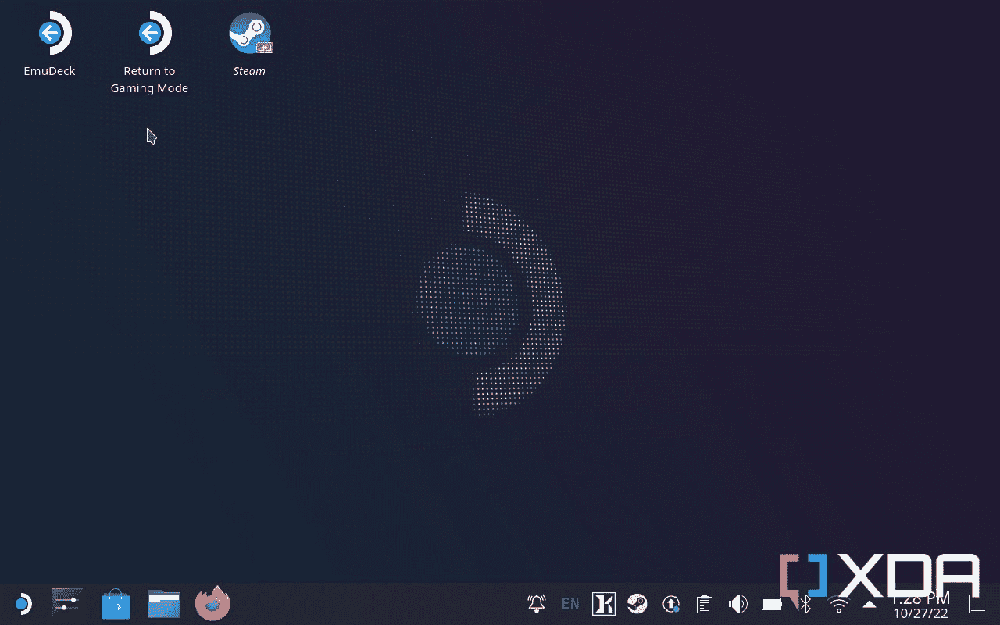

# 如何在 Steam Deck 上安装 Spotify

> 原文：<https://www.xda-developers.com/how-install-spotify-steam-deck/>

如果你有一台 Steam Deck [或者想买一台](https://www.xda-developers.com/buy-steam-deck-get-two-weeks/)，那么你可能很熟悉它不像是一台手持游戏机，而更像是一台小型电脑。它运行基于 Arch Linux 的 SteamOS，Valve 没有锁定用户的访问权限，你有充分的特权在软件方面做你想做的任何事情，如果你想，没有什么可以阻止你甚至[在它上面安装 Windows](https://www.xda-developers.com/steam-deck-windows/)。然而，也许你想在玩游戏的时候听音乐。谢天谢地，在 Steam Deck 上安装 Spotify 很容易。

请注意，如果您使用其他服务登录 Spotify(例如，脸书或谷歌)，您需要在桌面上登录您的 Spotify 帐户，并更改您帐户的密码。然后，您可以使用您的登录凭据通过 Spotify 登录，而不是使用社交媒体。这不会中断社交媒体登录；它只允许你在 Steam Deck 上使用正常的 Spotify 流登录。

##### 蒸汽甲板

Valve 的第一款便携式游戏 PC Steam Deck 是 2022 年最热门的设备之一，拥有庞大的游戏库。

## 蒸汽甲板上的 Spotify:你需要什么

**互联网连接:**要想使用 Spotify，你首先需要一个互联网连接。然而，要下载并安装它，你也需要一个。

一个 Spotify 帐户:本教程将与免费的 Spotify 一起使用，尽管你会有广告。

**(可选)键盘:**这并不是绝对必要的，但如果你有一个有线或蓝牙键盘来配合 Steam deck 使用，以便在需要时登录和键入命令，那就方便多了。有一个屏幕键盘，你可以通过按住 Steam 键和 X 键来访问，但如果准备好一个键盘就更容易了。

## 步骤 1:切换到桌面模式

在 Steam Deck 上安装 Spotify 的第一件事是切换到桌面模式。你可以通过两种方法做到这一点:

1.  按下蒸汽按钮并向下滚动到电源，然后选择**切换到桌面模式。**
2.  按住电源按钮，选择**切换到桌面模式。**

一旦你进入桌面模式，它应该看起来像下面的图片。

### 

## 第二步:启动 Discover 并搜索 Spotify

“发现”在左下角，看起来像是有一个购物袋作为图标。它应该已经在你的任务栏里了。如果不是，请执行以下操作:

1.  前往左下方的应用程序菜单
2.  转到标签为**系统**的文件夹，选择**发现**。
3.  在左上角搜索 **Spotify** ，或者转到多媒体选项卡并向下滚动。

## 第三步:登录 Spotify

现在，您可以登录 Spotify 并进行设置。如前所述，如果你的 Spotify 账户与一个社交媒体账户相关联，那么你需要更改账户设置中的密码。测试以确保音乐播放正常，然后继续。

## 步骤 4:将 Spotify 添加到您的 Steam 库中

要在正常游戏模式下使用 Spotify，您需要将其添加到您的 Steam 库中。Steam Deck 允许您在游戏模式下同时运行多个应用程序，这就是我们在玩游戏时听音乐的方式。请执行以下操作:

1.  在桌面模式下打开 **Steam 应用**
2.  选择顶部的游戏，然后选择**将非 Steam 游戏添加到我的库中。**
3.  向下滚动并选择 **Spotify** 。
4.  您现在可以选择桌面上的**返回游戏模式**。

## 第五步:在游戏模式下启动 Spotify

为了确保一切正常，请访问游戏模式中的 Steam 库。，转到**非蒸汽标签**并选择 **Spotify** 。如果成功的话，它应该会作为一个全屏应用程序启动，你可以用它来听音乐。然后，您可以返回您的游戏库，选择另一个游戏来玩，让 Spotify 继续运行。

* * *

## Steam Deck 上的 Spotify 非常好用

虽然将 Spotify 作为一款真正的游戏放在 Steam Deck 上看起来有些奇怪，但这是你在玩游戏时听音乐的最佳方式。您可以使用蒸汽按钮在它和您正在播放的任何内容之间快速切换，它运行起来没有任何问题。Steam Deck 在支持蓝牙的同时也有一个耳机插孔，所以一定要看看一些你可以挑选出来试用的[最佳有线耳机](https://www.xda-developers.com/best-wired-earphones-headphones-dac-lossless-audio/)和[最佳无线耳机](https://www.xda-developers.com/best-wireless-earbuds/)。