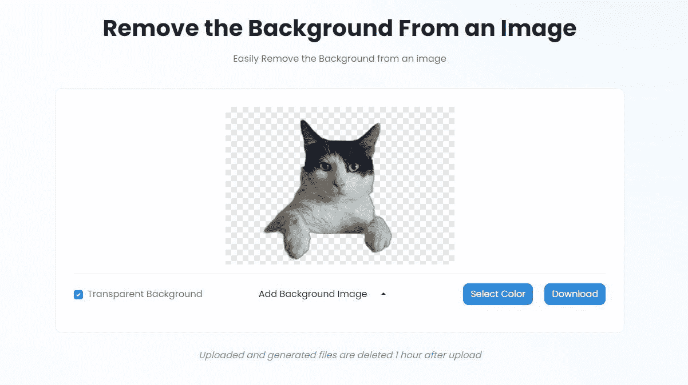

# 如何用 TinyWow 移除图像背景

> 原文：<https://www.xda-developers.com/how-remove-image-backgrounds-with-tinywow/>

说到照片编辑，每个人都讨厌的一项任务是从图像中移除背景。这很烦人，没有合适的工具很难做到，当我们想要的只是一个简单的[背景去除器](https://tinywow.com/image/remove-bg)时，我们大多数人都无法证明支付像 Photoshop 这样的专业工具是合理的。谢天谢地，有像 TinyWow 这样的工具可以帮我们做到这一点。

## 为什么要用 TinyWow 来移除你的照片背景

与许多类似的在线工具不同，使用 TinyWow 实际上是免费的，所以试用它没有任何风险。由于 TinyWow 是一个在线工具，你甚至不需要在你的设备上安装这个软件。下载和安装随机工具不仅会让你的电脑变得杂乱，还会带来安全风险，因为你永远无法绝对确定它们不会携带恶意软件。

由于你是在第三方服务器上操作的，所以使用 TinyWow 这样的在线工具会有一些风险。然而，TinyWow 的隐私政策规定，在完成处理后的一个小时内，所有文件都将从其服务器上删除。最重要的是，您可以手动从服务器上删除文件，让您更加放心。

## 如何用 TinyWow 去除照片背景

TinyWow 有很多有用的工具供您使用，但这个工具必须是它的武器库中最酷的一个(也是我们在 XDA 经常使用的一个)。背景去除过程是自动化的，所以你只需要上传图片，让应用程序做它的事情。

你要做的是:

1.  加载 TinyWow 的 **[从图像中移除背景](https://tinywow.com/image/remove-bg)** 工具。
2.  您可以点击**从 PC 上传或**移动按钮或采取简单的方式拖放任何您想要调整的文件。
    *   页面上还有一个名为**我的文件**的按钮，可以让你查看之前处理过的文件。它也是你可以从 TinyWow 服务器上删除文件的地方。

3.  通过检查 **reCaptcha 框**确认您不是机器人。
4.  一旦完成，TinyWow 将从您的图像中移除背景。只要图像在人/宠物和背景之间有相当清晰的对比，你就会得到很好的效果。看看它在我们从 Unsplash 得到的这张猫图片上表现如何。
5.  当结果出来时，你可以选择下载文件，有一个透明的背景，或者来点创意。您可以选择纯色背景添加到图片中，或者从您的计算机中添加背景图像。我们选择了后者，在一张实地图片上得到了一只好玩的猫。
6.  轻触**下载**按钮，你可以选择将图像保存到你的设备或驱动器(后者需要你登录 Google Drive)。
7.  您也可以继续编辑文件，或者将图片发送到另一个工具。您可以调整图像大小，[压缩图像大小](https://www.xda-developers.com/compress-pdf-file-size-with-tinywow/)，创建一个圆形图像，裁剪它，或者将它变成黑白。接下来你要做什么完全取决于你自己。

## 使用 TinyWow 快速简单

使用 TinyWow 超级简单，结果对很多人来说绰绰有余。希望我们已经通过向你介绍这个图像背景去除器，并回答你对整个过程可能有的任何问题，使事情变得更容易。

前往 [TinyWow 的网站](https://tinywow.com/)开始使用这个工具和许多其他伟大的工具——全部免费！

我们感谢 TinyWow 赞助这篇文章。我们的赞助商帮助我们支付与经营 XDA 相关的许多费用。虽然您可能会在标准的 XDA 内容旁边看到赞助文章，但它们总是被贴上这样的标签，并不一定反映编辑团队的观点。XDA 绝不会通过接受金钱来赞扬一家公司或以任何方式改变我们的观点或看法，从而损害其新闻诚信。