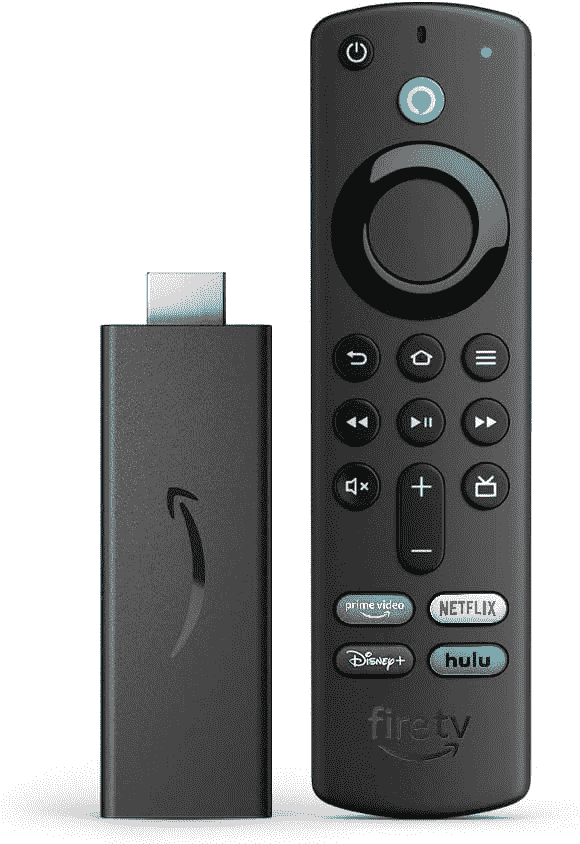

# 如何访问亚马逊 Fire TV 上的开发者选项

> 原文：<https://www.xda-developers.com/how-to-access-developer-options-amazon-fire-tv/>

许多亚马逊 Fire TV 用户可能永远都不需要接触[开发者选项设置](https://www.xda-developers.com/android-developer-options/)。但是潜在的开发者需要这样做，任何想下载亚马逊商店里没有的应用程序的人也需要这样做。直到最近，这些选项都很容易在 Fire TV 菜单中找到。然而，2022 年 6 月中旬的最新更新隐藏了开发者选项菜单。你可以说这是一个很好的举措，将许多人不知道如何正确使用的设置牢牢地隐藏起来。

幸运的是，亚马逊只是隐藏了菜单，并没有完全删除。现在它实际上更符合在常规 Android 手机或平板电脑上访问开发者选项的方式。下面是访问它的方法。

## 如何访问亚马逊 Fire TV 上的开发者选项

*   开发者选项菜单在亚马逊和第三方 Fire TV 硬件上都有。
*   因为它现在是隐藏的，导航到“设置”中的“关于”部分。
*   在第一个项目上按遥控器上的按钮七次，以显示现在隐藏的开发者选项菜单。

根据你使用的是亚马逊设备(比如 Fire TV Stick)还是预装的 Fire TV 电视，操作步骤会略有不同。差异将在出现的地方突出显示。

1.在你的 Fire TV 上，打开**设置**。

2.选择**我的 Fire TV** 。

3.关于选择**。**

4.突出显示列表中的第一个选项。这应该是对您的特定设备的引用。

5.按下遥控器，就好像您正在选择此项目**七次**。

6.完成后，您应该会看到一条消息，告诉您已经是一名开发人员。

7.按遥控器上的后退按钮返回上一个菜单。

如果你使用的是 Fire TV 电视，那么步骤 2 可能指的是“设备和软件”，但其余步骤是相同的。完成这些步骤后，你会看到缺失的开发者选项菜单再次出现。

* * *

这就是全部了。除非你碰巧重置了 Fire TV，否则菜单将永久保留在那里。对于大多数人来说，访问这个菜单的主要原因是使用[下载器](https://www.amazon.com/dp/B01N0BP507?tag=xda-30c19ud-20&ascsubtag=UUxdaUeUpU42341&asc_refurl=https%3A%2F%2Fwww.xda-developers.com%2Fhow-to-access-developer-options-amazon-fire-tv%2F&asc_campaign=Evergreen)等工具从未知来源加载第三方应用程序。虽然下载器工具在亚马逊的商店里，但你需要启用未知来源的必要选项，然后才能用它安装任何东西。

 <picture></picture> 

Fire TV Stick 4K

##### 亚马逊 Fire 电视棒

一段时间以来，亚马逊的最新产品将 Alexa 集成到了遥控器中，可以直接从电视的 USB 端口供电。