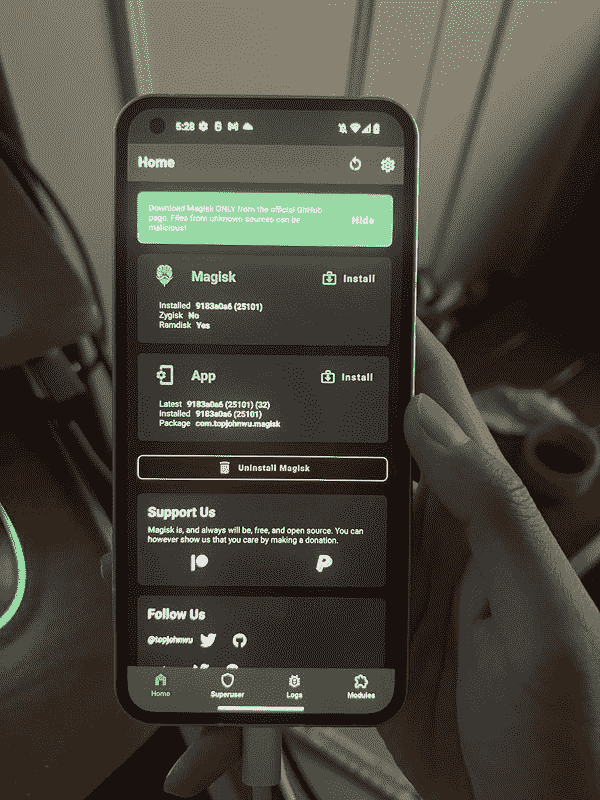

# 如何解锁 Nothing Phone 1 的 bootloader 并用 Magisk root

> 原文：<https://www.xda-developers.com/how-to-bootloader-unlock-root-magisk-nothing-phone-1/>

在新智能手机发布时，许多 Android 爱好者承担的任务是解锁引导加载程序并[根设备](https://www.xda-developers.com/root/)。在这之后，通常会出现大量定制 rom、内核和其他修改和调整形式的开发。可以说，在 XDA 这里，一个设备的生命并没有真正开始，直到钩环(读“锁定引导加载器”)被彻底摧毁。对于[一无所有电话 1](https://www.xda-developers.com/nothing-phone-1-review/) 社区来说，这个旅程现在就可以开始了！

你会很高兴地知道，解锁一无所有的手机 1 的引导程序只需要几秒钟，而让你的设备启动并以 root 用户身份运行只需要几分钟。如果你曾经解锁过谷歌 Pixel 或一加设备的非运营商版本，你应该不会有任何问题解锁你的花哨的 Nothing Phone 1 并安装 Magisk。对于那些需要复习的人，这里有一个教程来指导你完成这个过程。

*   没有任何东西允许终端用户解锁其电话 1 的引导加载程序。
*   引导加载程序解锁过程中没有等待时间或令牌生成。
*   解锁引导程序后，您可以使用 Magisk 来引导设备。

* * *

## 如何引导加载程序解锁和根无手机 1

一无所有的手机 1 的[内核源代码和设备树已经开放，因此我们肯定会看到售后开发工作和定制修改开始为该设备做准备。尽管如此，您需要首先解锁引导加载程序，以便引导任何第三方软件。以下是开始的方法:](https://www.xda-developers.com/nothing-phone-1-kernel-source-code/)

### 第一步:解锁无手机 1 的引导加载程序

1.  在你的 Nothing Phone 1 上打开**设置**应用。
2.  点击**关于手机**。
3.  找到名为**软件信息**的部分并点击它。
4.  在下一个屏幕上，点击**内部版本号** 7 次，直到它显示您现在是一名开发人员。
5.  回到主**设置**页面，点击**系统**，在列表底部附近，你应该会看到**开发者选项**。轻敲它。
6.  您应该会看到一个 **OEM 解锁**选项。启用它。为了安全起见，它可能会要求您输入您的锁屏 PIN/密码(如果您有一套的话)。
7.  向下滚动一点，直到看到 **USB 调试**。也启用它。
8.  将您的 Nothing Phone 1 插入 PC/Mac/Chromebook。确保安装了最新版本的 [ADB 和 Fastboot](https://www.xda-developers.com/install-adb-windows-macos-linux/) 二进制文件。
9.  现在打开一个终端窗口/命令提示符实例，输入以下命令:

    ```
     adb devices 
    ```

10.  如果您看到您的设备的序列号并显示“已授权”，那么您就可以使用了。如果这是您第一次为该设备设置 ADB，那么您可能会在您的手机上看到提示，以便为您的 PC 启用 USB 调试。授予它许可。
    *   如果你无法让你的 Windows PC 识别你的设备，尝试安装最新的 [Android USB 驱动程序](https://www.xda-developers.com/download-android-usb-drivers/)。
11.  现在，**重启到引导程序**菜单。您可以在启动时按住电源和音量降低按钮，或者输入以下 ADB 命令:

    ```
     <span ><span >adb reboot bootloader</span></span> 
    ```

12.  一旦你在引导菜单上，你现在必须切换到使用快速启动命令与你的设备通信。要解锁 Nothing Phone 1 的引导程序，请输入以下命令:

    ```
     fastboot flashing unlock 
    ```

13.  现在，您应该会在屏幕上看到文本，警告您解锁引导程序的潜在风险。在电源和音量按钮旁边的屏幕上，您应该会看到一些文本。按下音量增大键，直到它显示“解锁引导程序”一旦它这样说，按下电源按钮。
14.  手机将解锁引导加载程序，并重新启动回到引导加载程序菜单。这一次，引导程序将显示一个红色警告图标和“解锁”文本。
15.  现在，重启你的手机回到安卓操作系统。您可以通过发送下面的快速启动命令来做到这一点:

    ```
     fastboot reboot 
    ```

16.  恭喜你，你的一无所有的手机 1 现在有一个解锁的引导程序了！你会看到一条警告信息，提示你的手机引导程序在每次启动时都被解锁，但是不要担心，因为这不会影响你的日常使用。

### 第二步:用 Magisk 开发一无所有的手机 1

使用解锁的引导加载程序，您现在可以引导修改后的引导映像。要让 Magisk 工作，你需要修补 Nothing Phone 1 的普通启动映像。

1.  由于您的设备之前已被擦除，您需要返回并重新启用开发人员选项，然后重新启用 USB 调试。确保您的电脑仍能识别您的“无手机 1”。
2.  从我们的[Nothing Phone 1 update tracker](https://www.xda-developers.com/nothing-phone-1-nothing-os-update-tracker/)下载与上安装的软件版本相对应的完整 OTA 包。
3.  从 OTA 包中提取股票引导镜像。要了解更多信息，请查看“您可以访问可恢复的 flash ZIP 文件”部分[我们的“如何在您的 Android 手机上安装 Magisk”教程](https://www.xda-developers.com/how-to-install-magisk/)。
    *   如果你不想下载整个 OTA 文件，你可以从我们的论坛单独下载启动镜像。但是，为了避免版本不匹配和其他不可预见的错误，总是建议您自己提取启动映像。
4.  现在我们已经有了要修补的普通引导映像，使用下面的命令将它推送到您的设备:

    ```
     adb push <path_to_file> /sdcard/Download 
    ```

5.  [在 Nothing Phone 1 上下载并安装 Magisk app](https://github.com/topjohnwu/Magisk/releases/latest) 。
6.  打开 Magisk 应用程序，点击**安装**按钮。
7.  选择**选择并修补一个文件**。将弹出一个文件管理器。
8.  选择您之前推送的启动映像，并让 Magisk 修补它。
9.  用这个命令把它从你的手机上拉下来:

    ```
     adb pull /sdcard/Download/magisk_patched_[random_strings].img 
    ```

10.  重启手机 1 进入引导程序:

    ```
     adb reboot bootloader 
    ```

11.  刷新补丁启动镜像:

    ```
     fastboot flash boot /path/to/magisk_patched_boot.img 
    ```

12.  重启手机:

    ```
     fastboot reboot 
    ```

13.  打开 Magisk 应用程序，你的 Nothing Phone 1 就应该有根了。

 <picture></picture> 

H/T: XDA Member [Qiyue_](https://forum.xda-developers.com/m/qiyue_.11861699/) for the screenshot!

* * *

## 下一步是什么？

在使用 Magisk 之后，你可以用你的 Nothing Phone 1 做些什么呢？这里有一个简短的列表:

请记住，解锁引导加载程序和 root 你的一无所有的手机 1 将影响你如何采取更新。您需要学习如何手动下载每月安全补丁更新。不过，没必要担心，因为这实际上很容易做到。

**[没事电话 1 XDA 论坛](https://forum.xda-developers.com/f/nothing-phone-1.12585/)**

最后，如果你想更好地控制你的设备，你可以在你的 Nothing Phone 1 上闪存定制的 rom 和内核，一旦它们可供这两个设备使用。定制光盘可以提供很多股票软件上没有的选项。[另一方面，定制内核](https://www.xda-developers.com/most-popular-custom-kernels-for-android/)可以让你调整设备的性能，以延长电池寿命或在你最喜欢的游戏中获得更多帧数。由于 Nothing Phone 1 刚刚发布，目前还没有任何定制的 rom 或内核可供该设备使用。但如果你对定制开发感兴趣，请关注这款手机的 XDA 分论坛。