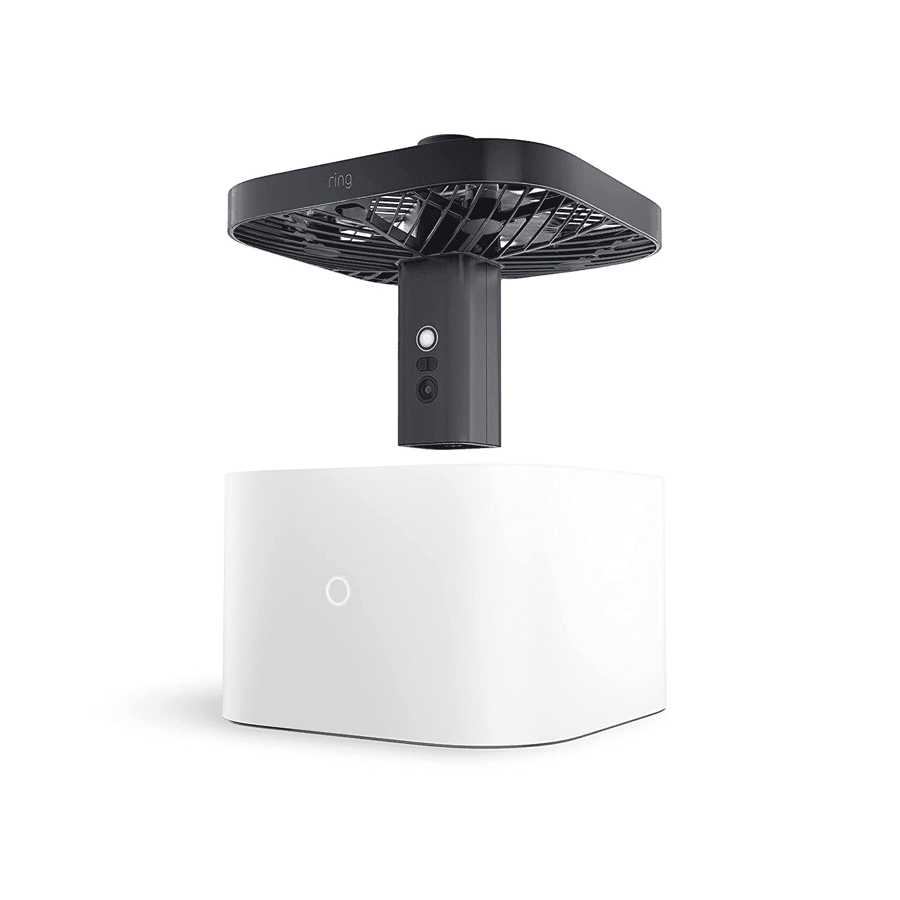

# 如何购买亚马逊的安全无人机，环总是家里的凸轮

> 原文：<https://www.xda-developers.com/how-to-buy-ring-always-home-cam/>

去年，亚马逊旗下的家庭安全品牌 Ring 推出了一款新的安全摄像头，引发了很多质疑。这款名为 Ring Always Home Cam 的安全摄像头安装在本质上是一架无人机的设备上，允许它在室内飞行，从多个角度拍摄你家里发生的事情。一架连接互联网的亚马逊制造的无人机在你家里录音的想法显然对许多人来说听起来很可怕，但很难否认这个概念很酷，也许对一些人有用。对于那些对环总是家庭摄像头感兴趣的人，亚马逊今天宣布了可用性细节。

在你考虑停止购买这种产品之前，值得注意的是，供货将非常有限。首先，Ring Always Home Cam 只会在美国发货。它数量有限，不是每个想要的人都能得到。你必须向亚马逊申请邀请，才有机会购买，而且不能保证亚马逊会答应你的请求。如果亚马逊确实接受了你的请求，那么你将不得不支付 249.99 美元来购买这个名为“永远在家”的摄像头。

 <picture></picture> 

Ring Always Home Cam

##### 环总是首页凸轮

亚马逊的安全无人机确实会在你的房子周围飞行，但如果这没有吓到你，你可以在今年晚些时候请求邀请购买一架。

如果你对购买这个产品不感兴趣，但是你对它的概念感兴趣，那么你并不孤单。亚马逊的新安全无人机是同类产品中的第一款，因为要让该产品在室内导航，同时避免障碍，从多个角度捕捉事件，需要克服许多挑战。该无人机以 1440x1440 的分辨率捕捉镜头，并有一个 LED 在弱光条件下飞行时照亮其路径。飞行路线可以根据用户的需求定制，允许“环总是回家”摄像头在你不在家的时候检查房子的某些部分(如炉子或窗户)。接触和运动传感器可以放置在家里，这可以触发无人机飞到检测到事件的位置，以记录正在发生的事情。一旦完成录制，它会自动返回其基座充电。

照片并没有真正做到产品公正，所以如果你有兴趣看到环总是家庭凸轮在行动中，你可以看下面的视频从环。

\ r \ nht TPS://www . YouTube . com/watch？v=JuXOCamGUnE\r\n