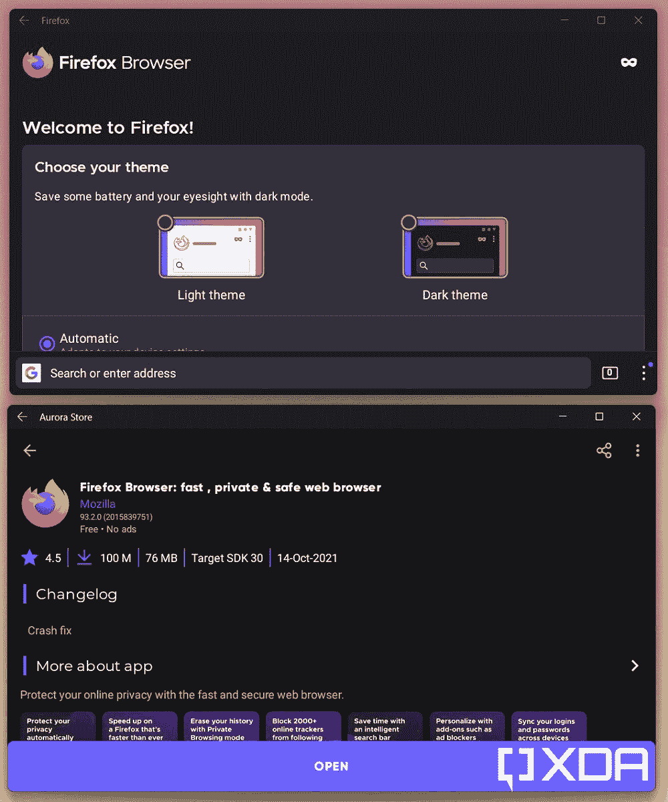

# Android 的区域锁如何绕过 Windows 子系统

> 原文：<https://www.xda-developers.com/how-to-bypass-amazon-appstore-region-lock-windows-subsystem-for-android/>

本周早些时候，微软[让我们先睹为快](https://www.xda-developers.com/amazon-appstore-windows-11-small-selection-android-apps/)在 [Windows 11](https://www.xda-developers.com/windows-11/) 上为 Android 开发的 Windows 子系统，因为他们[通过测试版渠道发布了第一个版本](https://www.xda-developers.com/android-apps-available-windows-11-beta-channel/)。然而，Android 层没有任何谷歌服务，这意味着还没有官方途径在 Windows 11 上从谷歌 Play 商店下载应用程序。微软确实提供了与亚马逊应用商店的集成，但目前批准的兼容应用程序列表相当小。此外，您的 PC 的地区必须设置为美国，您还需要一个美国的亚马逊帐户，以便访问 Android Windows 子系统上的亚马逊应用商店。

**[动手操作 Windows 11 上的安卓应用](https://www.xda-developers.com/hands-on-android-apps-windows-11/)**

幸运的是，前面提到的大多数限制都可以绕过。我们已经向您展示了[如何在任何 Windows 11 版本上安装 Android 的 Windows 子系统](https://www.xda-developers.com/how-to-run-android-apps-on-any-windows-11-pc/)，这使得稳定和开发渠道用户更容易体验 Android 应用程序，而无需切换更新渠道。事实上，也可以通过 [ADB](https://www.xda-developers.com/install-adb-windows-macos-linux/) 在 Windows 11 中[侧载独立的 Android 应用包](https://www.xda-developers.com/how-to-sideload-android-apps-on-windows-11/)。

如果你不想尝试命令行-foo，我们现在找到了一种绕过区域锁定的简单方法，这样你就可以从亚马逊 Appstore 无缝下载官方批准的 Android 应用程序，而无需使用 VPN 或更改 Windows 11 的区域设置。修改 Android 子系统的范围并没有到此为止，因为人们可以进一步下载一个替代的谷歌 Play 商店客户端，如 [Aurora Store](https://www.xda-developers.com/aurora-store-gets-major-facelift-version-4/) 来克服亚马逊产品的局限性。祝您身体健康

* * *

## 如何绕过亚马逊应用商店对安卓系统 Windows 子系统的区域锁定

一旦你安装了 Android 版的 Windows 子系统，你应该会看到 Amazon Appstore 出现在你的开始菜单中。快捷方式指向商店的 Android 应用程序变体，它允许你使用亚马逊帐户凭证登录。然而，下一步，非美国用户将被通知亚马逊应用商店在他们的国家不可用。

尽管如此，变通方法([H/T*@扎克鲍登*](https://twitter.com/zacbowden/status/1450916654968365059) )出奇的简单。你所需要做的就是遵循下面列出的步骤:

1.  确保 Android 环境的 Windows 子系统正在运行，并且可以通过 ADB 访问。如果你需要任何帮助，请参考我们的【Windows 11 安卓应用侧装指南。
2.  从[这里](https://www.amazon.com/gp/mas/get/amazonapp?tag=xda-6225uta-20&ascsubtag=UUxdaUeUpU4913&asc_refurl=https%3A%2F%2Fwww.xda-developers.com%2Fhow-to-bypass-amazon-appstore-region-lock-windows-subsystem-for-android%2F&asc_campaign=Evergreen)以安卓包(APK)文件的形式下载亚马逊 Appstore 应用的最新稳定版本。
3.  使用 ADB 和-r 参数从侧面加载 APK 文件，用您在上一步中下载的版本替换子系统中现有的 Amazon Appstore 版本。

    ```
     adb install -r <full_path_to_the_APK_file> 
    ```

4.  现在从开始菜单快捷方式打开亚马逊应用商店，你应该能够安装由微软和亚马逊管理的应用程序，不管你在哪个地区。

请注意，亚马逊应用商店 APK 的新版本内置了 WSA 检测例程。因此，手动侧装 APK 可能最终会迫使您使用微软提供的版本。虽然修补这些检查超出了本教程的范围，但您也可以使用 Aurora Store 这样的替代应用商店。

* * *

## 如何在 Android 的 Windows 子系统中使用极光商店

如果绕过亚马逊应用商店的区域锁定是为 Android 解放 Windows 子系统的第一步，那么下一个明显的步骤应该是设置对谷歌 Play 商店的访问。多亏了开源的 Aurora Store 客户端，我们可以很容易地做到这一点，而不会弄乱 Play 服务和相关的专有谷歌应用程序( [H/T *@kcFive12*](https://twitter.com/kcFive12/status/1450917571679735809) )。

1.  从其[官网](https://auroraoss.com/download/)下载极光商店 app 的最新 APK。
    *   如果您想访问最新版本，请选择夜间版本。否则，坚持稳定的渠道。

2.  现在按照[我们的侧装导轨](https://www.xda-developers.com/how-to-sideload-android-apps-on-windows-11/)安装 APK。
3.  Aurora 商店快捷方式现在应该在开始菜单中可见。点击它打开应用程序。
4.  浏览配置向导并选择您的登录方法。您可以匿名登录，或者使用您的个人 Google 帐户登录，以便同步您的应用程序库。
5.  考虑到你已经给了 Aurora Store 所有必要的权限，你现在可以浏览庞大的应用程序库并在瞬间安装它们。<picture></picture>

    Firefox 从极光商店安装在 Windows 11 上

6.  利润！

* * *

**你已经在用 Android 的 Windows 子系统了还是在等稳定版？你最期待在 Windows 11 上使用哪些安卓应用？请在下面的评论区告诉我们。**