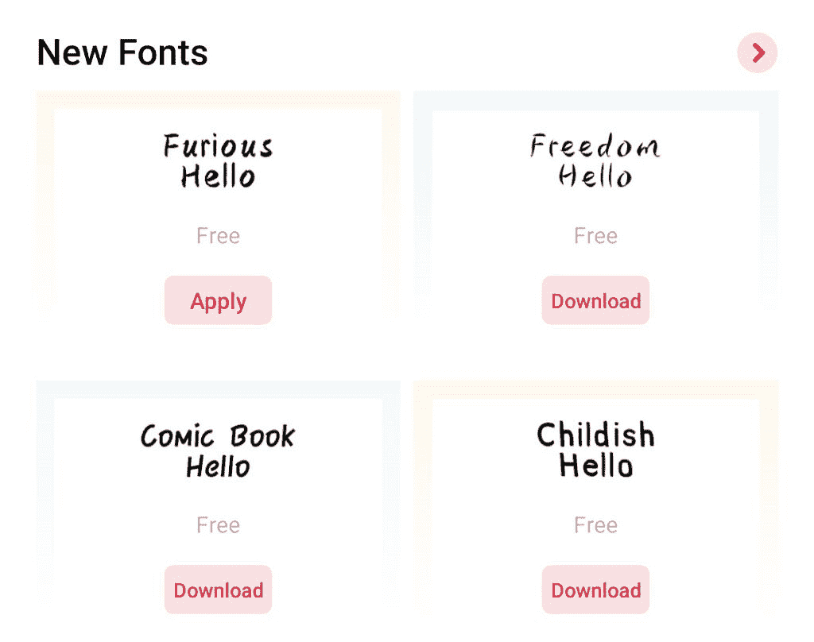

# 如何在 Android 智能手机上更改字体

> 原文：<https://www.xda-developers.com/how-to-change-font-android/>

改变系统字体是个性化你的手机的好方法。一个简单的字体变化，就能让整个系统界面看起来焕然一新，与众不同。在电脑上安装新字体就像点按一个按钮或将新字体文件粘贴到 fonts 文件夹中一样简单。然而，在 [Android 手机](http://www.xda-developers.com/best-android-phones/)的情况下，过程略有不同。

许多原始设备制造商包括改变系统字体的选项，但是可用字体的数量可能因手机而异。如果你的智能手机没有改变字体的内置选项，第三方启动器可以帮助定制外观。或者，您可以获得 root 访问权限来负责定制。在本指南中，我们将讨论如何在 Android 手机上更改字体。

像三星、LG、OPPO、一加、Vivo 和小米这样的智能手机制造商允许用户改变系统字体，但一些制造商比其他制造商有更多的字体选择。至少，更改它们的选项相当简单。

我们在下面列出了一些受欢迎的智能手机制造商的手机上改变字体的步骤，但如果你拥有一部其他品牌的手机，你可以尝试在设置中的**显示**或**主题**下寻找一个选项。

### 更改三星手机的字体

1.  打开**设置**。
2.  选择**显示**。
3.  选择**字号和**样式*。*
4.  从**字体样式**菜单中选择您选择的字体，就大功告成了。

也可以从三星 Galaxy Store 下载更多字体。

### 改变小米手机的字体

小米允许用户通过 Themes 应用程序下载和安装新字体，但它们只在印度和香港等特定地区可用。如果你不住在这些地区，你可以把手机上的地区改成印度，然后下载新的字体。更改地区也意味着您现在将获得该地区的软件更新。

1.  打开**主题** app。
2.  选择**字体**。
3.  选择并应用您想要的字体。

### 改变 Oppo 手机上的字体

1.  开**主题店**。如果主题商店版本低于 6.4，请更新应用程序。
2.  点击**字体图标**(看起来像盒子里的 T)。
3.  您现在可以下载您想要的字体或试用它。

### 更改 Vivo 手机上的字体

1.  打开**主题** app。
2.  点击底部栏中的**字体图标**。
3.  选择您想要的字体并应用它。大部分字体都是在 Vivo 的主题商店上付费的。

### 更改一加手机的字体

1.  转到**设置**。
2.  打开**定制**。
3.  设置您想要的字体。

### 改变 LG 手机的字体

1.  打开**设置**。
2.  转到**显示屏**。
3.  点击**字体**。
4.  选择您想要的字体，或从 LG SmartWorld 下载更多字体。

## 使用启动器更改字体

如果你的手机没有内置支持换字体，又不想 root，可以用 Nova 这样的第三方启动器换字体。不同于在系统范围内改变字体的内置工具，启动器只能改变启动器元素的字体，而不是整个系统的字体。

### 使用 Nova 启动器更改字体

1.  打开 Nova 的**设置** app。
2.  现在，您可以进入主屏幕和应用程序抽屉的单独设置下的图标布局，以更改字体样式。
3.  你必须分别改变这三种字体。

类似地，其他启动器也在它们的设置中给出改变字体的选项。

## 手机字体应用

如果你已经在手机上获得了 [root 权限，你就可以使用 FontFix 和 iFont 之类的应用下载并安装新字体。这两款应用都提供了数百种字体可供选择。在安装这些应用程序之前，请确保您的手机是 rooted 用户。否则，他们不会为你工作。](https://www.xda-developers.com/root/)

如果您习惯使用具有 root 访问权限的文件资源管理器(在继续操作之前进行备份)，您也可以手动替换 */system/fonts* 中的 TTF 文件，并将权限更改为 rw-r-r。请记住将新放置的 TTF 文件命名为与该位置上以前的 TTF 文件相同的名称，并在完成后重新启动您的设备。

* * *

这些是你可以改变你的 Android 手机字体的各种方法。如果你认为我们错过了一个很棒的字体应用程序，可以在评论区告诉我们。