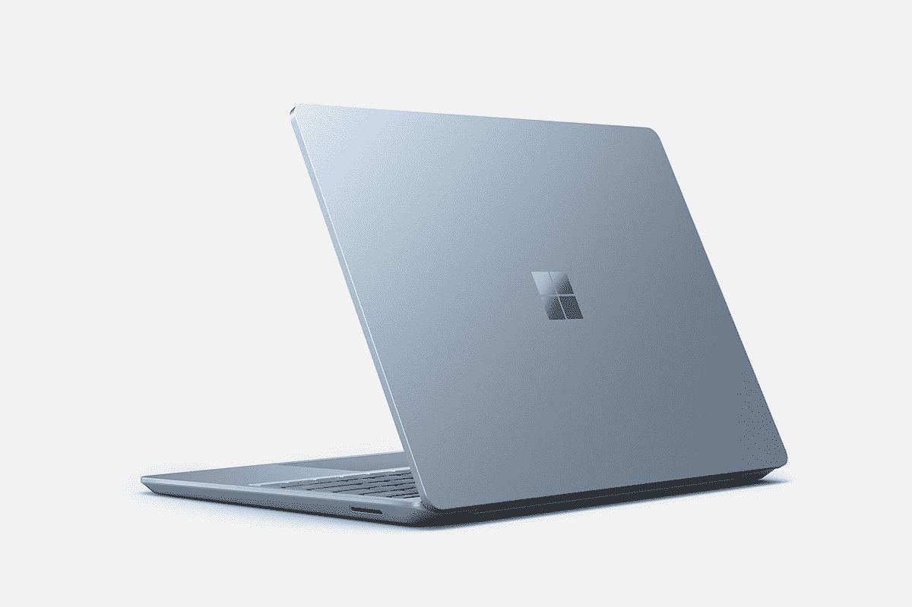

# 如何轻松更换微软 Surface Laptop 4 上的固态硬盘

> 原文：<https://www.xda-developers.com/how-to-change-ssd-surface-laptop-4/>

# 微软 Surface Laptop 4 怎么换 SSD

微软的 Surface Laptop 4 有一个可移动的 SSD。这意味着当您回收产品或升级时，您可能会破坏您的存储。

微软所有最新 Surface 个人电脑的关键特征之一是可移动存储。它首次亮相于 Surface Laptop 3，这是 AMD 锐龙最好的笔记本电脑之一。这当然包括 Surface Laptop 4，所以你可以换掉固态硬盘。实际上，这在现代超极本中是非常罕见的功能。它大多是 Surface 独有的，因为即使是一些[最好的笔记本电脑](https://www.xda-developers.com/best-laptops/)也不会给你一个简单的升级方法。

但在我们开始之前，有些事你需要知道。微软**不**建议这么做。可移动 SSD 是为训练有素的专业人士设计的，当然，它的设计不是为了让用户能够规避该公司过高的存储层价格。

## 先决条件

 <picture></picture> 

SanDisk PC SN520 512GB M.2 2230 SSD

##### 闪迪电脑 SN520 M.2 2230 固态硬盘

 <picture></picture> 

Torx Screwdriver Set

##### Tekprem 梅花螺丝刀套件

 <picture></picture> 

Stick Spudger Opening Pry Tool

##### 斗杆销座开口撬动工具

* * *

## 准备:准备好你的 Surface 笔记本 4

您需要做的第一件事就是备份您想要保留的内容，并创建一个恢复介质。

1.  如果您想要保留任何文件，请将其放入 OneDrive。
2.  前往微软网站查看 [Surface recovery 图片](https://support.microsoft.com/en-us/surface-recovery-image)。
3.  从下拉列表中选择您的产品。
4.  输入序列号，该序列号位于 Surface Laptop 4 的底部。
5.  点击继续后，下载与您想要的 Windows 10 版本相对应的映像。
6.  ZIP 文件下载完成后，将其解压缩到 USB 驱动器。
7.  确保 ZIP 文件已完成解压缩，OneDrive 已完成同步。
8.  转到设置->更新和安全->恢复->开始。请注意，此步骤和以下步骤是关于如何重置您的电脑。它们是可选的，对于替换 Surface Laptop 4 中的 SSD 并不重要，但它们被包括在内是因为假设您想要擦除现有的 SSD。
9.  选择删除所有内容->本地重新安装。
10.  在下一个屏幕上，单击链接更改设置。
11.  打开清洗驱动器的选项。
12.  点按“确认”并按照说明完成重置您的设备。

* * *

## 打开 Surface Laptop 4

打开 Surface Laptop 4 比 Surface Pro X 或 Surface Pro 7+要复杂一点。那些设备只需要一根针就能打开盖子。

1.  拆下橡胶支脚。这最好用开口工具或镊子来完成，但请记住，它们是粘在一起的。移除它们需要一点努力。
2.  注意有两种不同的脚。前面的两个有三个塑料尖头，而后面的两个没有。后面两个也比较深。
3.  使用 T5 Torx 螺丝刀，拆下四个螺钉。
4.  接下来，将 Surface Laptop 4 翻转过来，像平常一样打开它。不要试图拆除底座。
5.  在前面，使用开口工具(指甲也可以)将键盘从底座上拉开。它是磁性附着的，所以不需要太多的努力。有一根带子把键盘和底座连接起来。拆卸之前，请注意它是如何连接的。
6.  使用 T5 Torx 螺丝刀，拧下 SSD 前面的螺钉。会弹出一点。
7.  将 SSD 滑出其插槽。

* * *

## 在 Surface Laptop 4 上安装新的固态硬盘

现在，是时候做同样的事情了，但是反过来。

1.  取出新的 SSD，并将其插入您从中卸下旧 SSD 的同一个插槽中。
2.  拧上梅花螺丝，固定新的固态硬盘。
3.  将键盘带固定到基座上。确保它咬合到位。
4.  将键盘放回底座。它会用磁力固定自己。
5.  合上笔记本电脑，将其翻转过来。
6.  将四个 Torx 螺钉拧回原位。
7.  将四个橡胶支脚弹回原位。确保每个球洞使用正确的球洞。对于三叉的，一定要对齐。

* * *

## 重新安装 Windows 10

现在你有了一个新的固态硬盘，你需要安装一个操作系统。

1.  将您之前制作的 USB 驱动器插入 USB 端口。
2.  将 Surface Laptop 4 连接到充电器上。
3.  按住音量降低键，按下电源。继续按住音量，直到您看到恢复选项。
4.  按照屏幕上的说明安装 Windows 10。

就是这样。现在，您已经在 Surface Laptop 4 的全新固态硬盘上安装了全新的 Windows 10。事实上，你可能以比微软更低的价格获得了存储升级。你也可以看看我们对 Surface Laptop 4 的[评测。](https://www.xda-developers.com/microsoft-surface-laptop-4-review/)

 <picture></picture> 

Surface Laptop Go (up to $200 off)

##### 微软 Surface Laptop 4

Surface Laptop 4 配备了英特尔最新的处理器，以及一个可移动的固态硬盘。