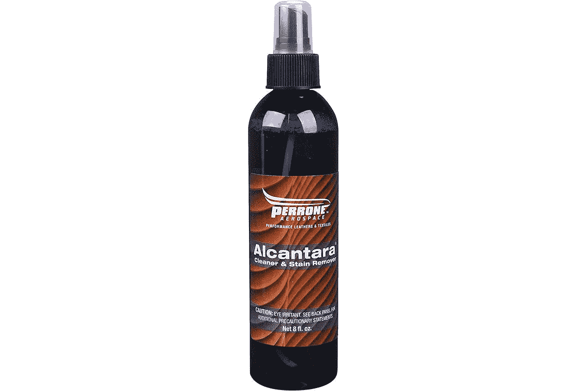

# 如何清洁 Surface Laptop 4 上的 Alcantara 键盘

> 原文：<https://www.xda-developers.com/how-to-clean-alcantara-keyboard-surface-laptop-4/>

自从 Surface 笔记本电脑首次亮相以来，Alcantara 面料就一直是它的主打产品。当时，它有四种颜色——酒红色、钴蓝色、铂金色和石墨金色。微软还推出了 Surface Pro 的 Alcantara 键盘 Signature Type Cover。这些年来颜色发生了变化，现在 Alcantara 只是 Surface Laptop 4 的两种颜色之一。那些颜色是白金和冰蓝色。

最重要的是，如果你走阿尔坎塔拉路线，你需要保持它。Alcantara 是一个品牌，你可以在该公司的网站上找到关于它的所有信息。它甚至有自己的维护指南。[微软有一个关于如何保养 Surface 产品的指南](https://support.microsoft.com/en-us/surface/clean-and-care-for-your-surface-8b3e7e01-f2b7-5854-b7a6-dac2cbf6e104)，但是关于保养 Alcantara 的部分非常简短，而 Alcantara 网站要深入得多。

## 维护

### 日常清洁

首先，有日常清洁。建议您每天使用软刷、干布或吸尘器清洁一次。

### 每周清洁

在开始每周清洁之前，请确保您已经掸掉了 Surface 笔记本电脑 4 上的灰尘。接下来，拿一块稍微湿润的白棉布在布料上擦拭。不要使用任何有颜色或墨水的东西，因为它可能会污染材料。

请注意，根据微软的说明，他们建议使用温和的肥皂和水溶液进行定期清洁。

### 年度清洁

这是该公司建议使用温和的肥皂来清洁你的阿尔坎塔拉。具体来说，它建议用来自 [Fenice](https://www.fenice.care/en/alcantara-specific-products/) 、 [James](https://www.james.eu/en/products) 或 [Perrone](https://www.amazon.com/Perrone-Aerospace-AL-108-Alcantara-Cleaner/dp/B074CP79R1?tag=xda-tr1pjia-20&ascsubtag=UUxdaUeUpU2421&asc_refurl=https%3A%2F%2Fwww.xda-developers.com%2Fhow-to-clean-alcantara-keyboard-surface-laptop-4%2F&asc_campaign=Short-Term) 的产品清洁你的 Surface Laptop 4。

 <picture></picture> 

Perrone Alcantara Cleaner

##### Perrone Alcantara 清洁剂

这是一种推荐的去污溶液，有助于清除 Alcantara 面料上的墨水、红酒、咖啡和其他污渍。

如果您无法获得其推荐的清洁溶液，建议使用湿海绵或布。适当地拧干它，并在整个材料上运行。让它干燥，然后用软刷刷它。

* * *

## 去污

好吧，你已经竭尽全力每天、每周、每年正确保养你的 Surface Laptop 4 键盘。但是你把东西洒在上面了，把事情弄糟了。这就是去除污渍的用武之地。

对于任何污渍，建议您尽快采取行动。在这里，30 分钟内被认为是最佳做法。

你需要做的第一件事是清除任何溢出的多余产品。确保避免摩擦材料，这样它不会扩散或变得更深。此外，确保*切勿*将清洗液直接倒在键盘上。

你可以用一块白布或拧干的海绵来去掉污渍。还建议您冲洗并拧干抹布中间的海绵。

### 特定污渍

建议你使用专门用于清洁 Alcantara 的东西来清除 Surface Laptop 4 键盘上的污渍。上面列出的品牌是该公司推荐的，但也有很多 Alcantara 清洁剂可供选择。这里有一些具体的例子，如果你没有 Alcantara 清洁剂，如何清洁它们。

*   **果汁、果酱、果冻、糖浆、番茄酱:**用温水，用清水轻拍冲洗干净。
*   **血、蛋、屎、尿:**用冷水；避免使用温水，因为它会使这些物质凝结，用清水轻轻冲洗。
*   **白酒、酒精饮料、葡萄酒、啤酒、可乐、茶:**用温水；如果色标仍然存在，用柠檬汁处理，然后冲洗干净。
*   **擦不掉的铅笔、可可、巧克力、带奶油或巧克力的糕点、冰淇淋、芥末:**用温水；用清水轻轻冲洗。
*   **醋、发胶、番茄酱、加糖咖啡:**用柠檬汁然后用温水擦拭；用清水轻轻冲洗。
*   **口红、粉底、睫毛膏、眼影、香水、鞋油、一般油脂、草渍、一般毡尖(包括擦不掉的那种):**用乙醇擦，然后用水冲洗。对于比较难去除的草渍和毡尖，尤其是浅色上，为了防止变得太“干”，需要尽快行动。
*   **口香糖和蜡:**把装满冰的塑料袋放在污渍上；当材料变硬时，取出碎片，然后用乙醇处理。

最后，如果你有一个旧污渍，你甚至不知道它是从哪里来的，你可以尝试用水处理它。如果这样不行，你可以用酒精。

如果这些提示对你有帮助，请查看我们对 Surface Laptop 4 的评论。它的前身是采用 AMD 锐龙处理器的最佳笔记本电脑之一，也是支持 Windows Hello 的最佳笔记本电脑之一。

 <picture></picture> 

Surface Laptop 4 (Ryzen 7/512GB)

##### 微软 Surface Laptop 4

Surface Laptop 4 是微软的铝制笔记本电脑，有四种颜色，可选 Alcantara 键盘。