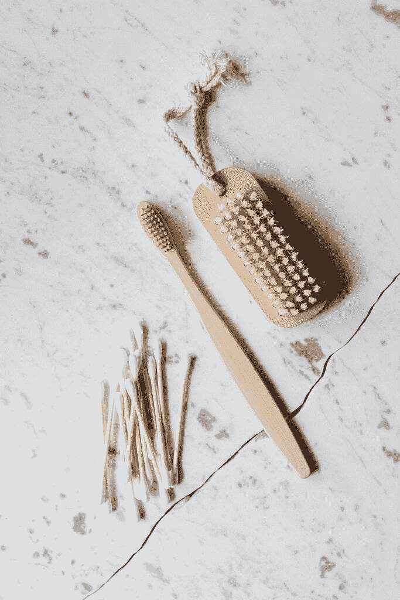
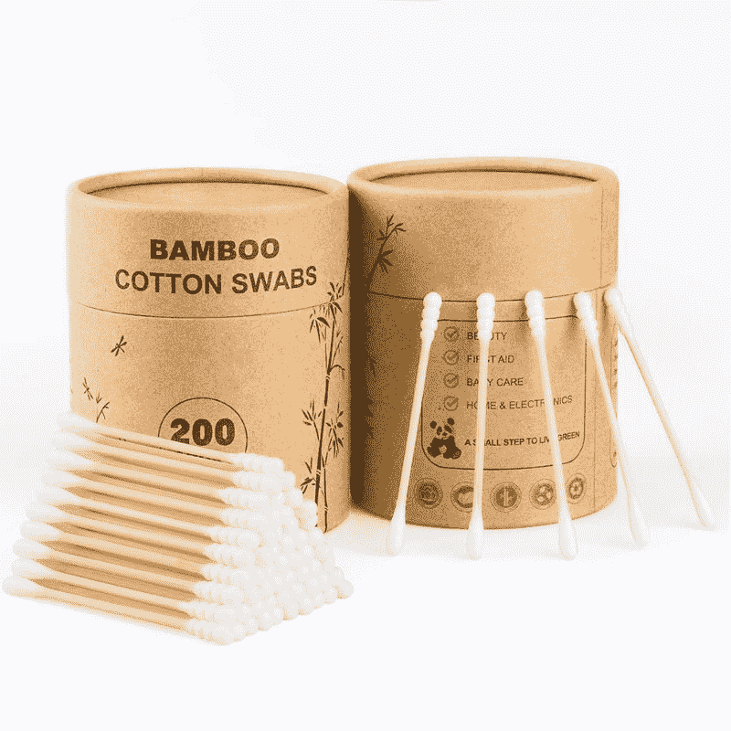
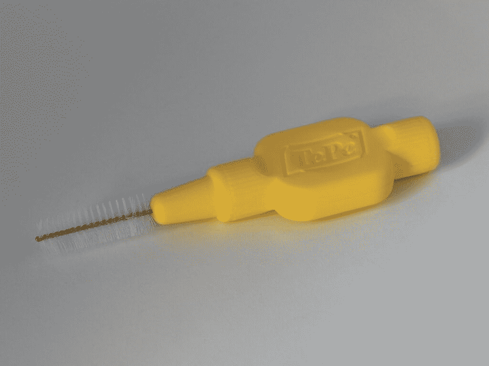
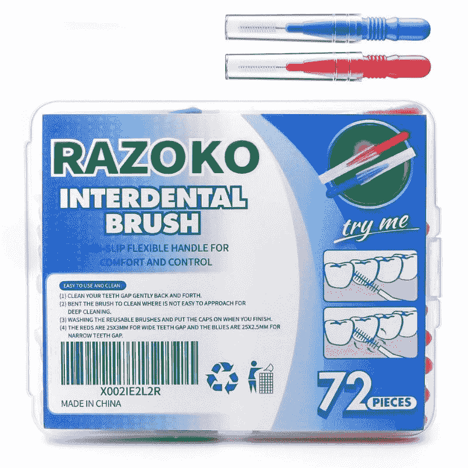
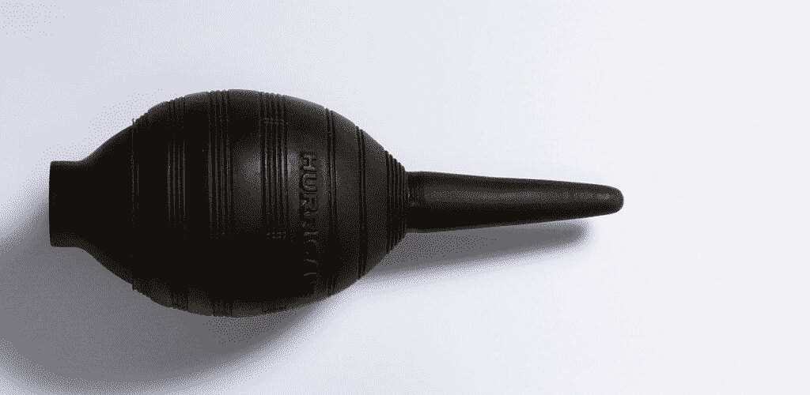
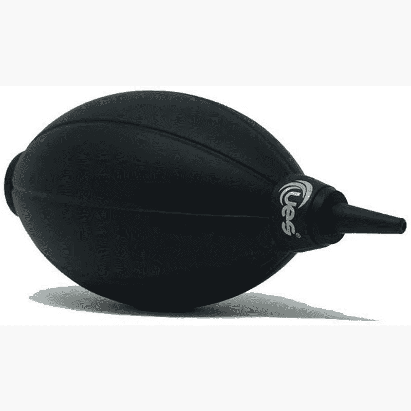

# 如何使用家用和专业工具清洁手机的扬声器格栅

> 原文：<https://www.xda-developers.com/how-to-clean-phone-speaker-grille/>

用不了多久，灰尘、污垢和碎片就会进入你手机的所有角落，不管它是安卓旗舰手机还是 T2 iPhone 手机。如果你的手机扬声器开始发出有点低沉的声音，或者格栅边缘看起来有点毛茸茸的，那么可能是时候清洁一下了。以下是清洁手机扬声器格栅的方法。

## 如何用家里的东西清洁手机的扬声器格栅

虽然用合适的工具清理手机肯定有好处，但你也可以用家里已经有的东西来清理，效果也不错。

### 透明胶带

胶带的用途非常广泛，非常适合去除手机扬声器格栅表面的灰尘和污垢。只需撕下一片，绕在手指上，然后轻轻拍打手机的扬声器格栅。

### 蓝色大头钉

Blu Tack 或任何其他非品牌粘性油灰也是清除手机扬声器格栅灰尘的好方法。虽然胶带无法进入格栅的小孔，但粘性油灰会变形为正确的形状，使其能够从扬声器的更深处清除灰尘。

使用 Blu Tack 或 putty 清洁手机时要非常小心，因为将其推入太深可能会导致弊大于利，特别是如果它在内部破裂的话！

 <picture></picture> 

Blu Tack adhesive putty

##### 蓝色粘性粘性腻子

Blu Tack 粘性油灰可用于捕捉灰尘和其他颗粒，否则很难用胶带清洁。

### 棉签

 <picture></picture> 

Image Credit: Pexels

虽然棉签可能不太擅长清洁耳朵，但它是专业手机清洁工具中海绵的一个很好的替代品。使用干棉签去除表面灰尘，并喷洒酒精清洁剂去除更顽固的污垢。

 <picture></picture> 

Cotton swabs

##### 棉签

棉签是专业清洁工具中清洁海绵的绝佳替代品。

### 牙刷/齿间刷

 <picture></picture> 

Image Credit: [Unsplash](https://unsplash.com/photos/vZdkvtt4Vwo)

最后但并非最不重要的一点是，当要清除手机扬声器格栅上的灰尘和污垢时，牙刷或齿间刷可以进入最小的空间。将刷毛插入扬声器格栅的小孔中，小心刷去灰尘。注意不要用力过猛，记住你是想把灰尘带走，而不是把它塞得更深。齿间刷对于清理机械键盘按键之间的深处也很有用。

 <picture></picture> 

Interdental brush

##### Razoko 齿间刷

齿间刷可用于进入普通清洁布难以触及的最小的地方和角落。

## 如何以专业的方式清洁手机的扬声器格栅

如果你想以一种更专业的方式做事，那么互联网上不乏手机清洁工具。一般来说，这些包含以下内容的组合:

### 压缩空气

 <picture></picture> 

Image Credit: [Flikr](https://www.flickr.com/photos/32996142@N05/6638316145)

压缩空气是从难以触及或脆弱的地方(如手机的扬声器格栅)清除灰尘的最安全的方法之一。一些清洁工具带有橡胶空气除尘器，而其他的可能带有压缩空气罐。无论你选择哪个，把喷嘴放在你的扬声器格栅附近，把灰尘吹走。

 <picture></picture> 

UES Air dust blower

##### UES 空气除尘器

这个简单的配件可以让你抽空气吹掉扬声器格栅、相机镜头等上面的灰尘。

### 清洁海绵

专业清洁海绵有各种各样的尺寸和形状，因为它们适合手机上所有难以触及的地方。虽然棉签可以去除棉绒，但清洁海绵是防静电的，如果你不介意购买一些，这是一个更好的选择。

你可以用干海绵擦去任何堆积的灰尘，然后轻轻喷洒含酒精的清洁喷雾，去除任何顽固的污垢。

### 清洁刷

与清洁海绵一样，清洁刷是牙刷或齿间刷的专业版本。它们的设计足够坚硬，不会造成损坏，并且有许多不同的尺寸，以确保它们适合你手机上的所有小空间。

### 清洁油灰

最后，如果你想用专业版的 Blu Tack，那就投资一些清洁油灰。清洁油灰的设计具有弹性和粘性，不会留下任何残留物。它还可以重复使用，可以用来清洁你的 Macbook 或其他笔记本电脑，也可以清除键盘上的灰尘和碎片。

## 清除手机扬声器上的灰尘

为了获得最佳效果，你需要结合使用上述方法来清除手机扬声器格栅上的灰尘和污垢。首先吹掉或刷掉松散的纤维，然后在用海绵擦去任何残余物之前，用一些油灰进行更深入的清洁。如果你想更深入地清洁，那么考虑将你的设备交给专业人士，他们可以打开设备，从里到外清洁扬声器格栅。