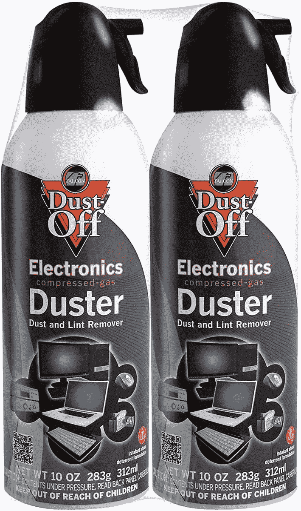
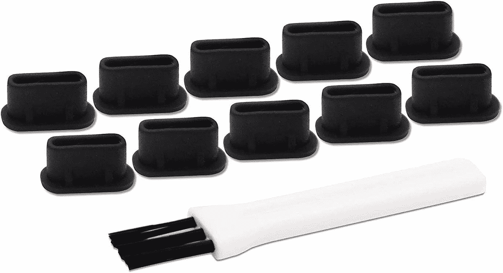

# 如何清洁手机的 USB 接口

> 原文：<https://www.xda-developers.com/how-to-clean-phone-usb-port/>

考虑到我们的手机生活，它们的端口偶尔需要一点点保护也就不足为奇了。无论你的智能手机有多坚固，你的手机壳有多坚固，在长时间的粗暴使用后，在 [USB 端口](https://www.xda-developers.com/usb-standards-explained/)中一定会有一些污垢和灰尘积累，特别是当经常暴露在自然环境中时。如果你的 USB-C 端口已经停止工作或看起来有点脏，下面是如何安全地清洁它。

## 基本要素

*   灰尘和碎片会阻止手机的 USB-C 端口正常工作。
*   一罐压缩空气是清洁手机 USB 接口最安全的方法。
*   不要在手机的 USB-C 端口内使用液体。

## 清洁手机 USB 端口的最佳方式

手机上的 USB 口比较敏感，清洁的时候需要温柔的手。到目前为止，清洁手机 USB 接口最安全的方法是用压缩空气。压缩空气将松散的灰尘和吹出来的污垢，你不需要插入任何东西到端口。

使用压缩空气是相当不言自明的，但我们会给你一个快速运行下来。

1.  将压缩空气喷嘴放在离 USB 端口不远的地方。
2.  始终保持罐子直立。
3.  使用短时间压缩空气吹松灰尘和碎屑。

虽然你可以很容易地吹你的 USB 端口，但一罐压缩空气更强大，而且不小心让液体进入端口的机会更少。

 <picture></picture> 

Dust-Off Disposable Compressed Gas Duster, 10 oz - Pack of 2

##### 除尘压缩气体除尘器

清除难以触及区域的灰尘、棉绒和其他污染物。

## 清除手机 USB 接口上的顽固污垢

如果你的 USB 端口仍然被污垢堵塞，那么是时候深入研究一下了。在这个阶段，我们需要提到的是，在您的 USB 端口中放置任何清洁工具都可能有风险，您需要非常小心。以错误的角度施加压力，可能会使连接器断裂或弯曲。如果你担心损坏内部连接器，那么就把你的手机交给专业人士。

如果你想试一试，你需要一根牙签或类似的窄物体。你可以在网上购买手机清洁工具，但如果你手头没有这些工具，牙签或牙间牙签的塑料头也可以。我们不建议使用安全别针或任何金属物品，你也不应该把任何东西塞进你的 USB 接口。

用你选择的戳具，非常小心地开始在中央电触点周围工作。请记住，目的是清除碎片，而不是把它推进去，所以试着用一个小铲子的动作。这应该可以让你去除更深的污垢。还是那句话，要细腻，遇到阻力就改变动作，而不是施加更大的压力。最后，用压缩空气吹一下你的 USB 接口，以消除任何松动的颗粒。

如果你想彻底检查一下你的手机，那么我们也介绍了[如何清洁你手机的扬声器格栅](https://www.xda-developers.com/how-to-clean-phone-speaker-grille/)，以及[如何清洁你的手机屏幕](https://www.xda-developers.com/how-to-clean-your-phone-screen/)。

## 如何阻止灰尘进入您的 USB-C 端口

预防是迄今为止最好的行动方针。如果你在多尘的环境中工作，或者经常将手机放在口袋或手提包中，那么购买一套防尘塞或内置端口盖的手机壳是值得的。这些将首先防止灰尘进入你的 USB 端口，你就不需要经常清理它。防尘插头可能很容易丢失，尤其是如果你需要继续使用 USB 端口充电，但它们很便宜，并且以倍数包装。如果你的手机支持无线充电，你可能想考虑一些[很棒的无线充电器](https://www.xda-developers.com/best-qi-wireless-charger/)来补充你对防尘插头的使用。

 <picture></picture> 

PortPlugs USB C Port Plug (10 Pack)

##### 端口插头 USB-C 端口插头(10 个装)

兼容三星 Galaxy s22、s21、s20、Plus、Ultra、Note 10、Pixel、MacBook、USB c Android 防尘套的防尘塞，包括清洁刷(黑色)

我们希望这篇文章能帮助你清理你的 USB 端口。记住，如果有疑问，让专业人士做他们的工作。