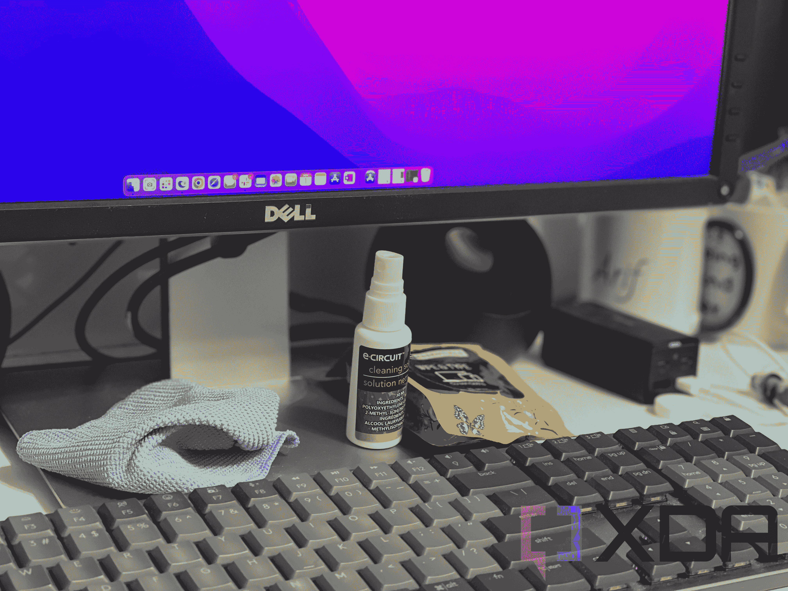

# 如何清洗你的电脑显示器

> 原文：<https://www.xda-developers.com/how-to-clean-your-computer-monitor/>

你的[电脑显示器](https://www.xda-developers.com/best-monitors/)是生产力的关键，但如果它最终变脏了，我们知道它会如何降低你在工作、学校或玩游戏时的速度。没有人喜欢在电脑显示器上看到污迹或灰尘和其他痕迹。它不仅难看，而且在合适的照明条件下，还会分散注意力。这就是为什么在本指南中，我们将解释如何通过几个简单的步骤来清理您的计算机显示器。

## 你需要什么

**超细纤维清洁布:**这将帮助你擦去屏幕上的灰尘和碎屑。请不要使用纸巾或其他家用衣物。这些类型的材料会刮伤显示器的面板。

**屏幕清洁液:**在亚马逊的五金店可以找到，这是帮助清洁屏幕以去除污迹和痕迹的东西。确保溶液或抹布对电子产品是安全的。不要使用含有漂白剂或肥皂的抹布或溶液，这可能会损坏您的屏幕。

**压缩空气:**您可以使用压缩空气清除显示器上较大的灰尘或碎屑。

**水:**当与超细纤维布搭配使用时，水可以作为一种很好的屏幕清洁剂。

*   <picture></picture>

    Eveo 屏幕清洁套装

    ##### Eveo 屏幕清洁套装

    这是一款屏幕清洁套装，可以用来帮助清洁你的电脑显示器。

*   <picture></picture>

    亚马逊基本款超细纤维清洁布

    ##### 亚马逊基本款超细纤维清洁布

    这包超细纤维清洁布能经受住时间的考验，帮你擦拭家中所有的电子产品和其他物品

*   ##### 猎鹰除尘，关压缩气体

    这是一种易拉罐空气，可用于清洁电脑显示器、电视、键盘等。

    T34

## 第一步:关闭你的显示器，给它一个基本的擦拭

要开始清洗过程，请确保您已将显示器从电源上拔下，并关闭电源，让其冷却下来。此外，断开任何可能连接的电缆。这将确保您在初次清洁时不会触电或损坏屏幕。另外，请不要使用屏幕清洁液。这是一个基本的擦拭，以消除碎片和灰尘。

1.  手里拿一块超细纤维的布，如果布太大就折叠起来。
2.  将布举到显示器前面，并放在屏幕上有标记或碎屑的地方。
3.  在屏幕上擦拭布以去除灰尘或污迹。不要用力摩擦这块布，因为它可能会使显示屏破裂。
4.  在显示器正面清洁的情况下，将显示器转过来，使屏幕背向您。
5.  使用压缩空气吹走显示器背面、通风口或任何其他表面上较大的灰尘或碎屑。
6.  也可以随意擦拭显示器的背面。

这种基本的擦拭和清洁现在已经完成。接下来，我们将使用液体溶液擦拭显示器和机箱。

## 步骤 2:使用清洁溶液或水和超细纤维布来清洁显示器

在第二步中，您将使用屏幕清洁溶液或水。这将比基本的 wipedown 更深入地清理你的计算机显示器。但是请记住，不要将溶液直接喷到屏幕上。这样做会导致溶液渗入缝隙并损坏部件。

1.  将清洁液喷入超细纤维布中，确保不要浸湿。弄湿布就行了。如果你用水，只需在布上轻轻喷水。
2.  将布举到屏幕前，开始轻轻地擦拭。重复该模式，直到整个屏幕被擦拭，但不要施加太大的压力。
3.  让屏幕变干，然后用第二块超细纤维布重复同样的摩擦方式，去除溶液可能留下的任何痕迹。
4.  如果你愿意，把你的显示器转过来，让屏幕远离你，然后重复第 2 步和第 3 步来清洁背面、侧面和其他不仅仅是屏幕的地方。

### 第三步:插回电缆和电源

在最后一步中，您现在可以将拆下的电缆插回显示器。如果您不确定电缆的走向，您可以检查端口上的标记并匹配连接。如果您使用的是 [USB-C 加密狗](https://www.xda-developers.com/best-usb-c-hub/)，那么您也可以将线缆插入加密狗，而不是 PC。

## 结论

这就是你如何通过三个步骤清洁你的电脑显示器。我们希望你喜欢你的新鲜和干净的显示器！当你在做的时候，我们[也有一个指南](https://www.xda-developers.com/how-to-clean-your-laptop-display)，解释你如何清洁你的笔记本电脑屏幕。